# 项目 Diversita:当机器学习遇到用户体验

> 原文：<https://towardsdatascience.com/project-diversita-an-intelligent-edge-computing-device-31adbd0d4076?source=collection_archive---------9----------------------->

## 在这个为期两个季度的研究生项目中，我探索了如何释放机器学习的力量，以满足上一代技术难以满足的要求，同时考虑到以人为中心的设计和工程。

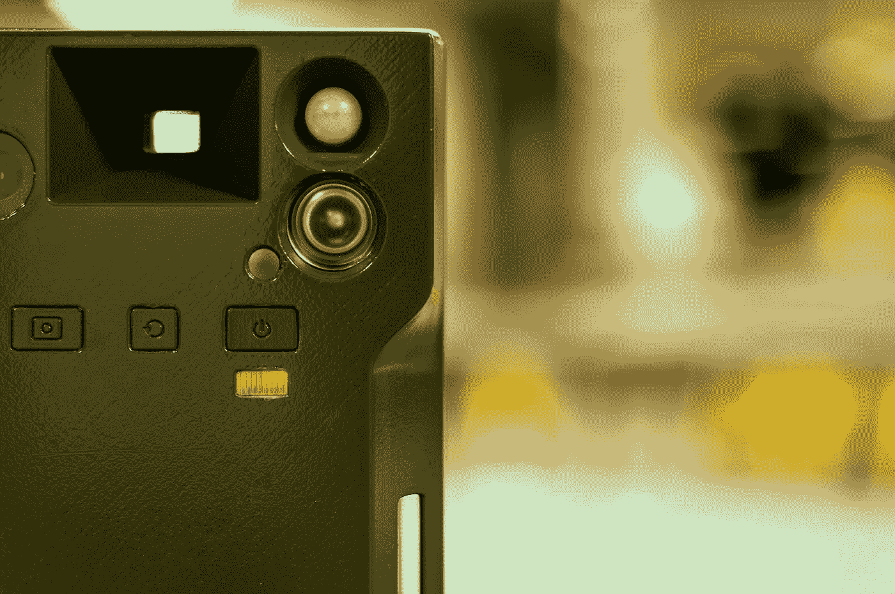

**背景**

Project Diversita 是微软于 2018 年在 [AI for Earth initiative](https://www.microsoft.com/en-us/ai-for-earth) 下在[GIX](https://gixnetwork.org)大学发起的“启动项目”。它旨在通过利用边缘技术上的机器学习(ML)来支持生物多样性研究。微软研究院已经基于非自然主义者数据集训练了 ML 模型。

我接受了机器学习和传感器方面的培训，但是在这个项目中，我的角色主要是产品设计。面临的挑战是探索潜在的市场空间，并找到最适合我们技术骨干的利基市场。

**时间跨度**

2018 年 6 月 27 日至 2018 年 12 月 7 日

**关于团队**

一个十人小组由大学的学生([菲尔普斯夏](http://linkedin.com/in/chengxi-phelps-xia)、[哈尔张](https://www.linkedin.com/in/haochen-hal-zhang)、[本凯勒](https://www.linkedin.com/in/benjaminckeller/)和我)和微软的研究人员([丹莫里斯](https://www.microsoft.com/en-us/research/people/dan/)、[卢卡斯约帕](https://www.microsoft.com/en-us/research/people/lujoppa/))/工程师([魏永德、、、、艾丽卡梅内塞斯、朱)组成](https://www.linkedin.com/in/weehyongtok)

**在项目中的作用**

产品设计师(UX，身份证)，产品经理，用户研究员

**总体目标**

*   研究市场，以确定一个利基相机陷阱场景，以破坏微软在人工智能方面的能力。
*   对客户来说是可取的，对业务是可行的，对工程是可行的。
*   开发工作原型来证明这个概念。

**关键词**

*机器学习、边缘计算、树莓派、物联网、计算机视觉*

# 1.产品的定义

## 来自微软的原始输入

在微软园区的启动会议上，微软方面的项目团队提出了以下要求:

*   面向消费者:最终产品应该面向消费者，能够扰乱相机陷阱市场；
*   移动性:最终产品应该易于携带；
*   连接性:最终产品应该能够连接到其他设备或云。

为了更好地了解主题，我们的团队分三个阶段研究了该案例:

1.  竞争分析；
2.  用户调研:访谈；
3.  用户研究:调查。

## 1.1.竞争分析

本研究旨在回答三个研究问题，并提取启发和指导概念设计的见解。这些见解来自对竞争对手产品发现的推理。

研究问题是:

*   竞争对手的产品如何适应特定的使用情形？
*   成像产品有哪些合适的交互模式？
*   开发我们产品的好方法是什么？

**确定的竞争对手**

“竞争者”包括直接竞争者和间接竞争者。直接竞争对手是可能与我们的潜在产品竞争的产品。而间接竞争对手是在特定维度上与我们的潜在产品有相似之处的产品。在本研究中，“间接竞争对手”不需要能够替代本项目的预期解决方案。本研究选择的间接竞争对手包括共享类似功能(例如图像捕捉)或可以在同一场景中共存的产品或服务(例如双筒望远镜、野生动物跟踪系统)。

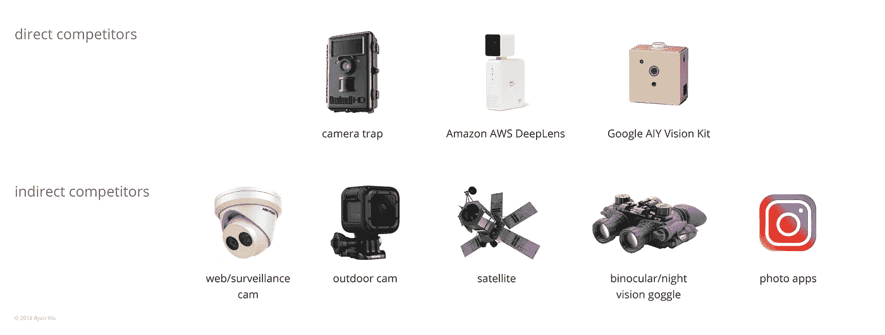

**观察指标**

在浏览竞争对手的产品时，团队成员记下了产品三个方面的发现— 1。业务方面；2.交互体验；3.发展方式。

**从竞争分析中获得的见解**

四名团队成员促成了 84 项调查结果。84 项调查结果中有 44 项是关于用例/业务模型或用户交互体验，其余是关于工程解决方案的调查结果。基于这些发现，我们提取了以下见解:

1.  **平台即服务。** —该产品可以是不同服务的通用平台。当产品联网时，协同效应可以产生额外的价值。价值可以打包成服务出售。
2.  **以差异化为优势。** —低成本、可移动、无需连接、隐私。边缘设备上的机器学习可以仅针对特定用例进行设计，这使得它与智能手机相比成本较低。与云上的 ML 相比，它节省了订阅信用和连接费用。
3.  **利用分层策略扩大市场规模。** —向市场提供低成本 MVP，通过允许更多的试购来刺激需求。
4.  **寻求与社区合作，以打破特定的利基市场。** —无论是专业社区还是居住社区，与他们紧密合作，解决他们的独特问题，是踏足市场的有效途径。
5.  **授权他人。** —除了是一个独立的产品。该产品作为一个模块也是可行的，该模块可以利用/授权其他产品来实现与独立产品类似的功能。
6.  **主动服务，倾听用户。** —用户的反馈是迭代和改进的宝贵输入。预测用户的挫折感，并准备结构良好的资源来帮助用户。
7.  **为分享而生。分享是人类的天性。让用户自由表达既能满足他们的愿望，又能创造超越用户的影响力。**
8.  **传递用户关心的东西。** —用户关心结果。他们不介意封闭背后的算法或工程努力。避免使用术语或提示用户配置不必要的对话框。
9.  **形式遵循功能。** —逻辑设计既实用又美观。通过采用逻辑工业设计，可以用更低的成本实现相同的功能，为客户留下更多的空间来创造价值。
10.  **使用手机作为界面。** —智能手机屏幕具有丰富的交互性。将特定操作转移到智能手机可以降低设备成本，实现更好的交互体验。
11.  **冗余带来可靠性。** —为同一目的使用多组组件可以增强系统的性能。此外，它使系统更加健壮。
12.  **准备扩张。** —为特定模块留出开放的末端将使产品能够以较小的努力适应不同的场景。

## 竞争分析的结论

通过竞争分析，我们探索了项目多样性的竞争空间。根据我们提取的见解，Project Diversita 的预期产品应该采用边缘设备上的 ML 的差异化优势来与智能手机和其他竞争对手竞争。通过寻求与社区的合作，产品可以通过扰乱利基市场来扩大其市场。从长远来看，它应该为扩展到更多的场景做好准备；设备节点可以作为一个整体形成一个平台来提供服务。在设计产品时，我们应该牢记以用户为中心的原则——倾听他们的声音，并提供能够激励他们参与生物多样性保护行动的东西。

# 1.2.1.用户研究

用户研究的研究问题是:

*   在什么场景下，人们希望识别自己附近的野生动物？
*   不同的利益相关者群体对自然界持有什么样的观点，这些观点如何影响他们的行为和购买？
*   当前 ML on Edge 设置的技术能力和局限性是什么？

**面试**

In one of the user interview sessions, the participant was an active hiker and world traveller. She showed us her tools for species recognition and shared her opinion on design’s impact on the environment.

我们采访了主题专家(SME)和潜在用户(有后院并愿意与动物互动的人)。我们采用亲和图对访谈数据进行处理。主题演讲被聚合到不同的集群中—场景、特征、用户属性、动机、关注点。基于这五个亲和组，我们确定了该项目的障碍、动机、用户要求和其他方向。

Interview data processing.

障碍:

1.  **遭遇物种缺乏变异**。–在用户访谈中提到的物种不到 10 种。在 100 个样本的调查中，提到的物种不到 20 种。
2.  **识别结果的准确性**。–SME 3 *:“研究人员在发表经过同行评审的论文时，要求准确度高(98%)。
3.  **维护**。–SME 3:“每年有 10-20%的摄像机损坏或被盗。”
4.  **伦理问题**。——增加人与动物的互动有好处吗？

动机:

1.  **好奇+参与**。–U1 *:“我想知道喂鸟器发生了什么事。”"我需要一些可操作的信息。"
2.  **安全+安保**。–U2:“当土狼来了，提醒对方注意。”
3.  **社交网络**。–U2:“当麋鹿来到我们家门前的湿地时，我会给邻居发短信。”

用户请求:

1.  **语音识别**。–U2:“鸟类照片很难捕捉，但很容易听到。”
2.  **菌群识别**。U1:“我做蘑菇。有些人觉得它令人生畏，因为很难确定它是否可以食用。”
3.  **足迹识别**。–U2:“雪地环境中的动物脚印就在小路旁边，很容易辨认。”
4.  **超过认可**。–U1:“我更想知道如何改进，而不仅仅是识别物种。”

其他说明:

*   **浮潜**。–浮潜时，人们有很大机会在短时间内接触多种物种。此外，水下没有连接。边缘语言可以利用它的优势来区别于其他计算平台。
*   **保护性研究与保存**
*   —入侵物种清除；
*   —无线电遥测钻铤；
*   —遗传取样。
*   **保护区管理:**
*   —监控外壳；
*   ——城市发展生态影响评价。

注:SMEx =主题专家 x 号；Ux =用户编号 x。

# 1.2.2.调查

该小组从拥有房子的参与者那里收集了定量数据。该团队总共收集了 120 个样本，并分析了结果，以提取关于兴趣的见解，从而在不同的场景中利用动物识别能力。结果反映了对应用程序最感兴趣的目标的更多共同特征。他们是有后院的房主，并拥有宠物，尤其是猫和狗。这些见解将在下一阶段指导团队进行概念设计和方向选择。

研究问题如下:

*   在什么场景下，人们希望识别自己附近的野生动物？
*   人们出于什么原因想要购买一个设备来监控他们的后院？
*   从用户的角度来看，边缘计算设备能给他们带来什么好处？

**调查工具**

谷歌表单，亚马逊土耳其机器人，Tableau。

**分析方法论**

我们从两个方面分析了数据。首先，我们从定量方面分析了数据。我们使用这些数据来缩小范围并支持角色制作过程。同时，我们希望了解不同场景的潜在用户规模，作为我们市场研究的一部分，以找出可能的最大市场。同时，我们分析了所有的开放式问题，以从受访者那里获得更多的灵感和有价值的想法，这将有助于我们了解更多的可能情况以及支持或反对我们想法的证据。

**调查感悟:**

1.  后院的潜在市场可能是巨大的。
2.  对于消费者来说，他们会认为这款设备更像是一款娱乐设备。
3.  人们监视他们后院主要是出于安全目的。
4.  养宠物的人更有可能购买这些设备。
5.  人们关心的是参与而不是技术。

# 1.3.概念发展

我主持了一个概念创作的头脑风暴会议。构思有两组限制:技术限制和非技术限制。技术上的局限性:1 .机器学习模型只能识别陆地动物；2.该设备需要移动性。因此，我们需要平衡性能和功耗；3.作为项目投入，它必须具有连接能力。非技术制约因素:1 .设备应该面向消费者；2.我们只有七周的时间来做这个项目。

## 思维能力

考虑到这些限制，该团队提出了以下想法:

1.  **邻里好奇心**:一种将设备捕获的动物分享给社区的设备。给他们一个空间来分享在他们的地方目睹野生动物的经历。
2.  **小朋友的守护**:用设备捕捉孩子与家中宠物玩耍的瞬间。当捕捉到危险的动物时，警告父母他们的孩子或宠物的安全威胁。
3.  **露营发现**:放在帐篷外或露营地点附近的设备。捕捉路过的动物。
4.  **自然之窗**:残疾人如何体验自然。他/她可以设置该设备，并在家中的森林中查看经过他设置的设备的动物的照片。
5.  **掠夺者监视**:作为一个邻里监视系统，许多设备协同工作来监视附近的院子、道路和绿化带，并提防危险的动物。当食肉动物出现时向居民发出警报，这样他们就可以避开它们，呆在家里，保持安全。
6.  露营守卫:设置在帐篷上或食物储藏室旁，在你睡觉的时候为你提防掠食者，记录你露营旅行中令人兴奋的动物遭遇。
7.  植物和动物移动维基:大多数时候，当你去一个有外来物种的地方旅行时，你没有手机网络覆盖。如果你能在给它们拍一张令人惊叹的照片的同时获得物种的名称和信息，那就太好了。
8.  **Smart GoPro** :帮助用户捕捉身边有不认识的动物的瞬间。
9.  **宠物跟踪器**:帮助用户跟踪宠物在后院的活动。
10.  **捕食者警报**:提醒用户警惕附近即将到来的捕食者。
11.  **保护平台**:联网摄像陷阱，实现研究和保护自然的新方式。
12.  人工智能喂鸟器:对到达喂鸟器的鸟进行计数和分类，以了解如何最好地促进当地的生物多样性。
13.  **猎人用 AI 步道摄像头**:帮助猎人更好地了解鹿的数量，从而知道有选择地去除哪些。

我们综合了这些想法，想出了三个概念:

*   **理念一:好奇心**——利用 ML on Edge 满足人们的好奇心和教育目的。示例场景:带着设备去野营，设置好设备，去享受大自然。回来检查捕获的图像。
*   **概念二:安全**——识别可能威胁孩子或宠物安全的物种。必要时发出警告。示例场景:在需要的地方部署设备。配置要监控的物种。如果检测到目标物种，向用户发送通知。
*   概念三:平台 —部署一个设备网络，实现保护研究和管理的新方法。示例场景:保护区管理、入侵物种应对、围栏安全、气候监测。

## 解决方案描述/工作分解结构

该系统应该有三大支柱:

*   **设备(物联网套件)**:套件会部署在用户需要的地方。它会扫描场地，如果有动物经过，就会唤醒相机并拍照。照片将在设备上进行本地处理。如果边缘 ML 模型确定图像中有动物，设备将通过无线连接将图像发送到云服务。
*   **Azure services** :当云服务收到图片时，云上 ML 模型会分析图片提取物种信息。随着试剂盒发送的图像数据的积累，这些数据可用于 ML 模型进化。在图像接收到作为其元数据一部分的物种识别结果之后。云上的通知服务将根据用户的设置确定图像是否应该触发通知操作。
*   **应用控制台**:应用是用户与物联网套件和云服务交互的入口。用户可以配置物联网套件和云服务的设置。例如，用户可以设置系统在物联网套件检测到郊狼时向他/她发送通知。该应用程序是一个内容分发渠道。用户可以观看由该设备捕获的正面图像。也是一个社交平台。多个用户可以共享来自同一设备或设备网络的数据，并就内容进行通信。此外，该应用程序是用户反馈识别质量的反馈渠道——用户可以对识别质量进行评级，并提供正确的物种名称。由于时间和资源限制，该应用程序将针对移动网络浏览器而不是原生应用程序进行开发。

从长远来看，该系统应该允许多个套件形成一个物联网网络。可以添加更多功能，如工作流程简化、远程触发、行为映射、年龄/性别识别，为客户带来更多价值。

# 2.原型开发

## 2.1.用户旅程映射

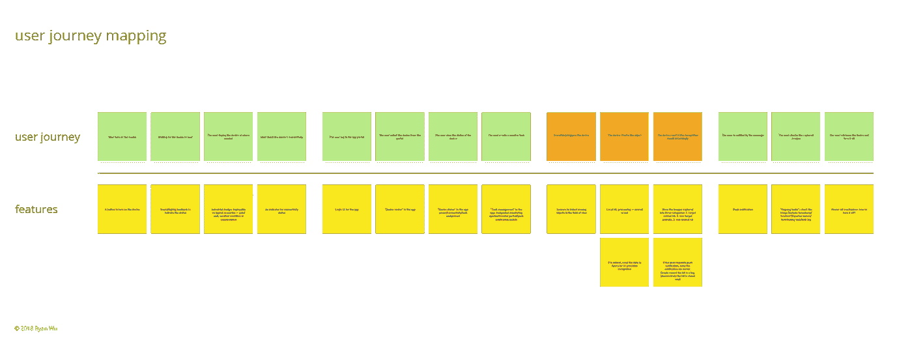

我起草了一份用户旅程图来生成功能列表:

**硬件:**

1.  开关按钮打开/关闭相机；
2.  重置按钮；
3.  手动捕获按钮；
4.  状态的 LED 指示器；
5.  工业设计:可在典型场景下部署——柱子/墙/树；
6.  检测视野中运动物体的传感器。

**软件:**

1.  登录；
2.  设备管理；
3.  任务管理；
4.  本地 ML 处理；
5.  Azure ML API
6.  推送通知服务。

## 2.2.用户体验

在这个项目中，我负责产品设计，包括产品定义、数字体验和物理原型。

**2.2.1。数字体验**

这项服务的数字接触点是应用程序。最初，当我们计划这个项目时，由于我们团队中没有人有开发原生 iOS/Android 应用程序的实践经验，我们决定开发一个 web 应用程序。所以当我设计产品的时候，我只用了基本的网络交互模式，比如滚动和点击。考虑到时间限制(四个人，两个月)，该应用程序只能提供非常基本的功能——注册/登录，添加设备，设置触发器，查看拍摄的图像。事实上，最小的可行产品已经是团队的一个挑战——我们还需要测试和开发硬件部分，在 Edge 和 Azure 上配置和测试 ML，设计机械结构并制作原型。

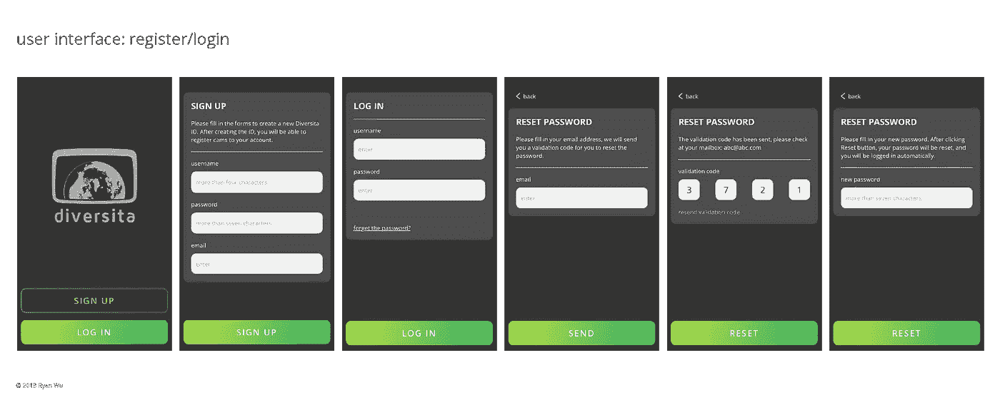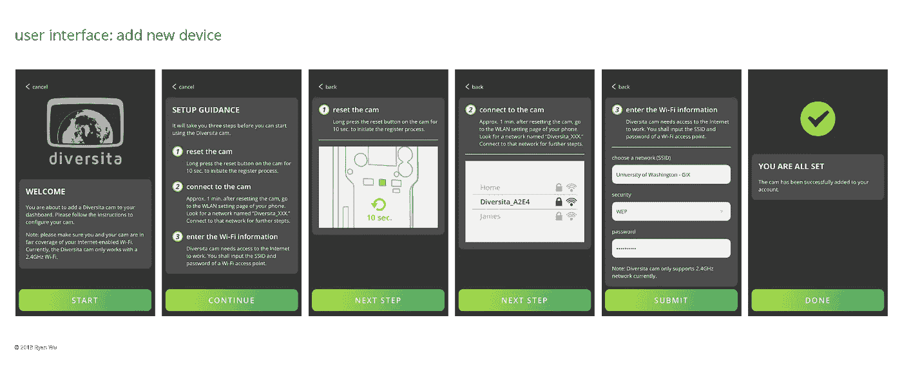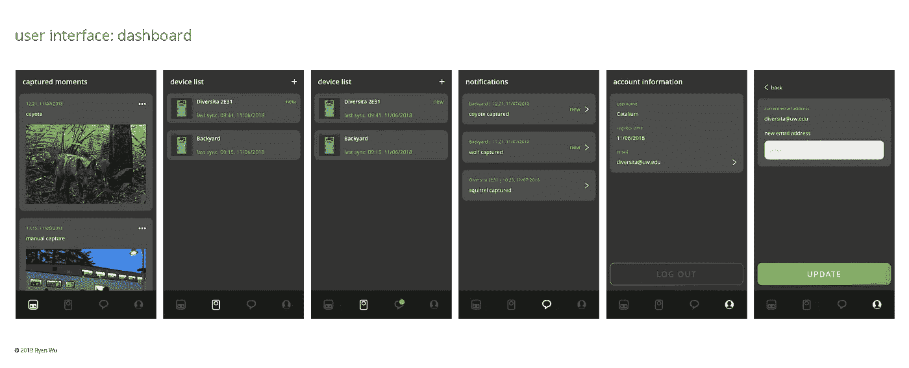

2.2.2。物理体验

经过 60 多天的实验，我们的团队确定了用于最终原型的最终组件集。这些部件的物理尺寸以及它们相互连接的方式成为了原型外形的限制因素。

我使用 CAD 工具来安排电路系统的空间关系，并仔细考虑用户将如何使用该产品。V2 原型是为了评估我的设计和 3D 打印机的性能而制作的。基于我们教员的反馈和我的观察，我进一步将模型迭代到 V3。

与使用 360mL ABS 的 V2 相比，V3 仅消耗 268 mL，即少消耗 25.6%的材料，但保持相同的强度(请参考下图)。此外，新的设计使我们能够密封部件和外壳之间的所有间隙，使其成为一种防水设备。

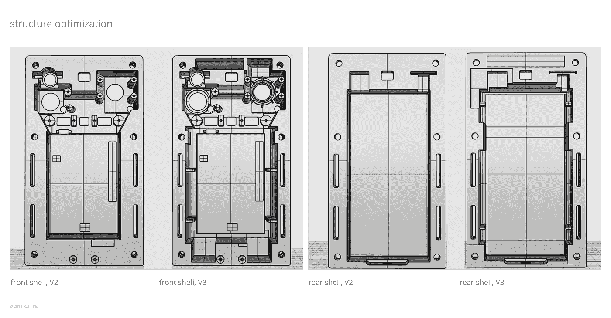

通过点击这个[链接](http://bit.ly/2EILJ7Q)，你可以交互式地查看 CAD 模型。

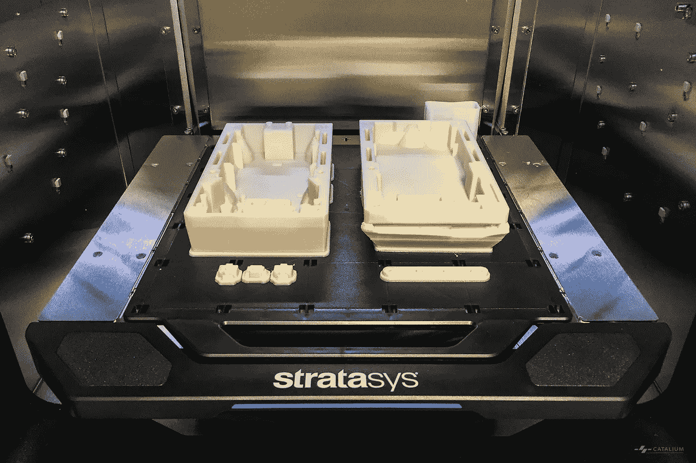

Parts just got printed from the Stratasys F170 machine, the chamber was still very hot.

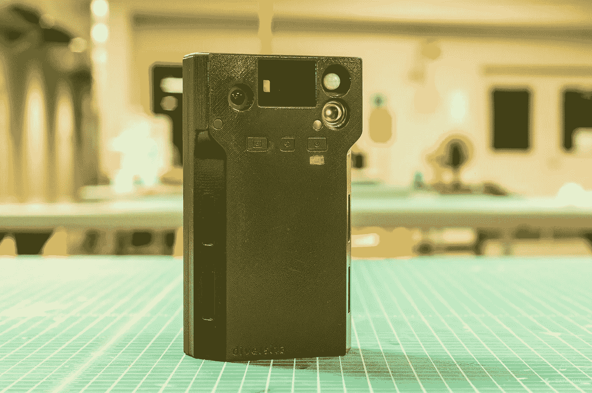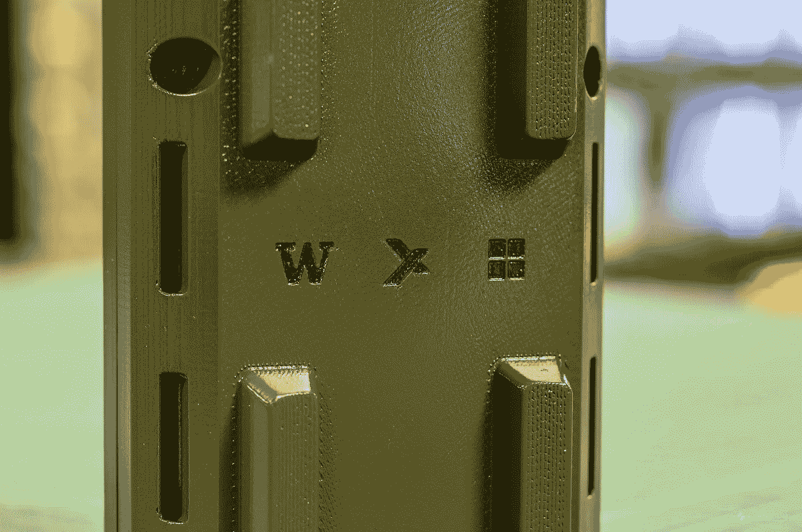

The back of the prototype, from left to right: University of Washington (UW), Global Innovation eXchange (GIX), Microsoft. Someone joked it was Word, Excel, Windows.

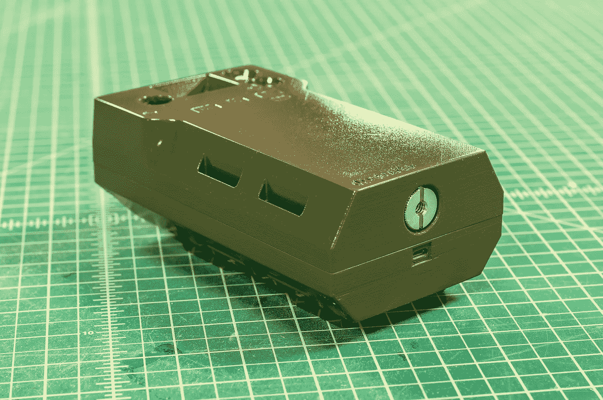

I designed the device with a tripod mounting point.

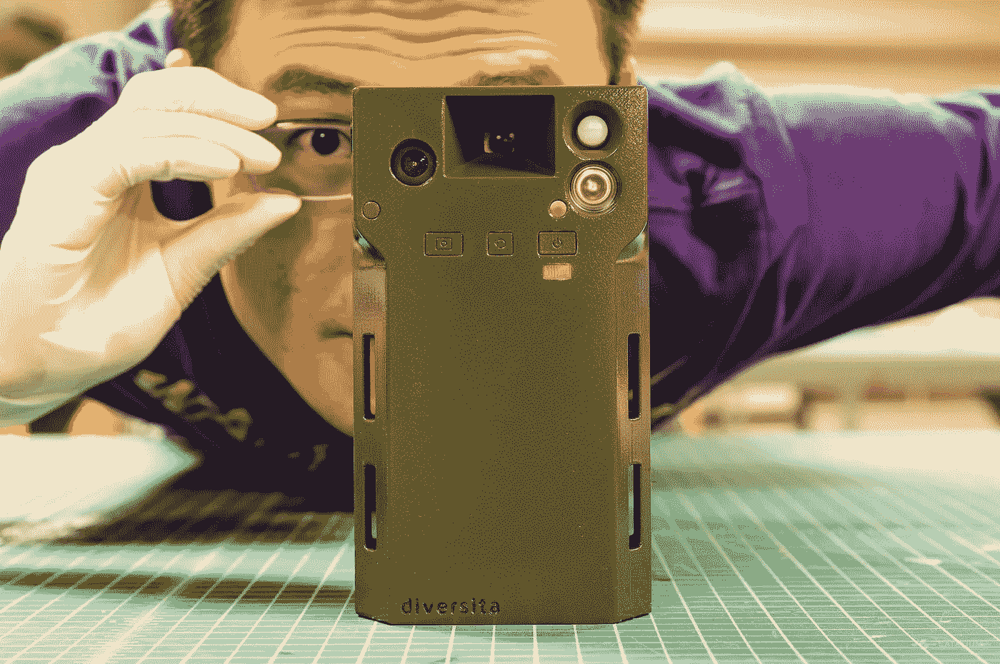

The viewfinder was my answer to a teammate’s plan to add a video streaming feature, which was just for the user to check what the camera can see. I’m proud to solve a seemingly tricky requirement with a stone age solution.

# 3.以后

## 3.1.Diversita+

在我们最后一次展示的舞台上，我评论了 Diversita cam:

> *然而，我们的长远眼光不仅仅是照相机。*
> 
> *当我们有一个支持 ML 的摄像头矩阵时，我们可以形成一个平台，这是一个智能边缘设备的平台。其可用于收集数据并从世界中获得洞察力，例如，监测水的纯度、环境的变化等等。*

Diversita 项目的本质是使用边缘技术上的机器学习来识别特定的模式，并相应地对不同的结果做出反应。虽然 Diversita 是为陆地动物建造的，但我个人开发了 diversi ta+——技术框架场景的扩展——用于水下。用于训练模型的数据集可以是单个物种如鲨鱼、鳐鱼、梭鱼的光学相机图像。也可能是声纳反射模式。总的来说，Diversita+可用于协助海滩安全监测、海洋动物研究和水质监测。

三个示例概念:

1.  狩猎区(hunt away):部署在海滩或类似地方的围栏系统，用于监控和抵御威胁人类生命的海洋物种。
2.  **Remora**:ML on Edge 设备，安装在船舶吃水线以下的船舷，它结合来自光学相机和声纳阵列的图像，识别海洋生物物种，并对数据收集的位置进行地理标记。
3.  **海马**:集成了电子显微镜和边缘计算模块的设备。

如果你有兴趣，请查看以下文档了解详细描述:[http://bit.ly/2EFxdgj](http://bit.ly/2EFxdgj)。

## 3.2.媒体报道

photo credit: Scott Eklund

我们的团队很幸运地在[微软上发表了一篇关于](https://news.microsoft.com/on-the-issues/):[http://bit.ly/2GxYvYA](http://bit.ly/2GxYvYA)问题的报道。当这个故事发布时，微软总裁布拉德·史密斯转发了它。看到我们的合影出现在最有价值的上市公司总裁 Twitter 账户的时间轴上，真是令人惊讶。

## 3.3.信用

最后，我想给以下的人热烈的掌声:

*   布莱克·汉纳福德、琳达·瓦格纳、约翰·莱蒂:感谢他们的指导和帮助；
*   尼古拉斯·艾姆斯:为我们提供了可靠的制造设备；
*   肯特·福斯特:为微软和 UW 牵线搭桥，使该项目成为可能；
*   微软项目团队:为我们提供了这个参与这个项目的机会，特别感谢杨思雨，当我们的机器停机时，他及时联系了微软园区的制造部门；
*   [马克西姆·苏尔盖伊](https://maxoffsky.com/):作为我们的第五名成员，为我们提供焊接工具、螺丝和胶水。

本文原载于我的博客:[https://catalium . net/project _ diversita _ when _ machine _ learning _ meets _ user _ experience/](https://catalium.net/project_diversita_when_machine_learning_meets_user_experience/)