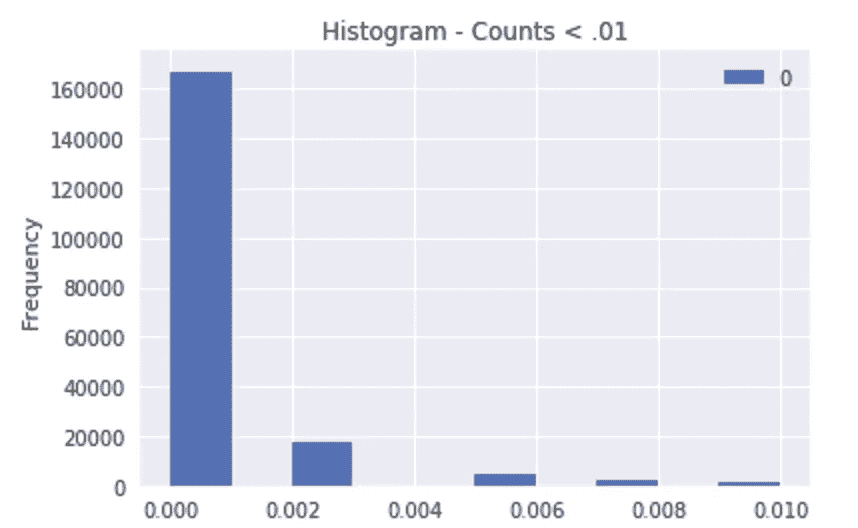
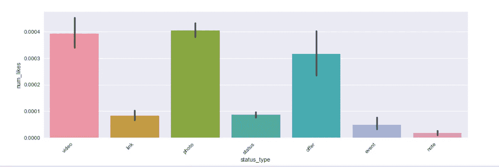
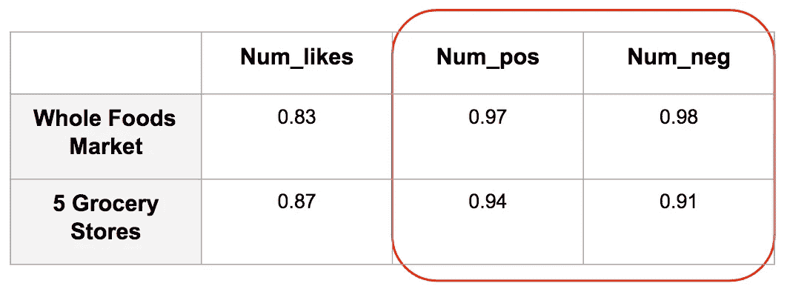
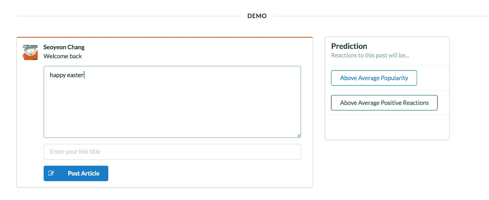

# 托弗计划:脸书·佩奇反应预测计划

> 原文：<https://towardsdatascience.com/project-topher-facebook-page-reaction-prediction-program-95bcf4916892?source=collection_archive---------3----------------------->

我终于在旧金山大会完成了为期 12 周的数据科学沉浸式项目。对我来说，学习前沿数据分析&机器学习技术是一次非常好的经历。

本课程的重点部分是“顶点工程”。我想出了一个在脸书商业页面上建立一个反应预测程序的主意。我在这个项目中主要使用了自然语言处理和分类建模技术。

# **动机**

我为我的顶点项目选择这个主题，因为大约 5 年前当我还是一名营销经理时，我真的很想有这样一个项目。我不得不为我每天管理的每个社交媒体设计内容，却不知道我的预期绩效结果。我必须根据我在脸书分析工具上的发帖记录和我的直觉，在社交平台上发布新的东西。如果当时我有一个自动反应程序，可能会对我更好。我根据公司的发帖历史设定策略，尽可能多地获得反馈，但这是一项如此不可预测的工作。因此，我决定建立一个社交网络反应预测程序，帮助几乎每天都在创建在线营销内容的社交媒体经理。首先，我选择创建一个脸书·佩奇反应预测程序，托弗。

1)Post from Whole Foods Market Facebook Page: ‘Status message’ and ‘Link text’ are highlighted by red lines

# **产品设计**

我设计 Topher 是为了帮助社交媒体经理在过去分析他们的发帖历史和竞争对手的帖子时表现得比他们的平均表现更好。换句话说，这个程序显示你是否会得到比你目前得到的平均反应更多的反应。

该产品的目标是预测给定用户文本输入后的反应。脸书因其“喜欢”按钮而闻名，但它在去年(2016 年 3 月)推出了亚情感表情符号，如积极的爱、哈哈、哇，消极的悲伤和愤怒。

2)Facebook added sub emoting emojis such as Love, Haha, Wow, Sad and Angry in March, 2016

我把这些反应分成三类:积极的反应，消极的反应。我设计了这个程序来预测这篇文章，在给定文本输入的情况下，是否会比脸书页面上的平均表现获得更多的每个反应类别的数字。当你在页面上写下你的文字输入后，这个程序会自动评估你的表现。我没有在这个分析中包括“分享数量”和“评论数量”,因为我们无法仅用数字来推断分享和评论的哪个行为是积极的还是消极的。

# **数据集**

我使用脸书 API 从 5 个杂货店页面获取了大约 15k 个帖子。数据包含文本和每种反应类型的反应数量。脸书提供的数据有两部分文本:“状态消息”和“链接文本”，在上图(图 1)中用红线突出显示。除了文本数据，该数据还包括其他信息，如“内容类型”、“发布日期”、“内容链接”等。我最初分析了“全食超市”数据集，后来将我的分析扩展到另外 4 个数据集。

# **数据预处理**

首先，我从数据集中过滤掉一些极端的异常值和反应数量很少的帖子。除此之外，数据的分布是极其正偏的，所以我采用自然对数变换来使我的数据呈正态分布。由于该程序旨在帮助你获得比你之前帖子的平均数量更多的喜欢或积极反应，过滤这些帖子将有助于我的模型的一致性。

3)Remove outliers -> natural log transformed -> remove posts with least number of reactions

除此之外，如果你的帖子是付费的，那么比普通粉丝数量有更高的可能性接触到更多的人，也更有可能获得更多的反应。事实上，当我比较离群值的文本时，我无法说出离群值和只有文本数据的正常帖子之间的任何特殊差异。因此，我怀疑那些极端的异常值可能是付费的帖子，或者那些有大量回复的帖子可能有一些背景。然而，这次我无法证明这个假设，因为我无法获得关于每个页面上哪个帖子是有机的或付费的信息。因此，这次我只是为了模型的一致性而将它们过滤掉。

4)Texts from normal posts

第二，我把两列文字合并成一列，因为“状态消息”和“链接文字”同时出现在一篇文章中。在整个项目中，我意识到文本越多，建模的结果就越好。

第三，为了简单起见，我从文本中删除了特殊字符、数字和链接名(比如‘https://…’)。

第四，数据规范化。由于每个页面的粉丝数量不同，曝光度也不同。当我将我的分析扩展到另外 4 个数据集(如 Safeway、Sprouts、Walmart 和 Kroger)时，我将每个反应的数量除以每个页面的粉丝数量进行了归一化。

5)pairplot for num_likes and num_reactions

最后，当我研究变量之间的相关性时，我注意到反应的数量和喜欢的数量高度相关。这是因为在 2016 年 5 月之前,“赞”是脸书上唯一的情感反应按钮，超过 95%的反应来自“赞数”。

从现在开始，我将主要解释全食超市数据集(WFM)的数据分析和建模过程。

# **自然语言处理**

对于文本数据处理，我使用了 Scikit-learn(sklearn)、NLTK 和 Gensim 库来分析文本数据。

首先，我使用停用词去除频繁但不必要的词，并使用 Tf-idf 向量机创建文本稀疏矩阵，该向量机赋予频繁和重要的词更多的权重。Tf-idf 是“术语频率和逆文档频率”的缩写，它是一种数字统计，旨在反映一个词对集合或语料库中的文档有多重要，并且是广泛用于信息检索的技术。除此之外，我过滤掉了在整个语料库中只出现一次的最不常用的词。

6)distribution of most frequent words(x-axis: frequency rate)

7)distribution of least frequent words(x-axis: frequency rate)

我必须查看真实的单词，确定哪些单词是不必要的或重要的，更新包含要从原始语料库中过滤的单词的停用单词列表，并一遍又一遍地调查单词的分布。这可能是一项非常乏味的工作，但对于自然语言处理来说却非常重要。

我还研究了 n 元语法，这对于相邻单词的序列是有用的。N-gram 是来自给定文本序列的 *n* 项的连续序列。我能够理解哪些单词经常一起使用，并更好地理解上下文中的单词。

在清理和过滤不必要的单词后创建的文本稀疏矩阵将被用作预测器，以预测一个帖子是否会在建模中获得更高的反应数。

# **更多特色工程**

对于分类建模，我使用上面的 tf-idf 矢量器创建了一个文本预测器。然而，仅使用标记化的文本数据，我无法获得高准确度分数，因此我必须想出更多的特征工程技术。我尝试创建了几个功能，如使用 word2vec 的文本向量表示、内容类型、可读性和文本列长度。

首先说明结论，文本长度可以有效区分低于平均文本和高于平均文本。当我查看数据时，我可以看到较短的文本通常会得到更多的反应，所以我创建了一个文本长度列，并使用预测器进行分类建模。

8) mean of number of reactions for text length

除此之外,“内容类型”列稍微增加了准确性分数。然而，我没有包括这个功能，因为我的程序不会接收输入的内容类型(如视频，图片，只有文本)将用于这个职位。数据类型和反应数量之间肯定存在正相关关系。然而，我决定这次不包括这个特性，我将在不久的将来把它与图像和视频分析结合起来

9) video and photo has the most biggest number of likes(mean)

# **型号选择**

下面是我为托弗做的最终模型的解剖图。

**目标**

Topher 将新的用户文本输入分为 2 类(低于/高于平均值),每类 3 种反应。

*   反应:喜欢，积极反应(爱，哈哈，哇)，消极反应(悲伤，愤怒)
*   目标类:低于平均类(类 0)，高于平均类(类 1)

**预测值**

*   清理和标记文本数据
*   文本长度

**模型:带有决策树分类器的 Adaboost 分类器**

我的最终模型是 Adaboost(Adaptive Boosting 的缩写)分类器，这是一种用于集成方法的机器学习元算法。

**决策树分类器**

决策树分类器是该模型的基础分类器。决策树分类器根据输入变量中最显著差异将输入数据划分为预定义类别。由于决策的重复过程看起来像树的节点，因此被称为决策树。

**Adaboost 分类器**

Adaboost 分类器将基分类器的性能训练成强分类器。根据 Scikit-learn 文档，boosting 基本估计量是按顺序构建的，人们试图减少组合估计量的偏差。其动机是将几个弱模型组合起来，产生一个强大的集合。

弱模型被顺序添加，使用加权的训练数据进行训练。该过程继续，直到已经创建了预设数量的弱学习者(用户参数)，或者不能对训练数据集进行进一步的改进。

我以 7:3 的比例将数据集分为训练数据集和测试数据集。我用训练数据训练我的模型，并用测试数据集测试模型。最后，在使用 Adaboost 分类器的所有五个源/数量喜欢的情况下，我的准确度得分为 0.87。这意味着我的分类模型以 87%的准确率预测了输入文本的性能。

**10) Accuracy score comparison**_ number of likes model

查看 Topher 的最终模型，总共有 6 个分类模型在一起工作。我最初开始只分析全食超市数据集的每个反应(赞数、赞数和负数)，并将我的分析扩展到所有 5 个杂货店数据集。通过这六个模型，用户不仅可以将他们的文本输入结果与他们自己过去的数据集进行比较，还可以与他们的竞争对手进行比较。

11) Accuracy score table_all models

我对积极和消极反应的准确率更高。你可以看到红线框里的数字。然而，这些对于这个模型来说并不是好的分数，因为这些模型是过度拟合的。

根据维基百科，在过度拟合中，统计模型描述的是随机误差或噪声，而不是潜在的关系。过度拟合发生在模型过于复杂的时候，例如相对于观察值的数量有太多的 [p](https://en.wikipedia.org/wiki/Parameter) 参数。过拟合的模型具有较差的预测性能，因为它对训练数据的微小波动反应过度。在这种情况下，num_pos 和 num_neg 的这 4 个模型几乎只预测了一个类别(低于平均值)。

这是因为阳性和阴性反应的数据数量非常少(不到整个数据集的 5%)。由于 Adaboost 容易对小数据集和太多参数(在这种情况下，文本稀疏矩阵超过 16，000 列)过度拟合，这种情况发生在这四个模型上。然而，我没有排除这些模型，因为我假设当我以后获得更多数据时，我可以改善这个问题。

# 模型性能评估

我的最佳模型有 87%的准确率。**精度**是正确预测的观测值之比。这个分数是选择最佳模型的直观的和主要的度量，但是这对于分类器的性能评估是不够的。为了更彻底地评估分类模型，我还使用了 Scikit 中的一个常规函数——学习库，分类报告。我将用我的主模型和 num_likes 的 5 个杂货店数据集来分析模型性能。

**分类报告**

分类报告有 3 个主要的分类指标:精确度、召回率和 f-1 分数。

*   精度表示所选类别中正确阳性结果的比率:真阳性/(真阳性+假阳性)
*   召回率表示相关数据中正确预测的阳性事件的比率:真阳性/(真阳性+假阴性)
*   f-1 分数是精确度和召回率的调和/加权平均值。因此，这个分数同时考虑了误报和漏报。直观上，它不像精确度那样容易理解，但是 F1 通常比精确度更有用，尤其是当你的职业分布不均匀的时候。:2*(召回率*精确度)/(召回率+精确度)

Classification report for the main model with 5 grocery store dataset for num_likes

从我的最佳模型的分类报告来看，每个分数看起来都很不错。不同类别之间在精确度和召回率方面存在一些差异，但总体而言，该模型在超过 16，000 个特征(标记化单词)的情况下工作良好。

# **网络应用**

我使用 Flask 和 Reactjs 与一名开发人员一起创建了一个 web 应用程序。这个程序被设计成当你在输入框中输入你的文本时立即显示结果。

**程序演示**

下面是 Topher 演示页面。第一个窗口仅用于 WFM 数据集，第二个窗口基于 5 个杂货店数据集。当您想要查看仅使用过去的数据时，您的文本输入将如何执行时，您可以使用第一个窗口。如果您想与他人比较您的表现，您可以在第二个窗口中键入文本。

例如，在第一个框中键入“复活节快乐”,然后您会看到您的输入将获得比平均数量更多的反应。在这个演示中，“高于平均受欢迎程度”意味着你将获得比你之前帖子平均更多的“喜欢”。

这个项目现在不对公众开放。当我很快创建一个供公众使用的网站时，我会在这里链接该程序。

**未来工作**

对于这个项目，我专注于文本分析，试图捕捉文本和反应之间的关系。直观地说，图片和视频的质量对吸引用户关注脸书有着最大的影响。为了检验我的假设，我对周围的人做了一个简短的调查。

问题:当你看这个帖子的时候，你首先看到了什么？

1.  状态消息
2.  图片/视频
3.  链接文本

我询问的大多数人(60 人中有 58 人)回答说
图片首先引起了他们的注意，然后是“链接文本”和“状态消息”。我想很快将项目范围扩大到图像&视频。

**关于作者**

我是加州圣何塞的一名热情的数据科学/机器学习从业者。我是一个终身学习者，目前对 NLP 和深度学习非常感兴趣。你也可以在 [Linkedin](https://www.linkedin.com/in/seoyeonchang/) 上找到我。