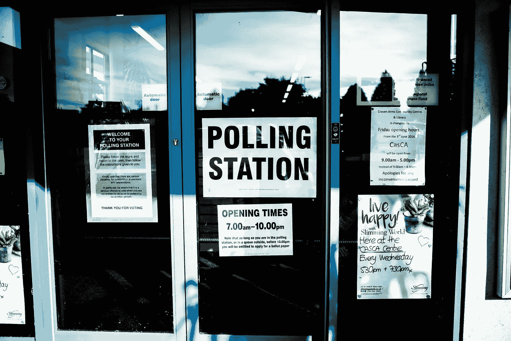
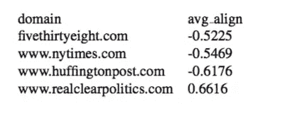
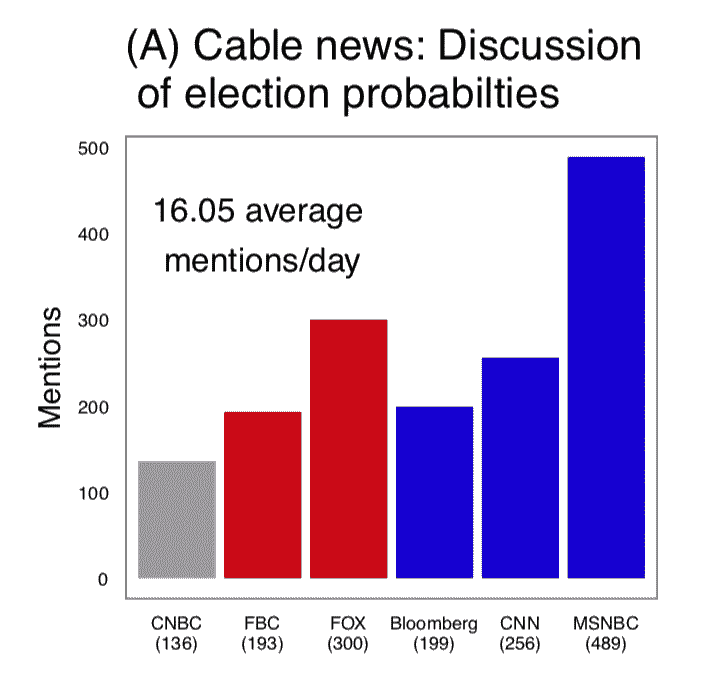
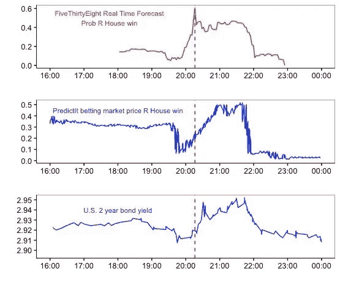
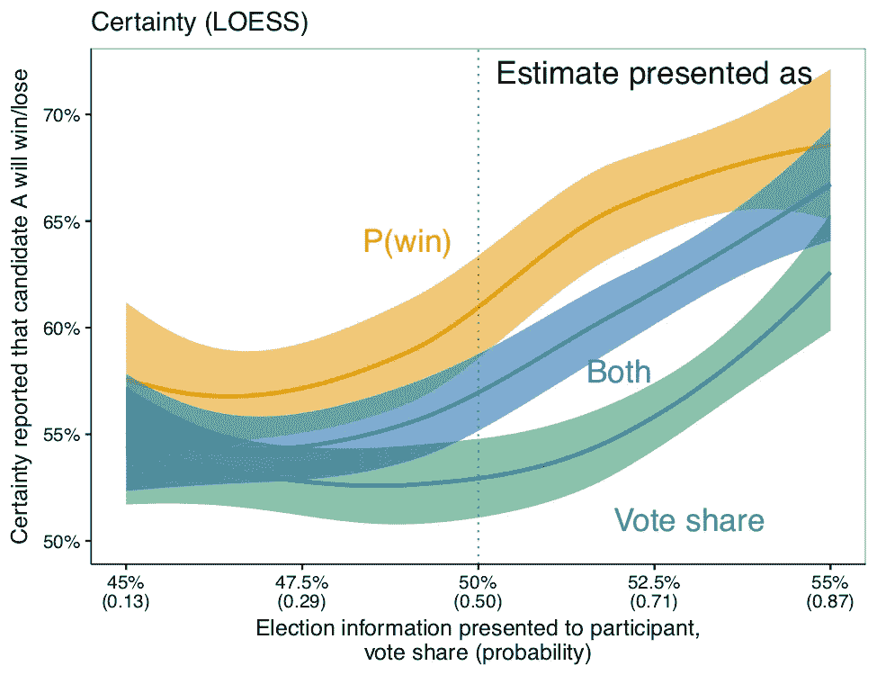
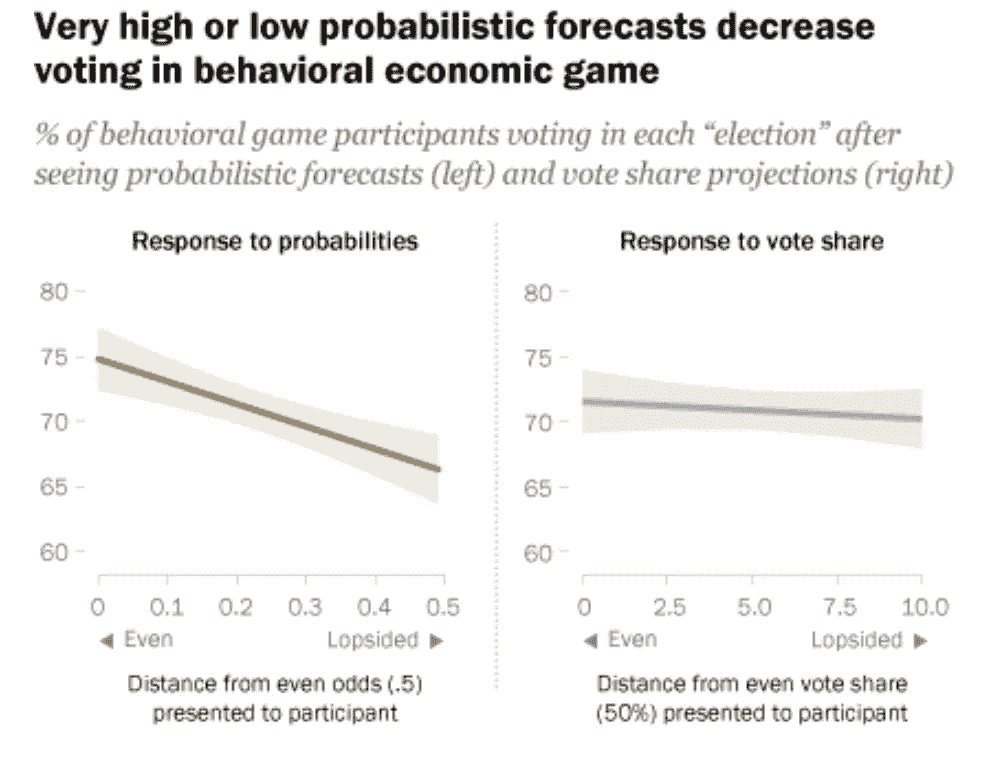
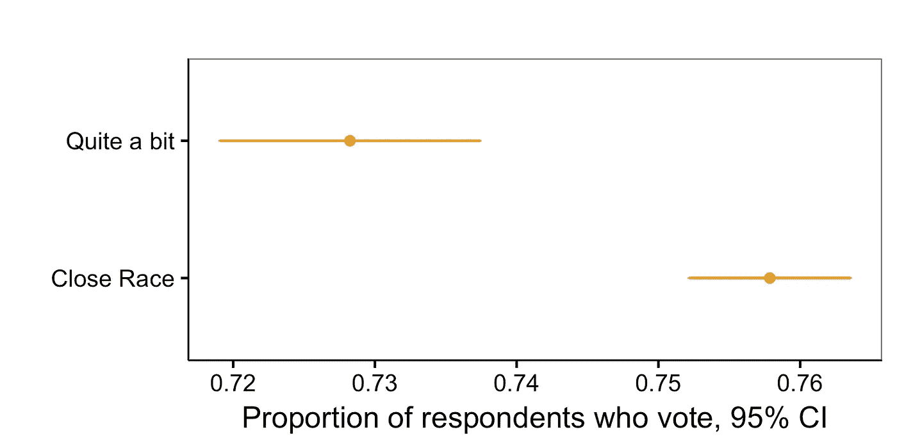
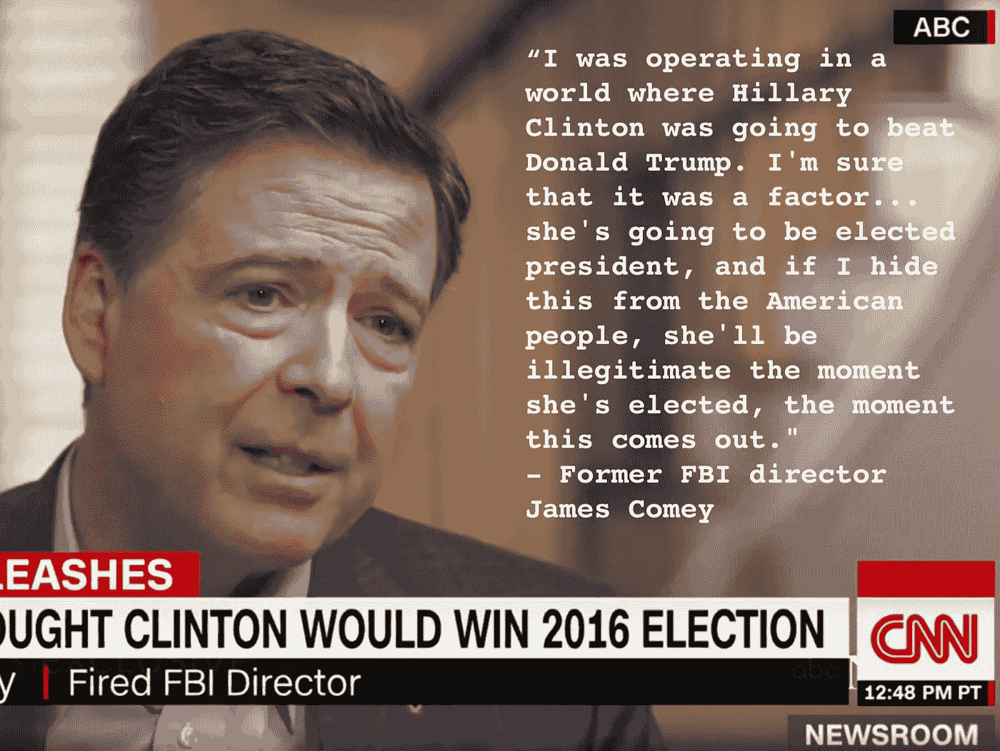

# 表现出自信

> 原文：<https://towardsdatascience.com/projecting-confidence-5fe3a799913d?source=collection_archive---------15----------------------->

## 概率赛马如何遣散公众

受唐纳德·川普在 2016 年大选中令人震惊地击败希拉里·克林顿的启发，[肖恩·韦斯特伍德](https://www.dartmouth.edu/~seanjwestwood/)、[伊普塔赫·莱克斯](http://ylelkes.com/)和我开始探究这样一个问题:elecion 的预测——尤其是概率性预测——是否有助于制造一种对克林顿获胜的虚假信心，并最终导致许多左翼人士在选举日留在家中。

选举后,[纽约杂志](http://nymag.com/daily/intelligencer/2017/05/hillary-clinton-life-after-election.html?mid=nymag_press)引用了希拉里本人的话:

> *有人真的在寻求赦免……’*很抱歉我没有投票。我以为你不需要我。“我不知道我们将如何计算有多少人认为它是稳操胜券的，因为百分比一直被抛给人们——”“哦，她有 88%的机会赢！*’*

预测可能影响了选举，这有可能吗？

为了影响选举，它必须出现在媒体上，接触潜在选民，压低投票率，并对克林顿支持者(和/或克林顿竞选者)产生比特朗普更大的影响。

与过去的选举周期相比，2016 年媒体对概率预测的报道明显增多:

(谷歌新闻索引的提及概率预测的文章数量。)

我们的研究(见下面的结果)表明，在民调中领先的候选人更容易受到概率预测的影响。2016 年，那是希拉里。

但不管 2016 年如何，当你看谁在社交媒体和电视媒体上接触这些材料时，你会发现这些渠道拥有左倾的观众。根据概率展示民意调查汇总结果的网站拥有左倾(负面)的社交媒体受众——只有不强调获胜概率的 realclearpolitics.com 拥有保守的受众:

这些数据来自那些分享链接到脸书各种投票聚合网站的人的平均自我报告意识形态，这些数据来自[本文](http://science.sciencemag.org/content/early/2015/05/06/science.aaa1160.full)的[复制材料](http://dx.doi.org/10.7910/DVN/LDJ7MS)。

当你看一下主要电视广播对概率预测的报道平衡时，你会发现对 MSNBC 的报道更多，那里有更自由的观众。

**预测者到底有多大影响力？**

嗯，FiveThirtyEight 的 2018 年报道似乎已经很有影响力了。在他们的实时预测显示共和党获得众议院席位的几率在晚上 8 点 15 分左右达到 60%后，PredictIt 预测共和党的几率升至 50%以上，美国政府债券收益率短暂飙升 2-4 个基点。

这种激增似乎已经发生，因为许多大的，[共和党占主导地位的地区在那些支持民主党的地区之前开始报告回报，还因为它从部分选票统计中做出推论:](https://fivethirtyeight.com/live-blog/2018-election-results-coverage/#3495)

这是由 FT.com 的布莱恩·格里利首先报道的。他们报告说，由于市场预期在共和党控制下(高支出、低税收)，美国债券收益率上升。

这只是一种关联吗？有可能，但在美国几乎没有其他事情发生，就像上面 FT.com 的文章指出的那样，欧洲现在是凌晨 1 点。

Josh Tucker 在一篇猴子笼博文中提出，2012 年，538 可能正在推动预测市场。

**我们对预测和感知的研究**

我们的研究显示，概率性的选举预测让一场比赛看起来不那么激烈。国家概率调查实验的参与者在看到概率预测后，比看到同等的投票份额估计和误差幅度后，更加确定一个候选人将赢得假设的比赛。这是一个很大的影响——这些是置信区间而不是标准误差，p 值低于 10^-11.

**人们为什么会这样做？**

这里需要更多的研究，但我们确实有一些线索。首先，公众最熟悉的选举指标——投票份额估计——的微小差异通常对应于候选人获胜概率的巨大差异。

Andy Gelman 在 2012 年的一篇博文中顺便提到了这一点，质疑 538 在其网站上传达预测时使用的十进制精度(0.1%):

> 没错:0.1%的获胜概率变化对应着 0.004 个百分点的两党选票份额。我看不出想象如此精确的选举预测有什么意义……

其次，人们有时会混淆概率预测和投票份额预测，并错误地得出结论，认为候选人预计会赢得 85%的选票，而不是有 85%的机会赢得选举。在我们的实验中，大约十分之一的人会这样做。

正如[约书亚·本顿在推特](https://twitter.com/jbenton/status/1059898288139354112)中指出的，TalkingPointsMemo.com[犯了这样一个错误](https://talkingpointsmemo.com/news/issa-calls-race-early):

最后，人们倾向于从定性的角度思考事件发生的概率 [(Sunstein，2002)](https://solomonmg.github.io/projects/1_project/#sunstein2002probability) ， [(Keren，1991)](https://solomonmg.github.io/projects/1_project/#keren1991calibration) 。有 85%的可能性某事会发生意味着它将会发生。这些研究可能有助于解释为什么在 2016 年大选后，如此多的人批评预测者“搞错了”(见[这个](https://www.nytimes.com/2016/11/10/technology/the-data-said-clinton-would-win-why-you-shouldnt-have-believed-it.html)和[这个](http://www.slate.com/articles/news_and_politics/politics/2016/01/nate_silver_said_donald_trump_had_no_shot_where_did_he_go_wrong.html))。

**投票呢？**

也许最关键的是，我们发现显示更多井喷的概率预测会降低投票率。在研究 1 中，我们发现基于自我报告的证据有限。在研究 2 中，我们表明，当参与者面临模拟现实世界投票的激励时，当概率预测显示一名候选人获胜的可能性更高时，他们不太可能投票。然而，他们对投票份额的变化没有反应。

这真的会影响现实世界的投票吗？

想想 2016 年——异常多的民主党人认为领先的候选人会以相当大的优势获胜:

在选举前的民意调查中，认为领先的候选人将会以相当大的优势赢得 T21 的人，比认为这是一场势均力敌的选举的人说他们在选举后投票的可能性低大约 3 个百分点。这是在控制了选举年、之前的投票率和政党身份之后。

这里的数据来自美国全国选举研究(ANES)的数据，可以追溯到 1952 年。

过去的社会科学研究也提供了证据，证明认为竞争激烈会提高投票率。一些最好的证据来自分析投票结束前公布投票后民调结果的影响的工作，这显然消除了不确定性。研究东海岸电视网为一个或另一个候选人“提前打电话”对西海岸投票率的影响的工作通常发现微小但具有实质性意义的影响，尽管这些电话发生在选举日的后期[(德利·卡皮尼，1984)](https://solomonmg.github.io/projects/1_project/#carpini1984scooping) ，[(苏德曼，1986)](https://solomonmg.github.io/projects/1_project/#Sudman:1986wu) 。利用投票改革作为自然实验的类似工作显示，在出口民调公布后，法国海外领地的投票率下降了整整 12 个百分点 [(Morton，Muller，Page，& Torgler，2015)](https://solomonmg.github.io/projects/1_project/#Morton201565) 。这些设计不会与竞选团队在竞争激烈的竞选中投入更多资金的趋势相混淆。

研究人员一致发现，更严格的选举和更高的投票率之间存在强有力的关联。 [(Cancela & Geys，2016)](https://solomonmg.github.io/projects/1_project/#cancela2016explaining) 供点评】。此外， [(Nicholson & Miller，1997)](https://solomonmg.github.io/projects/1_project/#nicholson1997prior) 从统计模型中提供证据表明，先前的选举结果也解释了超出竞选支出的投票率，尤其是在没有良好的投票数据的情况下。

实地实验提供了额外的证据，表明对更激烈的选举竞争的感知会增加投票率。这项工作发现，当民调结果显示通过电话传递一场势均力敌的比赛时，会对投票率产生实质性影响[在那些被触及的人中， [(Biggers，Hendry，Gerber，& Huber，2017)](https://solomonmg.github.io/projects/1_project/#biggers2017experimental) ]，但当依靠明信片传递近距离信息时，结果为零[无法验证是否实际阅读了该处理，(缺少参考文献)；[(比格斯，亨德利，格柏，&胡伯，2017)](https://solomonmg.github.io/projects/1_project/#biggers2017experimental) 。最后，在 2012 年总统大选前几周进行的一项研究发现，在公布表面上显示奥巴马与罗姆尼不分上下的民调结果时，自我报告的选举后投票率更高[这与现存的显示奥巴马轻松领先的民调数据不一致， [(Vannette & Westwood，n.d.)](https://solomonmg.github.io/projects/1_project/#Vannette:2014vk) ]。

这也会影响政治家吗？

候选人对选举接近程度的看法会影响竞选和代表 [(Enos & Hersh，2015)](https://solomonmg.github.io/projects/1_project/#enos2015campaign) ， [(Mutz，1997)](https://solomonmg.github.io/projects/1_project/#Mutz:1997wy) 。

这些看法也可以影响政策决定——例如，在 2016 年选举之前，据报道，奥巴马政府对克林顿获胜的信心是对俄罗斯干预选举保持沉默的一个因素。

前联邦调查局局长詹姆斯·科米表示，由于对希拉里获胜充满信心，他觉得自己有责任在 10 月 28 日写信给国会，表示他将重新调查希拉里的电子邮件。科米解释了他的行为，基于他对克林顿获胜的某种信念:“(她)会当选总统，如果我对美国人民隐瞒这一点，她当选的那一刻，这一点出现的那一刻，她就是非法的”。内特·西尔弗一度表示，“[科米的信可能让希拉里输掉了选举](https://fivethirtyeight.com/features/the-comey-letter-probably-cost-clinton-the-election/)。''

**媒体报道** [华盛顿邮报](https://www.washingtonpost.com/news/politics/wp/2018/02/06/clintons-achilles-heel-in-2016-may-have-been-overconfidence/?utm_term=.619133ce9312)， [FiveThirthyEight 的政治播客](https://fivethirtyeight.com/features/politics-podcast-whats-so-wrong-with-nancy-pelosi/)，[纽约杂志](http://nymag.com/intelligencer/2018/02/americans-dont-understand-election-probabilities.html?gtm=bottom&gtm=bottom)，[政治专线](https://politicalwire.com/2018/02/06/election-forecasts-lower-voter-turnout/)。

**参考文献**

1.  Keneally，M. (2018)。科米说每个人——包括他自己——都认为克林顿会赢得 2016 年大选。美国广播公司新闻。ABC 新闻网。检索自[https://ABC news . go . com/Politics/comey-included-thought-Clinton-win-2016-election/story？id=54486869](https://abcnews.go.com/Politics/comey-included-thought-clinton-win-2016-election/story?id=54486869)
2.  Biggers，D. R .，Hendry，D. J .，Gerber，A. S .，& Huber，G. A. (2017)。关于选举接近程度是否(以及为什么)影响投票率的实验证据。从 https://huber.research.yale.edu/materials/67_paper.pdf 取回
3.  坎塞拉，j .，&盖斯，B. (2016)。解释投票率:国家和地方选举的荟萃分析。*选举研究*， *42* ，264–275。
4.  Enos，R. D .，& Hersh，E. D. (2015)。竞选对选举接近度的看法:不确定性、恐惧和过度自信。《英国政治科学杂志》，1–19 页。
5.  莫顿，R. B .，穆勒，d .，佩奇，l .，和托格勒，B. (2015)。出口民调、投票率和从众投票:来自自然实验的证据。*欧洲经济评论*， *77* ，65–81。[https://doi . org/http://dx . doi . org/10.1016/j . euro ecorev . 2015 . 03 . 012](https://doi.org/http://dx.doi.org/10.1016/j.euroecorev.2015.03.012)
6.  Geys，B. (2006 年)。解释投票率:总体水平研究综述。*选举研究*， *25* (4)，637–663。
7.  桑斯坦(2002 年)。情绪、最坏情况和法律。*《耶鲁法律杂志》*， *112* (1)，第 61–107 页。
8.  尼科尔森，S. P .，，米勒，R. A. (1997)。1986 年和 1988 年国会选举中的先验信念和投票率。*政治研究季刊*， *50* (1)，199–213。
9.  穆茨，哥伦比亚特区(1997 年)。动力机制:是思维让它如此吗？*《政治杂志》*， *59* (1)，第 104–125 页。
10.  克伦，G. (1991 年)。校准和概率判断:概念和方法问题。*心理学报*， *77* (3)，217–273。
11.  苏德曼(1986 年)。出口民调会影响投票行为吗？*舆情季刊*， *50* (3)，331–339。
12.  德利·卡皮尼，硕士(1984 年)。拉拢选民？1980 年电视网提前宣布总统竞选的后果。*《政治杂志》*， *46* (3)，866–885 页。
13.  选举前的民意调查能影响投票率吗？来自随机实验的证据。检索自[https://www.dartmouth.edu/](https://www.dartmouth.edu/)seanjwestwood/papers/polling . pdf

*原载于*[*https://solomonmg.github.io/projects/1_project/*](https://solomonmg.github.io/projects/1_project/)*。*