# 社交媒体分享心理学:关注、情绪和反应

> 原文：<https://towardsdatascience.com/psychology-of-sharing-on-social-media-attention-emotion-and-reaction-707f164e4136?source=collection_archive---------6----------------------->

我很高兴看到我的 [*《波士顿环球报》*/脸书](http://sonya2song.blogspot.com/2013/07/proto-analysis-of-boston-globe-traffic.html)的研究受到好奇的读者的欢迎，并被几个组织特别报道，如哈佛[尼曼新闻实验室](http://www.niemanlab.org/2013/07/what-works-and-what-doesnt-on-the-boston-globes-facebook-page/)、 [Chartbeat](http://blog.chartbeat.com/2013/10/28/understanding-traffic-sources-part-3-social-traffic/) 、[社会新鲜](http://socialfresh.com/bgfacebook/)和 [ISHP 咨询](http://www.ishpc.de/2013/07/30/was-wird-wie-auf-facebook-geteilt-analyse-des-boston-globe/)。与此同时，我一直在不同的地方就这项研究发表演讲，包括波士顿环球报、伦敦 Mozilla Festival、汉堡 Spiegel Online 和 Hacks/Hackers Berlin。如果你觉得这项研究很有趣，并想进一步讨论，请在 Twitter 上给我打电话 [@sonya2song](https://twitter.com/sonya2song) 或给我发邮件 sonya2song#gmail。也请随意下载为我的演讲开发的[幻灯片](https://drive.google.com/file/d/0Bx8IdMC7CoeZSkRBVi00SkhmYTA/edit?usp=sharing)(最后更新于 2013 年 12 月 9 日)。

在之前的研究中，我展示了数据分析，研究用户如何阅读和分享《波士顿环球报》在脸书页面上的帖子。在这个扩展分析中，我加入了定性分析，重点是内容、认知和情感。我的目标是帮助新闻编辑室更好地在社交媒体上推广他们的故事，并吸引更多的关注。

为了实现这个目标，我一直在挖掘心理学文献寻找灵感。欣喜之余，我发现了一些适用于社交媒体环境的理论和发现:

*   快速和慢速两种思维模式会吸引不同类型的注意力。
*   在社交媒体上分享是
*   充满感情，
*   受自我形象管理的约束，也
*   担心与他人的关系。

同样，这份报告是基于脸书洞察的三个关键指标:触达、参与用户和谈论这个。根据脸书的说法， *reach* 被定义为“看过你帖子的独特人数”；*参与用户*为“点击过你帖子的唯一人数”；*将此*描述为“从你的页面帖子中创造故事的独特人数。当有人喜欢、评论或分享你的帖子时，故事就产生了；回答您发布的问题；或响应您的事件”。这些指标以各种方式作为独立访问者的绝对数量，反映了从被动消费到主动互动的用户行为。

# # # # # # # # # # # # # # # # # # # # # # # #

在对脸书的*波士顿环球报*流量的[原型分析中，我报告了关于图像大小和“突破”标签的发现。一般的模式是，与没有图像相比，用图像来说明帖子与更高的流量相关联，与缩略图相比，大图像也是如此。这个模式适用于脸书的三个关键指标(图 2)。此外，仅仅“打破”与更高的触及度相关，尽管与参与或谈论这一点无关(图 1)。事实上，不仅是突发新闻，其他大写单词也与更高的触及范围相关联，包括天气监视、重大更新、大图、NOW LIVE 等。作为一名努力工作的记者，你可能会告诉我，读者被这种肤浅的东西吸引，比如大照片和突发新闻，这令人不安。但对你来说好消息是，原始伎俩引发的关注是相当廉价的。为了获得更多的关注，复杂的信息会是一个更好的选择，我们将在认知紧张和系统 2 一节中讨论。](https://medium.com/@sonya2song/proto-analysis-of-boston-globe-traffic-on-facebook-db66bcda3693)

Figure 1: “Breaking” is associated with higher “reach”

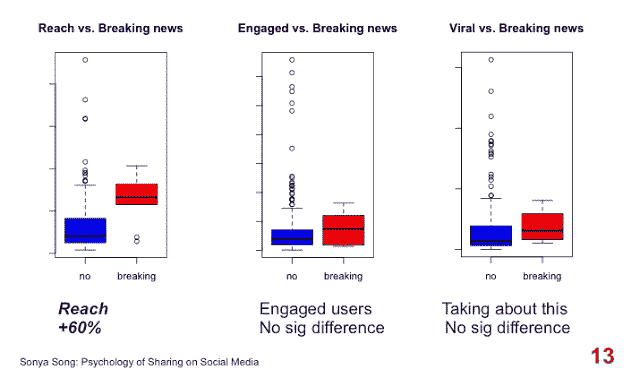

Figure 2: Larger images are associated with higher traffic

作为一个不太正面的例子， [*麻省理工科技评论*](http://www.technologyreview.com/) 可能会告诉我们如何获得很少的关注。看它的[脸书页](https://www.facebook.com/technologyreview)，我们可以看到很多大大的 T，肯定是杂志的 logo。很明显，故事是以链接的形式分享的，脸书会自动提取其徽标。因此，这些故事没有有趣或简单相关的视觉伴侣。重复的 T 也可能让粉丝们对这个符号视而不见。可悲的情况是，尽管*这篇评论*产生了许多激动人心的故事，但它在脸书的存在远非令人信服——你可能已经注意到了图 3 中的少量分享和喜欢。

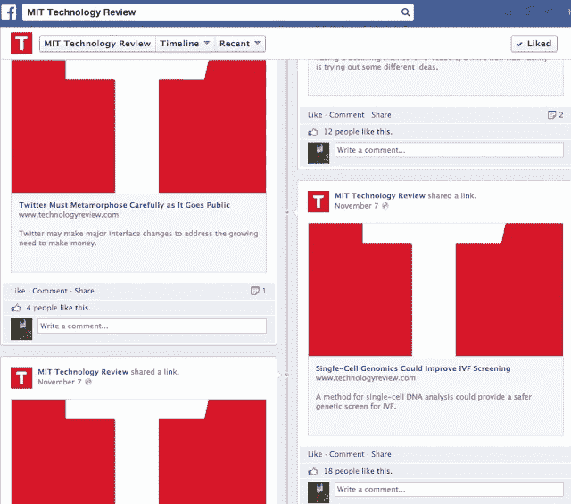

Figure 3: Facebook Page of *MIT Technology Review*

# # # # # # # # # # # # # # # # # # # # # # # #

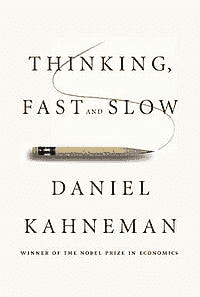

理解我们如何处理简单和复杂的刺激(如文本、图片、谜题等)。)，**的**(2011)[*思维，快与慢的*](http://en.wikipedia.org/wiki/Thinking,_Fast_and_Slow) 是一本好书。在本书中，卡尼曼考察了与人类两种思维模式相关的各种理论和发现:系统 1(快)和系统 2(慢)。

**系统 1——无意识注意**

系统 1 处理对生存至关重要的先天技能，它快速自动地工作。一个例子是，在我们意识到发生了什么之前，我们把手指从火中抽回。还有一个就是在空旷的高速公路上开车。系统 1 是完全无意识的，例如，当看到 1 + 1 = ____，我们会觉得必须去填空。换句话说，系统 1 不能关闭，因为它对我们的生存至关重要。当听到像爆炸这样的突然噪音时，我们会把头转向声源，想知道危险是否出现。除了天生的技能，通过长期练习获得的能力也可以由系统 1 处理，例如为国际象棋大师设想下一步，或者为计算机科学家设想 210 = 1024。

**系统 2——有意识的注意力**

相比之下，系统 2 处理习得的技能，如外语、逻辑推理、数学等。又慢又费力，就像我们计算 23 x 67 = ____ 时的感受。换句话说，它需要更多的关注，就像如果有人以前没有这样做过，就从左边开车。与系统 1 不同，系统 2 并不总是袖手旁观，这就是为什么我们容易受到营销和广告技术的影响。此外，当我们累了、饿了或心情不好时，可以停止使用系统 2。想象一下熬夜备考后参加考试有多艰难。

**分工和最小努力定律**

在系统 1 和系统 2 之间，劳动力被划分。大多数时候，我们处于系统 1 的快速模式。同时，系统 1 评估环境，并确定是否需要调用系统 2 进行额外的工作。当检测到困难、冲突和压力时，系统 2 将被调动并控制局面。系统 2 处理由系统 1 感知的信息，并在必要时纠正它。此外，系统 2 克服了系统 1 的冲击。例如，当争论升级时，我们必须努力抑制工作中的情绪。因此，系统 2 拥有最终决定权。

然而，懒惰是我们作为动物的天性，我们倾向于为未来意想不到的威胁保留能量。因为脑力劳动也消耗资源(例如葡萄糖)，所以它的能力有限。因此，我们天生厌恶努力，让系统 1 领先。

现在考虑我们如何使用社交媒体:我们浏览帖子的速度相当快。虽然我们偶尔会在快速滚动或大或小的屏幕时陷入在线辩论，但我们通常会感到放松、宽慰，甚至高兴。换句话说，我们来到社交媒体是为了一段轻松的时光，而不是挑战。

**认知易与系统 1**

这种社交媒体上的轻松时光就是卡尼曼(2011)所说的“认知轻松”。他将认知放松描述为“事情进展顺利的迹象——没有威胁，没有重大新闻，不需要转移注意力或调动努力”(第 59 页)。换句话说，系统 1 在负责，系统 2 在打瞌睡。

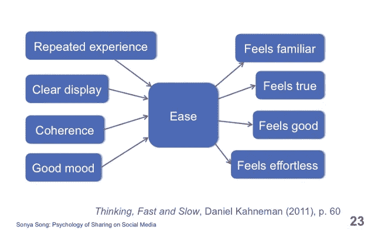

Figure 4:Causes and consequences of cognitive ease

图 4:认知容易的原因和后果图 4 说明了认知容易的各种原因和后果。(也许你已经感觉到广告商一直在利用的认知理论:重复、清晰和快乐更有可能让你感觉更好，并说服你相信某些产品或服务值得你花钱)。就像清晰的显示一样，易读性影响我们解析一条信息的难易程度。

**突发新闻和易读性**

高度易读的文本将导致认知上的放松，并很好地纵容系统 1。看看下面卡尼曼给出的例子:

**阿道夫·希特勒出生于 1892 年。**

阿道夫·希特勒出生于 1887 年。实验表明，与第二种说法相比，更多的人会相信第一种说法是正确的——事实是希特勒出生于 1889 年。正如您所猜测的那样简单:第一条语句用粗体显示，更加易读。

如果我们将这一心理发现移植到社交媒体上，我们可能会意识到突发新闻也在扮演类似的角色，从而吸引更多的注意力，尽管几乎是无意识的。由于我们无法定制我们在社交媒体上发布的文本的大小、颜色或字体，使用大写字母是我们改变帖子易读性水平的唯一选择。如果你不顾一切地想要克服社交媒体上的障碍，你可能会发现 [lolcats](https://en.wikipedia.org/wiki/Internet_meme) 很鼓舞人心。

像大写文字一样，大图片也是抚慰系统 1 的养眼糖果，吸引社交媒体用户几乎无意识的注意。

**简单的文本和可读性**

迎合系统 1 的另一种方法是使文本简单且易于解析。[可读性](http://en.wikipedia.org/wiki/Readability)用来衡量这方面。已经建立了许多公式来测量可读性。

正如所料，每个词的平均音节数与所有三个指标负相关，即“触及”、“参与用户”和“谈论这个”。这对社交媒体编辑的启示是准备迎合快速阅读的信息，因为人们经常被社交媒体上的系统 1 所引导，即使各种媒体渠道的受众在不同的水平上说出可读的语言(查看图 8 中跨新闻编辑室的可读性水平)。据推测，一旦人们被带离脸书，他们就会从快节奏转为慢节奏。但在此之前，每个帖子都只有一瞬间来吸引人们的注意力。

在简单语言的主题上，奥威尔强调，不管文学用途如何，简单的词语增强了语言作为表达思想的工具。你可以用下面的例子来测试自己，看看你是否能顺利地将注意力从这个句子的第一个词移到最后一个词。

> 对当代现象的客观考虑迫使我们得出这样的结论:竞争活动中的成功或失败并不表现出与先天能力相称的趋势，而是必须始终考虑相当多的不可预测因素
> 
> *—* [政治和英语](http://www.orwell.ru/library/essays/politics/english/e_polit)，*乔治·奥威尔，1946*

这一段实际上是奥威尔从《传道书》中“翻译”出来的，以表明文本可能会不必要的困难。原文如下:

> *“我又转念，见日光之下，跑得快的不一定能赛跑，强壮的不一定能争战，智慧的不一定能得食物，聪明的不一定能致富，有才能的不一定能得宠。但时间和机会发生在他们身上。”*

为了让奥威尔的观点更加准确，根据弗莱斯奇-金凯德公式，原文得分为 18.5，而译文得分为 27.5，我将在认知压力和系统 2 一节中介绍这个公式。

**启动效应和在社交媒体上提问**

与系统 1 相关，心理学家发现了很多有趣的现象，比如启动效应。启动效应是一个总括性的概念，讨论人们在几乎无意识的影响下的行为。例如，让两组人完成 SO _ P；在这个任务之前，一组看吃的，另一组看洗的。吃组更有可能以汤和其他肥皂的形式完成。在这里，吃素汤，洗素皂。

另一个与无意识影响相关的实验是在纽卡斯特大学进行的([巴特森等人，2006](http://rsbl.royalsocietypublishing.org/content/2/3/412.abstract) )。一个诚实的盒子被放在办公室里，用来收取茶和咖啡的费用。价目表上方依次展示了不同的海报。海报没有文字，但有两个主题，眼睛或花朵。结果(图 5)显示，在“有眼睛”的几周里，比“有花”的几周支付了更多的钱。这个实验很好地证明了“启动现象出现在系统 1 中，而你没有意识到它们”(Kahneman，2011 年，第 57 页)。

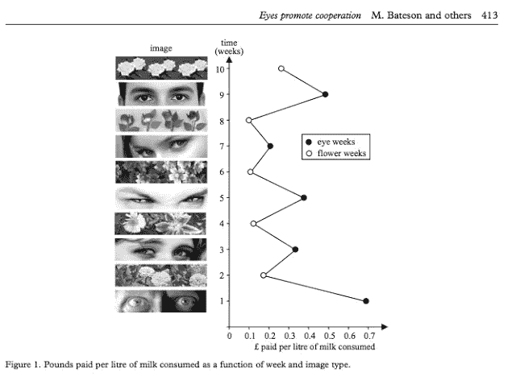

Figure 5: Eyes on you, [Bateson et al., 2006](http://rsbl.royalsocietypublishing.org/content/2/3/412.abstract)

如果我们将这一概念应用于社交媒体，我们会发现什么？我从一个小任务开始探索证据。研究的问题是:在社交媒体上提出的问题能引导人们回答这些问题的行为吗？也就是说，一个问号会在一篇帖子上产生更多评论吗？

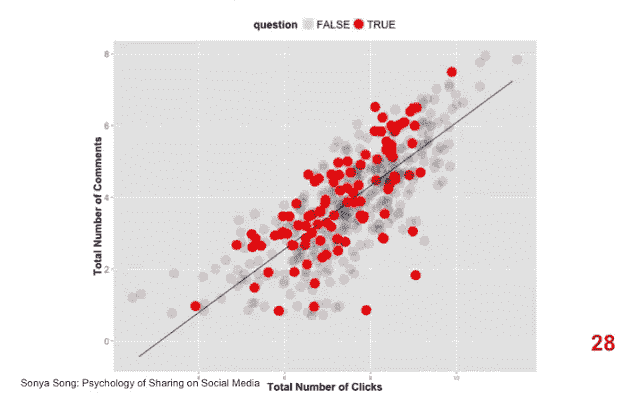

Figure 6: Asking questions is associated with more comments.

是的，在控制新闻部分、分享时间和其他因素后，问题与更多评论显著相关(注意:与喜欢或分享无关)。一般模式是，更多的接触与更多的参与相关，更多的参与与更多的喜欢、分享和评论相关(见图 10)。相比之下，有问题的帖子更有可能出现在趋势线上方，表明表现更好，尽管下方有一些异常值。根据两周内收集的样本，有问题的帖子会有 80%以上的评论。

同样，这个发现的概念是不要像突发新闻的诱惑一样过度使用它。虽然人们说没有所谓的愚蠢问题，但当你的问题不那么聪明时，你会很清楚。此外，“素数的影响很大，但不一定很大”(Kahneman，2011 年，第 56 页)。这表明内容本身仍然是流量的主要驱动力，而促销在一定程度上有所帮助。

在讨论各种启动效应和锚定效应这两种与快速思维模式(系统 1)相关的现象时，卡尼曼指出，尽管我们可以做出额外的努力来控制我们的系统 1，但无意识地受到影响是人类的本性。下面的引语应该可以缓解读者和记者对这些发现的道德担忧:

> 你的思想和行为可能会受到你根本没有注意到的刺激的影响，甚至是你完全没有意识到的刺激。启动研究的主要寓意是，我们的思想和行为受到当下环境的影响，比我们知道或想要的要多得多。许多人发现启动结果不可信，因为它们不符合主观经验。许多其他人发现结果令人不安，因为它们威胁到主观能动性和自主性……如果风险很高，你应该动员自己(你的系统 2)来对抗这种影响。(第 128 页)。

现在，你们这些辛勤工作的记者将会从这项研究中了解到一些令人鼓舞和兴奋的发现:你们复杂的信息应该得到更多的关注，不一定是更高的数量，但可能是更高的质量。

Figure 7: Causes and consequences of cognitive strain

与认知放松相反，认知紧张具有相反的原因和后果(图 7)。在系统 2 的指导下，人们变得更加警惕，犯的错误更少，但同时变得更没有创造力，感觉更加努力。

给定漂亮的流程图，在实践中，我们应该如何激活系统 2 并让人们的慢思维参与进来？这里有一个有趣的实验。有些棘手的问题人们经常会弄错。其中三个包含在 Shane Frederick 的[认知反射测试](http://www.militarymba.net/plan-and-prepare/cognitive-reflection-test.html)中。这个测试非常棘手，即使是顶尖学校的学生也会给出错误的答案。然而，当用褪色的劣质印刷品进行测试时，错误率从 90%下降到 35% ( [Alter 等人，2007](http://psycnet.apa.org/index.cfm?fa=search.displayRecord&uid=2007-16657-003) )。这个实验表明，认知紧张会调动第二系统，而第二系统会进行缓慢而仔细的思考。

**复杂文本和更多评论**

在社交媒体上，我们可以用什么样的认知压力来吸引读者？更复杂的文本可能是一种方法，例如包含更多单词的句子和包含更多音节的单词。

为了衡量脸书文本的复杂程度，我在研究中采用了 [Flesch-Kincaid 等级水平](http://en.wikipedia.org/wiki/Flesch%E2%80%93Kincaid_readability_tests)。这个工具已经被调整以反映美国读者理解给定文本所需的教育年限。例如，一篇得分为 5.2 的文章可以被五年级以上的学生理解。F-K 水平建立在每个单词的平均音节数和每个句子的平均单词数的基础上，计算如下:

Flesch-Kincaid Grade Level =(每个单词 11.8 *音节)+(每个句子 0.39 *单词)-15.59 在脸书，各种媒体渠道以反映在它们自己的出版物中的风格呈现它们自己。图 8 中的可读性分数是根据七家媒体在脸书的最新 200 篇文章计算出来的。

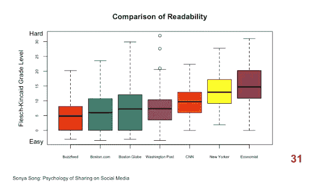

Figure 8: The median score of Flesch-Kincaid. BuzzFeed: 4.83, Boston.com: 6.01, Boston Globe: 7.23, Washington Post: 7.37, CNN: 9.69, New Yorker: 12.91, The Economist: 14.62.

记者们的激动人心的消息来了。更复杂的文本与更多的评论相关(再次注意:与分享或喜欢无关)！不过，效果并不明显:K-F 水平多 12 分，评论就多 12%。在图 9 中，点的饱和度和大小表示文章的可读性分数。更大和更饱和的点更有可能落在趋势线之上，表明表现更好。

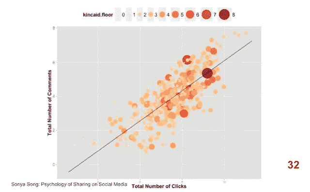

Figure 9: Harder text is associated with more comments

快速和慢速思维模式可能有助于解释这一证据。当文字看起来很难时，一些社交媒体用户会放弃，继续下一篇文章。那些决定阅读复杂帖子的人实际上是在进行缓慢的思考，缓慢的思考让他们更好地理解信息并形成观点。因此，就像糟糕的印刷与更好的答案相关一样，复杂的文本似乎与读者更多的评论相关。

除了心理学角度，其他因素也可能有助于解释这一证据。1)文本的整体复杂性可以暗示帖子的重要性，因此更复杂的文本可以吸引更多的查看和点击。以及 2)复杂的消息往往更长，并且更长的消息显示在更大的文本块中。因此，对于脸书用户来说，更复杂、更长的帖子需要花费更多的时间来解析，从而吸引更多的注意力。在我的统计分析中，这两个参数(消息的重要性和解析时间)没有被控制，所以不能排除它们的影响。

**紧张+放松=交谈**

三个脸书 KPI 之间的一般模式是，更多的接触与更多的参与相关联，更多的参与与更多的喜欢、分享和评论相关联(图 10)。这种趋势出现在 reach、参与用户和谈论这之间的大致线性关系中(经过对数转换)。同时，我们可以很容易地辨别趋势线上下的异常值。那么，为什么这些故事产生的活动较少呢？

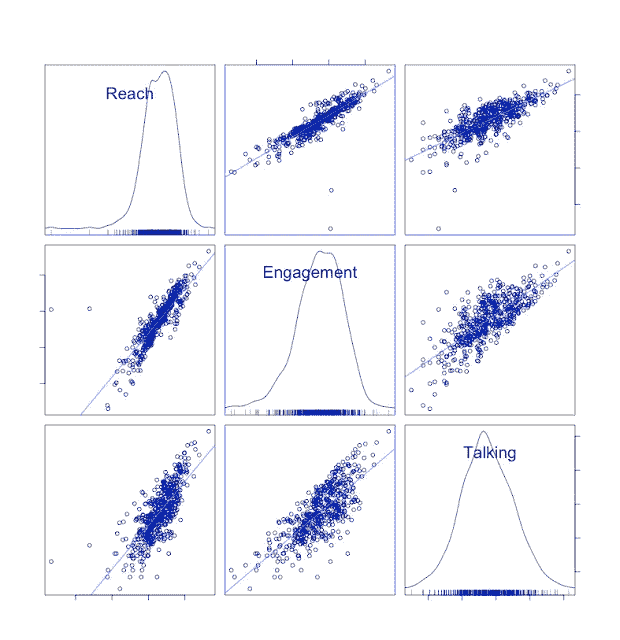

Figure 10: Reach vs. Engagement vs. Talking about this (log-transformed)

为了量化这个问题，一些人开发了一个叫做对话率的指标。此指标计算为“谈论此事”与“达到”的比率。我将列出最少和最多的对话故事，并对内容中观察到的模式进行快速总结。让我们先来看看对话最多和最少的故事，并试图调查它们为什么会变成这样。

**最会说话的故事**

1.  俄克拉荷马城雷霆队的明星凯文·杜兰特今天承诺为昨天毁灭性的 T2 龙卷风后的恢复工作捐赠 100 万美元。【http://b.globe.com/191OR6r 
2.  夏天住在波士顿公园(冬天住在富兰克林公园动物园)的**天鹅**罗密欧与朱丽叶，今天回到那里，标志着春天的季节真正到来了。见照片:[http://b.globe.com/ZOid4O](http://b.globe.com/ZOid4O)
3.  阿诺德树木园的紫丁香盛开了。这张照片是昨天在植物园拍摄的，官方名称是丁香星期天。如果你有机会顺便来看看。环球员工照片/ Yoon S. Byun
4.  向飞行员问好。它今天进行了首次运行，并计划于下周末正式亮相，这是大约 25 年来第一次从波斯顿到科德角的服务。http://b.globe.com/13xiois:你会骑它吗？
5.  马拉松**爆炸** **在一毫秒内切断了马克·富卡里勒(如图，和他的未婚妻珍·雷根)的右腿**。它放过了左派，但也差不了多少。现在，他和他的家人正处于痛苦的等待游戏中，看他的“**好的”腿** **能否保住**。[http://b.globe.com/11igVlA](http://b.globe.com/11igVlA)
6.  在一场 EF-4 **龙卷风**袭击后，一名**儿童被从俄克拉荷马州摩尔市广场塔小学的废墟中救出。风速高达每小时 200 英里的龙卷风，宽度达一英里，并留下大片破坏区域。[http://b.globe.com/12pP8KY](http://b.globe.com/12pP8KY)**
7.  “这是波士顿体育史上最伟大的时刻之一，”《环球时报》的丹·沙乌格内西写道，布鲁因斯队激动人心地战胜了枫叶队。“然后奇迹出现了……布鲁因斯**进球了，进球了，进球了**”[http://b.globe.com/18H5GTZ](http://b.globe.com/18H5GTZ)
8.  波士顿运动协会邀请所有未能完成 2013 年波士顿马拉松的参赛者参加明年的比赛。这影响了 5633 名跑步者。
9.  布拉德·马尔尚在**加时赛**的 15:40 分钟时，为布鲁因斯队攻入制胜一球。故事:【http://b.globe.com/10vZlak[(图片来源:美联社)](http://b.globe.com/10vZlak)
10.  在得知她有 87%的机会患乳腺癌后，女演员安吉丽娜·朱莉接受了预防性的双乳房切除术。朱莉今天在纽约时报专栏上分享了她的故事:[http://nyti.ms/18HZFX3](http://nyti.ms/18HZFX3)环保局照片

**最少对话的故事**

1.  基思·雷丁的惊悚片《几乎是蓝色的》在查尔斯镇工作剧院上映，与其说是蓝色，不如说是 http://goo.gl/PwlBT 的黑色
2.  #海鲜饭辣椒的配方[http://goo.gl/PwlBT](http://goo.gl/PwlBT)
3.  新:马修吉尔伯特的 Buzzsaw 专栏。环球影评人马修·吉尔伯特(Matthew Gilbert)问道，作为最受崇拜的“发展受阻”，带着一季大小的“集转储”回归，给观众太多会让他们无话可说吗？[http://b.globe.com/10a7Sg5](http://b.globe.com/10a7Sg5)
4.  用这些时尚的母亲节礼物让妈妈感到更加特别。
5.  菲尼克斯太阳队任命前波士顿凯尔特人队的 33 岁的瑞安·麦克多诺为他们的新总经理。
6.  专辑评论:巴兹·鲁赫曼改编的电影《了不起的盖茨比》(The Great Gatsby)的配乐由 Jay-Z 策划，是对那个时代的梦幻再现，将 20 世纪 20 年代的爵士乐置于现代流行音乐和嘻哈音乐的背景下。奇怪的是，原声音乐缺少的是心。
7.  创新的躁动和冒险的感觉是 Iron & Wine 最新专辑《幽灵上的幽灵》(Ghost on Ghost)的核心，萨姆·梁(Sam Beam)将于今晚在伯克利表演中心(Berklee Performance Center)举行一场演出来庆祝这张专辑。
8.  书评:深受喜爱的《追风筝的人》的作者卡勒德·胡赛尼，带着《群山回响》回到了他的祖国阿富汗崎岖的土地上
9.  乔恩·莱斯特在芝加哥的六局比赛中失六分，白袜队以 6 比 4 击败红袜队。
10.  雅虎将以 11 亿美元收购 Tumblr。你认为这将有助于重振雅虎品牌吗？Tumblr 是一个好的投资吗？

下面是我对故事对话潜力相关模式的快速总结。

*   漂亮和令人愉快的东西是最容易交流的，比如照片幻灯片。
*   也是高度对话式的:有一个问题，但已经(或将会)有一个解决方案:
*   在体育比赛中奇迹般获胜，打破了平局
*   未能完成马拉松，但被邀请回来做这件事
*   马拉松爆炸受害者，但得到了医疗护理
*   自然灾害，但孩子们得救了
*   癌症的机会，但干预使其最小化
*   两个城市分开了 25 年，但最近联系起来了
*   最不健谈的:
*   艺术相关(音乐、电影、书籍等。)
*   事实信息(体育比分、已达成的商业交易等。

对话也可以通过快速和慢速思维框架来解释。两种美丽的照片(天鹅和紫丁香)可能会吸引系统 1，并有助于对话。相比之下，其他八个热门对话故事根本没有漂亮的照片。相反，他们首先提出一个问题(平局、龙卷风、癌症、断线等。)然后提供一个解决方案或者一个凯旋。这种模式我命名为张力释放，由一个转折点组合而成。由于转折点扰乱了信息的流动，它可能会减缓人们的思维，并使系统 2 发生反应。

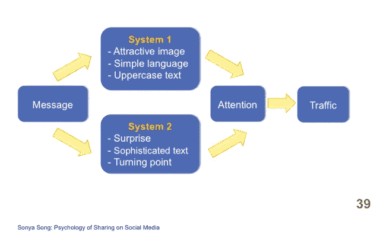

Figure 11: How to attract System 1 and System 2 for higher traffic

综上所述，在社交媒体上吸引眼球的方式多种多样。漂亮的照片、简单的信息和大写的单词可能会吸引系统 1 的一些无意识的注意。为了吸引更多有意识的和有意义的注意，我们可以在信息中强调惊喜、复杂的语言和转折点。这两种方法都有助于在社交媒体上获得更多的关注和流量(见图 11)。有些人可能会说这些方法是骗人的。然而，我认为，判断取决于目标。如果我们的目标是真诚地接触更多的观众，增加新闻编辑室的公民影响力，那么这些技术的使用是合理和恰当的。在这里我想引用卡尼曼对此的看法:

> 所有这些都是很好的建议，但我们不应该忘乎所以。如果你的信息明显是无意义的，或者与你的听众知道是真实的事实相矛盾，那么高质量的纸张、明亮的颜色、押韵或简单的语言都不会有太大的帮助。做这些实验的心理学家并不认为人是愚蠢的或容易受骗的。 ***心理学家认为，我们生活中的大部分时间都是由系统 1 的印象引导的……****——如何写一条有说服力的信息，丹尼尔·卡内曼(2011 年，第 64 页)*

- * — * — * — * — * — * — * — * -

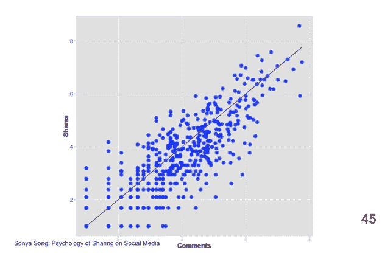

图 12:评论与分享(对数转换)
人们在脸书上有三种表达方式:喜欢、分享和评论。一般来说，喜欢超过分享和评论，因为这是人们可以承受的最便宜的表达方式，除了一些负面或有争议的信息(图 12)，这些信息使“喜欢”与人们的认知相矛盾。这一发现并非脸书独有，其他网络媒体也是如此。在 YouTube 上，尽管有大量的观看，但竖起大拇指或向下只占总观看数的 0.22%，评论占更小的比例 0.16%的人会留下评论( [Cha et al .，2007](http://dl.acm.org/citation.cfm?id=1298309))；在维基百科上，4.6%的访问与编辑有关；在 Flickr 上，20%的用户曾经上传过照片( [Auchard，2007](http://www.reuters.com/article/2007/04/18/us-web-participation-idUSN1743638820070418) )。当我问评论和分享哪个数字更大时，问题就变得棘手了。对此的最佳回答是:视情况而定。在图 12 中，线条标记了匹配注释的股份；上面有更多的分享，下面有更多的评论。这里有一对案例(图 13)。第一个帖子是滚石封面，以波士顿爆炸案嫌疑人为主角。它收集了大约 600 条评论和 100 条分享(你可能也注意到了，它只获得了 57 个赞，比分享和评论都少)。第二个例子是以英雄警察和受害者为主题的另类封面，吸引了约 100 条评论和 600 次分享。这两个帖子是关于同一个主题，但是它们引发的活动是不同的。

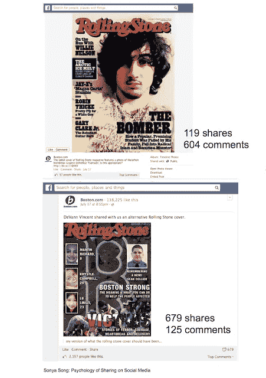

Figure 13: Contrast between comments and shares

为了回答为什么人们会通过分享或评论做出反应，让我们来看看更多的例子。它们是股票超过评论最多的极端例子，反之亦然。

1.  你留在了芝加哥:黑鹰队今天投放了一整页的《波士顿环球报》广告，向布鲁因斯和波士顿人民表达感谢和赞扬。[http://bo.st/14BGdHL](http://bo.st/14BGdHL)
2.  昨晚，旧金山市政厅被彩虹旗的颜色点亮，最高法院的裁决为同性婚姻在经历了长达五年的激烈法律斗争后在加州恢复扫清了道路。故事:[http://bo.st/18inxlD](http://bo.st/18inxlD)环保局照片
3.  这可能是我们见过的波士顿上空最好的烟火照片。《环球时报》摄影师马修·j·李摄我们希望每个人都有一个美好的 7 月 4 日！更多庆祝活动的照片:http://bo.st/18AIVmv
4.  德文·文森特与我们分享了一张《T4》的另类滚石封面。
5.  大卫·奥尔蒂斯在他的第一次击球中击出二垒安打，成为棒球史上安打次数最多的指定击球手，并在一局后击出两分全垒打，带领**红袜**队在周三晚上以 11 比 4 **战胜西雅图水手队**。[http://bo.st/16t6Wpz](http://bo.st/16t6Wpz)
6.  **“波士顿强**”是第十届里维尔海滩沙雕节的中心主题，该节将持续到周日。
7.  我们今年最喜欢的摄影作品之一:**2013 年国家地理旅行者**摄影比赛的获胜者。这里可以看到东方尖叫猫头鹰在做它们最擅长的事情。你最好有一双锐利的眼睛来发现这些小猛禽。
8.  上个月出生在圣安东尼奥动物园的一只双头龟变得如此受欢迎，以至于它现在有了自己的脸书主页。你可以在这里找到《末路狂花》的剧情:[http://on.fb.me/1e4rdWB](http://on.fb.me/1e4rdWB)
9.  红袜队在从七月开始到八月结束的 15 局胜利后，又回到了第一的位置。在周四午夜过后 14 分钟结束的比赛中，斯蒂芬·德鲁最终以决定性的一击帮助波士顿以 5 比 4 战胜西雅图水手队。[http://bo.st/169Fcrn](http://bo.st/169Fcrn)
10.  今晚在芬威公园，红袜队以 8 比 2 轻松击败水手队。[http://bo.st/158PjQu](http://bo.st/158PjQu)
11.  《滚石》杂志的最新封面刊登了一张马拉松爆炸案嫌犯焦卡尔·萨纳耶夫的照片。这样合适吗？[http://bo.st/15lJKKX](http://bo.st/15lJKKX)
12.  非常悲伤的消息:宾夕法尼亚州西部两岁的洛根·史蒂文森在上周父母的婚礼上担任伴郎后，昨晚死在了母亲的怀里。
13.  这条死去的鲨鱼今天早上被发现躺在楠塔基特的海狗酿酒酒吧前。
14.  Tedeschi 食品店和 CVS 都承诺不刊登封面上有马拉松爆炸案嫌疑人 Dzhohkar Tsarnaev 的《滚石》杂志。
15.  一名英国研究人员声称，规律的性生活(T3)可能是看起来年轻 7 岁的秘密。
16.  继**乔治·齐默尔曼判决**之后，前奥巴马顾问范·琼斯在推特上发布了这张照片，照片上小马丁·路德·金穿着帽衫……你认为这张照片上 MLK 穿着帽衫合适吗？
17.  南茜·克里根和棠雅·哈丁将会在二月份作为一部新纪录片的一部分回到聚光灯下，这部纪录片将会在奥运期间在 NBC 电视台播出。你会看吗？
18.  据 TSN 报道，作为周四多方交易的一部分，布鲁因斯将把泰勒·塞金送到达拉斯来交换路易·埃里克森。这笔交易用塞金、里奇·佩维利和小联盟球员瑞安·巴顿来交换埃里克森、乔·莫罗、雷利·史密斯和马特·弗雷泽。[http://bo.st/17Or9Jv](http://bo.st/17Or9Jv)
19.  一名康涅狄格州八年级学生**拼错了“危险”的正确答案**问题，并为此丢了钱说他被骗了。你同意吗？
20.  我们正处于热浪之中，所以让我们来谈谈冰淇淋吧。新英格兰最好的冰激凌店是哪家？请在评论中发表你最喜欢的。谢谢！

# # # # # # # # # # # # # # # # # # # # # # # #

审视以上 20 个帖子的一个角度是情绪。一些心理学家研究情绪与信息传播的关系( [Rimé，1991](http://www.tandfonline.com/doi/abs/10.1080/02699939108411052%23.UoKZaJRVQvo)；彼得斯，2009 年。当故事是关于其他人的插曲时，情绪会起到如下作用:

*   人们与不同的观众分享充满不同情感的故事，比如家人和朋友，而不是陌生人。
*   在不同类型的情绪中，有些比其他的更常见。在离线环境中，人们发现兴趣、快乐和厌恶更容易被分享。
*   一种情感越强烈，一个故事就越有可能被分享。

一些学者已经将情绪研究应用到媒体领域。例如， [Berger 和 Milkman](http://journals.ama.org/doi/abs/10.1509/jmr.10.0353) (2012)研究了从《纽约时报》头版收集的 6956 篇文章和电子邮件分享的频率。他们发现，高唤醒情绪与更多的电子邮件分享有关，包括积极(敬畏和娱乐)和消极(焦虑和愤怒)情绪。此外，研究人员发现，当一个故事变得不那么情绪化时，读者可能会分享它。他们控制了其他因素，如头版位置，并讨论了情绪和信息传递之间的复杂关系。他们的发现与之前在离线环境下进行的研究一致。

请注意，这项研究是在 2008 年进行的，当时调查人员关注的是新媒体而不是社交媒体，以及通过电子邮件进行的窄播而不是通过社交媒体进行的广播。尽管如此，他们的发现对社交媒体仍有影响。从脸书上面的 20 个帖子中，我们还可以观察到一个与情绪有关的模式。快乐的(同性婚姻，红袜队的胜利)和有趣的(最佳烟火，双头乌龟)故事被分享的比评论的多。

**社会关系维护**

相比之下，悲伤的(死亡，损失)和可鄙的(各种嫌疑人，体育丑闻)故事被评论多于分享。看看脸书，我们认识到它是一个连接朋友和家人的场所。这一特点可能会导致分享和评论之间的分歧，因为评论将允许用户在半匿名的空间内参与，远离他们的朋友和家人。

也许还有其他原因可以解释为什么脸书的一些故事比其他故事更容易分享。脸书以积极的情感氛围([皮尤研究，2012](http://pewinternet.org/Reports/2012/Social-networking-climate.aspx) )和和谐的社会关系而闻名——猜猜为什么没有不喜欢按钮被引入脸书。

我们可以怀疑为什么我们更喜欢保持良好的社会关系有各种各样的动机。一些学者认为，良好的社会关系表明人际吸引和信任，有助于获得社会支持，并有助于传递对职业表现至关重要的信息和资源( [Podolny 和 Baron，1997](http://www.jstor.org/discover/10.2307/2657354?uid=3739696&uid=2&uid=4&uid=3739256&sid=21102910736977) )。另一些人则称之为互惠，假设人们给予，同时期望在以后得到回报。

尽管这些动机多种多样，但人们通常都是为了保持良好的社会关系。因此，这种行为也应该在脸书这个社交网络中心观察到，它的用户应该努力取悦他人，避免冒犯他人。这意味着，如果一个帖子警告恶劣天气，人们更有可能在社交关系中分享它(信息交换)。另一方面，如果一个政治或宗教故事肯定会让一些用户的父母、朋友或老板感到不安，他们会不愿意通过分享来羞辱他们。或者，如果它与社交圈的信仰一致(体育胜利、同性婚姻、正义感)，分享是首选。

尽管如此，当一个故事读起来有争议和情绪化时，人们会产生一种冲动去表达他们的观点。在这些情况下，我们会注意到一个帖子下产生了很多评论，尽管它可能不会导致很多分享。

**自我形象管理**

除了维持与他人的关系，人们还倾向于改善和管理他们在社会生活中的存在。[高夫曼](http://clockwatching.net/~jimmy/eng101/articles/goffman_intro.pdf) (1959)将日常生活比作戏剧表演；在这两种情况下，人们会认出一个特定的场景，并把自己呈现在一个已知的观众面前。不仅通过面对面的互动，人们还试图通过将自己与有形物体(如品牌商品)联系起来来建立理想的自我形象。正如[汤普森和赫希曼](http://psycnet.apa.org/psycinfo/1996-13171-001)指出的:“消费通过一个人的财产所传达的形象和风格来产生一个想要的自我”(1995 年，第 151 页)。

类似的现象在网上也观察到了。例如，个人网站所有者可能会遵循“我们就是我们发布的东西”的座右铭，因为他们可以通过随心所欲地展示品牌标志和产品来管理他们的在线自我形象，而不是财务拮据的现实生活( [Schau & Gilly，2003](http://www.jstor.org/stable/10.1086/378616) )。在约会网站上，人们变得相当谨慎，因为个人资料和照片往往是精心挑选的，如果不是完全误导的话。我们还听说，青少年痴迷于频繁改善他们的网上形象，并为此感到疲惫不堪。同样，我们怀疑脸书页面(品牌、名人、新闻媒体等。)也被用来塑造和提高人们在网上的形象，或者理想的自我形象。

在社交媒体上，“我分享所以我在”。脸书用户策划和分享的新闻故事不可避免地也传达了他们理想的自我形象。以 *Wired* 为例，它频繁“极客”粉丝。复杂的电路和图表往往是高度共享的，如下图截图所示。我相信*连线*拥有高科技受众，但这些“极客”故事仍然可以被非技术读者策划为装饰品。

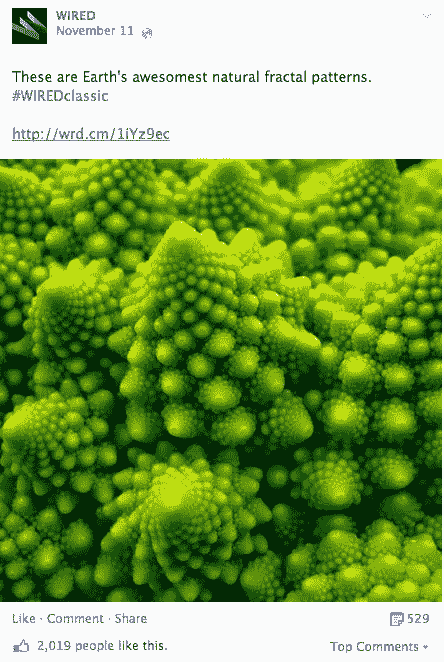

再比如*《纽约时报》*的脸书页面，如下图截图所示。它的帖子既时髦又聪明(科学、健康、可爱的小贴士),被高度分享。

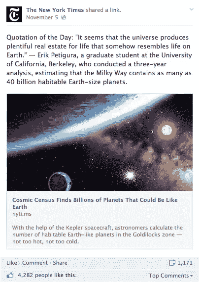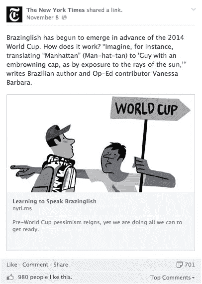

# # # # # # # # # # # # # # # # # # # # # # # #

在这篇文章中，我强调了我对社交媒体的研究，尤其是脸书如何看待《波士顿环球报》的帖子。这是我第一次分析后的后续研究，重点是实证证据。解释为什么观察到各种类型的阅读和分享行为是这项研究的目的。我采用的理论和得出的结论包括:

*   人们不断地在快速和慢速思维模式之间切换。
*   在社交媒体上，人们大多被快速模式所引导。
*   为了迎合快速思维模式，我们应该更好地利用形象，保持语言简单。
*   另一方面，不要犹豫地讲述复杂的故事，因为它们可能会让人们慢慢思考，从而获得更多的反馈。
*   如果你想鼓励讨论，请提问。
*   如果你想让一个故事变得有对话性，用一种紧张感和一种解脱感来表现一个转折点，因为转折点会吸引注意力。
*   如果你想看到更多的分享，考虑在故事中注入情感；积极的(敬畏和娱乐)和消极的(愤怒和焦虑)情绪都可能起作用。
*   除了情绪，聪明也有用，因为人们试图以一种理想的方式呈现自己。在科学、健康和时尚故事方面表现出一些好的品味，他们将有更好的机会被选中。
*   如果你的故事没有被广泛分享，而是被狂热地评论，这可能是由其中的争议引起的，因为人们珍惜社会关系，避免通过分享令人不快的故事来扰乱家人、朋友和同事。

随着我的研究的发展，这一指导方针将会持续更长时间，但我绝不把它作为新闻编辑室应该严格采用的处方，因为 1)过度使用这些策略可能会让读者疲惫不堪，2)创造力最有效。我认为，这个列表的目的是作为一个营养事实标签，帮助新闻编辑室调查为什么有些帖子会出现，而另一些则不会，因为你包括或排除了一些成分。尽管如此，这完全取决于个体社交媒体编辑来制定他们的最佳策略，以推广已经发布的新闻故事。也就是说，在我看来，在社交媒体上分享新闻故事可能比新闻更与广告相关，因为这些故事已经作为最终产品完成了。接下来是一场注意力之战，以及说服读者分享的努力。

# # # # # # # # # # # # # # # # # # # # # # # #

我在分析中使用的统计工具是负二项式回归来控制新闻报道的各个方面。我控制的因素是新闻部分(由*波士顿环球报*定义)和一天中的共享时间以及一周中的一天。在分析这三个 KPI 时，我控制了另外两个。关于省略变量的更详细的解释，请查看我以前的博客文章“独立变量、因变量和负二项式回归”中关于实证的部分:[对脸书](https://medium.com/@sonya2song/proto-analysis-of-boston-globe-traffic-on-facebook-db66bcda3693)的波士顿环球报流量的原型分析。

另一个值得注意的是，脸书最近[重新定义了指标](https://www.facebook.com/facebookforbusiness/news/pageinsights)，所以未来的研究可能会显示不同的数字。尽管如此，潜在的理论应该仍然适用，因为我们人类对自己的行为相当执着。

作为 Knight-Mozilla OpenNews 的研究员，我一直得到《波士顿环球报》的持续支持，他们的支持使得这项研究得以进行。我非常感谢《环球时报》的工作人员与我分享数据，因为他们的好意帮助我和许多其他新闻编辑室了解人们如何在社交媒体上阅读和分享新闻。我希望这项研究有助于确保其在网络媒体世界的领先地位，不仅通过响应性设计，还通过社交媒体的战略使用。

与《波士顿环球报》合作是一种特权，这种特权是通过 OpenNews 提供的。我无法表达[对](http://sonya2song.blogspot.co.uk/2013/07/why-opennews-fellowship-is-great.html)[丹·辛克](https://twitter.com/dansinker)和[艾丽卡·欧文斯](https://twitter.com/erika_owens)的感激之情，他们是伙伴计划背后的人，感谢他们的信任和支持。今年太棒了！

此外，我要感谢我在密歇根州立大学的导师史蒂夫·怀尔德曼，他一直支持我的研究。丹尼尔·卡内曼的*思考，快与慢*，史蒂夫推荐的那本书，在这项研究中给了我很多启发。我还要感谢安·克朗罗德教授和我在 MSU 的同学黄冠雄。他们在广告和营销方面的专业知识帮助我丰富了这项研究。

*原载于 2013 年 11 月 14 日 sonya2song.blogspot.com***。**