# PyCon India 2018 —数据科学家的体验

> 原文：<https://towardsdatascience.com/pycon-india-2018-a-data-scientists-experience-a7ca59e26ea9?source=collection_archive---------19----------------------->

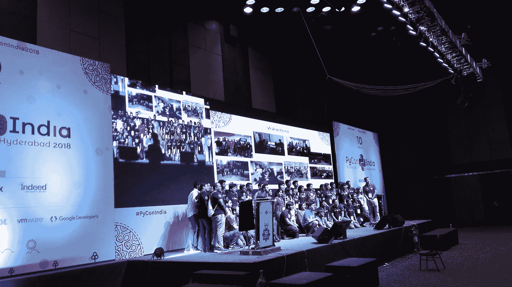

The team behind PyCon India 2018

每年秋天来临的时候，它都会在世界各地掀起一场大规模的会议、研讨会和黑客马拉松。其中之一是[派康的](https://www.pycon.org/)非常自己的[派康印度](https://in.pycon.org/)

PyCon India 汇集了技术专家、科学家、一般开发人员和 Python 开发人员、开源贡献者、数据极客和软件开发人员(具体而言)

今年，PyCon India 十周年庆典在海得拉巴市的海得拉巴国际会议中心(HICC)举行，约有 16000 名与会者在不同领域使用 Python，从为科学图书馆做出贡献到自动化和维护发电厂。

# 那么，我们开始吧，让我们看看 2018 年印度 PyCon 上发生了什么😍：

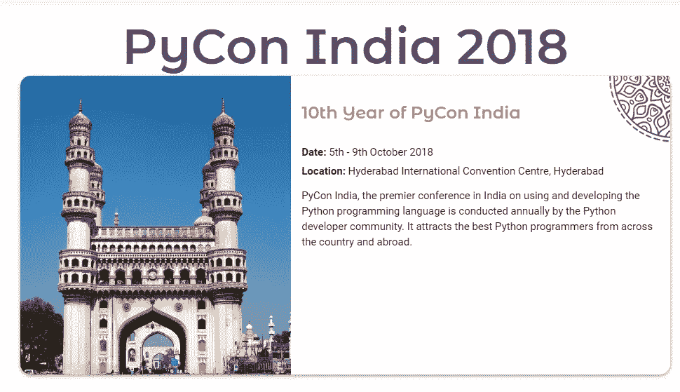

一般来说，PyCon India 从各种 Python 库和框架的研讨会和实际操作开始，这些库和框架用于解决许多问题的各个领域。激动吗？什么问题？谁解决？怎么解决？…🤔🙄

## 让我们看看他们🤗研讨会…👨🏻‍💻

Exploring PyTorch for AI assistance in medical imaging

这个人是深度学习工程师(哇，工程师🙃)解决医疗保健面临的问题。他说，*“就像在我们的日常生活中一样，人工智能和机器人越来越成为我们医疗保健生态系统的一部分。目前医疗保健被打破了；医生短缺；护理质量差。迫切需要为整个医疗行业提供援助，以改善医疗保健”(嗯，没错*😌)

这个会议说明了我们作为工程师有多棒，今天谁关心健康(如果你关心的话👏🏻)? [Abhishek Kumar](https://vibrantabhi19.github.io/) 和 [Aditya Bagari](https://www.linkedin.com/in/aditya-bagari-863808a6/) 震撼了本次会议，他们带领观众从介绍 PyTorch 到解释卷积神经网络以及[如何在充满挑战的敏感医疗保健领域使用它](https://github.com/vibrantabhi19/PyConIndia2018)。

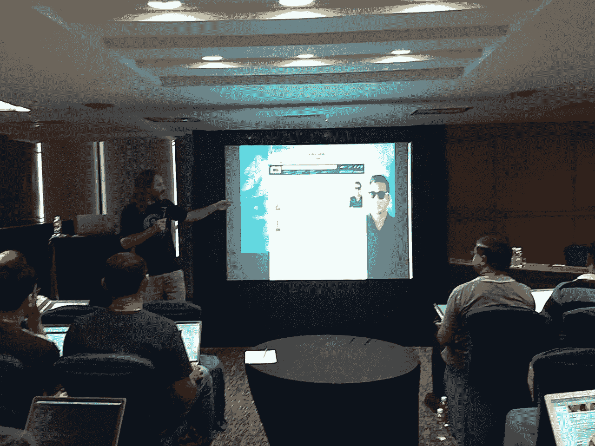

Decoding Bollywood with Python and Data Science

敲门敲门。这是马克·加西亚和他的朋友希曼舒。Marc 是 Python 数据分析库 Pandas 的核心开发人员🐼🐼
但是，等等！告诉我谁更受欢迎，*卡特里娜·卡伊夫*和*迪皮卡·帕度柯妮*？从故事情节来看，什么电影最像 *PK* ？

惊讶吗？好奇想知道？😃

在这个工作室中，他们收集 IMDB 数据，在熊猫中进行处理，制作美丽的图案，并在散景和其他带有宝莱坞数据的酷东西中可视化，[看看他们的 github repo 并享受吧！！！](https://github.com/datapythonista/bollywood_workshop)

本次研讨会展示了 Python 及其开源库的另一个令人惊叹的应用，这个人展示了 Python 如何简化地理空间数据(矢量数据和栅格数据)的分析。

他说，“*地理空间表示在日常生活中非常普遍，例如甚至在简单的与地图、航空/卫星图像等旅行相关的对话中。在数字时代，地理空间数据被广泛生产和消费，其比例越来越大。Python 及其免费和开源库提供了各种简单有效的工具来可视化和分析地理空间数据"*

他向我们介绍了一个名为 GeoPandas 的出色的 python 库，这是一个开源项目，旨在使使用 Python 处理地理空间数据变得更加容易。GeoPandas 扩展了[熊猫](http://pandas.pydata.org/)使用的数据类型，允许对几何类型进行空间操作。几何运算由 [shapely](http://toblerity.github.io/shapely) 完成。Geopandas 进一步依赖 [fiona](http://toblerity.github.io/fiona) 进行文件访问，依赖 [descartes](https://pypi.python.org/pypi/descartes) 和 [matplotlib](http://matplotlib.org/) 进行绘图。(酷😍，没有？).别忘了留意他的 GitHub 报告。

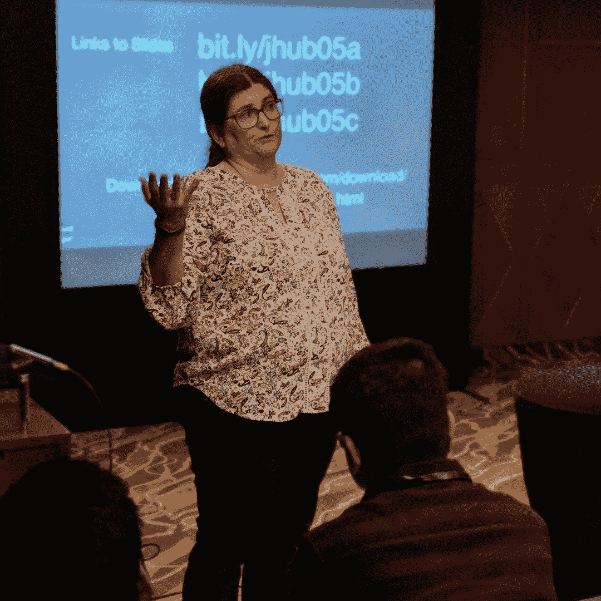

JupyterHub and Binder

Carol Wiling 是 Project Jupyter(是的，你没看错)和 CPython 的核心开发人员之一，也是 Python 软件基金会的前主任。

她参加了一个关于 Python 中科学计算以及 JupyterLab 如何用于此目的的精彩会议

她用 JupyterLab 和它在数据科学和科学计算中的应用告诫与会者(是的，哈哈)

在本次会议中，我们了解了 JupyterLab 用户可以使用的新用户界面功能。稍后，我们将超越 JupyterLab 的个人工作流，看看 JupyterHub 如何将 JupyterLab 带给用户组。最后，我们讨论了 Binder 及其为 Jupyter 笔记本和其他设备提供短暂计算环境的能力。这是她对案例研究的幻灯片

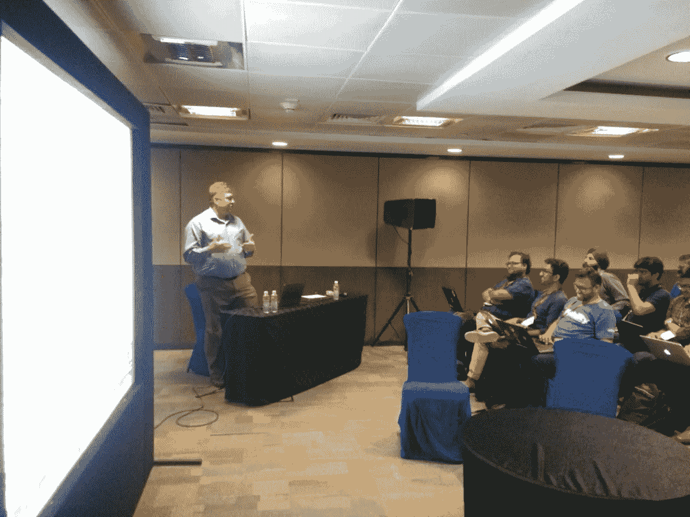

嘿，你认识照片上的这个人吗(不认识？😱)?他是 SciPy，NumPy 和 Numba 的创造者。特拉维斯·奥列芬特是你在 Python 中进行科学和数值计算的原因。(你用 anaconda 吗？他也是幕后黑手🤓)

是的，他拿走了车间！他说所有使用 Numba，NumPy 的人都是“他的人”

在这个研讨会上，他讨论了用 Numba 和 Dask 扩展 Python，他解释了 Python 的编译器是如何工作的(什么？编译器？)并使用 JIT 编译器增强 Python 的计算能力💪🏻

*这些是 2018 年印度 PyCon 第一天的几个研讨会的亮点！*

# 现在怎么办？发布会！！！😻😻

Conference Hall (empty, han?)

人们为什么参加会议🤔？嗯，也许是因为以下原因？
1。走廊对话
2。伟大的会谈(我知道你不看网上会谈)
3。潜在的职业机会(许多人通过 PyCon 找到工作)
4。与创业公司和公司建立关系网。开始进入开源领域
，这样的例子不胜枚举…🚀

在会议期间，我必须在登记处管理门票、t 恤和礼品，我们做得很好(你可以问与会者🤷🏻‍).我真的很喜欢登记的匆忙(等等😼)

会议以开幕致辞开始，以 2018 年印度 PyCon 主席 *Manivannan Elangovan 的闭幕致辞结束。* 但是等等！这中间发生了什么？好了，让我们来看看亮点！

主题会议、机构群体讲座、赞助商讲座、照明讲座和各种平行讲座都在这两天举行。人们分散在 HICC 的各个房间和大厅。

这四位传奇人物是主题演讲人，他们都让我和众多与会者着迷。

*着迷？怎么会？这些人是我们今天所看到的人工智能的原因，这些人是我们今天如何处理数据的原因！*

阿明·罗纳彻(Flask framework 的创始人，用 Python 编写的令人敬畏的 web 应用程序框架)是第一个主旨发言人，随后是特拉维斯、卡罗尔和西杜。*我永远不会忘记在这两天的会议中我看到并记下的一些精彩内容*

这个闪电谈话中的传奇展示了他如何运用自己的天赋、技能和热情去营救喀拉拉邦洪水的受害者。他是 Django 的开发者 Biswas，在喀拉拉邦洪水灾民的大量请求中，他帮助 keralarescue.in 运行。

Carol Wiling 在她的演讲中分享了一些关于 Python 及其未来的很酷的统计数据。她已经编码 41 年了！

她说[1989 年的 Python，
154，293 个项目，
1，094，879 个版本，
1，503，765 个文件，
268，049 个用户](https://twitter.com/Daminisatya/status/1048905040369520640)

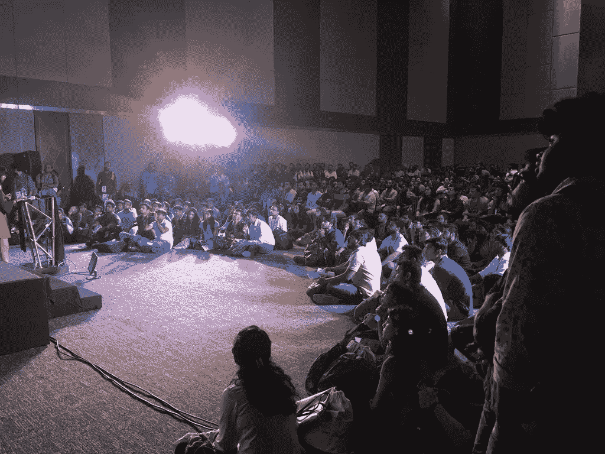

在这里你可以看到很多谦卑，人们坐下来听数据科学家达薇亚关于自然语言处理的演讲。

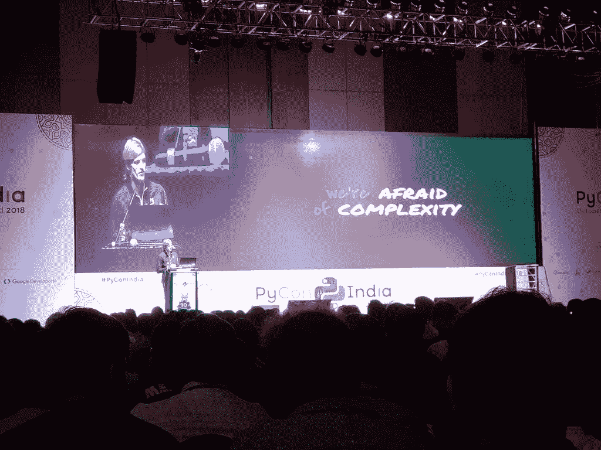

阿明·罗纳切尔讨论了 Python 的“T2”对复杂性的恐惧。

阿明 [@mitsuhiko](https://twitter.com/mitsuhiko) 在 [@pyconindia](https://twitter.com/pyconindia) 的主题演讲中表示愿意应对 [#Python](https://twitter.com/hashtag/Python?src=hash) 及其社区的挑战，这非常了不起。我们只有通过深入看待我们的挑战来学习。向 Rust 等其他社区学习是个好主意。

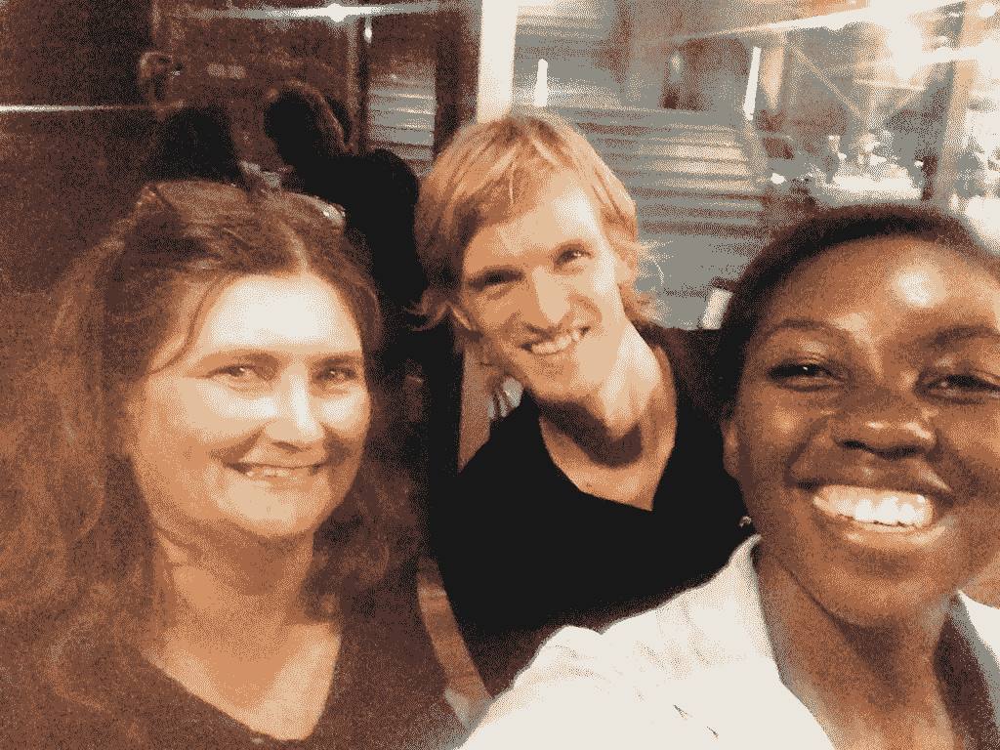

给你，在会议的第二天晚上，玛琳·姆汉加米与卡罗尔和阿明进行了激烈的讨论。

Marlene 是 Python 软件基金会的主任，也是津巴布韦 Python 用户组的联合创始人

**嗯，有一个 Durgaput Linux 用户组** **的聚会，这是一个大多数学生在开源和自由软件基金会的海洋中开始他们职业生涯的地方。**

在这里，我开始了我的数据科学之旅，学到了技术伦理，学到了自由软件运动的遗产和许多东西。十年前，库沙尔·达斯创立了 DGPLUG，帮助学生在从事牙线工作后最终找到工作

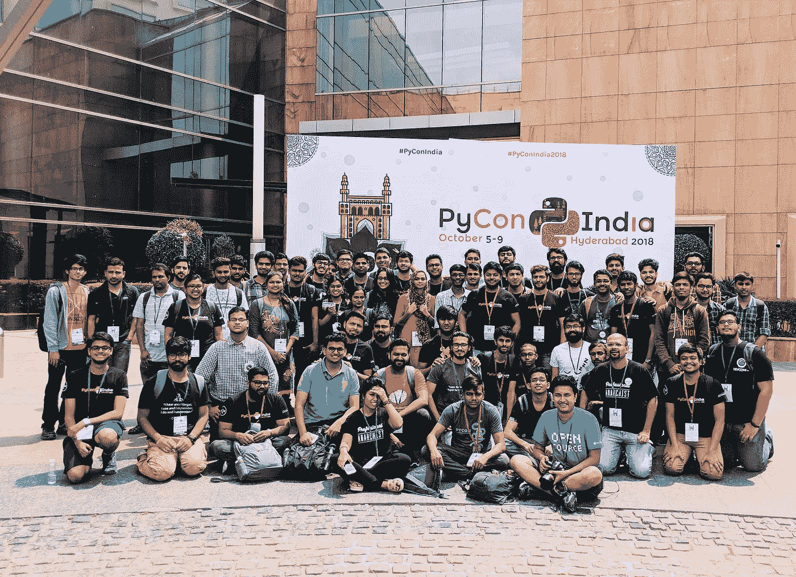

Alumni and Community of Durgapur Linux User Group’s very own Summer training

# 👨🏻‍💻👨🏻‍💻👨🏻‍💻👨🏻‍💻👨🏻‍💻发展冲刺👨🏻‍💻👨🏻‍💻👨🏻‍💻👨🏻‍💻👨🏻‍💻

在 PyCon 的 Devsprints 上又是一个伟大的日子(但不是最后一天),开发人员聚集在一起，通过贡献他们天赋的编码技能来解决问题

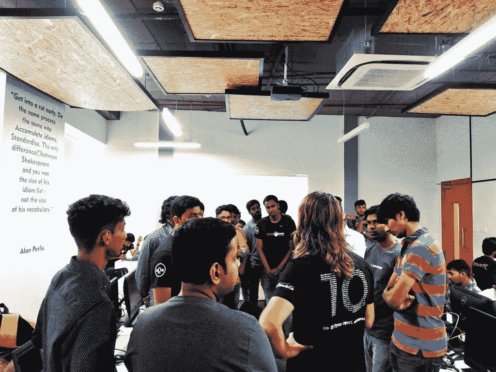

数据人马克·加西亚激励我们为熊猫做贡献，并简化这个令人敬畏的数据工具

令人敬畏的 Jupyter 女人 Carol Willing 坐在椅子上指导开发人员，并指导我们解决 Jupyter 项目中的问题

阿明(烧瓶创建者)、特拉维斯·奥列芬特(T1)(Scipy 创建者)、卡罗尔·威林(CPython 核心开发人员和 Jupyter 核心开发人员)、马克·细川玉子(熊猫核心人员)都非常谦逊，乐于助人。他们站了几个小时来回答与会者的问题，吃饭的时候，休息的时候，会议结束后，哇！编码，交谈，指导，吃，享受这个 [PyCon](https://www.linkedin.com/feed/topic/?keywords=%23PyCon) 。

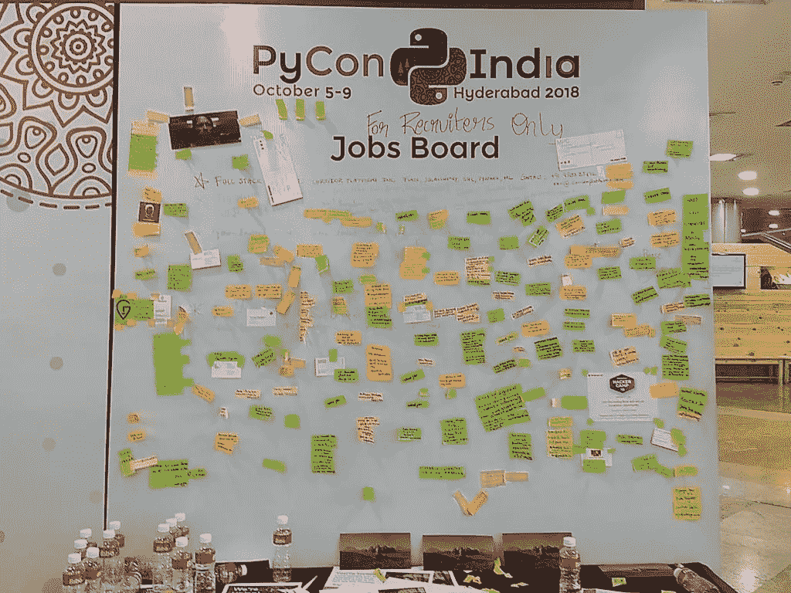

Jobs Board at PyCon

那么，这就是 2018 年印度 PyCon 的结束。人们编码、指导、建立联系、交谈等等

无论如何，我只见过创业的人和研究员，他们给了我很多关于我们(我和我亲爱的朋友)即将到来的商业想法的建议(上帝保佑)

这一次，人们聚集在这个国家最好的会议中心之一，它以热情好客而闻名

人们得到了工作推荐，初创公司和跨国公司展示了他们的产品，Python 核心开发人员、Pandas 核心开发人员和 Jupyter、Scipy 开发人员来到现场，与开发人员互动

人们寻求他们的指导来为这些令人敬畏的项目做贡献，一些公开的问题已经在 Devsprints 中解决了

开源人员听到了一个好消息，他们将获得一份有报酬的工作(如果他们将自己的想法转化为业务，并拥有自己的创业公司，而不是免费提供他们的想法，这将更加有益，也许他们可以成为独角兽🦄)

> 为语言而来，为社区而留——布雷特