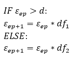
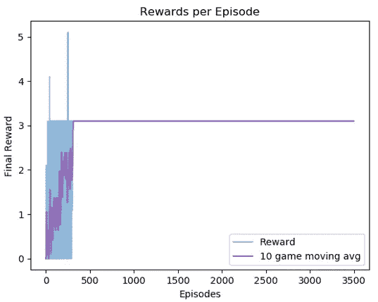
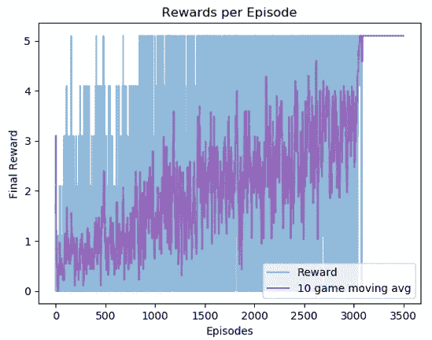
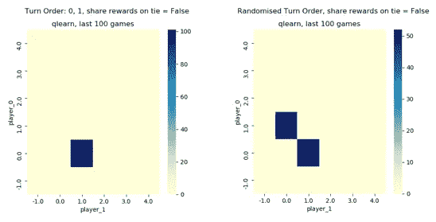
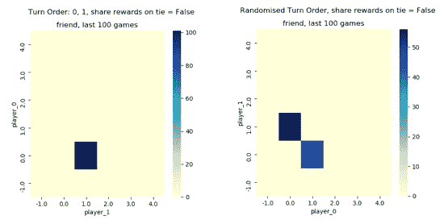
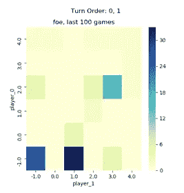

# Q-Bay:用模拟拍卖解释 Q-Learning

> 原文：<https://towardsdatascience.com/q-bay-explaining-q-learning-with-simulated-auctions-f85bac990c60?source=collection_archive---------10----------------------->

强化学习是一个热门话题，近年来，DeepMind 的 AlphaGo 等复杂系统利用一种叫做深度 Q 学习的方法取得了引人注目的成功，但它们是如何工作的？本文解释了 Q-Learning(深度 Q-Learning 背后的强化学习方法)是如何工作的，首先看一个应用于一个简单得多的问题的例子，即地铁网络的一个小部分的导航，然后看一个稍微复杂一点的例子，即拍卖。

Our q-Bay agent

## Q 学习背后的理念

在一个 Q-Learning 问题中，一个智能体试图学习一种导航其环境的最佳方式，通过估计在任何一点它可用的哪个即时动作最有可能导致最佳的长期结果，该结果由达到某个目标状态(或多个状态)所获得的奖励来定义。这可能是选择哪一步棋最有可能赢得围棋比赛，哪一次出价最有可能以好价钱赢得拍卖，或者在地铁系统中选择哪条路线，我将在这里更详细地解释 Q-learning 背后的直觉。

Q 学习代理的世界围绕着两个矩阵——R 矩阵和 Q 矩阵。R 矩阵表示代理将在其中操作的环境，从代理可能处于的状态、代理从每个状态可用的动作(通常被视为移动到其他状态)以及到达一个状态所收到的奖励来看。代理不知道整个 R 矩阵；它所能看到的是它能立即采取的行动。

R-matrix for navigation of a small section of the London Underground

上表是一个 R 矩阵，用于导航图中所示的一小部分伦敦地铁，目标是到达托特纳姆黑尔站。表中的每一行描述一个状态，每一列中的值代表代理移动到另一个状态所获得的奖励。例如，当在斯坦福德山时，经纪人可以留在斯坦福德山，或者搬到七姐妹。但是如果这是代理人能看到的全部，并且两个移动有相同的回报，代理人如何能算出哪个移动是最好的？这就是 Q 矩阵的用武之地。

Q 矩阵表示代理积累的关于其环境的知识。它与 R-矩阵的结构相同，但在开始时，它的所有值都是 0(因为它还没有学到任何东西)。它只知道，它希望获得最大回报。因此，代理开始探索它的世界，每次移动后，它都用它所学到的东西更新它的 Q 矩阵。这可以通过以下等式来实现:

简而言之，这意味着在每一步棋后，代理人都会更新它对刚才所做选择的价值的估计，基于它得到的回报，它对这一步棋的价值的现有估计，以及它对现在可用的这一步棋的价值的现有估计。

让我们看一下这个例子。由于代理正在探索，假设它随机选择了一个选项，这个随机选择是从斯坦福德山移动到七姐妹。现在，因为这一步的回报是 0，所有当前的 Q 值都是 0，没有新的知识来更新我们的 Q 矩阵，所以什么都没有改变。

现在经纪人面临四个选择:留在七姐妹，或者搬到托特纳姆黑尔，芬斯伯里公园，或者回到斯坦福山。同样，经纪人无法在这些选项中做出选择，所以只能随机选择，为了简单起见，我们会说是去托特纳姆黑尔。这一次，它确实得到了回报，所以这一步的 Q 值更新了 100 倍的学习率(我们假设α和γ都是 0.1)。

Q 矩阵现在看起来像这样:

因为代理已经达到目标，所以该集结束，并且代理被放置在随机站中以再次开始该过程。然而这一次，它有了一些知识。下一次它从斯坦福德山移动到七姐妹时，它将看到它的一个可用的下一个动作具有值，这将意味着状态/动作对值也得到更新，即使它没有得到任何奖励:

就最终目标而言，这一步是有价值的，因为它导致了另一步，而这一步会带来回报。

从这个简单的例子中，您可以看到，经过多次重复，达到目标所获得的奖励值是如何通过前面所有可能的选择进行反馈的，直到代理最终制定出从任何站点采取的最佳移动，以便尽快达到其目标。您可能还会看到，这将需要大量的重复，并且将问题扩大，即使是相对简单的任务，也会使涉及的矩阵非常大(伦敦网络上有 427 个车站，我们只研究了 6 个！).

回到本文开头提到的标题抓取 Deep-Q 系统，这些系统运行在所需矩阵的复杂性和大小使这种方法不切实际的环境中(例如，围棋有 10 种⁷⁰可能状态)。他们不是试图学习和记住每个可能的状态/动作对的值，而是使用神经网络来学习近似这些值(如果你想一想，这很像我们在遇到以前从未遇到过的情况时所做的)。然而，他们仍然致力于相同的基本原则，即从经验中学习，根据预期的长期回报来评估给定状态和行为的价值。

# q 湾

我的理学硕士同学莎拉·斯科特和我在一个简单的拍卖游戏中实现了 Q-learning，首先是一个代理，然后是两个代理。拍卖和上述场景的第一个主要区别是时间依赖性。在地铁的例子中，没有时间限制——代理可以花它需要的时间来达到它的目标，直到它这样做，情节才结束。它也总是因为达到目标而获得相同的奖励，不管它在哪个时间段达到目标。在拍卖中，这显然是不同的——有预先确定的移动次数，只有在最后一段时间才会收到奖励。这将我们的两个矩阵的形状从二维变为三维，尽管在新的维度上的运动是预先确定的(因为时间总是增加 1)。

在这个游戏中，状态是代理的当前出价，动作是向新出价的移动。代理人开始时没有出价，每次都可以提高出价，保持不变，或者退出拍卖。代理在拍卖中具有该物品的预设价值，并且奖励是该价值与赢得拍卖时支付的价格之间的差(因此，无论出价如何，代理未赢得拍卖都获得 0，但是超额支付可以获得负奖励)。

代理人行为的一个关键因素，我上面没有提到，是探索政策。在每一步行动中，代理人都有一个选择，是应该遵循当前的估计以获得最大的回报(exploit)，还是在不同的路线上冒险，这可能会导致一个未发现的路径，以获得更好的解决方案(explore)。如果代理人太热衷于利用，那么它很可能会选择它找到的第一条路径来获得积极的结果，这可能是好的，但不太可能是最佳的。如果它过于热衷于探索，它将无法实现其回报最大化的总体目标。

在探索和利用之间找到平衡对代理识别最优路径的速度有很大的影响，在我们的实验中，这可能比学习率或折扣因子更重要。实现这种行为的常用方法是使用衰减参数ε，它决定了代理在每次移动时探索的概率。在学习之初，代理什么都不知道，所以我们希望它多多探索。渐渐地，随着它的知识增加，我们希望它走向更贪婪的方法，在那里它经常利用，探索更少，所以我们需要 epsilon 随时间减少。我们使用两个衰减因子来控制这种变化。每次学习后，epsilon 更新如下:

其中，df1 是接近 1 的数字(例如，0.9999)，这导致ε在每次转动时仅减小很小的量，df2 是更小的数字(例如，0.99)，这导致ε减小得更快。

下面的两个图表显示了使用这些参数的两种不同设置训练单个代理的结果。

在这里，我们可以看到ε衰变得太快了。代理人找到了一种从每集获得 3 英镑奖励的方法，并很快停止了探索，尽管这不是最优策略，甚至不是代理人经历过的最佳奖励。

这一次，我们可以看到代理人花费了更长的时间来探索，并逐渐走向剥削(随着紫色线移动得更高)，在 3000 多集后越过阈值( *d* )之前，并切换到完全剥削行为，这一次在每一集中都实现了最大奖励。

# 多智能体 Q-学习

虽然单个代理人的场景展示了一些有趣的行为，但最优解对大多数人来说可能是直观上显而易见的——在任何时候出价 1，然后坚持这个出价。在有多个代理的情况下，最佳方法并不那么明显，并且根据所遵循的策略而变化(例如，我是将其他代理视为竞争对手还是合作伙伴？).

为了让自己更进一步，并开始探索这些博弈论的思想，我们用两个代理实现了我们的拍卖，使用了三种不同的策略，这是由 Q 更新规则的变化引入的。为了简单起见(ish ),拍卖被限制在一个时间段内，每个代理遵循相同的策略，并对拍卖项目赋予相同的价值，因此两者的 R 矩阵是相同的。允许的最高出价是 4，项目的价值是 3，出价-1 表示从拍卖中退出。

增加玩家的数量会增加状态的数量(因此也会增加动作的数量)，因为状态需要代表每个单独玩家的出价。这意味着，如果有 *k* 个可能的出价和 *n* 个参与者，那么现在就有*个 k^n* 个状态，这再次说明了场景中看似微小的变化会多么迅速地导致环境复杂性的大幅增加。

我们尝试在确定性的回合顺序和随机性的回合顺序之间进行切换，在确定性的回合顺序中，一个代理总是先移动，而在随机性的回合顺序中，代理仍然依次移动，但先移动的玩家在每集开始时确定。如果出现平局，任何一方都没有赢得奖励。

## 标准 Q 学习

在两个玩家都遵循与单人游戏相同的策略的情况下，双方都知道，无论谁先移动，都无法获得积极的奖励，因为第二个玩家总是可以出价高于他们或迫使平手，因此满足于不出价(这仍然比通过支付赔率赢得拍卖要好)。然后第二个玩家叫牌并得到奖励。

Bidding behaviour in the final 100 episodes

## 朋友-Q

Friend-Q 是对前面描述的 Q-Learning 规则的改编:

这意味着每个代理寻找具有最高估计值的一对动作(每个玩家一个)。实际上，它是假设另一个代理人会对它采取利他行为。与前一种情况一样，先行动的玩家学会出价 0，允许第二个玩家出价 1 并赢得最大可能的奖励。

## Foe-Q

Foe-Q 是一个极小极大策略；假设其他代理人都在努力使其报酬最小化，代理人正在努力使其报酬最大化，如下式所示(从 0 号玩家的角度):

在这个场景中，我们的实现产生了一些有问题的结果。人们可能会认为，第一个行动的代理人将学会出价低于物品价值的最高价格，让对手选择要么出价高于物品，要么与物品的出价相当，从而导致任何一方都没有任何回报。虽然这种情况确实会发生，但我们的代理无法确定一种恒定的方法，即使在 Q 矩阵已经收敛之后，这表明我们的代码可能有问题，我们甚至可能已经处于这样一个点，即用某种形式的值近似函数(可以是神经网络，但也可以是更简单的东西，如线性回归)来替换我们的值矩阵。

# 包扎

除了我们在这里尝试的以外，还有许多可供研究的选项，例如:

*   当代理对该项目有不同的价值时会发生什么？
*   如果代理遵循不同的策略会发生什么？
*   如果两个代理同时出价会发生什么？
*   在多代理、多时间段场景中会发生什么？

…等等，但希望这篇文章已经让你很好地理解了这种流行的强化学习方法背后的思想，以及我们可以开始扩展它的一些方法，而不仅仅是最简单的例子。

所有的代码(大部分是莎拉写的！)可以在 [GitHub](https://github.com/SarahJL/pyBuyAI) 上获得(如果你能解决 Foe-Q 问题，欢迎拉请求！).它是用 python 写的，主要使用了 Numpy、Pandas 和 Matplotlib。感谢阅读，如果你喜欢，请留下一些掌声！