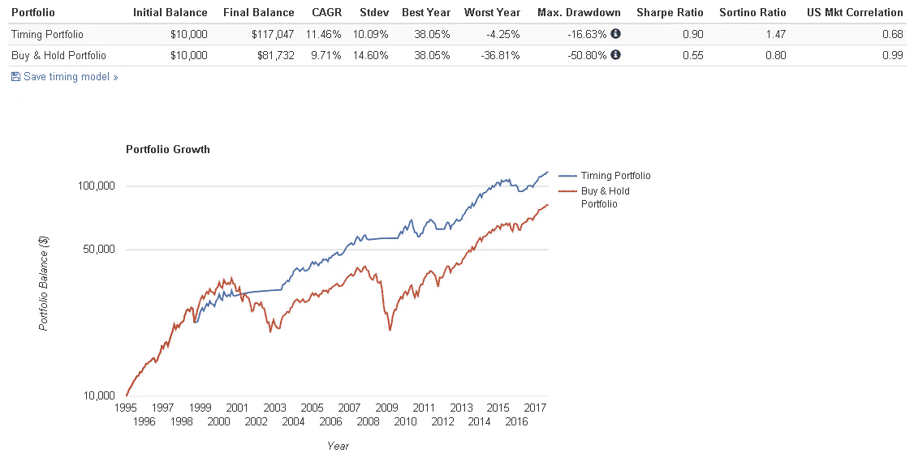

# 量化基金和新的哑钱

> 原文：<https://towardsdatascience.com/quantitative-funds-and-the-new-dumb-money-e0d88072dbaf?source=collection_archive---------4----------------------->

大多数量化基金是新的“傻钱”来源，在不知情和无技能的散户供应减少的时候，这些钱可以被用来获利。此类基金的运营限制使它们很容易成为目标。

交易是零和游戏。尽管有些人认为事实并非如此，但他们这样做是自担风险的。如果交易者不明白利润必须来自其他市场参与者的损失，那么失败的条件已经存在。然而，说服任何拒绝理解这一事实的人并不是本文的目的。

在 20 世纪 80 年代和 90 年代，当交易非常流行的时候，专业交易者和其他熟练的市场参与者能够因为哑币的供应而获得可观的利润。不熟练和不知情的散户交易者使用未经测试的方法，如[图表模式](http://www.priceactionlab.com/Blog/2015/11/technical-analysis-wealth-redistribution/)是 CTA、做市商、熟练专业交易者和其他消息灵通的市场参与者的主要利润来源。网络泡沫破灭后，在随后的熊市中，大多数不熟练的交易者退出了市场，其中一些成为了被动投资者。难怪 CTA 和其他熟练的市场参与者[的回报一直很低](http://www.priceactionlab.com/Blog/2017/07/trend-following-profits/)，因为:周围没有足够的哑资金供应。我已经说了很多年了，最近得到了[尼尔·伯格](http://www.priceactionlab.com/Blog/2017/08/neal-berger-trend-following-wont-survive/)的证实。

鉴于以上对市场现实的介绍，至少在过去的 10 年里，交易者产生 alpha 变得更加困难。顺便说一句，由于各国央行的不懈干预，被动投资者在股市中获得了巨额回报，但这场派对很快就会结束。此外，这些被动投资者面临着很高的风险，即在某个时间点，央行可能会试图获利了结，并为地方政府的社会政策提供资金，我认为这是投资趋势股票市场的主要意图。实际上，央行抛售可能导致下一轮熊市，而不是地缘政治事件。

坏消息是，现在已经没有多少散户傻钱了。好消息是，有许多新的量化基金。虽然操作这些基金的人很聪明，有数学和编程技能，但他们没有市场经验，尽管他们认为自己有，因为他们认为交易市场相当于在读了一些相关书籍后部署一个算法。大多数人发现这还不算太晚，在叔叔点。我有一些故事要分享，但我不会。

**量化对冲基金的局限性**

熟练的专业交易者可以利用量化对冲基金的一些局限性:

**1。高容量交易算法**

基金期望资金流入，因此它们的策略应该适应这一点。这就限制了他们可以使用的策略类型。为了增加容量，必须交易大量的工具，这通常可以在股票市场上获得，因为期货市场的流动性要低得多。标准普尔 500 成分是构成合适宇宙的一个例子。交易大量的证券降低了回报方差，但由于偏差-方差权衡，通过实施弱模型也降低了预期回报。简而言之，高容量限制通常会导致弱模型和高交易摩擦下的低回报。

专业交易者可以利用这一限制，专注于交易模型相对较快的指数 ETF。由于再平衡，这些交易所交易基金的价格行为会影响潜在价格行为。最终结果是，对冲基金最终以更低的价格交易个股。

从容量限制中获利的另一种更先进的方法是采用非常快速的算法。HFT 交易者已经这样做了，但是如果滞后很小，中低频交易者可以受益。

**2。低β限制**

大多数量化对冲基金要求业绩与市场相关性低。这意味着β值尽可能接近 0。然而，这排除了一大类基于风险调整的高盈利模式。例如，自开始以来，SPY 中的 1-12 个月移动平均动量规则的夏普比率为 0.90，而买入并持有的夏普比率为 0.55，但贝塔系数为 0.48，远远高于预期阈值。

Source: Portfolio Visualizer

专业交易者可以使用类似的模型，尽管他们有更高的贝塔系数，但他们仍然会降低对冲基金的利润潜力，因为对冲基金要求更低的贝塔系数。

上述模型是作为一个例子提出的，但它的未来表现很可能也会受到哑金和央行支持的不利影响。这被称为“行人”策略，这只是一个例子。

**3。依靠学术研究者的建议**

依赖学术研究人员可能是对冲基金能做的最糟糕的事情。学术研究人员和专业熟练的交易者在心态上有很大的不同。

我最近看到一位学术研究人员向对冲基金做了一个关于使用机器学习的演示。对我来说显而易见的是，尽管这位研究人员是一个拥有高级数学技能的聪明人，但他使用了怪异的术语，目的是为了制造炒作和给人留下印象。

数据挖掘偏见和 p-hacking 是一个问题，但学术研究的解决方案模棱两可，并忽略了一个事实，即过度拟合的模型可以很好地工作甚至几十年，并在 p-hacking 显而易见之前实现巨额财富。在交易中，知道市场条件何时变化比估计数据挖掘偏差重要得多。实际上，只要市场条件保持不变，过度拟合模型可能是一个好的解决方案。我在我的论文里有例子 [*关于交易策略评估的量化主张的局限性*](https://papers.ssrn.com/sol3/papers.cfm?abstract_id=2810170) 。我收到人们的电子邮件，告诉我这篇论文如何改变了他们对战略发展和市场的整体看法。不用说:我不期待学术研究者的任何赞扬，因为他们的目标是不同的。

**4。很多量化基金都在劫难逃**

为什么我把这个列为限制？在我看来，这是因为任何认为 algos 很容易赚钱的人最终都会失败。任何有切身体会的人都知道，交易不仅仅是算法。有许多因素会影响性能。保持一切都在雷达下是一项艰巨的工作，需要一大群高度自律的员工和任务共享(雷伊·达里奥和布里奇沃特原则)，或者保持小规模运营——专注于几个流动市场的独角戏。因素、特征、机器学习、算法、回溯测试、数据挖掘偏差、花哨的平台等等。可能不到工作的 50%。另外 50%是关于执行、维护和处理突发事件。

**总结**

新的量化基金有几个限制，专业交易者可以利用并获利。高容量要求，低贝塔约束，依赖学术建议，认为算法交易是灵丹妙药就是其中的一些。量化对冲基金是新的哑钱，尽管操作它们的人可能很聪明，受过高等教育。零和游戏是无情的。

***注来自《走向数据科学》的编辑:*** *虽然我们允许独立作者根据我们的* [*规则和指导方针*](/questions-96667b06af5) *发表文章，但我们不认可每个作者的贡献。你不应该在没有寻求专业建议的情况下依赖一个作者的作品。详见我们的* [*读者术语*](/readers-terms-b5d780a700a4) *。*

这篇文章最初发表在[价格行动实验室博客](http://www.priceactionlab.com/Blog/2017/09/quantitative-funds/)

如有任何问题或意见，欢迎在推特上联系: [@mikeharrisNY](https://twitter.com/mikeharrisNY)

[**免责声明**](http://www.priceactionlab.com/Blog/disclaimer/)

**关于作者:**迈克尔·哈里斯(Michael Harris)是一名交易者和畅销书作家。他也是 17 年前第一个识别价格行为无参数模式的商业软件的开发者。在过去的七年里，他一直致力于开发 DLPAL，这是一个软件程序，可以用来识别市场数据中的短期异常，与固定模型和机器学习模型一起使用。点击此处了解更多信息。