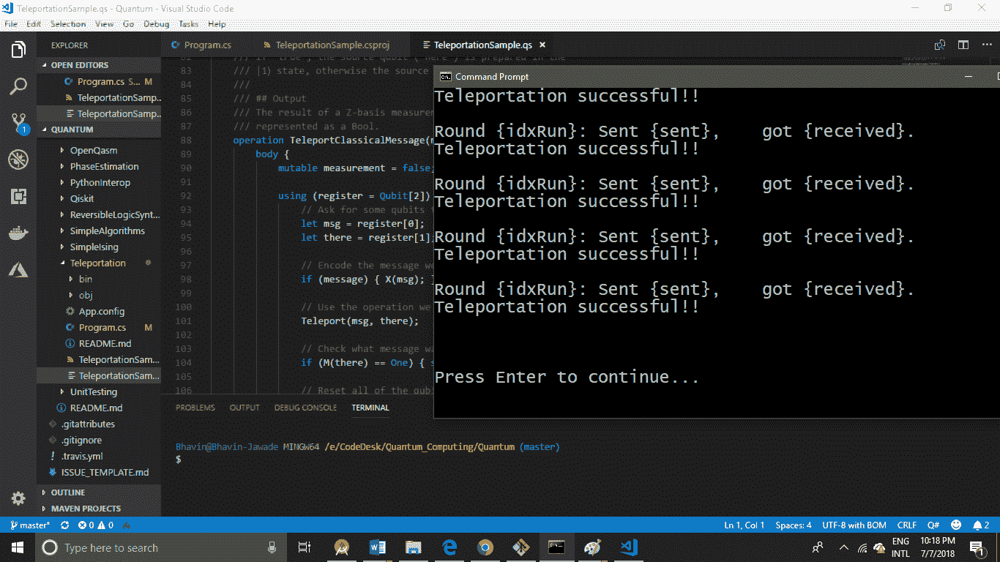

# 量子计算？/!

> 原文：<https://towardsdatascience.com/quantum-computing-5b715976e61d?source=collection_archive---------5----------------------->

*零和一。这就是我们迄今为止对计算的想象。这就是经典计算。但是一个全新的概念正在改变我们对计算的看法。*

在经典计算机中，一切都围绕着晶体管这个最基本的存储单元。众所周知，晶体管基本上是一个开关，不是开就是关，因此代表二进制 1 或 0。如今，晶体管的典型尺寸约为 14 纳米，比人类红细胞小 500 倍。随着这一规模的缩小，我们正在接近经典计算能够正常工作的极限。原因是经典物理在量子关系中不太适用。一个著名的例子是量子隧道效应，在这种效应中，电子会穿过一个传统上无法逾越的障碍。

但是科学家们正在通过建造量子计算机来利用这些不寻常的特性。

> 经典计算就像独唱——一行接一行的纯音。量子计算就像一首交响乐——许多音调相互干扰。― [Seth Lloyd](https://arxiv.org/abs/1312.4455) ，宇宙编程:量子计算机科学家挑战宇宙

正如经典计算机由比特驱动一样，量子计算机由**量子比特**驱动。这些量子比特有各种各样的属性，比如叠加和纠缠。

**叠加:**想象一次抛硬币。我们知道抛硬币的结果是二进制的，正面或反面。但我们也知道，一枚硬币可以停留在未定状态。当它在空气中时，它的状态还没有定义，或者我们也可以说它在两种状态中。这种同时拥有两种状态的原理，定义了量子位元最重要的属性，称为叠加态。我们大多数人都已经听说过经典的斯克罗登吉尔的猫的故事中的叠加，一只猫既是死的又是活的。当你试图测量一个量子位时，它会坍缩到一个确定的状态。如果我们有 4 个经典位，我们就有 2 个^4 = 16 个可能的值组合，你可以一次使用其中的任何一个组合。但是 4 个量子位可以同时存在于所有 16 种组合中。

**纠缠:**两个量子比特可以以这样一种方式相互绑定，即一个量子比特的状态变化会使另一个量子比特立即做出反应。这意味着使用一个纠缠的量子位，我们可以推导出另一个的性质。

就像使用逻辑门操纵经典比特一样，使用量子门操纵量子比特。量子门以叠加态和旋转概率作为输入，给出另一个叠加态作为输出，最终将这些叠加态压缩成实际的 0 和 1 序列。这允许同时进行一整套计算。

与经典计算机相比，量子计算机需要更少的迭代，尽管你不能用现在的量子计算机做很多事情。传统的数据库搜索可能需要 N 次迭代，而量子计算机只需要平方根 N 次迭代。1994 年，彼得·肖尔令人惊讶地发现了解决整数因式分解和离散对数问题的有效量子 T2 算法，此后，人们对该领域的兴趣大增。由于大多数当前的经典密码术假定这两个问题在计算上是困难的，实际建造和使用量子计算机的能力将允许我们破解大多数当前的经典密码系统。

几乎每个顶级公司都在研究量子计算机。**谷歌的 Bristlecone，**一种新的量子计算芯片，具有 72 个量子位，或量子位，使量子至上的竞赛更接近尾声，超过了 50 个量子位量子计算机的前纪录保持者 IBM。**量子优势**或“量子优势”是量子计算设备解决经典计算机实际上无法解决的问题的潜在能力。

现在重要的问题来了，我如何开始写量子算法。微软用它的量子开发工具包回答了这个问题。**微软的量子开发工具包**附带了一个名为 **Q#** 的专注于量子的领域特定语言，一个量子模拟环境，以及许多开源库和初学者样本。

要在需要约 30 个量子位的模拟环境中运行典型的量子算法，需要一台 RAM 约为 16 GB 的计算机，这个数字呈指数级增长。当你从 30 量子位增加到 40 量子位时，这个数字从 16GB 增加到大约 16TB。为了帮助解决这个问题，微软提供了一个托管在 azure 上的**量子模拟器。**

你今天就可以写出你的第一个量子算法。要开始，只需在你的系统上安装微软量子开发工具包[https://marketplace.visualstudio.com/items?itemName = quantum . quantum-dev kit-vs code](https://marketplace.visualstudio.com/items?itemName=quantum.quantum-devkit-vscode)。

您可以将它用于 visual studio 社区或 visual studio 代码。现在克隆这个库[https://github.com/microsoft/quantum](https://github.com/microsoft/quantum)，并试用这些样本。要运行这些示例，您只需要有 quantum-devkit 和。NET SDK。

*Message Teleportation code running on my system. Transfering message between 2 qubits*

量子计算的一些好读物。

罗纳德·德·沃尔夫讲座笔记:【https://homepages.cwi.nl/~rdewolf/qcnotes.pdf】T2

**学习 Q#和了解微软量子开发工具包:**[https://docs . Microsoft . com/en-us/quantum/quantum-writeaquantumprogram？view = qsharp-preview&tabs = tabid-vs 2017](https://docs.microsoft.com/en-us/quantum/quantum-writeaquantumprogram?view=qsharp-preview&tabs=tabid-vs2017)

**量子计算作者 Jozef grus ka:**[http://www2 . fiit . stuba . sk/~ kvasnicka/Quantum computing/grus ka _ QC . pdf](http://www2.fiit.stuba.sk/~kvasnicka/QuantumComputing/Gruska_QC.pdf)