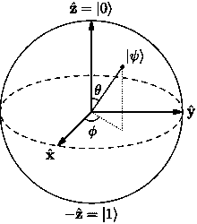

# 量子计算解释！

> 原文：<https://towardsdatascience.com/quantum-computing-explained-a114999299ca?source=collection_archive---------0----------------------->

## 在亚原子水平上，我们所知道的关于经典物理学的每一件事情都破裂了，不仅仅是小幅度的破裂，而是大规模的破裂。欢迎来到量子力学的世界，准备好大吃一惊吧。

在我们开始谈论[量子](https://hackernoon.com/tagged/quantum)计算之前，我们必须很好地理解什么是**量子力学**，它有什么特别之处，以及量子力学现象如何帮助我们执行高级计算。

关于量子[力学](https://hackernoon.com/tagged/mechanics)的最初研究可以追溯到 17 世纪，当时科学家提出了[光的波动理论](http://www.nightlase.com.au/education/optics/light.htm) ( *光可以同时展示波动理论和粒子理论*)。光量子的存在是由 [*马克斯·普朗克*](https://en.wikipedia.org/wiki/Max_Planck) 在 1900 年提出的，这一观点被 [*阿尔伯特·爱因斯坦*](https://en.wikipedia.org/wiki/Albert_Einstein) 进一步加强，他指出，光是由称为光子的微小粒子组成的，每个光子都具有能量。 ***一般来说，量子力学在原子和亚原子粒子的尺度上处理物质的行为及其与能量的相互作用。***

随着量子力学的出现， [**牛顿力学**(或**经典力学** )](https://en.wikipedia.org/wiki/Classical_mechanics) 开始在基础层面消退。光本身的某些特定性质无法用经典物理学解释，[氢光谱系列](https://en.wikipedia.org/wiki/Hydrogen_spectral_series)，例如，当氢气在一个管中加热并观察发射的光时，可以注意到氢原子的发射光谱包含多个光谱系列，而不是连续发射的光(或电磁辐射)，是的，它更像是颜色的条带，与经典物理学的预期不同。丹麦物理学家 [**尼尔斯·玻尔**](https://en.wikipedia.org/wiki/Niels_Bohr) 对此提出了一个解释，即[波尔模型](https://en.wikipedia.org/wiki/Bohr_model)，在该模型中，他将原子描述为一个带正电荷的小原子核，周围是 ***电子，这些电子围绕着原子核以圆形轨道*** 运行——类似于太阳系的结构。每个轨道对应不同的能级。能量的变化，如电子围绕原子核从一个轨道转移到另一个轨道，是在离散的量子中完成的。术语**量子跃迁**指的是从一个离散能级到另一个离散能级的突然 ***运动，没有平滑过渡*** 。没有“中间”。

量子跳跃是特殊的，因为电子的运动不是渐进的，它只是从一个轨道上消失，然后出现在下一个轨道上，没有中间状态，并释放(或吸收)一定量的能量。这让事情变得有趣了。Bhor 解释说，这个层次的能量不能再细分，它被称为量子，一种特定的最小能量。这种能级的第一个见解是由一位名叫普朗克的物理学家提供的，所以我们称它为普朗克常数。所以，一般来说，原子中电子的能量是量子化的。

这只是开始，经典物理的可预测性被量子物理的潜力所颠覆。这是当时许多物理学家非常关心的问题。为什么电子遵循量子化轨道而没有中间态？

路易·德布罗意 1923 年的论文回答了这个问题。他解释说 ***物质可以表现出粒子性和波动性*** 就像光一样。电子的波动性质要求它们获得特定的波长，这是允许它们适应轨道的。但是在这个轨道上，由于电子的波动性质，电子可以存在于任何地方，而不仅仅是某个特定的点。这从根本上不同于经典物理学，但被[实验证明](https://en.wikipedia.org/wiki/Matter_wave)。因为质量较大的物质，如我们人类，具有高动量，并且这种物质的波长会小得多，因为质量与**德布罗意波长成反比。因此，德布罗意解释的效果在宏观层面上减弱了。**

**1927 年，戴维孙和热尔默进行的双缝实验证明，光和物质可以表现出经典定义的波和粒子的性质。托马斯·杨在 1801 年做了一个类似但更简单的双缝实验。当光线穿过屏障上的两个狭缝时，会在另一侧的屏幕上形成干涉图案。(穿过双缝的光不会在屏幕上形成双带图案)这些实验有趣的部分是，即使我们一次通过一个电子/光子，干涉图案也会在屏幕/探测器上形成。这怎么可能呢？这意味着，如果我们从一个源发送一个电子通过一个双缝(我们不知道电子通过哪个缝)，电子出现在屏幕(或探测器)另一侧的位置是随机的(意味着它可以在干涉图案中的任何地方)。如果我们发送大量的电子，就会在另一边形成干涉图案。这意味着每个单个电子必须表现出波的性质，否则它不会干扰任何其他东西，在势垒一侧的单个电子波将在双缝势垒的另一侧产生两个波(就像单个水波穿过两个孔可以在另一侧形成两个波)，这两个波相互作用形成干涉图案。**

**Erwin Schrodinger 发表了一个方程，其中 ***将运动的电子描述为一个穿过*** 传播的波。这个方程也被称为薛定谔方程，它帮助他获得了 1933 年的诺贝尔物理学奖。**

**德国物理学家和数学家梅克斯·玻恩阐明了概率密度函数，它将所有这一切描述为发现电子为波的一种 ***可能性。*** 这是在他研究了玻尔模型的电子轨道之后，这有助于他和沃纳·海森堡一起阐明量子力学的矩阵力学表示。一年后，海森堡提出了海森堡的测不准原理，认为即使在理论上，粒子的位置和速度也不能同时精确测量。**

**沃纳·海森堡和尼尔斯·玻尔一起设计了量子力学的哥本哈根解释，该解释指出 ***物理系统在被测量之前通常不具有确定的属性，量子力学只能预测测量将产生某些结果的概率。测量的行为将导致波函数坍缩，把概率变成一个可能的值。*****

**阿尔伯特·爱因斯坦回应道**

> **“上帝不和宇宙玩骰子”**

**尼尔斯·玻尔回答道**

> **"别再告诉上帝该怎么处理他的骰子了。"**

**即使是有史以来最聪明的人也很难理解量子物理学的全部内容。但是在双缝实验中很明显，如果我们在任何一个缝上放置一个测量装置，试图找出电子通过哪个缝，干涉图样就会消失。**

**强烈建议观看此视频:**

**所以，在没有观察的情况下，把现实赋予宇宙是没有意义的。在测量间隔中，量子系统确实是所有可能性质的模糊混合物。这就是**量子叠加，**正常的物质宇宙只有在测量的瞬间才有意义。**

**就我们的电子而言，叠加可以描述为电子同时处于不同位置的可能性。根据测不准原理，这也适用于电子的自旋(它是角动量的一种固有形式)。电子可以在所有方向上自旋，直到我们测量它的自旋，测量时自旋要么与测量方向一致，要么与测量方向相反。这也称为加速旋转或减速旋转。**

**量子系统中的情况不同乍一看也难以把握，为了放松我们可能需要看一段猫的视频。薛定谔的猫呢？**

**让我们也看看这个..**

**简而言之，一只猫在一个封闭的盒子里，盒子里有某种东西(比如说炸药)可能会杀死它，也可能不会杀死它，这是叠加态，这意味着对外界来说，猫要么活着，要么死了。所以直到我们打开盒子，观察到猫有一半的概率是死的，一半的概率是活的。**

**这个实验还有一个更重要的含义，那就是在封闭的盒子里会发生什么。如果猫感觉到爆炸，它就会死，如果它感觉不到爆炸，它就会活着。cat 的状态与 explosive 的状态有某种联系。在量子世界中，这被描述为**量子纠缠。****

**量子纠缠是一种现象，通过这种现象，一个以上的粒子，共同产生或密切相互作用，可以开始一种关系，每个粒子的量子状态不能独立描述(如果猫死了，爆炸/如果爆炸的猫死了)。因此，粒子不能独立描述，它们成为一个连接的系统，测量一个会影响另一个的状态。即使当它们相隔很远时，这种属性也将被保留。**

**例如，考虑两个纠缠的电子，我们将考虑电子的自旋(可以考虑位置或动量，我们将自旋视为角动量)在产生时总和为零。现在我们可以把这些电子分开任意距离，并独立地测量它们。如果第一个电子测量自旋向上，那么另一个将总是自旋向下，反之亦然。而测量的效果是瞬间发生的，意味着比光速还快。**

**纠缠的量子粒子以概率状态存在，只有当其中一个粒子被测量时才会失去叠加态，而另一个粒子会瞬间受到影响，即使相隔任何距离，这种想法让当时的许多科学家疯狂。它甚至包括爱因斯坦，他称之为“超距幽灵行动”。他甚至提出了 [EPR 悖论](https://en.wikipedia.org/wiki/EPR_paradox)，它说两个粒子相互作用形成深层关系，信息被编码在一些关于可能状态的“隐藏参数”中。就像一个电子说，如果有人测量我，我会旋转，另一个说我会旋转。否则，它发送信息的速度将超过光速，从而打破相对论。**

**[阿兰方面](https://en.wikipedia.org/wiki/Alain_Aspect)在 1980 年用基于约翰·斯图尔特·贝尔 1964 年提出的[贝尔定理](https://en.wikipedia.org/wiki/Bell%27s_theorem)的[贝尔检验实验](https://en.wikipedia.org/wiki/Bell_test_experiments)推翻了 EPR 佯谬。是的，量子世界是真实的，幽灵般的行为确实存在。**

**现在让我们用量子计算的观点重新开始每一件事…让我们再做一次。**

> ****量子计算**研究直接利用叠加、纠缠等量子力学现象对数据进行运算的理论计算系统。**

**在经典计算机中，我们将任何数据转换为 0 和 1，即所谓的 ***位。*** 实际上是对高电压和低电压进行处理，然后将它们通过一系列称为逻辑门的门，这些门可以操纵数据来计算出结果。逻辑门如与、或、非、异或等。可以以不同的方式排列来处理这些位并产生输出。它可以做简单的操作，如复杂加密的加法。逻辑门是通过使用晶体管来实现的，现在晶体管依靠硅半导体的特性来执行操作，而不是使用机械开关。**

**当然，经典计算机速度快、效率高，但它们不擅长处理涉及指数复杂性的问题，如 ***整数因式分解*** 。尤其是整数进一步限定为质数时的**质因数分解**([半质因数分解](https://en.wikipedia.org/wiki/Semiprime))。基本上，找到两个大素数的乘积是很容易的，但是在给定乘积的情况下，用经典计算机找到产生乘积的数需要大量的计算。事实上，这种复杂性是包括 RSA 在内的许多密码系统的基础。**

**那么量子计算机如何解决这个问题呢？**

**在量子计算中，基本计算单位是一个**量子位**，它可以表示信息。量子位与普通位有一些相似之处，例如它可以被测量为 0 或 1。但是量子比特的威力在于它像叠加和纠缠一样的量子力学性质。一个量子位可以同时处于零态和一态。一个量子位的状态用“ket 0”和“ket 1”符号来表示，记为 **|0 >** 和 **|1 >** ，基本的测量状态类似于经典的 0 和 1。**

**真实量子计算机中的量子比特到底可以是什么？它可以是有自旋的电子，有极化的光子，杂质自旋，俘获离子，中性原子，半导体电路等等。**

**简单量子位的超位置可以用下面的**布洛赫球**来表示**

****

**这看起来可能有点复杂，但我们需要记住的要点是，单个量子位在任何时候都可以处于 **|0 >** 和 **|1 >** 的超级位置，它可以表示为**

****a | 0>+b | 1>+****

**其中 a 和 b 分别是被测量的量子位的振幅(与概率成比例)为 0 和 1，并且 **a + b =1****

**因此，一个量子位可以处于两个状态的叠加位置，一旦它被测量，它将根据每个状态的概率返回两个状态中的一个。所以测量一个量子位本身对系统有影响，所以测量一个量子位类似于一个影响量子位状态的门。**

**如果我们考虑一个以上，比如说两个，量子位的事情变得更有趣，基本状态将是 00，01，10，11 但是量子位可以同时处于所有四个状态的超级位置。所以这应该表示为**

****a | 00>+b | 01>+c | 10>+d | 11>+****

**为了表示两个量子位，我们需要 4 个概率/振幅(a，b，c，d)，如果我们有三个量子位，我们将需要 8 个。因此，如果我们有 n 个量子比特，我们将需要 2^n 数来代表这个量子系统的整体状态。因此，通过少量增加量子位的数量，我们将能够产生能够代表巨大状态的系统，这与经典计算机不同。**

**即使描述超位置所需的信息量随着量子位的数量呈指数增长，由于量子测量的基本限制，我们也无法访问所有这些信息。叠加态中电子的自旋可以是所有方向的，但是当我们测量时，它只能是向上或向下的一个方向。我们也不能预测结果，它是基于与状态相关的概率的(例如:一半时间上升，一半时间下降)。这意味着，为了充分发挥量子计算机的潜力，我们需要开发量子算法，探索存储在量子位超级位置的大量信息的存在，并在计算结束时，让系统处于我们可以确定地检测到的基态之一。**

**在量子计算机中，有可能存在两个值相反的量子位，但在我们测量之前，单个量子位的值是未知的。这是可能的，因为量子纠缠。假设我们有两个零态的电子量子位，然后我们通过施加电磁波使第一个电子/量子位处于叠加态，该电磁波具有与零和一态之间的能量差成比例的特定频率。现在，当我们试图通过施加第一电子/量子比特处于零状态时所需频率的电磁波来调整第二电子/量子比特时，处于超位置的第一电子/量子比特将对第二量子比特的自旋产生影响，并且第二电子/量子比特也将移动到叠加状态(非稳定状态)。所以这两个量子位的状态将会纠缠在一起，如果我们测量第一个并得到向上自旋，那么另一个将给出向下自旋，反之亦然。这种纠结，在任何远距离都会持之以恒。在我们测量它们之前，这两个量子位元只能被视为一个具有可能值的单一系统。这在经典计算机中是不可能的，因为有两个比特没有值，而是相反的值。**

**因此，量子位元数目的增加，将会成倍增加可能的纠缠态数目。需要注意的一个关键点是，量子纠缠可能非常脆弱([量子退相干](https://en.wikipedia.org/wiki/Quantum_decoherence))，任何利用这一点的系统都应该具有非常小的外部干扰。**

**量子电路(量子计算的模型)的积木是**量子逻辑门。**它们就像经典计算世界的逻辑门，但与许多经典逻辑门不同的是， ***量子逻辑门是可逆的*** 。这是因为量子力学要求量子系统永远不会随时间丢失信息，并且它必须总是能够重建过去。**

**你能想到任何通往量子世界的经典大门吗？**

**“与”门不会成功，因为 1 和 0、0 和 1 的输出都是 0。**

**是，没有什么能到达量子世界**

**非 0 = 1，非 1 =0**

**这是可逆的，如果输出为零，则输入为 1，如果输出为 1，则输入为零。这个门在量子世界中被称为**泡利-X 门**。它映射 **|0 >** *到* **|1 >** 和 **|1 >** *到* **|0 >****

****哈达玛门**也作用于单个量子位，并产生叠加态。**

****交换门**交换两个量子位。即 **|10 >** *到* **|01 >** 以此类推。**

****受控门**作用于 2 个或更多的量子位，其中一个或多个量子位作为某种操作的控制。例如，[受控非门](https://en.wikipedia.org/wiki/Controlled_NOT_gate)(或 **CNOT** )作用于 2 个量子位，只有当第一个量子位为|1 >时，才对第二个量子位进行非运算，否则保持不变。**

**CNOT 门:**

****

**在 CNOT 门的情况下，我们可以看到每个输出都是不同的，没有模糊性，状态可以恢复。**

**在基于电子自旋的量子计算机中，CNOT 门很容易实现。由于控制比特和目标比特靠得很近，控制比特的自旋对目标比特有一定的影响，它决定了我们能否用一定的电磁波翻转目标。**

**CNOT 门也可以用来产生控制和目标的纠缠态。如果我们先用**阿达玛门**来控制，然后再用 CNOT 门，控制和目标就会叠加纠缠在一起。CNOT 门通常在量子计算中用来产生纠缠态。**

**CNOT 和任意量子位旋转可以在量子计算机中实现任何逻辑功能。**

**你可以在这里找到其他可用的量子门。**

*****测量一个量子位也可以改变系统的状态，功能非常类似于门，但它不是一个实际的量子门。*****

**为了让量子计算机工作，我们应该能够改变任意量子位的属性，我们应该能够通过在一个或多个量子位之间进行交互来运行量子逻辑门。**

**现在我们需要利用所有这些逻辑来创建一些有用的算法。使用量子计算机来执行计算简单的操作是没有意义的，因为经典计算机可以以更低的成本完成这一操作。由于基础设施本身是复杂的，并且量子计算机可以同时处理大量的状态，量子计算机的有效使用被限制在特定的领域，如寻找质因数、搜索大量数据等。这是计算密集型的。**

****量子算法**是一个循序渐进的过程，其中的每一步都可以在量子计算机上执行，这将涉及量子属性，如叠加和纠缠。已经有不同的算法可用，更多的算法正在开发中。**

**[**Shor 的整数因式分解算法**](https://en.wikipedia.org/wiki/Shor%27s_algorithm) 因其在密码学中的应用而成为最著名的算法之一。**

**[**格罗弗算法**](https://en.wikipedia.org/wiki/Grover%27s_algorithm) 也是众所周知的，用于搜索非结构化数据库或无序列表。**

**你可以在这里找到其他有趣的算法。**

**下面我们来探讨一下 [**格罗弗算法的一个小变种**](https://en.wikipedia.org/wiki/Grover%27s_algorithm) **，**用于搜索的量子算法。**

**首先，考虑 N 个电话号码和姓名的列表，我们需要从中找到特定号码的名称**

**与提供指数级速度增长的普通量子算法不同，Grover 的算法仅提供二次速度增长。复杂度将是可能元素数量 n 的平方根的函数。与可能具有复杂度 n 的经典算法相比，这要高效得多。Grover 的算法使用[振幅放大](https://en.wikipedia.org/wiki/Amplitude_amplification)工作。**

**在我们的例子中，我们将只考虑四个数字，它们可以用两个量子位来表示，我们需要找到与 10 相关的名字**

****a | 00>+b | 01>+c | 10>+d | 11>+****

**其中 a、b、c 和 d 是幅度，a=b=c=d。**

**这就是 Grover 算法中的**第一步**就是把量子比特放在超位。**

****第二步**是应用一个 oracle 函数，该函数将我们正在寻找的项目的振幅翻转到相反的方向。在这种情况下，c 变成了-c，现在 a=b=d，c 不同，是负数。**

****第三步**是应用一个放大函数，放大每个振幅和相等叠加态振幅之间的差异。因为-c 的值与其他振幅有很大的差异，所以与 a、b 或 d 相比，c 的值迅速增加。**

****

**现在，如果我们测量量子位，第三个状态将以最大概率返回(步骤 2 和 3 可以再次应用以增加概率)。因此，使用这种技术，我们可以通过一次性将所有可用值加载到量子位中来解决搜索问题。可用的量子位越多，我们能处理的问题域就越大。**

**一切都很好，但是运行这一切的硬件呢？**

**量子计算机的当前实现是基于半导体的。从这些半导体产生的量子位应该远离任何外部干扰。否则，这些量子位的量子力学特性将会丢失。因此，这些量子计算机的温度保持在非常接近绝对零度，这种设置以及微观水平的计算会使量子计算机非常昂贵。精确的微波/电磁波可以用来改变量子位的状态。通常情况下，经典计算机与量子计算机一起使用来帮助处理。**

**IBM Q 是行业首创，旨在为商业和科学领域构建商用通用量子计算机。 [IBM Q Experience](https://quantumexperience.ng.bluemix.net/qx/) 允许我们使用 online composer 或免费使用其 python 库来运行量子算法。这些系统中量子位元的数量相对较少，但肯定会快速增加。**

**[D-Wave Systems](https://www.dwavesys.com/) 是这个领域的另一个主要参与者，他们的旗舰产品是 2000 量子比特 D-Wave 2000Q 量子计算机。D-Wave 产品被谷歌等公司广泛用于运行量子人工智能实验室和美国宇航局的研究。**

**D-Wave 机器使用[量子退火](https://en.wikipedia.org/wiki/Quantum_annealing)来执行其操作。这对于优化问题的解决方案非常有用，可以快速搜索空间，找到成为解决方案的[全局最小值](https://en.wikipedia.org/wiki/Global_minimum)。这种方法对于某些问题领域可能会更快，但使用量子退火的系统将会发现很难运行某些算法，如著名的 Shor 算法。**

**另一方面，IBM 提供的通用量子计算将服务于更广泛的问题领域，并允许我们设计更复杂的算法。但是用通用量子计算来设计这些算法可能会很复杂，并且在系统设计和一致性方面也有自己的挑战。**

**量子力学是一个本质上令人震惊的科学领域，它所提供的计算能力只是冰山一角。它在[生物学](https://en.wikipedia.org/wiki/Quantum_biology)(它可以通过叠加解释突变)、计算机硬件(解释半导体芯片的特性)，甚至可以解释人类的期望或想法如何影响未来，正如[全球意识项目](http://noosphere.princeton.edu/)所解释的，该项目实验证明*“当人类意识变得连贯时，随机系统的行为可能会改变”。*是的*，*人类思维与量子物理之间确实存在[的奇怪关系。此外，它还可以用于](http://www.bbc.com/earth/story/20170215-the-strange-link-between-the-human-mind-and-quantum-physics) [**量子隐形传态**](https://en.wikipedia.org/wiki/Quantum_teleportation) ，据[中国科学家报道，他们已经将地球上一个光子的量子态传输到近地轨道](http://www.bbc.com/news/av/science-environment-40573621/first-teleportation-from-earth-to-orbit)卫星上的另一个光子。量子力学有潜力改变我们以经典方式知道和做的每一件事。**

**我希望你明白一些事情…**

> **“如果你认为你懂量子力学，那你就不懂量子力学。”理查德·费曼**

**谢谢你的时间。**