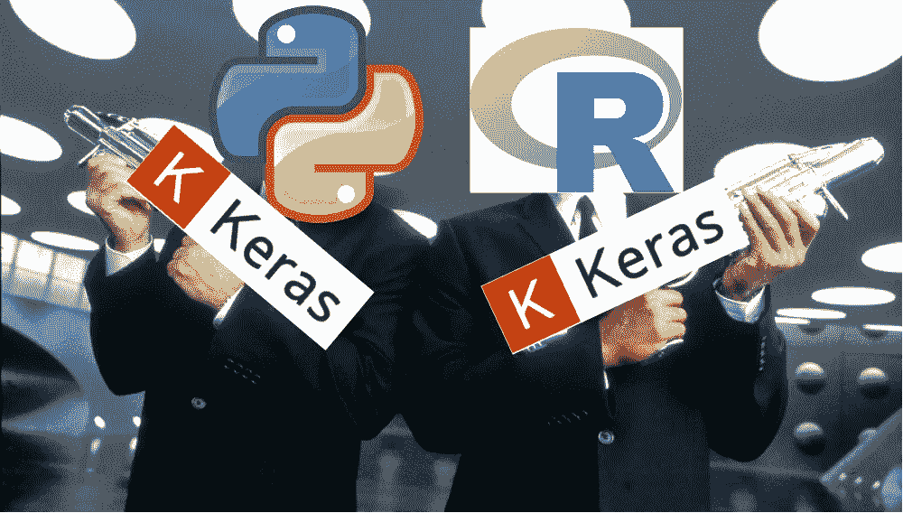

# R vs Python:基于 Keras 的图像分类

> 原文：<https://towardsdatascience.com/r-vs-python-image-classification-with-keras-1fa99a8fef9b?source=collection_archive---------2----------------------->

## 许多数据专家对用于人工神经网络模型的语言非常严格，这限制了他们的发展。Python 专用的环境。我决定根据训练一个基于[卷积神经网络](http://cs231n.github.io/convolutional-networks/)的图像识别模型所需的时间来测试 Python 与 R 的性能。作为起点，我从[Shirin Elsinghorst](https://shirinsplayground.netlify.com/2018/06/keras_fruits/)博士的博客文章开始，讲述了使用 Keras 在 R 语言中构建 CNN 模型是多么容易。

几句关于 [Keras](https://keras.io/) 的话。它是一个用于人工神经网络 ML 模型的 Python 库，提供面向各种深度学习框架的高级前端，默认为 [Tensorflow](https://www.tensorflow.org/) 。

Keras 有许多优点，其中包括:

*   只需几行代码即可轻松构建复杂的模型=> *非常适合开发人员。循环快速实验并检查你的想法*
*   代码回收:人们可以很容易地交换后端框架(比如从 [CNTK](https://docs.microsoft.com/en-ca/cognitive-toolkit/) 到 [Tensorflow](https://www.tensorflow.org/) 或者反之亦然)=>[*DRY principle*](https://en.wikipedia.org/wiki/Don%27t_repeat_yourself)
*   无缝使用 GPU => *非常适合快速模型调优和实验*

由于 Keras 是用 Python 编写的，它可能是您的开发人员的自然选择。使用 Python 的环境。直到大约一年前，RStudio 创始人 J.J.Allaire 宣布于 2017 年 5 月发布 Keras 库。我认为这是数据科学家的一个转折点；现在，我们可以更加灵活地使用 dev。环境，能够更有效地交付结果，并有机会扩展我们用 r 编写现有解决方案

这让我想到了这篇文章的主题。
**我的假设是**，*说到用 Keras 建立 ANN ML 模型，Python 不是必须的*，根据你客户的要求，或者 tech stack， *R 可以无限制使用，效率差不多*。

# 基于 Keras 的图像分类

为了测试我的假设，我将使用 kaggle 的水果图像数据来执行图像分类，并训练一个具有四个隐藏层的 CNN 模型:两个 2D 卷积层，一个池层和一个密集层。 [RMSProp](https://youtu.be/_e-LFe_igno) 正被用作[优化器功能](https://keras.io/optimizers/)。

# 技术堆栈

**硬件** :
*CPU* :英特尔酷睿 i7–7700 HQ:4 核(8 线程)、2800–3800(Boost)MHz 核心时钟
*GPU* :英伟达 Geforce GTX 1050 Ti 移动:4Gb vRAM、1493–1620(Boost)MHz 核心时钟
*RAM* : 16 Gb

**软件**:
*OS*:Linux Ubuntu 16.04
*R*:ver。3.4.4
*Python* : ver。3.6.3
和*版本。2.2
*张量流*:版本。1.7.0
*CUDA* :版本。9.0 ( *注意目前 tensorflow 版本支持 CUDA ver。9.0，而其最新版本是 9.2*)
*cud nn*:ver。7.0.5 ( *注意当前 tensorflow 版本支持 ver。7.0，而 cuDNN 的最新版本是 7.1* )*

# 密码

用于 CNN 模型构建的 R 和 Python 代码片段如下所示。由于 F. Chollet 和 J.J. Allaire 之间卓有成效的合作，R 中的逻辑和函数名与 Python 中的很相似。

## **R**

## 计算机编程语言

# 实验

上面的模型用 R 和 Pythons 在 GPU 和 CPU 上**训练了 10 次**，测量了经过的时间和 10 个历元后的最终精度。

测量结果显示在下图中。

从上面的图表中，我们可以看出

*   您的模型的准确性不取决于您用来构建和训练它的语言(该图仅显示了训练准确性，但该模型没有很高的方差，偏差准确性也在 99%左右)。
*   尽管 10 次测量可能没有说服力，但 Python 可以减少(最多 15%)训练 CNN 模型所需的时间。这是意料之中的，因为 R 在执行 Keras 函数时使用了 Python。

假设我们所有的观察值都是正态分布的，让我们进行不成对 t 检验。

T-score 反映了与 Python 相比，在 R 中训练 CNN 模型所需时间的*显著差异，正如我们在上面的图中看到的。*

# 摘要

*   使用 Keras 在 R 中构建和训练 CNN 模型就像在 Python 中一样“简单”,具有相同的编码逻辑和函数命名约定
*   你的 Keras 模型的最终精度将取决于神经网络结构、超参数调整、训练持续时间、训练/测试数据量等。，但不是您将用于 DS 项目的编程语言
*   用 Python 训练 CNN Keras 模型可能比 R

# 附言

如果您想了解更多关于 Keras 的知识，并能够使用这个强大的库来构建模型，我向您推荐以下书籍:

*   [f . Chollet](https://www.amazon.com/dp/1787125939)(Keras 创作者之一)用 Python 进行深度学习
*   [f . Chollet 和 J.J. Allaire 的深度学习与 R](https://www.amazon.com/dp/161729554X)
*   以及这个 [Udemy 课程](https://www.udemy.com/zero-to-deep-learning/)开始你的 Keras 之旅

非常感谢您的关注！我希望这篇文章能够帮助有抱负的数据科学家理解不同技术的用例，并避免在选择 DS 项目完成工具时产生偏见。