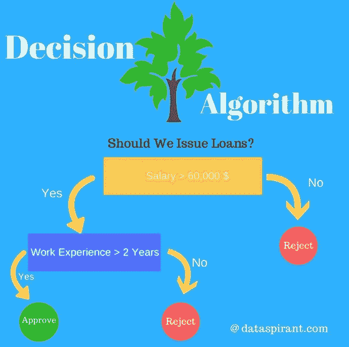

# 随机森林——谜底揭晓

> 原文：<https://towardsdatascience.com/random-forest-mystery-revealed-69ca18b82ff5?source=collection_archive---------5----------------------->

image by Jens Lelie on [unsplash.com](http://unsplash.com/)

为您的应用选择“正确的”机器学习算法是在现实世界中正确应用机器学习的众多挑战之一。正确的算法有时可能是最简单、最健壮、最容易被最终用户理解的算法。Random Forest 会定期勾选所有这些框，但正如其他人所写的那样，它经常被忽略。希望这篇文章能让你对算法的工作原理有一个坚实的了解，这样你在进行自己的研究或在 R 或 Python 这样的工具中应用时会更有信心。

随机森林是一种监督学习算法，通常应用于分类和回归情况。简单介绍一下，该算法是一个集合模型，创建一个由许多决策“树”组成的“森林”,树的数量由用户定义。每个决策树都是基于原始数据集中的属性(列)和观察值(行)的子集创建的。这些树是使用训练数据集生长的，并应用于测试数据集。模型返回的最终分类是与最大数量的单个决策树提供的分类相匹配的分类。

由于随机森林只是由最大数量的树返回的分类，所以本博客将关注决策树本身，它是算法的核心。

什么是决策树？

决策树是一种流型结构，其中数据中的每个属性都表示为一个“内部节点”，每个“分支”表示一个测试的结果，“叶子”表示所做的分类。算法中的每个决策树都是使用来自原始训练数据集的不同的“随机”属性和观察值子集创建的。

[1]

下一部分可能会令人困惑(至少对我来说是这样！)所以希望我的解释是清楚的。决策树以*析取范式*创建，其中决策是“*和*的一个“*或*”。或者，这可以被表述为一个或多个文字的一个或多个合取的分支。[2]上面的决策树示例将第一个析取项显示为“工资高于”或“低于 6 万美元”。就树的结构而言，这也是内部节点。代表“否”的分支是此薪金测试的结果，其中“拒绝”是分类。第二条分界线是两年以上的工作经验。我们同样有一个拒绝分类，但在本例中，我们还有一个批准分类。要达到批准的分类，工作经验必须在 2 年以上，并且(联合)薪金> $60k 测试的结果必须为真/是。下面嵌入了一个简短的视频，其中讨论了析取陈述。维基百科也有一篇关于[逻辑析取](https://en.wikipedia.org/wiki/Logical_disjunction)的文章，其中包括维恩图来突出‘或’属性。

**属性排序和拆分**

如上所述，决策树中的每个级别或分支代表用于单个决策树的随机数据段中的一个属性。考虑到最终模型的准确性以及与树相关的计算工作量，这些属性的排序非常重要。换句话说，属性应该以这样一种方式排序，以便为将来的观察分类提供最有效和最丰富的结构。在决策树中，属性的优先级是根据属性分解后的“信息增益”来确定的。

来自子内部节点的信息增益等于父节点的熵(无序度)减去子节点的加权平均熵。加权基于通过每个分支进行的分类的数量。当分类中存在完美分离时，熵为零，即所有“真”的结果导致“好”的分类，所有“假”的结果导致“坏”的分类。当“真”和“假”结果返回相同数量的“好”和“坏”分类时，熵为“1”(最大可能熵)。第二个例子没有提供信息增益，因为在两个可能的结果之间存在有效的分类随机分裂，并且树没有获得信息。因此，作为树的“根”,这是一个很差的属性。

熵是一个与系统的有序或无序有关的术语。高熵与高度无序相关，反之亦然。下面是来自 Udacity 的两个短视频，涵盖了熵和信息增益的概念。它们构成了一个免费系列的一部分，该系列介绍了机器学习的主题。

为了保持这篇文章的简短，我将在讨论包括决策树的“修剪”和与修剪概念密切相关的过度拟合的概念之前结束这篇文章。我将在以后的文章中讨论这两个问题，但是希望到目前为止的总结已经揭开了强大的随机森林算法的帷幕。

[1]* https://data aspirant . com/2017/01/30/how-decision-tree-algorithm-works/

[2]门德尔松，e .数理逻辑导论，第 4 版。伦敦:查普曼&霍尔出版社，第 27 页，1997 年。