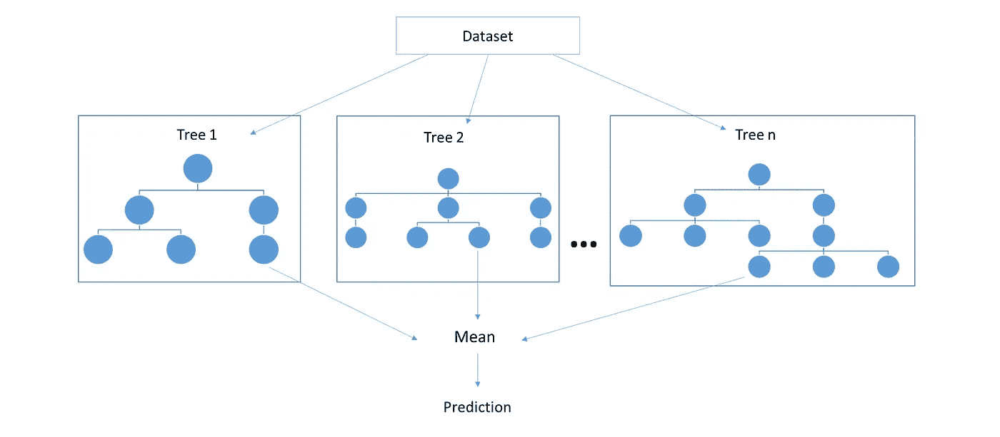
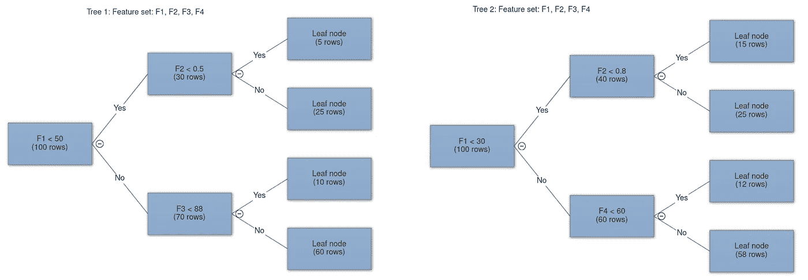
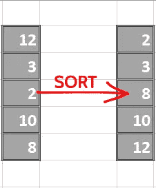
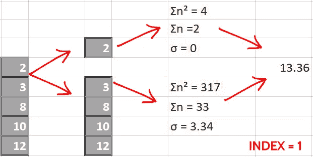
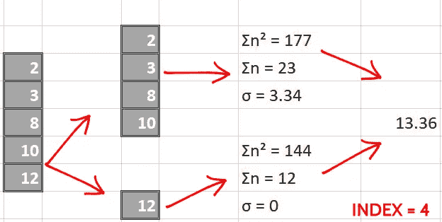
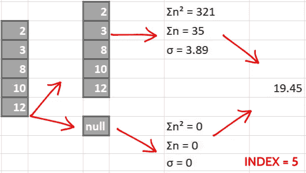

# python 中的随机森林和决策树

> 原文：<https://towardsdatascience.com/random-forests-and-decision-trees-from-scratch-in-python-3e4fa5ae4249?source=collection_archive---------1----------------------->

# 介绍

随机森林是集成机器学习方法的主要例子。简而言之，集成方法是一种聚合预测性较低的基础模型以产生更好的预测模型的方法。正如人们可以直观猜测的那样，随机森林通过减少决策树臭名昭著的过度拟合倾向，集成各种决策树以产生更一般化的模型。决策树和随机森林都可以用于回归和分类问题。在这篇文章中，我们创建了一个随机森林回归器，尽管在下面的代码中只需稍加修改就可以创建一个分类器。

# 先决条件

我建议你具备以下方面的工作知识，以便更好地理解这篇文章:

1.  [决策树](/decision-trees-in-machine-learning-641b9c4e8052):我们也将为我们的随机森林从头开始创建这种树，但我不会解释它的理论和工作机制，*为简洁起见，* *推理*因此，在一个帖子里把所有东西都搅在一起只会让它变得不合理。
2.  集成学习(Ensemble learning):随机森林只是这个庞大的机器学习技术集的一个子集，如果你对这个有一个基本的了解，你会更好地理解这个帖子(不要为了这个帖子而谈论太多细节)
3.  熊猫图书馆:一个好的木匠必须精通他的工具。这两个库是我们的工具。

# 理论

在开始编写我们的代码之前，我们需要了解一些基本理论:

1.  **特征装袋** : **b** 根带**聚集**再聚集或装袋是从替换的原始组中随机选择一定数量样本的方法。在特征打包中，原始特征集被随机采样并传递到不同的树上(没有替换，因为具有冗余特征没有意义)。这样做是为了降低树之间的相关性。具有无与伦比的重要性的特征将导致每个决策树选择它进行第一次和可能的后续分裂，这将使所有的树表现相似，并最终更加相关，这是不希望的。我们的目标是制作高度不相关的决策树。

> 为什么要让决策树高度不相关？

我们需要高度不相关的决策树，因为“[一组完全随机误差的平均误差是零](https://www.itl.nist.gov/div898/handbook/pmd/section2/pmd212.htm)”，因此通过降低相关性并使每棵树尽可能随机地分裂(在特征选择的意义上是随机的，我们的目标仍然是在随机选择的一组列中找到最佳分裂)，我们可以获得更好的无误差预测。

Correlated trees | Both have same feature set and make similar splits

People travel lands, i travel timeuncorrelated trees | Both have randomly selected different feature set and make different splits

2.**聚合**:使随机森林优于决策树的核心概念是聚合不相关的树。这个想法是创建几个蹩脚的模型树(低深度)并平均它们来创建一个更好的随机森林。[一些随机误差的平均值为零](https://www.itl.nist.gov/div898/handbook/pmd/section2/pmd212.htm)因此，我们可以从我们的森林中获得广义预测结果。在回归的情况下，我们可以平均每个树的预测(平均值)，而在分类问题的情况下，我们可以简单地取每个树投票的类别的大多数(模式)。

# Python 代码

为了从头开始编码我们的随机森林，我们将遵循[自顶向下的方法](https://en.wikipedia.org/wiki/Top-down_and_bottom-up_design)。我们将从一个单独的黑盒开始，进一步分解成几个黑盒，减少抽象层次，增加细节，直到我们最终达到不再抽象任何东西的程度。

# 随机森林类

我们正在创建一个随机的森林回归器，尽管同样的代码可以稍微修改一下来创建一个分类器。首先，我们需要知道我们的黑盒将什么作为输入来产生输出(预测)，因此我们需要知道定义我们的随机森林的参数:

1.  **x** :训练集的自变量。为了保持事情最小和简单，我没有创建一个单独的 fit 方法，因此基类构造函数将接受训练集。
2.  **y** :监督学习所需的相应因变量(随机森林是一种监督学习技术)
3.  **n_trees** :我们集合起来创建随机森林的不相关的树的数量。
4.  **n_features** :采样并传递到每棵树上的特征数量，这是特征打包发生的地方。它可以是 sqrt、log2 或整数。在 sqrt 的情况下，采样到每棵树的要素数是总要素数的平方根，在 log2 的情况下是总要素数的对数底 2。
5.  **sample_size** :随机选择并传递给每棵树的行数。这通常等于总行数，但可以减少以提高性能，在某些情况下[减少树的相关性](https://en.wikipedia.org/wiki/Bootstrap_aggregating)(树的打包是一种完全独立的机器学习技术)
6.  **深度:**每个决策树的深度。更高的深度意味着更多的分裂，这增加了每棵树的过度拟合趋势，但是因为我们聚集了几个不相关的树，所以单个树的过度拟合几乎不会干扰整个森林。
7.  **min_leaf** :一个节点中导致进一步拆分所需的最小行数。min_leaf 越低，树的深度越高。

让我们开始定义我们的随机森林类

1.  **__init__** :构造函数在我们参数的帮助下简单地定义随机森林，并创建所需数量的树。
2.  **create_tree** :通过调用类`DecisionTree`的构造函数创建一个新的决策树，这个类现在被认为是一个黑盒。我们稍后将编写它的代码。每棵树都接收一个随机的特征子集(特征打包)和一组随机的行(打包树，虽然这是可选的，但我写它是为了展示它的可能性)
3.  **预测**:我们的随机森林的预测只是所有决策树预测的平均值。

如果我们能神奇地创造出树木，这就很容易想象出一个随机的森林。现在，我们降低抽象层次，编写代码来创建决策树。

如果你知道如何从头开始写一个决策树，你可以在这里停止阅读，但是如果你不知道，那么继续阅读。

# 决策树类

它将具有以下参数:-

1.  **indxs** :该参数的存在是为了跟踪原始集合的哪些索引去了右边，哪些去了左边的树。因此，每棵树都有这个参数“ *indxs* ”，它存储它所包含的行的索引。预测是通过对这些行进行平均来进行的。
2.  **min_leaf** :一个叶节点上能够引起拆分所需的最小行样本。每个叶节点将具有小于 min_leaf 的行样本，因为它们不能再分割(忽略深度约束)。
3.  **深度**:每棵树内可能的最大深度或最大分裂数。

Why are decision trees only binary?

我们使用[属性修饰器](https://stackoverflow.com/questions/17330160/how-does-the-property-decorator-work)来使我们的代码更加简洁。

1.  **__init__** :决策树构造器。它有几个有趣的片段值得研究:

a.如果我们在这个特定树的计算中没有指定行的索引，只需取所有的行。

b.`self.val = np.mean(y[idxs])`每个决策树预测一个值，这个值是它保存的所有行的平均值。变量`self.val`保存对树的每个节点的预测。对于根节点，该值只是所有观察值的平均值，因为它包含所有的行，因为我们还没有进行分割。我在这里使用了“节点”这个术语，因为本质上决策树就是一个节点，它的右边有一个决策树，左边有一个决策树。

c.`self.score = float(‘inf’)`节点的得分是根据它划分原始数据集的“好”程度来计算的。我们稍后会定义这个“好”，现在让我们假设我们有一个方法来测量这样一个量。此外，我们的节点的分数被设置为无穷大，因为我们还没有进行任何分割，因此我们现有的分割是无限糟糕的，这表明任何分割都比没有分割好。

d.`self.find_varsplit()`我们第一次分开了！

2. **find_varsplit:** 我们使用蛮力方法来寻找最佳拆分。该函数按顺序遍历所有列，并在所有列中找到最佳拆分。这个函数仍然是不完整的，因为它只进行了一次分裂，后来我们扩展了这个函数，为每次分裂生成左右决策树，直到到达叶节点。

3. **split_name** :一个属性装饰器，返回我们要拆分的列的名称。`var_idx`是该列的索引，我们将在`find_better_split`函数中计算该索引以及我们拆分的列的值

4. **split_col:** 一个属性装饰器，用于返回索引`var_idx`处的列，该列包含由`indxs`变量给出的索引处的元素。基本上，用选定的行分隔一列。

5. **find_better_split:** 这个函数在某一列中寻找可能的最佳拆分，这很复杂，所以我们在上面的代码中把它看作一个黑盒。让我们稍后定义它。

4. **is_leaf** :叶节点是从未进行过分裂的节点，因此其得分为无穷大(如上所述)，因此该函数用于识别叶节点。同样，如果我们已经越过了最大深度，即`self.depth` < = 0，那么它就是一个叶节点，因为我们不能再深入了。

# 如何找到最佳分割？

决策树通过基于特定条件递归地将数据分成两半来训练。如果一个测试集有 10 列，每列有 10 个数据点(值)，总共有 10×10 = 100 个拆分是可能的，我们手头的任务是找出这些拆分中哪一个最适合我们的数据。

我们根据将数据分成两半的效果来比较拆分。我们进行分割，使两半的每一半都具有最“相似”的数据类型。增加这种相似性的一种方法是减少两半的方差或标准差。因此，我们希望最小化两半标准偏差的加权平均值(分数)。我们使用贪婪方法，通过将列中的每个值的数据分成两半，并计算两半的标准偏差的加权平均值(得分),最终找到最小值，从而找到拆分。(贪婪的方法)

为了加快速度，我们可以复制该列，并对其进行排序，以通过使用由拆分`nth`索引创建的两个一半的值的总和和平方和在`n+1th`索引处拆分值来计算加权平均值。这是基于以下标准偏差公式:

下图形象地展示了分数计算的过程，每幅图的最后一列是一个数字，代表分裂分数，即左右标准差的加权平均值。

继续对每一列进行排序

Sort the column

现在我们按指数顺序进行分割

Start with index = 0

index = 1

index = 2 (best split)

index = 3

index = 4

index = 5

通过简单的贪婪方法，我们发现在 index = 2 上进行的分割是最好的可能分割，因为它具有最小的分数。我们稍后对所有列执行相同的步骤，并对它们进行比较，以贪婪地找到最佳(最小)分数。

以下是上述绘画作品的简单代码:

以下代码片段很有趣，需要一些解释:

1.  函数`std_agg`使用值的总和以及平方和计算标准偏差
2.  `curr_score = lhs_std*lhs_cnt + rhs_std*rhs_cnt`每次迭代的拆分分数就是两半的标准偏差的加权平均值，每一半的行数作为它们的权重。较低的分数有利于较低的方差，较低的方差有利于相似数据的分组，这将导致更好的预测。
3.  `if curr_score<self.score:
    self.var_idx,self.score,self.split = var_idx,curr_score,xi`每当当前分数更好时(小于当前保存在`self.score`中的分数)，我们将更新当前分数，并将该列存储在变量`self.var_idx` 中(记住这是帮助为我们的两个属性装饰者选择列的变量)，并将进行拆分的值保存在变量`self.split`中。

既然我们知道了如何为所选的列找到最佳的拆分，我们需要为每个进一步的决策树递归地定义拆分。对于每棵树，我们找到最佳列和它的值来分裂，然后我们递归地生成两个决策树，直到我们到达叶节点。为此，我们扩展我们的不完整函数`find_varsplit`如下:

1.  `for i in range(self.c): self.find_better_split(i)`这个循环遍历每一列，并试图找到该列中的最佳拆分。到这个循环结束时，我们已经对所有列进行了所有可能的拆分，并找到了最佳可能的拆分。要拆分的列存储在`self.var_idx`变量中，我们拆分的列的值存储在`self.split`变量中。现在我们递归地形成两半，即右和左决策树，直到我们到达叶节点。
2.  如果我们已经到达了叶节点，我们不再需要寻找更好的分裂，简单地结束这棵树。
3.  `self.lhs`持有左侧决策树。它接收的行保存在`lhs`中，这些行是所选列中小于或等于`split.value`中存储的拆分值的所有此类值的索引。变量`lf_indxs`保存左树接收到的特征(列)样本(特征打包)。
4.  `self.rhs`掌握正确的决策树。`rhs`存储传递到右侧决策树的行的索引。`rhs`的计算方式与`lhs`类似。同样，变量`rf_indxs`保存右侧树接收到的特征(列)样本(特征打包)。

# 结论

这是完整的代码

这篇文章的目的是让读者和我自己更熟悉随机森林的一般工作方式，以便将来更好地应用和调试。随机森林有更多的参数和相关的复杂性，我不可能在一篇文章中涵盖。为了研究一个更加健壮和有益的代码，我建议你阅读开源的 sklearn 模块的随机森林代码。

我要感谢[杰瑞米·霍华德](https://twitter.com/jeremyphoward?lang=en)和[瑞秋·托马斯](https://twitter.com/math_rachel?lang=en)的 [fast.ai](http://fast.ai/) 机器学习课程，让我能够写这篇文章。事实上，我在这里的所有代码都是在对最初的 [fast.ai 课程材料做了小小的改动后创建的。](http://course.fast.ai/ml)

如果我的解释有错误/不清楚，请在回复中告诉我。感谢您的阅读。