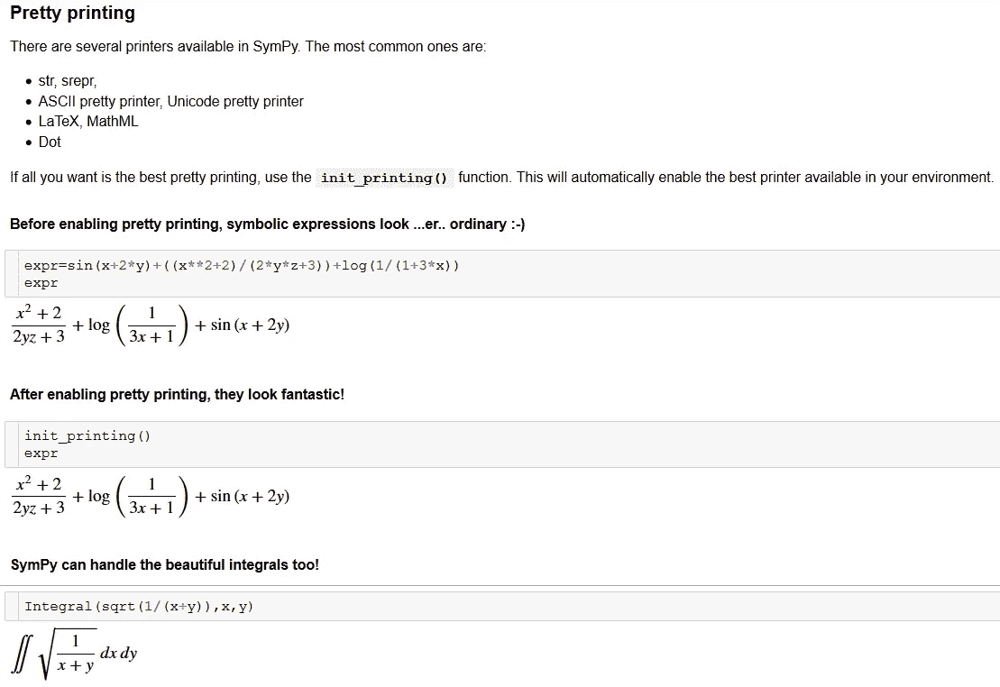
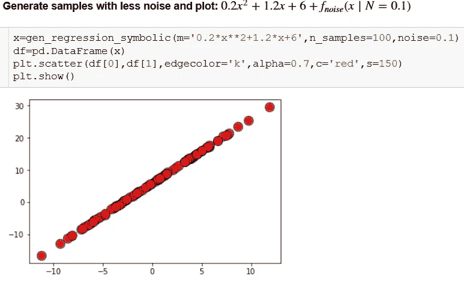
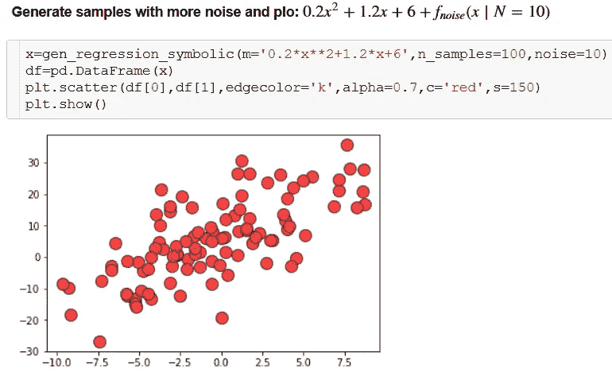
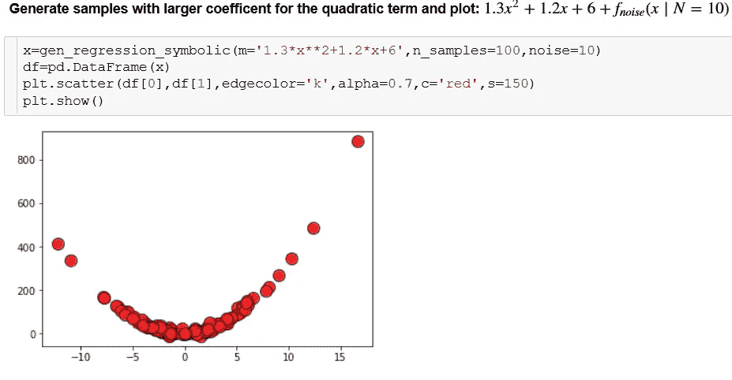
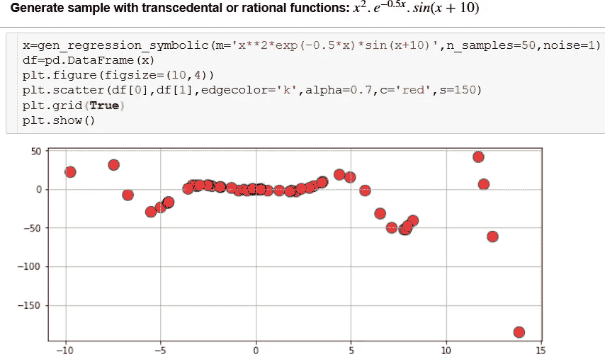
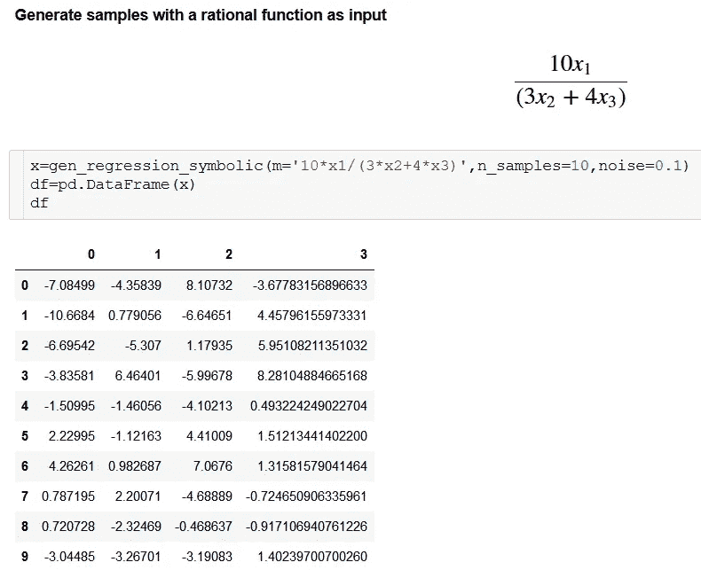

# 用符号表示的随机回归和分类问题生成

> 原文：<https://towardsdatascience.com/random-regression-and-classification-problem-generation-with-symbolic-expression-a4e190e37b8d?source=collection_archive---------2----------------------->

## 我们描述了如何使用 SymPy，我们可以为多项式(和非线性)回归和分类问题建立随机样本生成器。这补充了 Scikit-learn 的随机数据生成方法。

## 介绍

对于数据科学和机器学习的初学者来说，一个常见的问题是获得良好、干净的数据集以便快速练习。回归和分类是数据科学从业者必须处理的两个最常见的监督机器学习任务。并不总是有可能得到结构良好的数据集来练习人们学习的各种算法。

> 如果能有一个方便的函数来快速生成大小、复杂性和随机性可控的回归和分类问题的合成示例，那就太好了。

现在， [Scikit-Learn，Python](http://scikit-learn.org/stable/index.html) 中领先的机器学习库，确实为回归和分类问题提供了随机数据集生成能力。然而，**用户无法轻松控制数据生成的底层机制，回归输出也不是输入的决定性函数——它们确实是随机的**。虽然这对于许多问题来说可能已经足够了，但是人们可能经常需要一种可控的方式来基于明确定义的函数(*涉及线性、非线性、理性甚至超越项*)产生这些问题。

在本文中，我们将使用 SymPy(Python 生态系统中的一个伟大的符号计算包)来完成示例代码。你可以 [**在这里**](https://github.com/tirthajyoti/PythonMachineLearning/tree/master/Random%20Function%20Generator) 从我的 GitHub 库下载 Jupyter 笔记本，并根据你的需要进一步修改功能。

## Scikit-Learn 的数据集生成功能和局限性

Scikit-learn 为生成随机回归和分类问题提供了两个实用函数。它们列在`[sklearn.dataset](http://scikit-learn.org/stable/modules/classes.html#module-sklearn.datasets)` [API](http://scikit-learn.org/stable/modules/classes.html#module-sklearn.datasets) 下。它们如下:

`**sklearn.dataset.make_regression**`:生成随机回归问题。通过将具有确定数量的非零回归量的 ***随机线性回归模型*** 应用于先前生成的输入和具有一些可调标度的一些高斯中心噪声，来生成输出。

`**sklearn.dataset.make_classification**`:生成一个随机的 n 类分类问题。这首先创建正态分布在 n 维超立方体的顶点周围的点的聚类，并为每个类分配相等数量的聚类。它引入了这些特征之间的相互依赖，并给数据增加了各种类型的噪声。

这些是非常好的随机问题生成工具，但是**它们不允许用户基于一些底层的确定性函数**来创建数据。然而，人们可能希望为可控分析/机器学习实验生成数据集。例如，我们想要评估各种[内核化](https://www.cs.cmu.edu/~ggordon/SVMs/new-svms-and-kernels.pdf) [SVM 分类器](https://en.wikipedia.org/wiki/Support_vector_machine)在具有越来越复杂分隔符(线性到非线性)的数据集上的功效，或者想要证明线性模型对于由有理函数或超越函数生成的回归数据集的局限性。使用 scikit-learn 的这些功能很难做到这一点。此外，用户可能只想输入一个符号表达式作为生成函数(或分类任务的逻辑分隔符)。仅仅使用 scikit-learn 的实用程序很难做到这一点，必须为每个新的实验实例编写自己的函数。

## SymPy 来救援！

为了解决符号表达式输入的问题，人们可以很容易地利用令人惊叹的 Python 包 SymPy，它允许理解、呈现和评估符号数学表达式，达到相当高的复杂程度。更多细节可以在他们的网站上找到。这里有几个基本的例子，

## 使用用户提供的符号表达式的随机回归和分类数据集生成

代码的细节可以在我的 [GitHub repo](https://github.com/tirthajyoti/PythonMachineLearning/tree/master/Random%20Function%20Generator) 中找到，但是思路很简单。我们有一个`symbolize`函数，它将 Python 输入字符串转换成 SymPy 符号对象，还有一个`eval_multinomial()`函数，它将 SymPy 符号表达式和一个`(vals)`参数作为列表、字典或元组，并在内部创建一个`(symbol,value)`对来计算数学表达式。主要的效用函数如下:

`**gen_classification_symbolic()**`函数基于符号表达式生成分类样本。它计算随机生成(高斯分布)点的符号表达式的输出，并基于符号分配二进制分类。
***m*** :符号表达式。需要 *x* 1、 *x* 2 等作为变量和要使用的常规 python 算术符号。
***n _ samples***:要生成的样本数
***n _ features***:自变量数。这是从符号表达式中自动推断出来的。因此，在提供符号表达式的情况下，该输入将被忽略。然而，如果没有提供符号表达式，则可以调用默认的简单多项式来生成具有 *n_features* 的分类样本。
***flip_y*** :随机翻转分类标签的概率。较高的值会引入更多的噪声，并使分类问题更加困难。
**返回**:返回一个带维度的`numpy ndarray`(*n _ samples*， *n_features* +1)。最后一列是响应向量。

`**gen_regression_symbolic()**`函数基于符号表达式生成分类样本。它计算随机生成(高斯分布)点的符号表达式的输出。
*:象征性表达。需要 *x* 1、 *x* 2 等作为变量和要使用的常规 python 算术符号。
***n _ samples***:要生成的样本数
***n _ features***:变量数。这是从符号表达式中自动推断出来的。因此，在提供符号表达式的情况下，这将被忽略。然而，如果没有提供符号表达式，则可以调用默认的简单多项式来生成具有 n 个特征的分类样本。
***噪声*** :要引入的噪声(默认为高斯)的大小(加到输出上)。
***noise _ dist***:噪声信号的概率分布类型。目前支持:*正常，均匀，贝塔，伽马，泊松，拉普拉斯*。
**返回**:返回一个带维度的`numpy ndarray`(*n _ samples*， *n_features* +1)。最后一列是响应向量。*

## *例子*

*下面是一些代码片段和可视化的结果数据集。*

****分类样本****

******

****回归样本****

********

## *不限于单个符号变量*

*尽管使用一个或两个示例示出了上述示例，但是函数不受变量数量的限制。事实上，内部方法被编码成自动地从你的符号表达式输入中推断出独立变量的数量，并相应地设置问题。这里有一个例子，用户甚至没有给出 *n_features* ，但是函数从符号表达式中推断出特征的数量为 3。*

**

## *总结和未来扩展*

*基本代码设置为尽可能模拟 scikit-learn 的数据集生成实用程序功能。人们可以通过提供 Pandas 数据帧输出或 CSV 文件输出来轻松扩展它，以便在任何其他编程环境中使用，并将数据保存到本地磁盘。在一定的复杂程度上，也可以为用户提供符号表达式的 LaTeX 公式的字符串表示。当然，我们鼓励读者在 GitHub repo 中发送他们的评论或指明。*

*如果您有任何问题或想法要分享，请联系作者在[**tirthajyoti【AT】Gmail . com**](mailto:tirthajyoti@gmail.com)。此外，您可以查看作者的 [**GitHub 资源库**](https://github.com/tirthajyoti?tab=repositories) 中其他有趣的 Python、R 或 MATLAB 代码片段和机器学习资源。如果你像我一样，对机器学习/数据科学充满热情，请随时[在 LinkedIn 上添加我](https://www.linkedin.com/in/tirthajyoti-sarkar-2127aa7/)或[在 Twitter 上关注我](https://twitter.com/tirthajyotiS)。*

****关键词*** : #machinelearning，#symbolicmath，#supportvectormachine，#随机化，#回归，#分类*