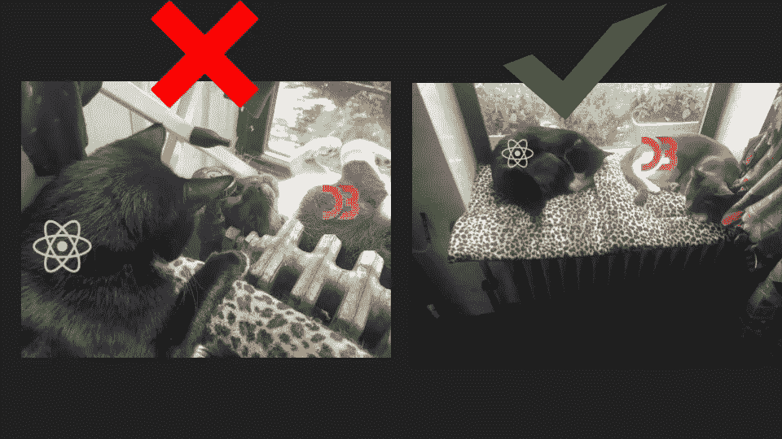
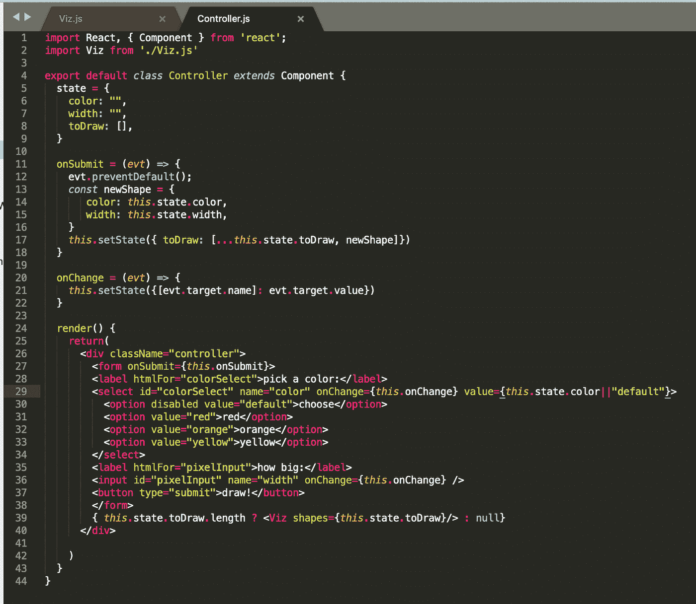

# React + D3:数据可视化世界的通心粉和奶酪

> 原文：<https://towardsdatascience.com/react-d3-the-macaroni-and-cheese-of-the-data-visualization-world-12bafde1f922?source=collection_archive---------3----------------------->

React and D3, just melting all over one another in gooey, data-driven deliciousness (aka a slice of mac ‘n cheese)

React 处于 SPA UI 开发的最前沿——目前没有其他技术像 react 这样强大和广泛使用。当我们谈论 web 上的数据可视化时，我们很可能*是在*谈论 D3(说真的，如果你所看到的 D3 只是一些快速的直方图，我不得不推荐这个[奇妙的 D3 v4 课程](https://www.udemy.com/d3-4x-mastering-data-visualization/)，它将带你深入了解这个库实际上能够做什么的本质。剧透:这太疯狂了。PS:我和那门课没有任何隶属关系，我只是拿了，挖了)。

但是，一个悲剧即将发生:*显然，在你的代码库中，一次只能有一个这么棒的库，对吗？*

看，React 如此快速和轻便的部分原因是它在高效更新 DOM 方面非常聪明，所以当您使用 React 时，您通常不会直接接触 DOM——您只是放松下来，让所有甜蜜的、声明性的 MVC jazz 为您处理一切。

而 D3 则是给你一条直接进行 DOM 操作的干净的路径。

因此，实现的重叠可能会给我们带来潜在的问题——如果您没有正确地计划它，React 和 D3 可能会……妨碍彼此，并且表现得非常不可预测。人们已经编写了一些包来为您处理这个问题，但是缺点是您会被锁定在 React 和 D3 之上的第三个系统中。这通常意味着你只能使用数量相对有限的预制模板，或者无法使用大量的 D3 特性。限制自己似乎真的很遗憾，尤其是当让他们守规矩和轮流真的很简单的时候。

为了说明我们想如何解决这个问题，以我的猫为例。

Ellis and Sol about to fight over a windowsill spot on the left, and the two of them comfortably snoozing and sharing on the right.

本质上，我们想把 React 和 D3 当作我的猫来对待。我们就假设穿着整洁晚礼服的埃利斯是 React，右边穿着优雅晨装的索尔是 D3，窗户前面的阳光点是 DOM。

如果只有一个位置，我们只是让它们自己解决，就像左边的照片一样，那么…那些抬起的爪子在照片里可能看起来超级可爱，但让我告诉你，在这张照片拍摄后大约三秒钟，就有一些严重的争吵。只有一个位置，他们都决心要独占它。

然而，右边阳光充足的窗户大小完全一样，得到的阳光也一样多，但是，因为我们给了他们每人一个单独的枕头，他们可以称之为自己的枕头，他们可以完全做主，他们都在非常平静地做他们的事情。

给他们一点喘息的空间，给他们一种完全掌控的错觉，我就能让他们两个都表现得最好。

a screenshot of what we’re building — live at [https://d3-react-tutorial.herokuapp.com](https://d3-react-tutorial.herokuapp.com)

所以，尽管我很讨厌这样做，让我们把我的猫的寓言抛在脑后，谈谈我们要做什么。为了确保我们让每个库真正做它应该做的事情，我们有一个用户界面，让你选择颜色和大小，并根据这些选择生成可爱的小飞行 SVG 圆。这是一个非常小的玩具，但这正是我们完成工作所需的代码量。你可以在这里查看代码[或者在这里](https://github.com/leighsteinerlocus/d3-react-tutorial)摆弄玩具本身[。](https://d3-react-tutorial.herokuapp.com/)

a relatively simple Controller Component, which renders a form and keeps track of form submission results in its state.

就像猫一样，我想给 React 和 D3 他们自己的独立空间，在那里他们可以负责并做他们所做的事情，这与“React-y”的思维方式非常好——我们想给每个库分配一个适当的角色，并将该角色的工作(以及库)隔离到单独的组件中。这样，当我们想知道谁可以操作 DOM 时，答案变得非常简单:我们在哪个组件中？

React 在交互性、状态管理和结构化用户界面方面非常出色，所以这就是我要让它做的事情——在上面显示的这个组件中，控制器。它只是一个漂亮、简单的表单，每个更改和提交都存储在组件的状态中——我们知道用户现在在做什么，以及他们已经做了什么。这就是我们在这里所做的——没有 SVG，我们甚至没有将 d3 导入到这个文件中。

所有这些都在第 39 行进行管理，其中“Viz”是一个子组件，它唯一的工作是获取控制器生成的数据，并使用 D3 来绘制图片。

虽然从技术上讲我们可以颠倒这些角色(例如，人们确实构建了只使用 D3 的整个 UI)，但关键是要充分利用每个库，对我来说这是最合理的分解。

a teeny, tiny, tidy, twelve-line Viz component, which renders a single, empty div

D3 组件，即，将会非常小，即使我们使用它来制作的可视化将会占据绝大部分的视口——我们不希望 React 介入或访问它，所以我们真正需要的只是一个参考点——第十三行的空 Div。该 div 基本上是一个小花园围栏，标记 React 停止的位置，D3 开始。

a helper function which searches out an empty div with a ‘.viz’ class on it, and uses it as a reference to hang the SVG element and all its children on.

而这就是 D3 拿起来的样子！这里我们有一个有用的“绘制”功能。将它定义为 Viz 类的一个方法很有诱惑力，但是没有必要这样做，最终，我建议不要这样做。

一旦我们进入了 D3，我们就想尽可能地“用 D3 的方式”做所有的事情，对吗？这不仅是因为这是确保 D3 能够在最高水平上工作的好方法，也是因为这是确保下一个接触您的代码库的人知道正在发生什么以及如何有效地构建它的好方法。

因为 D3 将直接接触 DOM，在 React 的模型-视图-控制 jam 之外，它不需要知道关于它最终将被调用的组件的任何事情——它与应用程序的整体 React 结构无关，并且可以在某处的一些 helpers.js 文件中非常舒适地存在。就像我们在 React 空间中不引用 D3 一样，我们在这里也不会引用 React。

所有这一切的关键在于，D3 接触到的所有东西都在这里产生，并且只在这里生存。我们使用这个空的 to div 来挂我们的 SVG，并在这个空间内创建图片的每个部分——所有的子元素和它们的属性，以及它们可能有的任何交互。甚至这些元素的样式也存在于此——这降低了 CSS 冲突和不可预测的结果的可能性，也意味着当您需要改变可视化的外观和感觉时，您可以一站式购买，这在您开始使用 D3 的一些更大规模的构建功能时尤其方便。(顺便问一下，您是否知道可以生成色标，该色标将映射到您用作范围的任何数值上？相当狂野。)

> 在我们继续之前，关于可访问性有一个简短的说明:有几件事你可以相对容易地做，以便在广大用户遇到你的应用程序时给他们最完整的体验。
> 
> 首先:您知道 SVG 有一个`<title>`元素吗，它可以被设置为类似于改变图像文本的功能。要使它工作，它必须是 SVG 的直接第一个子对象。想出为你的数据自动生成适当的和信息丰富的标题/alt 的方法可能是具有挑战性的，但绝对值得努力来制作一个包容性的应用程序。对于你所创造的形象，需要理解的最重要的事情是什么？你希望你的用户带走什么？
> 
> 第二:你打算让你的可视化互动吗？通过点击或悬停，是否有更多信息或操作变得可用？并不是所有的用户都能够访问它们，使用屏幕阅读器或有运动障碍的人可能不会使用鼠标。任何对你的 UX 来说重要的功能都应该可以通过键盘导航来实现。还好，那不是太难！SVG 形状有效地采用了 tabindex 属性，这将允许您的用户在可视化的每个部分之间切换。一旦到了那里，如果您将您的`element.on('hover',...)`行为复制到`element.on('focusin',...)`，将您的`element.on('click',...)`复制到`element.on('keydown',...)`，在那里您检查以确保击键来自确认键，会怎么样？有多少人能享受到你辛勤工作的成果？

a teeny, tiny, tidy, twelve-line Viz component, which renders a single, empty div

所以，回到我们的 Viz 组件。一旦我们设置好了 draw 函数，我们需要做就是使用它。如果你还记得我们的控制器组件是如何工作的，它只会在实际有形状要画的时候进行渲染，所以一旦我们安装了我们的组件，很明显在那一点上我们想要调用 draw 并把我们得到的数据传递给它。但是如果我们的用户添加更多的形状呢？嗯，`componentDidUpdate`钩子将被触发，因为关于这些形状的信息将改变 Viz 从控制器获得的道具，我们可以告诉 draw 再次做它的事情，但这次是用最新的数据。我们也不必担心 React 的干扰，因为实际上 React 甚至不知道我们的 SVG 在那里——它只是接收新的道具并做它被告知的事情。

如果你是在去年这样做的(或者你确实读过我的第一篇关于让 React 和 D3 在一起时表现自己的文章)，你可能会记得这个过程稍微复杂一点——你必须使用`shouldComponentUpdate`手动关闭 React 重新渲染，并且在它们变成`this.props`之前，使用`componentWillReceiveProps`用`nextProps`处理你的重绘。幸运的是，这两种生命周期方法都被弃用了，它们的功能包含在更少的函数调用中，这很好。

这不禁让人想知道，有没有更好、更酷、更紧凑、更先进的方法来做这件事？

我很高兴你这么问。看看这个，伙计们:

A six — count ’em SIX — line Viz Component, just as functional, but short and sweet

React 钩子仍然在 alpha 中，所以它们可能不太适合您的产品级代码，但是看看这个组件看起来有多光滑！钩子让我们保持组件的功能，即使我们需要生命周期方法或内部状态。这使得调试和阅读我们的代码更加容易。

这个组件中发生的事情与它上面的基于类的组件完全相同。`useEffect`实质上取代了我们之前的`componentDidMount`和`componentDidUpdate`功能。`useEffect`需要两个参数来完成工作——一个函数，它将在组件进行渲染的任何时候运行(在本例中，是我们熟悉的老 draw 函数),以及一个比较器，它使用该比较器来判断是否发生了足够多的变化来运行该函数。在这种情况下，我们告诉 useEffect 只在 shapes 数组的长度改变时运行它的函数，因为这就是我们如何知道我们有一个新的形状要绘制。很简单，对吧？React 向我们承诺，在可预见的未来，类不会消失，我也不特别希望它们消失，但是有另一种选择是很酷的。

我希望这篇简短的文章已经说明了在 React 应用程序中使用 D3 是多么容易和不令人生畏(顺便说一下，这是一个很好的路线图，可以将 React 与任何使用 DOM 的第三方库*一起使用)——它是否启发了你用它来制作很酷的东西？给我看看！跟我说说！或者，告诉我你认为我哪里错了，这也很有趣。*

a gratuitous cat picture of Ellis, holding a catnip banana