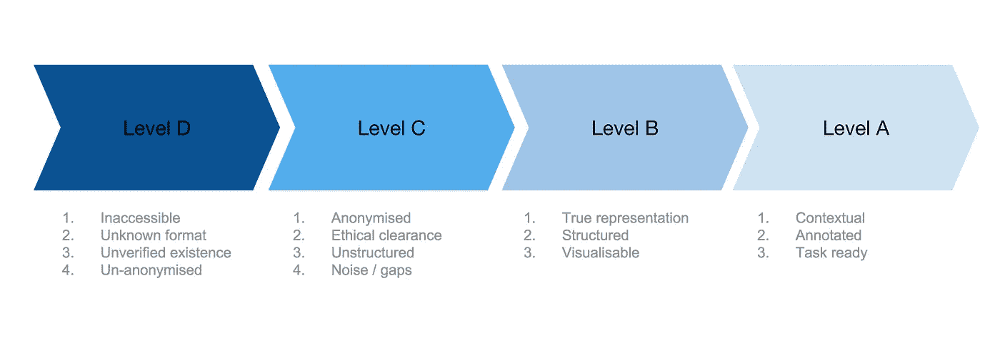

# 就绪…设置…人工智能—为未来准备 NHS 医学成像数据

> 原文：<https://towardsdatascience.com/ready-set-ai-preparing-nhs-medical-imaging-data-for-the-future-8e85ed5a2824?source=collection_archive---------2----------------------->

Image courtesy of the Invisible Light X-ray art gallery ([http://www.invisiblelight.com.au/](http://www.invisiblelight.com.au/))

除非放射科医生在过去的几年里把自己关在黑暗的房间里。)，他们将听说即将到来的放射学人工智能算法海啸，它将使他们的工作更快，他们的报告更精确，他们的实践更有影响力。我们中的积极分子将开始考虑如何参与开发放射学人工智能，有些人，像我一样，将积极致力于特定任务的用例、研究和验证。这很好——但我保证无论你在做什么数据集都不够大，你渴望更多。也许你可以从 NIH 获得免费的 [10 万张胸透照片？或者你说服了你的医院让你检查他们的 PAC？或者也许你在 IBM 工作，可以接触到所有甜蜜的](https://www.nih.gov/news-events/news-releases/nih-clinical-center-provides-one-largest-publicly-available-chest-x-ray-datasets-scientific-community)[合并医疗数据](https://www-03.ibm.com/press/us/en/pressrelease/47839.wss)？

对你有好处。获取医疗数据并使其独享和专有的热潮让我想起了两个世纪前的淘金热。勘探者成群结队地来到这里，与投资者讨价还价以获得开始挖掘的资金，乞求资金来购买地块，并在承诺黄金财富的同时寻求设备投资。然而，在挖掘真正有价值的东西和取出大块的固体矿石之前，有一个心照不宣且经常被忽视的障碍需要跨越…

> 问题是…医学成像数据还没有为人工智能做好准备

在医学成像数据上开发机器学习算法不仅仅是获取数据的问题。虽然访问本身当然是一个非常令人头疼的问题(看看 DeepMind 就知道一个明显的例子)，但这并不是比赛中唯一的障碍。在本文中，我将解释数据准备的概念，以及在准备数据方面的投资为何比开发第一个算法更重要。

# 数据准备阶段

没有定义和普遍接受的尺度来描述准备好的数据如何用于机器学习。许多管理咨询公司会提供漂亮的幻灯片，告诉你如何收集数据并从中创造见解(并为这种特权收取高额费用)，但数据就绪性的基本原则仍然是一个很大程度上无法量化的过程。

Neil Lawrence 教授(谢菲尔德，亚马逊)写的一篇鲜为人知但非常重要的[关于数据就绪的论文](https://arxiv.org/abs/1705.02245)引起了我的注意，在阅读了这篇论文并与他联系讨论后，我提出了自己的数据就绪量表的修改版。

Medical imaging data readiness scale

让我们从头开始，从 D 级开始…

# 每个人都想要 D

想象你拥有一个巨大的油田。想象一下这是多么美好的事情。除非你是 NHS，在这种情况下，你不必想象，因为你已经拥有一个巨大的油田！问题是，你的油田对于那些想把石油挖出来并把它变成汽油来为你赚取巨额利润的人来说是完全无法进入的。不仅如此，还有法律和道德的阻碍(甚至不要让我开始谈论 GDPR)。没有人，甚至是你，知道你的油田里到底有什么。你的油田就是我所说的‘D 级’数据。

D 级数据在数量和质量上都无法验证，不可访问，并且其格式使得机器学习很难或不可能做任何事情。这种级别的未匿名数据存在于每一家医院的 trust PACS 归档中，数量庞大，除了记录临床活动之外，什么也不做。(而且……我一想到这个就不寒而栗……由于数据存储问题，NHS 信托基金经常会删除这些积压的数据。比如扔油……)

为了将 D 级数据提升到 C 级，你需要建造一个精炼厂。数据提炼的第一步是获得访问数据的道德许可。在实践中，这是通过一个数据共享协议来实现的，要么通过一个道德委员会在本地与你自己共享，要么与第三方(大学、公司或初创企业)共享。NHS 信托可能在任何时候都有数以千计的数据共享协议。这些协议还将包括数据匿名化的条款，因为显然没有人希望 NHS 泄露机密的患者信息。到目前为止还不错…但是，数据仍然是非结构化的，不能代表一个完整的集合。这也将是非常嘈杂的，充满了错误，遗漏和只是简单怪异的条目。无论是谁，只要能接触到这些数据，现在都必须想办法让它们变得有用，然后才能开始算法开发。c 级数据已经准备好提供给人工智能开发者，但还远远没有准备好派上用场。

# 让它 B…

现在需要将数据进一步细化为 B 级数据，对其进行结构化，确保其代表您认为自己拥有的数据，并对其进行可视化，以便能够深入了解噪声特征和其他分析指标。这个过程实际上比 D 到 C 阶段更难，因为它是为每个数据集定制的。没有检查医学成像数据的标准方法，每个有权访问您的数据的小组将运行他们自己的数据可视化和分析。这是因为来自不同医院的数据将具有不同的特征和不同的格式(例如，不同的 DICOM 标题、日期和时间戳等)。将 C 级转化为 B 级的过程可能需要几个月——这可不是研究人员或初创企业在争夺金牌的过程中所需要的。只有有了 B 级的数据，你才能对它的可能性有一个概念，以及 AI 在哪里可以用来解决实际问题。

# 仅仅是最好的(比所有其他的都好)

对于算法开发来说，A 级数据是最接近完美的——它是结构化的，完全注释的，噪音最小，最重要的是，它在上下文中是适当的，并为特定的机器学习任务做好了准备。例如，100 万次肝脏超声检查的完整数据集，包括患者年龄、性别、纤维化评分、活检结果、肝功能测试(lft)和诊断，所有这些都在相同的元标签下构建，可用于深度学习算法，以确定哪些患者在 B 型超声扫描中有患非酒精性脂肪性肝病(NAFLD)的风险。

注释可能是放射学数据集提炼中最困难的部分——理想情况下，每一个图像发现都应该由经验丰富的放射科医师进行注释，以便在整个数据集内准确一致地突出显示所有可能的病理。问题是——世界上几乎没有任何现有的医学成像数据是以这种方式标注的。事实上，大多数“野生”图像甚至没有注释。这就是为什么有一个围绕数据标签的整个行业。有没有登录一个网站，被要求点击包含路标或汽车的图片？你在为自动驾驶汽车算法标记数据！当然，并不是每个互联网用户都是放射科医生，所以这种众包模式并不适用于医学成像(除非你经营[无线医疗](https://radiopaedia.org/)——有一个免费的商业创意给你们！).相反，研究人员不得不乞求或支付放射科医生的时间来注释他们的数据集——这是一项极其缓慢和昂贵的任务(相信我，我在论文期间花了 6 个月时间绘制前列腺周围的轮廓……)。另一种方法是在成像报告上使用自然语言处理(NLP)来挖掘概念，并使用它们来标记图像——然而，这种模型[还远远没有证明](http://pubs.rsna.org/doi/10.1148/radiol.16142770?url_ver=Z39.88-2003)足够健壮。

# 推测积累

从 D 级数据一直到 A 级数据的上述提炼过程在时间和资源方面都是昂贵的。我经常看到小型研究小组开始时提出一个大胆的建议，用机器学习来解决一个特定的任务，急于获得数据访问权，却被为什么他们的算法从未达到有用的准确率所困扰，然后放弃。他们试图避开提炼过程，结果被抓了出来。甚至像 IBM 这样的大玩家也在这个问题上苦苦挣扎。他们可以访问大量的数据，但是需要花费大量的时间和精力来准备这些数据，使其具有可操作性和实用性。

与任何投机性投资一样，你必须为基础设施建设融资，才能在下游获得收益。这就是为什么我提出了一个承担这项工作的国家框架，我称之为[英国放射学人工智能网络(大脑)](https://medium.com/@DrHughHarvey/uk-can-lead-in-radiology-ai-heres-how-c4c98990d833)。这个想法是利用最近宣布的政府[生命科学战略](https://www.gov.uk/government/publications/life-sciences-industrial-strategy)来获得资金，以创建一个基于 NHS 成像数据的全新产业。BRAIN 将充当匿名成像数据的“数据信托”或仓库，允许研究人员和公司访问，以换取知识产权权益。通过建立 BRAIN，NHS 将立即将数据准备程度提高到 C 级，然后随后的每一项研究活动都将有助于完善汇集的数据，将数据从 C 级提升到 A 级，为放射学人工智能的发展创造丰富的资源，增加数据集的价值。

这种设置的优势是巨大的 NHS 不仅在保持控制的同时开放了大量的数据，还通过对数据进行精炼*和*分享任何产生的知识产权，从人工智能发展的回报中获益两倍。此外，NHS 医院不再需要管理成千上万的数据共享协议(这是一项资源密集型任务)——它们只需将人们引向 BRAIN。

对研究人员和公司来说，好处也很大——他们都可以通过一个集中的数据共享协议访问数据(不再需要一个接一个地催促各个医院)，数据池比他们以前可以访问的任何数据都大，随着时间的推移，他们花在数据提炼上的资源越来越少，而花在开发有用算法上的时间越来越多。好处不止于此——通过汇集来自 NHS 的数据，您可以减少数据中的偏差，并将算法暴露于更广泛的成像技术、报告风格和病理，最终使最终产品算法更具通用性，可用于任何设置。

# 发展新产业

梅特卡夫定律(Metcalfe's Law)指出，网络的价值随着用户数量的平方增长而增长(看看脸书或 Twitter——庞大的网络，巨大的价值)。通过集中访问大型汇集数据集并邀请数百名研究人员参与，您可以立即显著增加网络的价值。所需要的只是一个建立它的承诺。人们只需要看看[英国生物银行](http://www.ukbiobank.ac.uk/)的成功就能明白为什么这样的网络是至关重要的(他们只有 1000 多台核磁共振成像仪)。

放射学人工智能领域就像是蛮荒的西部——它需要一个镇上的警长。通过汇集结构化数据，英国和 NHS 可以催生一个新的研究行业，同时收获回报。这是我对医学影像和 AI 海量数据的大梦想；我希望我已经说服你分享它！

如果你和我一样对放射学人工智能的未来感到兴奋，并想讨论这些想法，请保持联系。我在推特@drhughharvey

*如果你喜欢这篇文章，点击推荐并分享它会很有帮助。*

*关于作者:*

*Harvey 博士是一名委员会认证的放射科医生和临床学者，在英国国民医疗服务体系和欧洲领先的癌症研究机构 ICR 接受过培训，并两次获得年度科学作家奖。他曾在 Babylon Health 工作，领导监管事务团队，在人工智能支持的分诊服务中获得了世界第一的 CE 标记，现在是顾问放射科医生，皇家放射学家学会信息学委员会成员，以及人工智能初创公司的顾问，包括 Kheiron Medical。*