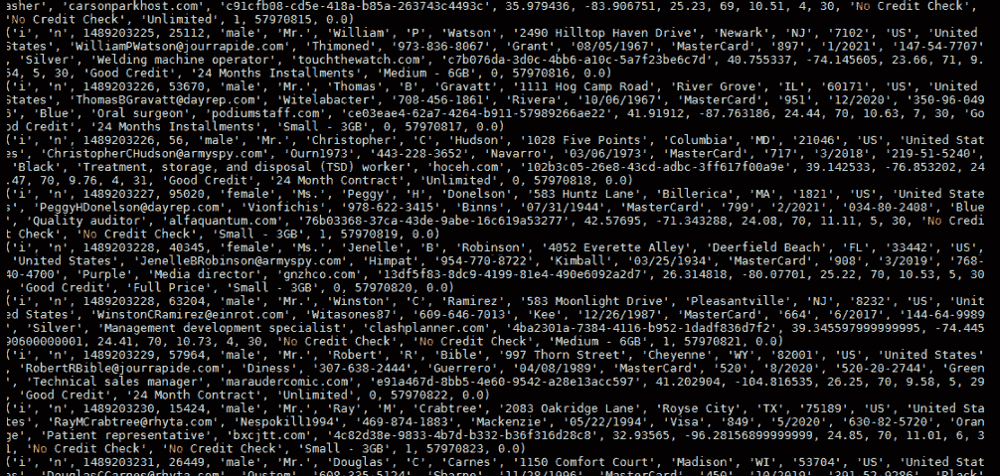
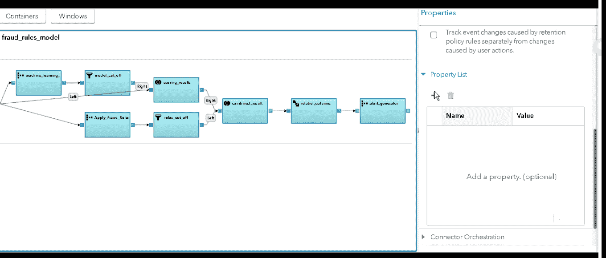

# 使用 Python 和 SAS 事件流处理进行实时分析

> 原文：<https://towardsdatascience.com/real-time-analytics-using-python-and-sas-event-stream-processing-92aecce95b92?source=collection_archive---------1----------------------->

实时或接近实时应用的分析为从事这项工作的公司带来了最大的经济效益。这里的论点是，从数据中获取最大收益的最佳方式是提取即时洞察力，以便为生成该数据的业务提供增量价值。现在有很多公司都这么做(网飞、亚马逊等)。)——还有很多人想尽快完成这项工作，并有实现目标的路线图。这是我们都同意的——至少我最近在这个领域交谈过的大多数人似乎都这么认为。虽然对静态数据的分析不会有任何进展，但实时分析如今却变得相当流行。我确信*这个时髦的词汇工厂*会制造出诸如机器智能、认知计算、全渠道、物联网、云战略等词汇。会同意。

T 这篇文章的目的是展示一种“ ***开放技术”*** 如 **SAS 事件流处理(ESP)** *(参见* [***此处***](https://www.sas.com/en_us/software/data-management/event-stream-processing.html) *了解 SAS ESP)* 如何使用户能够快速创建一个实时事务处理管道，并在此过程中实现分析——即应用业务规则如果我告诉你，你可以用 Python 只使用 SAS ESP 自带的 GUI 工具完全做到这一点，那不是更好吗？好吧，我们就这么做，让静态数据科学变得生动起来！

我们将利用 SAS ESP 附带的微分析服务(MAS)插件，快速解决复杂的实时分析处理和决策问题。可以把 MAS 想象成“一桶任意代码”,它保存着我们想要为流处理任务执行的业务逻辑。

> 当我考虑这么做的时候，我不得不专注于一些需要实时解决方案的实际问题——一些企业需要处理并且必须立即采取行动的问题。因此，我决定在这篇文章中，我们将构建一个**实时防欺诈引擎**，它将对流中的交易进行评分/评估。我个人最喜欢的一个是实时推荐引擎——所以我改天再回到这个话题。此外，我认为个性化值得自己的关注——而不是隐藏在一个像这样谈论实时分析的帖子中。

好了，现在我已经把这篇文章推销了不少，足以让你恼火，让我们开始吧，希望我们能看到所有这些是如何与我们的防欺诈用例一起工作的。

**创建流:**

我们将使用位于 [*这里的*](https://github.com/datasciencemonkey/fraud_demo/blob/master/fraud_demo/transactions.db) 的数据集。它是一个 sqlite 数据库，允许我们将事务数据连续地流入我们的 ESP 应用程序。现在，我们将使用它来模拟一个流媒体源。我设置了一个小的 python 脚本来简化这个过程 [*这里*](https://github.com/datasciencemonkey/fraud_demo/blob/master/fraud_demo/fraud_data_stream.py) 。所有这些都是初始设置项目，所以让我们浏览一下这些部分，如果您自己正在尝试，只需足够的细节就可以完成。这样，我们就不会陷入困境，并转移到用例的核心部分。这里有一个快速窥视我们的流媒体源

*注意:此时，您将在您想要尝试的机器上部署(或已经拥有)SAS 事件流处理，并为微分析服务插件配置它。在* *这里可以找到该任务的所有相关文档* [*。这是一个相当简单的过程。链接中的部署文档非常深入，一目了然。*](http://support.sas.com/documentation/onlinedoc/esp/)

现在，我们准备冒险设置我们的流应用程序。

**思考整个过程(3TP):**

使用 SAS ESP 的一个亮点是能够使用 GUI 快速编写复杂的流内转换和模式匹配逻辑。

我们将使用 GUI 为我们的检测过程建立一个整体的处理管道/流程。我们将通过以下方式实现这一目标

a.设置微分析服务(MAS)来管理我们的 python 文件，然后使用程序窗口在流中调用它

b.实施我们的机器学习算法，用于检测以及完成工作流程所需的规则、过滤器、连接和其他处理逻辑

当我做研究和思考什么是对的/什么是错的时，我喜欢思考高层次设计/架构的抽象过程，但帮助别人理解你的观点并不总是好的。因此，本着先做最后一件事的精神&为了帮助我们看到我们将到达的地方，这里是最终设置在 GUI 上的实际样子。

Streaming set up for Fraud Detection

上面你看到的是 ***窗口*** 相互连接的有向图。**关键概念***:ESP 中的“窗口”是独立的节点，即高效执行单一任务/功能的流处理管道中的接触点。*

虽然上面的图片对我所说的内容提供了一些清晰度，但是图形用户界面中的东西看起来如何并不那么重要。重要的是，ESP *自动地*将管道翻译成 XML 文件，供开发人员在生产环境中运行时部署在 ESP 服务器上。

这非常方便，因为迭代思想变得很容易。一旦你掌握了窍门，它会成为一个令人陶醉的玩具。如果你写代码(开发人员/研究人员/科学家等),这可能是一个甜蜜点。)因为你可以享受试验想法的自由，而不会陷入管理逻辑和句法细节的认知超载。所有这些越重要，你就越能理解你的逻辑在深层是如何运作的。此外，如果需要，您也可以选择深入研究。就这样，我又跑题了。

**问题解析—** *有什么快速解答* ***:***

O K，为了检测欺诈，我们需要*业务规则*(陷阱/停止规则和释放规则)和 ***机器学习模型*** (我们将使用 SAS E-Miner 实现一个，并将其移动到 ESP 中进行流内评分。在这篇文章中，我们不会关注 ML 模型的生成——那是另外一个时间了。

Ok, we’ll take some of it too!!

> 2017 规则#1 : *没有机器学习，就没有足够好的解决方案。想要证据吗？去看看* [*炒作周期*](http://www.gartner.com/newsroom/id/3412017) *的巅峰。*

但是，为什么规则？基本上，这些规则是企业用来帮助处理潜在的欺诈事件的。他们还可以使用规则来定义他们不想花费时间和精力的基于某种经验证据的交易特征。

最终，所有这些导致将可疑交易推入警报管理/交易审查工具，如[可视调查器](https://www.sas.com/en_us/software/intelligence-analytics-visual-investigator.html)(或类似的东西)，让审查代理/调查器处理这些交易的过程(取消/完成)。他们给银行打电话，做更深入的核实等等。诸如此类的事情。

**设置脚本:**

我们将使用 Python 编写陷阱规则和释放规则。我们将使用 MAS 插件设置它在 ESP 中工作。这将针对流中的所有事务运行。您可以从 GUI 工具配置 MAS 插件，如下所示:

Setting up the Micro Analytic Service

为了简单起见，我只为我们的虚拟项目使用了几条规则——在现实生活中可能有数百条——很容易以敏捷的方式修改。就像标准 python 一样，我们可以自由地返回任意数量的感兴趣的作用域变量。ESP 只需要一个提示，这个需求是在主函数的 docstring 中管理的，例如 manager 函数。否则，其他一切都保持不变。例如，你可以从其他模块或用户定义的对象(类/函数)借用多个辅助函数/方法，就像标准 python 一样。正如你在这里看到的*，我们使用几个助手函数来管理我们的代码。*

*接下来，我们将设置 MAS 插件来引用 python 脚本，就像我已经展示的那样。它非常简单，您可以将整个 python 函数作为文本粘贴进去，也可以只提供脚本位置的路径(推荐)。在这之后，我们使用管道中的程序窗口指向代码定义的 MAS 插件中的主函数。*

*最后，我们将我们用 SAS E-Miner 创建的机器学习模型合并到 ESP 中，在将 SAS 分数代码翻译成 DS2 代码之后再次使用程序窗口。对于这一步，我使用了 PROC DSTRANS 并推荐这种方法。在这一步之后，你可以做一些简单的改变，但是这是非常直接的，结果看起来像[T5。](https://github.com/datasciencemonkey/fraud_demo/blob/master/fraud_demo/EM_Model/dtree_model_mod.ds2)*

**注:如果你正在寻找用 E-Miner 构建机器学习模型的教程，请前往此* [*链接*](http://support.sas.com/training/askexpert.html) *。你会在那里找到很多资源。或者，您也可以挑选您的 scikit 学习模型并在 stream 中对其评分。**

*至此，我们用于欺诈检测的流引擎已经完成。我们已经制定了业务规则，检查了部署我们在待办事项列表上的机器学习模型。我甚至要让你知道这个卑鄙的小秘密。再次注意代码文件——我也用我的 sklearn 模型对事务进行评分。很容易，不是吗！因此，在所有这些之后，我们的流程会对交易进行评分，如下例所示:*

**

*Sample Scoring Result*

*请注意这一切是如何完美地工作的，其中规则和模型(SAS 和开源 ML 模型)都是为了实现相同的目标——根据一个公式分配一个警报分数(人类可以理解),当 ML 模型检测到警报时，该分数会偏高，而规则更有可能产生误报。上图还展示了 SAS ESP 为用户提供的处理能力。另一个例子是，如果你回到本文开头的流程图/有向图，过滤窗口(标有“截止”窗口)充当控制旋钮，允许我们根据企业希望吸收的风险大小，以灵活的阈值进行操作。从这一点开始，您可以定制您认为合适的流程，并让下游订户获取结果，并将其与支持更大业务流程的系统集成。*

*所以，你走吧！如果有一种简单的方法可以利用团队现有的技能来创建和部署实时解决方案，那么机会将是无限的。然后，您可以开始挑选用例库存中更高的东西&创建优雅的解决方案来解决它们。以前不可能的事情，现在变成了可能！*

*在[**LinkedIn**T3 上与 Sathish 连接](https://www.linkedin.com/in/sathishgangichetty/)*