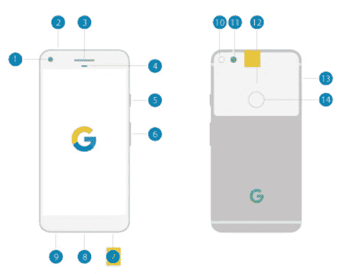
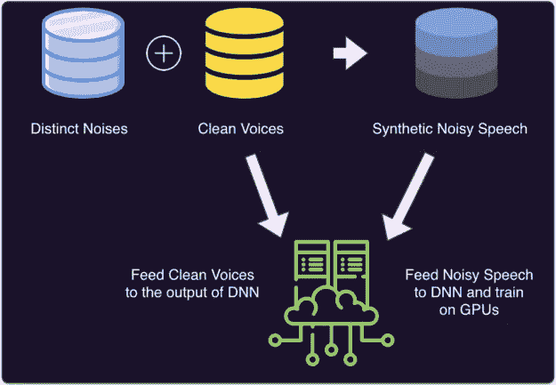
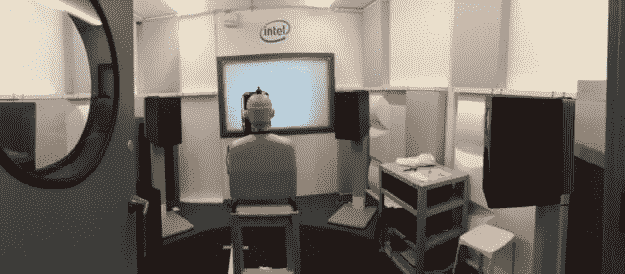
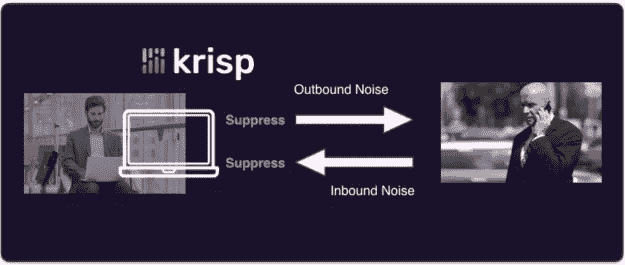

# 使用深度学习的实时噪声抑制

> 原文：<https://towardsdatascience.com/real-time-noise-suppression-using-deep-learning-38719819e051?source=collection_archive---------3----------------------->

## 基于最大似然的噪声抑制介绍

想象一下在机场等你的航班。突然，一个重要的商务电话点亮了你的手机。成吨的背景噪音扰乱了你周围的声景——背景噪音，飞机起飞，也许是航班通知。你必须接电话，你想听起来清楚。

我们都曾处于这种尴尬、不理想的境地。这只是现代商业的一部分。

背景噪音无处不在。而且很烦。

现在想象一下，当你接听电话并讲话时，噪音神奇地消失了，任何人在电话那头听到的都是你的声音。没有一丝噪音传进来。

这个愿景代表了我们在 [2Hz](https://2hz.ai/?utm_source=medium&utm_medium=tds) 的激情。让我们听听好的降噪带来了什么。

两年前，我们坐下来决定开发一种技术，可以完全消除人与人交流中的背景噪音，使交流更加愉快和清晰。从那以后，这个问题就成了我们的困扰。

让我们看看是什么让噪声抑制变得如此困难，构建实时低延迟噪声抑制系统需要什么，以及深度学习如何帮助我们将质量提升到一个新的水平。

# 噪声抑制的现状

我们先明确一下什么是噪声抑制。乍一看，这似乎令人困惑。

本文中的噪声抑制指的是抑制从*你的*背景传到你与之通话的人的噪声，以及从*他们的*背景传到你的噪声，如图 1 所示。

Figure 1\. Noise comes from both calling sides. Noise Suppression filters it out for both callers.

这与[主动噪音消除(ANC)](https://en.wikipedia.org/wiki/Active_noise_control) 形成对比，主动噪音消除是指抑制来自周围环境的有害噪音进入您的耳朵。主动噪声消除通常需要多麦克风耳机(如 Bose QuiteComfort)，如图 2 所示。

这篇文章关注的是噪声抑制，*不是*主动噪声消除。

# 噪声抑制的传统方法

传统的噪声抑制已经在边缘设备——电话、笔记本电脑、会议系统等——上得到有效实施。这似乎是一种直观的方法，因为它是首先捕获用户语音的边缘设备。一旦被捕获，设备就过滤掉噪音，并将结果发送给电话的另一端。

10 年前的手机通话体验相当糟糕。一些移动电话仍然是这种情况；然而，越来越多的现代手机配备了多个麦克风(mic)，有助于在通话时抑制环境噪音。

当代手机包括两个或更多麦克风，如图 2 所示，最新的 iPhones 有 4 个。第一个麦克风放置在通话时最靠近用户嘴巴的手机前底部，直接捕捉用户的声音。手机设计师将第二个话筒放在离第一个话筒尽可能远的地方，通常放在手机的背面上方。

Figure 2\. Pixel 2016\. The two mics are marked yellow

两个话筒都能捕捉周围的声音。离嘴越近的话筒捕捉到的声音能量越多；第二个捕捉到的声音更少。软件有效地将这些声音相减，产生(几乎)干净的声音。

这听起来很容易，但是这种技术在很多情况下都失败了。想象一下，当这个人不说话，所有的麦克风都是噪音。或者想象这个人在说话的时候主动摇晃/转动手机，就像在跑步一样。处理这些情况很棘手。

对于设备 OEM 和 ODM 而言，两个或更多麦克风还会使音频路径和声学设计变得非常困难和昂贵。音频/硬件/软件工程师不得不实施次优权衡，以支持工业设计和语音质量要求…

鉴于这些困难，今天的移动电话在适度嘈杂的环境中表现良好..现有的噪声抑制解决方案并不完美，但确实提供了改善的用户体验。

使用分离式麦克风时，外形会发挥作用，如图 3 所示。第一个和第二个话筒之间的距离必须满足最低要求。当用户把手机放在耳朵和嘴上说话时，它工作得很好。

Figure 3\. Necessary form factor for noise cancellation when using multi-mic arrays

然而，现代手机的“直板”外形可能不会长期存在。可穿戴设备(智能手表、胸前麦克风)、笔记本电脑、平板电脑和智能语音助手(如 Alexa)颠覆了平板直板手机的外形。用户从不同的角度和不同的距离与他们的设备对话。在大多数情况下，没有可行的解决方案。噪声抑制完全失败。

# 从多麦克风设计转向单麦克风设计

多麦克风设计有几个重要缺点。

*   它们需要特定的外形，因此仅适用于特定的使用情形，如带有粘性麦克风的电话或耳机(专为呼叫中心或入耳式监听系统设计)。
*   多话筒设计使音频路径变得复杂，需要更多硬件和代码。此外，为次级话筒钻孔会造成工业 ID 质量和产量问题。
*   只能在边缘或设备端处理音频。因此，由于低功率和计算要求，支持它的算法不可能非常复杂。

现在想象一个解决方案，您只需要一个麦克风，所有的后处理都由软件处理。这使得硬件设计更简单、更高效。

事实证明，在音频流中分离噪声和人类语音是一个具有挑战性的问题。这个函数没有高性能的算法。

传统的数字信号处理(DSP)算法试图通过逐帧处理音频来不断发现噪声模式并适应它。这些算法在某些用例中运行良好。然而，它们不能适应我们日常环境中存在的各种各样的噪音。

存在两种基本噪声类型:**平稳**和**非平稳**，如图 4 所示。

Figure 4\. Spectrogram of White Noise (stationary) and Chirp Noise (non-stationary)

把稳定的噪音想象成一种可重复但不同于人声的声音。当过滤这种噪声时，传统的 DSP 算法(自适应滤波器)可能相当有效。

非平稳噪声具有复杂的模式，很难与人的声音区分开来。信号可能很短，来去很快(例如键盘打字或警笛声)。参考这篇 [Quora 文章](https://www.quora.com/What-is-the-difference-between-stationary-and-non-stationary-environmental-noise)获得更多技术上正确的定义。

如果你想击败平稳和非平稳噪声，你需要超越传统的 DSP。在 2Hz，我们相信深度学习可以成为处理这些困难应用的重要工具。

# 利用深度学习分离背景噪声

一篇关于将深度学习应用于噪声抑制的基础论文似乎已经由 Yong Xu 在 2015 年写了[。](https://dl.acm.org/citation.cfm?id=2736113)

Yong 提出了一种回归方法，该方法学习为每个音频产生一个比率掩模。这种产生的比率遮罩应该会完整地保留人声，并删除外来的杂讯。虽然远非完美，但这是一个很好的早期方法。

在随后的几年里，许多不同的方法被提出来；高层次的方法几乎总是相同的，包括三个步骤，如图 5 所示:

1.  **数据收集**:通过混合干净语音和噪声，生成大数据集的合成噪声语音
2.  **训练**:将这个数据集输入给 DNN，输出给干净的语音
3.  **推断**:制作一个屏蔽(二元、比例或复合)，它将保留人声并过滤掉噪声

Figure 5\. Data Collection and Training Pipeline

在 2Hz 时，我们试验了不同的 DNN，并提出了我们独特的 DNN 架构，对各种噪声产生了显著的效果。平均 [MOS 得分](https://en.wikipedia.org/wiki/Mean_opinion_score)(平均意见得分)在嘈杂言论上上升 1.4 分，这是我们看到的最好结果。这一结果令人印象深刻，因为在单个麦克风上运行的传统 DSP 算法通常会降低 MOS 分数。

# 语音延迟。实时 DNN 可能吗？

低延迟在语音通信中至关重要。人类在交谈时可以忍受高达 200 毫秒的端到端延迟，否则我们在通话中会互相交谈。潜伏期越长，我们越注意到这一点，我们就变得越烦躁。

三个因素会影响端到端延迟:网络、计算和编解码器。通常网络延迟的影响最大。编解码器延迟范围在 5-80 毫秒之间，取决于编解码器及其模式，但现代编解码器已经变得非常高效。计算延迟实际上取决于许多因素。

计算延迟使 DNNs 面临挑战。如果您希望使用 DNN 处理每一帧，那么您将面临引入大量计算延迟的风险，这在现实部署中是不可接受的。

计算延迟取决于多种因素:

计算平台能力

在耳机中运行大型 DNN 不是你想做的事情。有 CPU 和电源的限制。实现实时处理速度是非常具有挑战性的，除非该平台有一个加速器，使矩阵乘法更快，功耗更低。

# DNN 建筑

DNN 的速度取决于您有多少超参数和 DNN 层以及您的节点运行什么操作。如果你想以最小的噪声产生高质量的音频，你的 DNN 不能很小。

例如， [Mozilla 的 rnnoise](https://github.com/xiph/rnnoise) 速度非常快，或许可以放入耳机中。然而，它的质量在非平稳噪声上并不令人印象深刻。

# 音频采样率

DNN 的性能取决于音频采样率。采样率越高，需要为 DNN 提供的超参数就越多。

相比之下， [Mozilla 的 rnnoise](https://github.com/xiph/rnnoise) 使用分组频率的频段，因此性能对采样率的依赖最小。虽然这是一个有趣的想法，但它对最终质量有负面影响。

[窄带](https://www.ligo.co.uk/blog/narrowband-wideband-telephony/)音频信号(8kHz 采样速率)质量较低，但我们的大部分通信仍在窄带中进行。这是因为大多数移动运营商的网络基础设施仍然使用窄带编解码器来编码和解码音频。

由于窄带每频率需要的数据较少，因此它可以作为实时 DNN 的一个很好的起始目标。但是，当您需要添加对宽带或超宽带(16kHz 或 22kHz)以及全频带(44.1 或 48kHz)的支持时，事情就变得非常困难了。如今，许多基于 VoIP 的应用程序都在使用宽带编解码器，有时甚至是全频带编解码器(开源的 Opus 编解码器支持所有模式)。

在一个简单的设计中，您的 DNN 可能需要它增长 64 倍，因此支持全频带会慢 64 倍。

# 如何测试噪声抑制算法？

测试语音增强的质量具有挑战性，因为你不能相信人耳。由于年龄、训练或其他因素，不同的人有不同的听力。不幸的是，没有公开和一致的噪声抑制基准，所以比较结果是有问题的。

大多数学术论文都是用 [PESQ](https://en.wikipedia.org/wiki/PESQ) 、 [MOS](https://en.wikipedia.org/wiki/Mean_opinion_score) 和 [STOI](https://ieeexplore.ieee.org/document/5495701/) 来比较结果。您向算法提供原始语音音频和失真音频，它会产生一个简单的度量分数。例如，PESQ 分数在-0.5 到 4.5 之间，其中 4.5 是完全干净的讲话。PESQ、MOS 和 STOI 并不是为评定噪音等级而设计的，所以你不能盲目信任它们。在你的过程中也必须有主观测试。

# ETSI 房间

进行主观音频测试并使其可重复的更专业的方法是满足由不同标准团体创建的此类测试的标准。

3GPP 电信组织定义了 ETSI 室的概念。如果你打算将你的算法部署到现实世界中，你的设备中必须有这样的设置。ETSI 室是构建可重复的和可靠的测试的一个很好的机制；图 6 显示了一个例子。

Figure 6\. Real ETSI room setup. Image from [Aqustica](http://Figure 8\. Real ETSI room setup. Image from http://aqustika.com/en/casestudies/etsi-room).

这个房间隔音效果极佳。它通常还包含一个人造人体躯干、一个在躯干内部模拟声音的人造嘴(扬声器)以及一个在预定距离的支持麦克风的目标设备。

这使得测试人员能够使用周围的扬声器模拟不同的噪声，播放来自“躯干扬声器”的声音，并在目标设备上捕获结果音频，然后应用您的算法。所有这些都可以编写脚本来自动化测试。

# 出站噪声与入站噪声

噪点抑制真的有很多[阴影](https://blog.krisp.ai/is_it_noise/?utm_source=medium&utm_medium=tds)。

假设你正在和你的团队参加一个电话会议。包括您在内，通话中有四个参与者。现在混合中可能有四种潜在噪声。每个人都把自己的背景噪音发给别人。

传统上，噪声抑制发生在边缘设备上，这意味着噪声抑制与麦克风绑定在一起。你从麦克风接收信号，抑制噪声，然后将信号发送到上游。

由于单麦克风 DNN 方法只需要一个单一的来源流，你可以把它放在任何地方。现在，假设您想要抑制来自所有参与者的麦克风信号(*出站噪声*)和进入扬声器的信号(*入站噪声*)。

我们构建了我们的应用程序， [Krisp](https://krisp.ai/?utm_source=medium&utm_medium=tds) ，明确地处理入站和出站噪声(图 7)。

Figure 7: Software noise suppression enables filtering both inbound and outbound noise

以下视频演示了如何使用 DNN 完全消除非平稳噪声。

对于入站噪声抑制，问题变得更加复杂。

您需要处理噪声抑制算法中不常见的声学和语音差异。例如，您的团队可能正在使用会议设备，并且坐在远离该设备的地方。这意味着到达设备的声音能量可能较低。或者他们可能在他们的汽车上用连接在仪表板上的 iPhone 给你打电话，这是一个固有的高噪声环境，由于距离扬声器较远，声音较低。在另一种情况下，可能会有多人同时发言，您希望保留所有的声音，而不是将其中的一些声音作为噪音抑制掉。

当您拨打 Skype 电话时，您会在扬声器中听到电话铃声。那个*响*到底是不是噪音？或者*等待音乐*是不是噪音？我将把那个留给你。

# 向云迁移

到目前为止，您应该对噪声抑制的艺术状态以及围绕用于此目的的实时深度学习算法的挑战有了坚实的想法。您还了解了使问题更具挑战性的关键延迟要求。噪声抑制算法增加的总延迟不能超过 20 毫秒，这确实是一个上限。

既然算法是完全基于软件的，那么它能移到云中吗，如图 8 所示？

Figure 8\. There are multiple benefits for doing noise suppression in the Cloud.

答案是肯定的。首先，基于云的噪声抑制适用于所有设备。其次，它可以在两条线路上执行(或者在电话会议中在多条线路上执行)。我们认为噪音抑制和其他语音增强技术可以转移到云上。这在过去是不可能的，因为需要多个麦克风。移动运营商已经制定了各种质量标准，设备原始设备制造商必须执行这些标准，以提供合适的质量水平，迄今为止的解决方案是多话筒。然而，深度学习使在支持单麦克风硬件的同时将噪声抑制放在云中的能力成为可能。

最大的挑战是算法的可扩展性。

# 使用 Nvidia GPUs 扩展 20 倍

如果我们希望这些算法能够扩展到足以服务真实的 VoIP 负载，我们需要了解它们的性能。

大型 VoIP 基础设施同时服务于 10K-100K 流。我们知道的一家 VoIP 服务提供商在一台裸机媒体服务器上提供 3000 个 G.711 呼叫流，这令人印象深刻。

有许多因素会影响像 FreeSWITCH 这样的媒体服务器可以同时提供多少音频流。一个明显的因素是服务器平台。与裸机优化部署相比，云部署的媒体服务器的性能明显较低，如图 9 所示。

Figure 9\. Average stream concurrency of cloud-hosted vs bare metal media servers

服务器端噪声抑制必须经济高效，否则没有客户愿意部署它。

我们的第一个 2Hz 实验是从 CPU 开始的。一个 CPU 内核可以处理多达 10 个并行流。这不是一个非常划算的解决方案。

然后，我们在 GPU 上运行实验，结果令人惊讶。单个 Nvidia 1080ti 可以在没有任何优化的情况下扩展到 1000 个流(图 10)。在正确的优化之后，我们看到了扩展到 3000 个流；更多是可能的。

Figure 10\. The DNN algorithm scales quite well on Nvidia 1080ti

包括处理流和编解码器解码在内的原始媒体服务器负载仍然发生在 CPU 上。使用 GPU 的另一个好处是能够简单地将外部 GPU 连接到您的媒体服务器机箱，并将噪声抑制处理完全卸载到其上，而不会影响标准音频处理管道。

# 使用 CUDA 进行配料

让我们来看看为什么 GPU 比 CPU 更好地扩展这类应用程序。

CPU 厂商传统上花费更多的时间和精力来优化和加速单线程架构。他们实现了算法、流程和技术来从单线程中获得尽可能高的速度。由于过去大多数应用程序只需要一个单线程，CPU 制造商有充分的理由开发最大化单线程应用程序的架构。

另一方面，GPU 供应商针对需要并行性的操作进行了优化。这源于 3D 图形处理的大规模并行需求。GPU 的设计使得它们的数千个小内核能够在高度并行的应用中很好地工作，包括矩阵乘法。

批处理是允许并行化 GPU 的概念。你把一批批的数据和操作发送给 GPU，它并行处理，然后发送回来。这是处理并发音频流的完美工具，如图 11 所示。

Figure 11\. This simplified diagram shows how batching can be used to process multiple audio frames concurrently on GPU

我们已经使用 NVIDIA 的 [CUDA 库](https://developer.nvidia.com/cuda-zone)直接在 NVIDIA GPUs 上运行我们的应用并执行批处理。

如果你想在你的 Mac 上尝试基于深度学习的噪音抑制——你可以用 [Krisp 应用](https://krisp.ai/?utm_source=medium&utm_medium=tds)来完成。

# 下一步是什么？

音频是一个令人兴奋的领域，噪声抑制只是我们在这个领域看到的问题之一。深度学习将实现新的音频体验，在 2Hz，我们坚信深度学习将改善我们的日常音频体验。查看[修复语音中断](https://blog.2hz.ai/2018/06/25/fixing-voice-breakups-with-deep-learning/)和[高清语音回放](https://blog.2hz.ai/2018/04/30/hd-voice-playback-with-deep-learning/)的博客帖子，了解此类体验。

> *声明:原本我已经以* [*客座博文*](https://devblogs.nvidia.com/nvidia-real-time-noise-suppression-deep-learning/) *的身份在 NVIDIA 开发者博客上发表了这篇文章。*