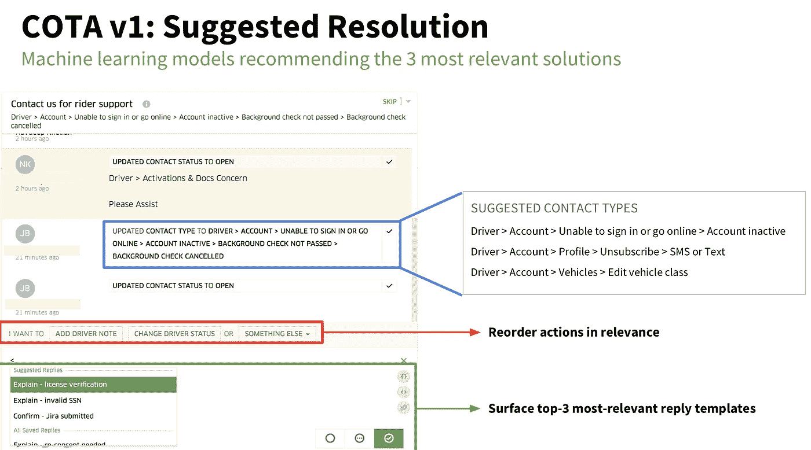
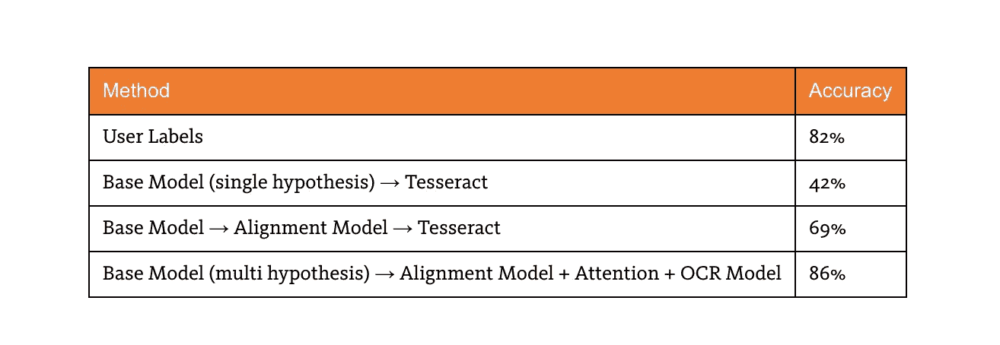

# 来自人工智能会议的应用机器学习的真实世界示例

> 原文：<https://towardsdatascience.com/real-world-examples-of-applied-machine-learning-from-ai-conference-4d4678700c6?source=collection_archive---------15----------------------->

## 了解像优步和 ZocDoc 这样的公司如何使用机器学习来提高关键业务指标

Ramping up for the keynotes at Strata Data Conference in New York — photo credit to the official [O’Reilly flickr site](https://www.flickr.com/photos/oreillyconf/albums/with/72157701019712905)

围绕机器学习和人工智能的大多数讨论都集中在计算机化的 Dota 游戏或真实的 T2 语音合成上。虽然这些领域很有吸引力，对该领域具有现实价值，**但对实用的机器学习和实现实际管道带来的挑战关注不够。**

> 由于不灵活的框架、缺乏可重复性、协作问题和不成熟的软件工具的挑战，机器学习团队仍然在努力利用 ML。

在过去的一个月里，我有机会参加了[奥莱利传媒](https://medium.com/u/fbfa235a954c?source=post_page-----4d4678700c6--------------------------------)的 [AI 会议](https://conferences.oreilly.com/artificial-intelligence/ai-ca)和[地层数据会议](https://conferences.oreilly.com/strata/strata-ny)。有这么多的会议和伟大的公司出席，总是很难选择参加哪些会议。有许多不同的方法(这里有一个来自缪斯[的很棒的指导手册](https://www.themuse.com/advice/a-conference-junkies-guide-to-attending-and-enjoying-conferences)，但是我个人**倾向于围绕应用机器学习的会议，涵盖实际的实现。**

**这些实用的 ML 演示很有价值，因为:**

*   演示者通常来自构建实际管道和处理特定需求的团队
*   内容诚实地讲述了失败的方法和团队经历的痛点，即使是在后来的迭代中
*   业务指标(如支持票烧毁率、客户满意度等)和机器学习模型之间有着真正的联系

**我在这两个会议上看到的最好的会议来自优步和 ZocDoc。**在这篇文章中，我将解释这些会议的关键收获，以及您的团队如何将这些经验融入到您自己的机器学习工作流程中。

# 会话深度潜水

优步和 ZocDoc 以自己的方式具有颠覆性，但两家公司都在使用机器学习作为竞争优势和改善用户体验的方法。

## 优步:利用自然语言处理和深度学习改善客户支持

仅在 2017 年就有超过 40 亿次乘坐，可以想象优步的支持系统需要可扩展。

在优步的支持下，机器学习团队希望通过推荐三个最相关的解决方案来专注于提高客户支持代表(CSR)的效率，这三个解决方案本质上是一个名为“客户痴迷票务助理”或 COTA 的“人在回路”模型架构。

优步大学的机器学习团队决定创建并比较两种不同的模型管道来实现规模支持:(1) COTA v1，它将多类分类任务转换为排序问题；(2)COTA v2，它使用了一种称为编码器-组合器-解码器的深度学习方法。

在 AI 大会上，来自优步团队的 Piero Molino、Huaixiu Zheng 和 Yi-Jia Wang 做了一项令人难以置信的工作，逐步展示了他们的模型架构以及他们的两种不同方法对收入和票务处理时间的影响。

 [## 利用自然语言处理和深度学习改善客户支持——人工…

### 优步已经实施了一个 ML 和 NLP 系统，该系统向其客户支持部门建议最可能的解决方案…

conferences.oreilly.com](https://conferences.oreilly.com/artificial-intelligence/ai-ca/public/schedule/detail/68612) 

皮耶罗非常友好地在这里 分享了他们演示的幻灯片 [**。**](http://w4nderlu.st/assets/javascript/ViewerJS/#http://w4nderlu.st/content/3-publications/cota-improving-the-speed-and-accuracy-of-customer-support-through-ranking-and-deep-networks/cota-o-reilly-ai-conference-2018.pdf)

> 你可以在皮耶罗的个人网站上看到更多他的作品:【http://w4nderlu.st/publications

Uber’s support UI with three suggested replies surfaced through the COTA models.

这两个模型都接收了机票、用户和旅行信息，为 CSR 建议机票分类和回复模板(答案)。

您可以在下图中看到这两种模型的架构。总而言之，COTA v1 随机森林模型将分类算法与逐点排序算法相结合，而 COTA v2 利用深度学习架构，可以通过优化几种不同类型的编码特征(文本、类别、数字和二进制)的损失来学习预测多个输出。该小组对每个模型进行了超参数搜索(用 COTA v1 进行网格搜索，用 COTA v2 进行平行随机搜索。

> 我强烈推荐阅读 [**他们的论文**](https://arxiv.org/abs/1807.01337) 以获得完整的细节和实现决策

From feature engineering to predictions, the Uber team maps out how they processed different inputs to populated suggested replies to the CSR team.

优步团队能够将他们的模型的影响与 A/B 测试(围绕 A/B 测试的良好资源 [**此处**](/data-science-you-need-to-know-a-b-testing-f2f12aff619a) )以及围绕他们的支持体验的客户调查进行比较。该团队最终发现，在他们的 A/B 测试中，COTA v2 比 COTA v1 准确 20–30%。COTA v2 还将处理时间减少了约 8%,而 COTA v2 减少了约 15%。虽然这两种方法都有助于提高客户满意度，但很明显，COTA v2 是冠军架构。

The Uber team set up an A/B test for both versions of COTA where COTA v2’s accuracy 20–30% higher than COTA v1’s ([Slide 23](http://w4nderlu.st/assets/javascript/ViewerJS/#http://w4nderlu.st/content/3-publications/cota-improving-the-speed-and-accuracy-of-customer-support-through-ranking-and-deep-networks/cota-o-reilly-ai-conference-2018.pdf) of 30)

优步的演讲展示了**如何将机器学习整合到客户支持等流程中是一个迭代过程。**他们必须测试不同的架构，还要围绕影响准确性的性能做出决策(考虑合理的错误)。

## Zocdoc:逆向工程你的人工智能原型和可复制性之路

> ZocDoc 是一种在线医疗保健预约服务，通过整合医疗实践和医生个人时间表的信息，为最终用户提供医疗保健搜索平台。

 [## 逆向工程你的人工智能原型和可复制性之路——人工智能…

### 在更好的软件、云基础设施和预训练网络的帮助下，人工智能模型变得更容易构建…

conferences.oreilly.com](https://conferences.oreilly.com/artificial-intelligence/ai-ca/public/schedule/detail/68656) 

ZocDoc 团队专注于用户旅程中非常特殊的部分:**根据医疗保险范围寻找网络内医生。**

对于 ZocDoc 的用户来说，找到一个网络内的医生可能意味着节省大量成本。通常情况下，如果您向网络内的医师或其他提供者就诊，您需要支付的费用将少于向网络外提供者就诊的费用([来源](https://www.ehealthinsurance.com/ehi/help/newhelpcenter?entry=faqId=HI1;categoryId=HI1-11;entryId=1))。

ZocDoc 团队建立了一个保险卡检查器，允许患者扫描他们保险卡的照片，然后从卡中提取相关细节，以检查特定医生和特定程序是否被覆盖。

**ZocDoc 的图像识别任务非常困难，因为:**

*   用户提交的图像通常具有较差的分辨率和变化的尺寸(由于缺乏格式约束),导致较差的训练数据质量
*   保险卡包含大量其他类型的信息，有时可能会重复成员 ID
*   该团队必须快速构建一个原型，然后将他们的流程转化为可重复的流水线

在人工智能大会上，ZocDoc 的 Brian Dalessandro(数据科学负责人)和克里斯·史密斯(高级首席软件工程师)通过他们模型架构的不同阶段概述了这些技术挑战(见下面的截图)。

会议中最有趣的部分是 Chris 描述团队出于可扩展性和可再现性的考虑，决定彻底拆除原型的基础设施。团队很难识别和跟踪关键的模型工件，例如使用的超参数、软件依赖性，以及迭代过程中的更多内容。

关于具体模型实现的更多细节，可以在这里 阅读 ZocDoc 关于这个项目 [**的原创博文**](https://www.zocdoc.com/about/blog/tech/making-sense-of-insurance-cards-using-deep-learning/)

ZocDoc’s MemberID extraction model architecture involved a base classification network, an alignment network, and an optical character recognition (OCR) model.

ZocDoc 团队最终能够通过他们的三部分模型管道超越 82%的基线准确性(用户报告的统计数据)!**然而，围绕数据和模型管理的体验，他们的旅程是一个不断迭代和挫折的旅程。**

ZocDoc 的演示令人印象深刻，因为它表明即使是用户体验的小调整也可以为客户带来巨大的价值，但也需要数据科学家的大量投资——正如引用他们的博客文章所表达的那样:

> “然而，我们很快就认识到，要达到适合生产级个人健康应用的质量，需要更多的独创性和反复试验，而不仅仅是简单地将开源组件串联起来。”

阿卡什·库沙尔

## 应对实际的 ML 挑战

来自优步和 ZocDoc 的这两个演示说明了机器学习在实践中如何不仅仅是使用最新的建模框架。想象一下，当 Chris 和 Brian 不得不重建他们的管道以准备生产，但意识到他们没有跟踪他们原型的度量、超参数或代码时，他们感到多么沮丧。

如今，有效的机器学习的最关键障碍之一是可重复性。重现性通过减少或消除重新运行过去的实验时的变化来实现稳健的模型。

> 在 [Comet.ml](http://www.comet.ml) ，我们允许数据科学团队自动跟踪他们的数据集、代码更改、实验历史和生产模型，从而提高效率、透明度和可重复性。

> 观看 Comet.ml 如何帮助成千上万的用户使他们的机器学习实验更加有效和可跟踪的快速视频:

> **对于纽约地区的人们，请在 10 月 4 日加入我们，了解 Precision Health AI 如何应用机器学习来检测癌症。**
> 
> 我们将邀请 PHAI 的客户服务总监、数据科学家和软件工程师来解释他们是如何构建丰富的 ML 管道的。 [**RSVP 此处**](https://www.meetup.com/NYC-Artificial-Intelligence-Machine-Learning/events/254407871/) **！**

## 想看更多应用机器学习的惊人例子？

*   **在 Airbnb 分类房源照片:**[https://medium . com/Airbnb-engineering/categoring-Listing-Photos-at-Airbnb-f 9483 F3 ab 7 e 3](https://medium.com/airbnb-engineering/categorizing-listing-photos-at-airbnb-f9483f3ab7e3)
*   **Spotify 怎么这么了解你？(发现周刊):**[https://medium . com/s/story/spotifys-Discover-Weekly-how-machine-learning-finds-your-new-music-19 a 41 ab 76 EFE](https://medium.com/s/story/spotifys-discover-weekly-how-machine-learning-finds-your-new-music-19a41ab76efe)
*   **缝合修复算法之旅**:[https://algorithms-tour.stitchfix.com/](https://algorithms-tour.stitchfix.com/)
*   [**ZestFinance for 承销**](https://conferences.oreilly.com/strata/strata-ca-2018/public/schedule/detail/63947)
*   来自 [Red Pixie](https://www.redpixie.com/blog/examples-of-machine-learning) 、[tech emergency](https://www.techemergence.com/everyday-examples-of-ai/)和 [ranee](https://medium.com/u/d755c7ceddd0?source=post_page-----4d4678700c6--------------------------------) 的[关于 ML x marketing](https://medium.com/@ranee/applied-machine-learning-the-future-of-marketing-859472150629) 的帖子的应用 ML 的更高层次概述

