# 使用深度学习以 98%的准确率识别交通标志

> 原文：<https://towardsdatascience.com/recognizing-traffic-signs-with-over-98-accuracy-using-deep-learning-86737aedc2ab?source=collection_archive---------0----------------------->


Stop Sign

*这是* [*Udacity 自动驾驶汽车工程师纳米学位*](https://www.udacity.com/course/self-driving-car-engineer-nanodegree--nd013) *第一学期的项目 2。你可以在*[*github*](https://github.com/kenshiro-o/CarND-Traffic-Sign-Classifier-Project)*上找到与这个项目相关的所有代码。你也可以阅读我关于项目 1 的帖子:* [*用计算机视觉检测车道线*](https://medium.com/computer-car/udacity-self-driving-car-nanodegree-project-1-finding-lane-lines-9cd6a846c58c) *只需点击链接。*

交通标志是道路基础设施不可或缺的一部分。它们为道路使用者提供关键信息，有时是令人信服的建议，这反过来要求他们调整自己的驾驶行为，以确保他们遵守目前实施的任何道路法规。如果没有这些有用的标志，我们很可能会面临更多的事故，因为司机不会得到关于他们可以安全行驶多快的关键反馈，或者关于道路施工、急转弯或前方学校路口的信息。在当今时代，每年大约有 130 万人死于交通事故。如果没有我们的路标，这个数字会高得多。
自然，自动驾驶汽车也必须遵守道路法规，因此*识别*和*理解*交通标志。

传统上，标准的[计算机视觉](https://en.wikipedia.org/wiki/Computer_vision)方法被用于检测和分类交通标志，但是这些需要大量和耗时的手工工作来手工制作图像中的重要特征。相反，通过对这个问题应用深度学习，我们创建了一个可靠地对交通标志进行分类的模型，通过*本身*学习识别最适合这个问题的特征。在这篇文章中，我展示了我们如何创建一个深度学习架构，该架构可以在测试集上以接近 98%的准确率识别交通标志。

# 项目设置

数据集分为训练集、测试集和验证集，具有以下特征:

*   图像为 32(宽)x 32(高)x 3 (RGB 颜色通道)
*   训练集由 34799 幅图像组成
*   验证集由 4410 幅图像组成
*   测试集由 12630 幅图像组成
*   共有 43 个等级(如限速 20 公里/小时、禁止进入、道路颠簸等。)

此外，我们将使用 Python 3.5 和 Tensorflow 来编写代码。

## 图像和分布

您可以在下面看到来自数据集的图像示例，标签显示在相应图像行的上方。他们中的一些很暗，所以我们将在稍后提高对比度。


Sample of Training Set Images With Labels Above

正如下面的直方图所示，训练集中的各个类之间也存在明显的不平衡。有些班级的图片不到 200 张，而有些班级的图片超过 2000 张。这意味着我们的模型可能*偏向*过度代表的类别，特别是当它的预测不确定的时候。我们将在后面看到如何使用数据扩充来减少这种差异。


Distribution of images in training set — not quite balanced

# 预处理步骤

我们首先对图像应用两个预处理步骤:

**灰度** 我们将 3 通道图像转换成一个单一的灰度图像(我们在项目 1 中做了同样的事情——车道线检测——你可以在这里[阅读我的博文](https://medium.com/computer-car/udacity-self-driving-car-nanodegree-project-1-finding-lane-lines-9cd6a846c58c))。

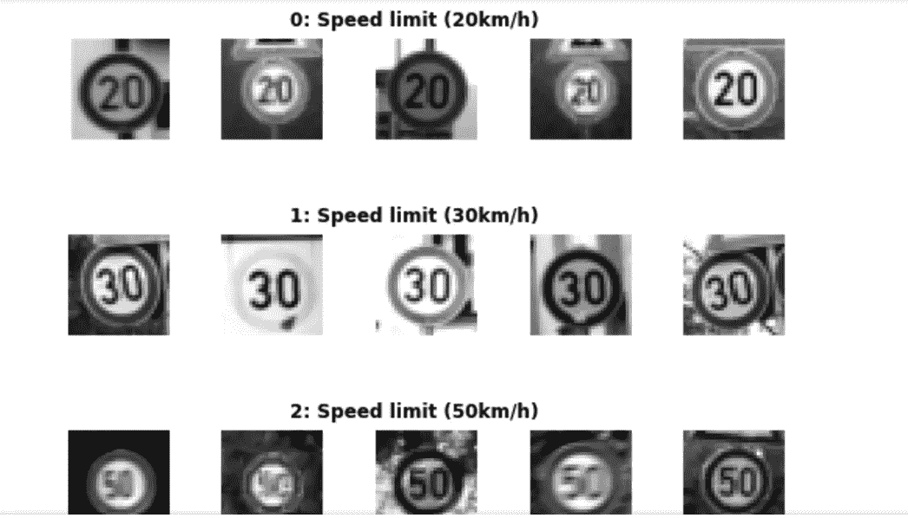

Sample Of Grayscale Training Set Images, with labels above

**图像标准化** 我们通过用数据集平均值减去每幅图像并除以其标准偏差来集中图像数据集的分布。这有助于我们的模型统一处理图像。生成的图像如下所示:

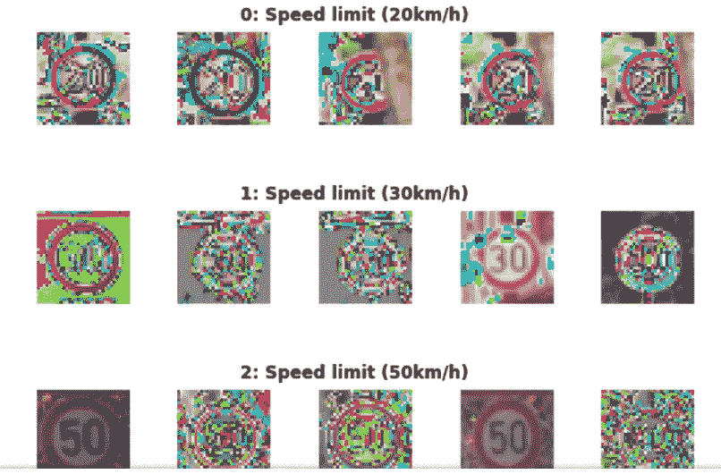

Normalised images — we can see how “noise” is distributed

# 模型架构

该建筑的设计灵感来自 Yann Le Cun 关于交通标志分类的[论文](http://yann.lecun.com/exdb/publis/pdf/sermanet-ijcnn-11.pdf)。我们添加了一些调整，并创建了一个模块化的代码库，允许我们尝试不同的滤波器大小、深度和卷积层数，以及完全连接层的尺寸。为了表达对乐存的敬意，并带着一点厚脸皮，我们把这样的网络叫做 ***EdLeNet*** :)。

我们主要尝试了 5x5 和 3x3 的过滤器(又名内核)大小，并从我们的第一个卷积层的深度 32 开始。 *EdLeNet* 的 3x3 架构如下图所示:


EdLeNet 3x3 Architecture

该网络由 3 个卷积层组成——内核大小为 3x3，下一层深度加倍——使用 [ReLU](https://en.wikipedia.org/wiki/Rectifier_(neural_networks)) 作为激活函数，每一层后面都有一个 2x2 最大池操作。最后 3 层完全连接，最后一层使用 [SoftMax](https://www.quora.com/Why-is-softmax-activate-function-called-softmax) 激活函数计算出 43 个结果(可能标签的总数)。使用带有 [Adam](https://www.quora.com/Can-you-explain-basic-intuition-behind-ADAM-a-method-for-stochastic-optimization) 优化器的小批量随机梯度下降来训练网络。我们构建了一个高度模块化的编码基础设施，使我们能够*动态*创建我们的模型，如以下代码片段所示:

```
mc_3x3 = ModelConfig(EdLeNet, "EdLeNet_Norm_Grayscale_3x3_Dropout_0.50", [32, 32, 1], [3, 32, 3], [120, 84], n_classes, [0.75, 0.5])
mc_5x5 = ModelConfig(EdLeNet, "EdLeNet_Norm_Grayscale_5x5_Dropout_0.50", [32, 32, 1], [5, 32, 2], [120, 84], n_classes, [0.75, 0.5])

me_g_norm_drpt_0_50_3x3 = ModelExecutor(mc_3x3)
me_g_norm_drpt_0_50_5x5 = ModelExecutor(mc_5x5)
```

`ModelConfig`包含关于模型的信息，例如:

*   模式功能(例如`EdLeNet`)
*   型号名称
*   输入格式(例如，灰度为[32，32，1])，
*   卷积层配置[滤波器大小，起始深度，层数]，
*   完全连接的层尺寸(例如[120，84])
*   班级数量
*   辍学保持百分比值[p-conv，p-fc]

`ModelExecutor`负责*训练*、*评估*、*预测*，并生成我们的*激活*地图的可视化。

为了更好地隔离我们的模型，并确保它们不都存在于同一个张量流图下，我们使用以下有用的构造:

```
self.graph = tf.Graph()
with self.graph.as_default() as g:
    with g.name_scope( self.model_config.name ) as scope:

...

with tf.Session(graph = self.graph) as sess:
```

这样，我们为每个型号的*创建单独的图表，确保没有混淆变量、占位符等。这让我省了很多麻烦。*

我们实际上从 16 的卷积深度开始，但是用 32 获得了更好的结果，所以决定用这个值。我们还比较了彩色图像与灰度图像、标准图像和标准化图像，发现灰度图像往往优于彩色图像。不幸的是，我们在 3x3 或 5x5 模型上勉强达到了 93%的测试集准确率，没有持续达到这个里程碑。此外，我们在给定数量的时期后，在验证集上观察到一些不稳定的损失行为，这实际上意味着我们的模型在训练集上过度拟合，而不是一般化。您可以在下面看到我们针对不同型号配置的一些指标图。

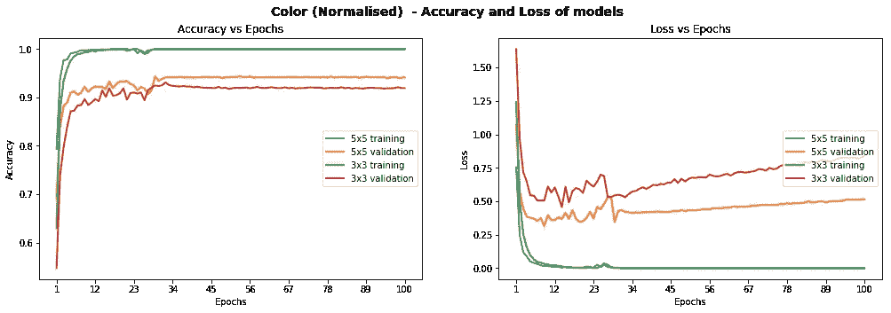

Models Performance on Color Normalised Images

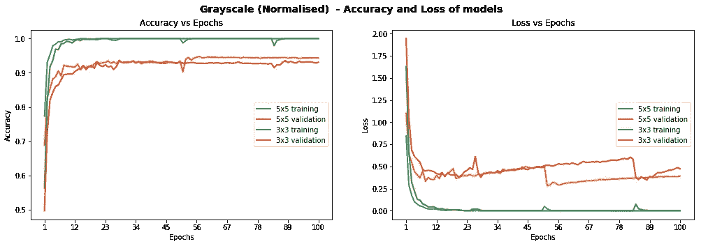

Models Performance On Grayscale Normalised Images

# 拒绝传统社会的人

为了提高模型的可靠性，我们转向了 dropout，这是一种正则化形式，其中权重以概率 *p* 保持:未接受的权重因此被“丢弃”。这可以防止模型过度拟合。辍学是由深度学习领域的先驱杰弗里·辛顿(Geoffrey Hinton)提出的。为了更好地理解作者背后的动机，他的团队在 T2 发表的关于这个主题的论文是必读的。生物学和进化论还有一个有趣的相似之处。
在论文中，作者根据图层类型应用了不同程度的辍学。因此，我决定采用一种类似的方法，定义两个等级的漏失，一个用于卷积层，另一个用于全连接层:

```
p-conv: probability of keeping weight in convolutional layer
p-fc: probability of keeping weight in fully connected layer
```

此外，随着他们在网络中的深入，作者逐渐采用了更积极(即更低)的辍学值。因此我也决定:

```
p-conv >= p-fc
```

也就是说，我们将在卷积层中以大于或等于全连接层的概率保持权重。对此的解释是，我们将网络视为一个漏斗，因此希望随着我们向更深的层次移动，逐渐*收紧*:我们不希望在开始时丢弃太多信息，因为其中一些信息非常有价值。此外，当我们在卷积层应用 [MaxPooling](https://www.quora.com/What-is-max-pooling-in-convolutional-neural-networks) 时，我们已经丢失了一些信息。

我们尝试了不同的参数，但最终确定了 *p-conv=0.75* 和 *p-fc=0.5* ，这使我们能够在 3x3 模型的标准化灰度图像上实现 97.55%的测试集准确度。有趣的是，我们在验证集上实现了超过 98.3%的准确率:

```
Training EdLeNet_Norm_Grayscale_3x3_Dropout_0.50 [epochs=100, batch_size=512]...

[1]	total=5.222s | train: time=3.139s, loss=3.4993, acc=0.1047 | val: time=2.083s, loss=3.5613, acc=0.1007
[10]	total=5.190s | train: time=3.122s, loss=0.2589, acc=0.9360 | val: time=2.067s, loss=0.3260, acc=0.8973
...
[90]	total=5.193s | train: time=3.120s, loss=0.0006, acc=0.9999 | val: time=2.074s, loss=0.0747, acc=0.9841
[100]	total=5.191s | train: time=3.123s, loss=0.0004, acc=1.0000 | val: time=2.068s, loss=0.0849, acc=0.9832
Model ./models/EdLeNet_Norm_Grayscale_3x3_Dropout_0.50.chkpt saved
[EdLeNet_Norm_Grayscale_3x3_Dropout_0.50 - Test Set]	time=0.686s, loss=0.1119, acc=0.9755
```

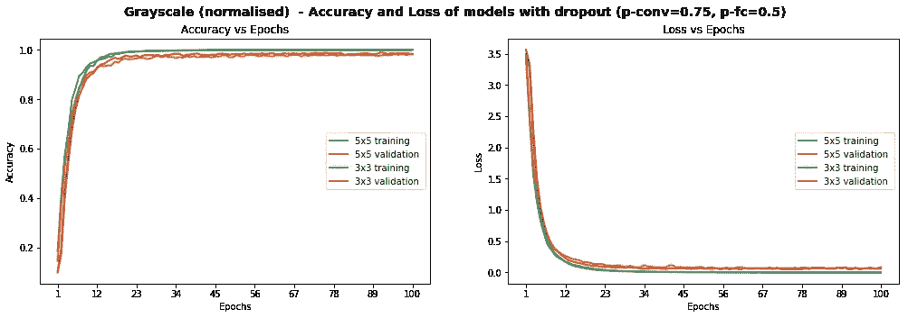

Models Performance on Grayscale Normalised Images, After The Introduction Of Dropout

上面的图表显示模型是*平滑的*，不像上面的一些图表。我们已经实现了在测试集上达到 93%以上准确率的目标，但是我们还能做得更好吗？请记住，有些图像是模糊的，每个班级的图像分布非常不均匀。我们将在下面探讨用于解决每个问题的其他技术。

# 直方图均衡

[直方图均衡化](https://en.wikipedia.org/wiki/Histogram_equalization)是一种计算机视觉技术，用于增加图像中的[对比度](https://en.wikipedia.org/wiki/Contrast_(vision))。由于我们的一些图像对比度低(模糊、黑暗)，我们将通过应用 OpenCV 的[对比度限制自适应直方图均衡](http://docs.opencv.org/3.0-beta/doc/py_tutorials/py_imgproc/py_histograms/py_histogram_equalization/py_histogram_equalization.html)(又名 CLAHE)功能来提高可视性。

我们再次尝试各种配置，并找到最佳结果，在 3x3 模型上使用以下压差值得到 97.75% 的**测试精度: *p-conv=0.6* ， *p-fc=0.5* 。**

```
Training EdLeNet_Grayscale_CLAHE_Norm_Take-2_3x3_Dropout_0.50 [epochs=500, batch_size=512]...[1]	total=5.194s | train: time=3.137s, loss=3.6254, acc=0.0662 | val: time=2.058s, loss=3.6405, acc=0.0655
[10]	total=5.155s | train: time=3.115s, loss=0.8645, acc=0.7121 | val: time=2.040s, loss=0.9159, acc=0.6819
...
[480]	total=5.149s | train: time=3.106s, loss=0.0009, acc=0.9998 | val: time=2.042s, loss=0.0355, acc=0.9884
[490]	total=5.148s | train: time=3.106s, loss=0.0007, acc=0.9998 | val: time=2.042s, loss=0.0390, acc=0.9884
[500]	total=5.148s | train: time=3.104s, loss=0.0006, acc=0.9999 | val: time=2.044s, loss=0.0420, acc=0.9862
Model ./models/EdLeNet_Grayscale_CLAHE_Norm_Take-2_3x3_Dropout_0.50.chkpt saved
[EdLeNet_Grayscale_CLAHE_Norm_Take-2_3x3_Dropout_0.50 - Test Set]	time=0.675s, loss=0.0890, acc=0.9775
```

我们在下面的图表中展示了我们测试 5x5 模型的 220 多个时期。我们可以看到一条更平滑的曲线，这加强了我们的直觉，即我们的模型更稳定。

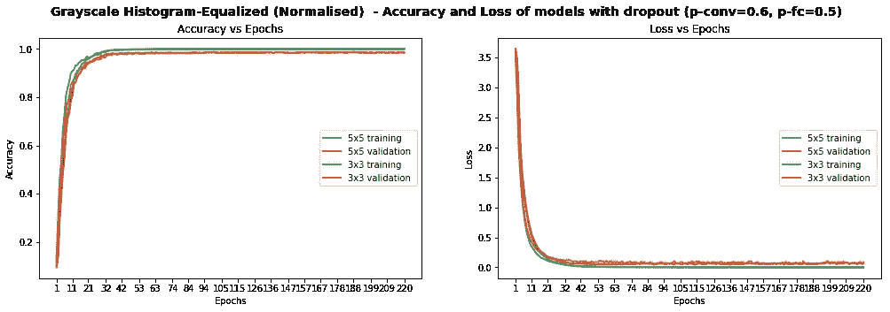

Models Performance On Grayscale Equalized Images, With Dropout

我们识别了 269 个模型不能正确识别的图像。我们在下面展示了 10 个随机选择的例子，来猜测为什么这个模型是错误的。


Sample of 10 images where our model got the predictions wrong

有些图像非常模糊，尽管我们的直方图均衡，而其他人似乎扭曲。在我们的测试集中，我们可能没有足够的这种图像的例子来改进我们的模型的预测。此外，虽然 97.75%的测试准确率非常好，但我们还有一张王牌:数据扩充。

# 数据扩充

我们之前观察到数据在 43 个班级中呈现出明显的不平衡。然而，这似乎不是一个严重的问题，因为我们能够达到非常高的精度，尽管阶级不平衡。我们还注意到测试集中的一些图像是扭曲的。因此，我们将使用数据增强技术来尝试:

1.  扩展数据集并提供不同照明设置和方向的附加图片
2.  提高模型变得更加通用的能力
3.  提高测试和验证的准确性，尤其是在失真图像上

我们使用一个叫做 [imgaug](https://github.com/aleju/imgaug) 的漂亮的库来创建我们的增强。我们主要应用[仿射变换](https://en.wikipedia.org/wiki/Affine_transformation)来放大图像。我们的代码如下所示:

```
def augment_imgs(imgs, p):
    """
    Performs a set of augmentations with with a probability p
    """
    augs =  iaa.SomeOf((2, 4),
          [
              iaa.Crop(px=(0, 4)), # crop images from each side by 0 to 4px (randomly chosen)
              iaa.Affine(scale={"x": (0.8, 1.2), "y": (0.8, 1.2)}),
              iaa.Affine(translate_percent={"x": (-0.2, 0.2), "y": (-0.2, 0.2)}),
              iaa.Affine(rotate=(-45, 45)), # rotate by -45 to +45 degrees)
              iaa.Affine(shear=(-10, 10)) # shear by -10 to +10 degrees
          ]) seq = iaa.Sequential([iaa.Sometimes(p, augs)])

    return seq.augment_images(imgs)
```

虽然类别不平衡可能会导致模型中的一些偏差，但我们决定在此阶段不解决它，因为它会导致我们的数据集显著膨胀，并延长我们的训练时间(我们在此阶段没有太多时间花在训练上)。相反，我们决定每个班级增加 10%。我们的新数据集如下所示。

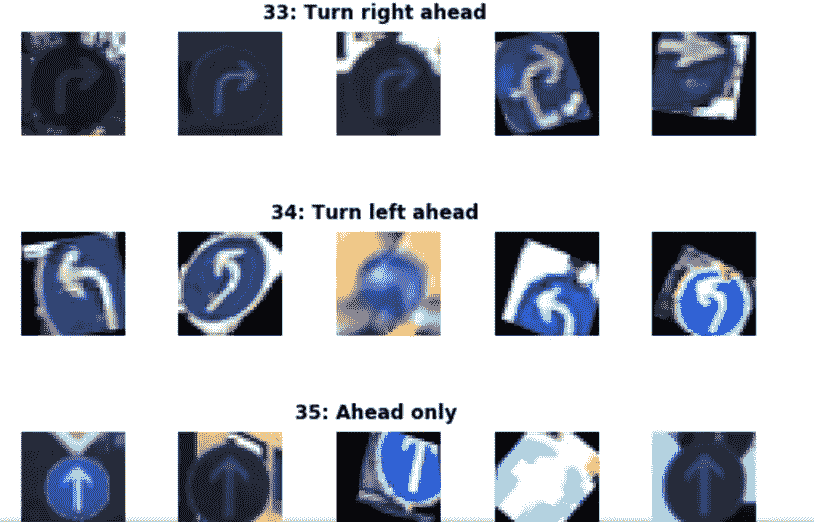

Sample Of Augmented Images

当然，图像的分布没有明显变化，但我们对图像进行了灰度、直方图均衡化和归一化预处理。我们训练了 2000 个有丢失的历元( *p-conv=0.6* ， *p-fc=0.5* )，在测试集上达到了 **97.86%的准确率**

```
[EdLeNet] Building neural network [conv layers=3, conv filter size=3, conv start depth=32, fc layers=2]
Training EdLeNet_Augs_Grayscale_CLAHE_Norm_Take4_Bis_3x3_Dropout_0.50 [epochs=2000, batch_size=512]...

[1]	total=5.824s | train: time=3.594s, loss=3.6283, acc=0.0797 | val: time=2.231s, loss=3.6463, acc=0.0687
...
[1970]	total=5.627s | train: time=3.408s, loss=0.0525, acc=0.9870 | val: time=2.219s, loss=0.0315, acc=0.9914
[1980]	total=5.627s | train: time=3.409s, loss=0.0530, acc=0.9862 | val: time=2.218s, loss=0.0309, acc=0.9902
[1990]	total=5.628s | train: time=3.412s, loss=0.0521, acc=0.9869 | val: time=2.216s, loss=0.0302, acc=0.9900
[2000]	total=5.632s | train: time=3.415s, loss=0.0521, acc=0.9869 | val: time=2.217s, loss=0.0311, acc=0.9902
Model ./models/EdLeNet_Augs_Grayscale_CLAHE_Norm_Take4_Bis_3x3_Dropout_0.50.chkpt saved[EdLeNet_Augs_Grayscale_CLAHE_Norm_Take4_Bis_3x3_Dropout_0.50 - Test Set]	time=0.678s, loss=0.0842, acc=0.9786
```

## 这是我们迄今为止最好的表现！！！

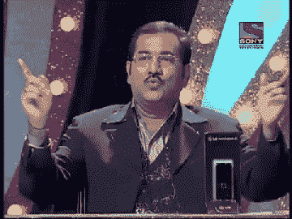

Neural Network Celebration

**但是** …如果你看看训练集上的损失度量，你可以看到在 0.0521，我们很可能还有一些回旋的空间。我们计划为更多的纪元进行训练，并将在未来报告我们的新结果。

# 测试新图像

我们决定也在新图像上测试我们的模型，以确保它确实比我们原始数据集中的交通标志更一般化。因此，我们下载了五张新图像，并提交给我们的模型进行预测。


Download 5 new traffic signs — color

图像的基本事实如下:

```
['Speed limit (120km/h)',
 'Priority road',
 'No vehicles',
 'Road work',
 'Vehicles over 3.5 metric tons prohibited']
```

选择这些图像的原因如下:

*   它们代表了我们目前分类的不同交通标志
*   它们的形状和颜色各不相同
*   它们处于不同的光照条件下(第四个有阳光反射)
*   它们处于不同的方向(第三个是倾斜的)
*   他们有不同的背景
*   最后一张图片实际上是一个设计，而不是真实的图片，我们想用它来测试模型
*   他们中的一些人在代表性不足的班级

我们采取的第一步是对这些新图像应用相同的 CLAHE，结果如下:


Download 5 new traffic signs — grayscale CLAHE

我们在新图像上达到了 100%的完美准确率。在原始测试集上，我们达到了 97.86%的准确率。我们可以探索模糊/扭曲我们的新图像或修改对比度，看看模型在未来如何处理这些变化。

```
new_img_grayscale_norm_pred_acc = np.sum(new_img_lbs == preds) / len(preds)
print("[Grayscale Normalised] Predictional accuracy on new images: {0}%".format(new_img_grayscale_norm_pred_acc * 100))
...
[Grayscale Normalised] Predictional accuracy on new images: 100.0%
```

我们还显示了为每个图像计算的前 5 个 SoftMax 概率，绿色条显示了基本事实。我们可以清楚地看到，我们的模型对其预测相当有信心。在最坏的情况下(最后一幅图像)，第二个最可能的预测的概率约为 0.1%。事实上，我们的模型在最后一张图片上挣扎得最厉害，我相信这实际上是一个设计，甚至不是一张真实的图片。总的来说，我们开发了一个强大的模型！

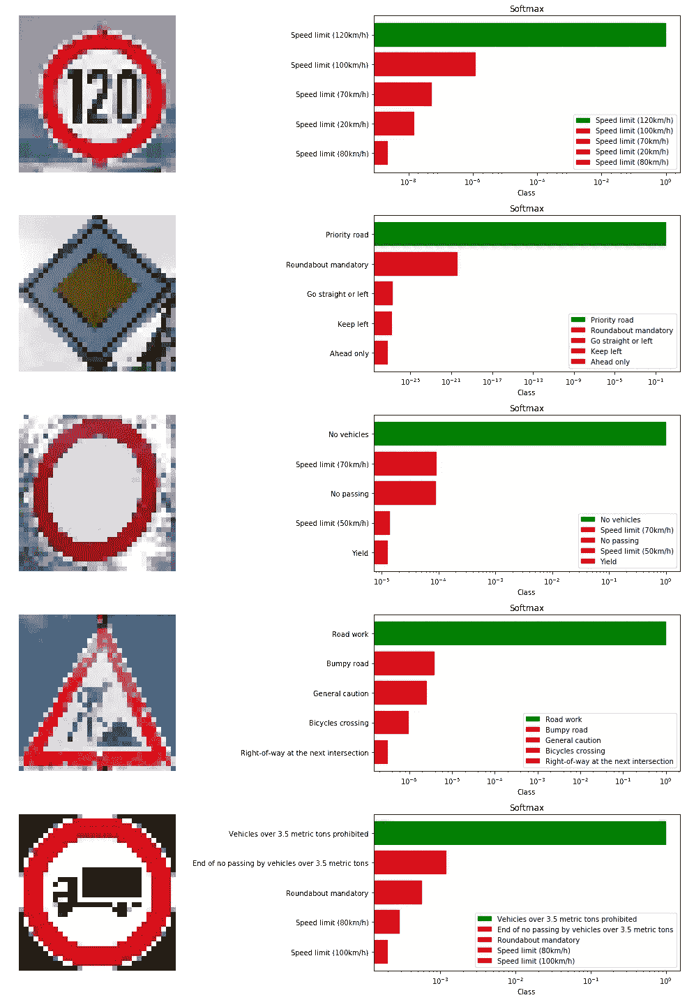

Visualizations of The Model’s Top 5 Predictions

# 可视化我们的激活地图

我们在下面展示了每个卷积层产生的结果(在最大池化之前)，产生了 3 个[激活图](https://www.quora.com/What-is-meant-by-feature-maps-in-convolutional-neural-networks)。

## **第一层**

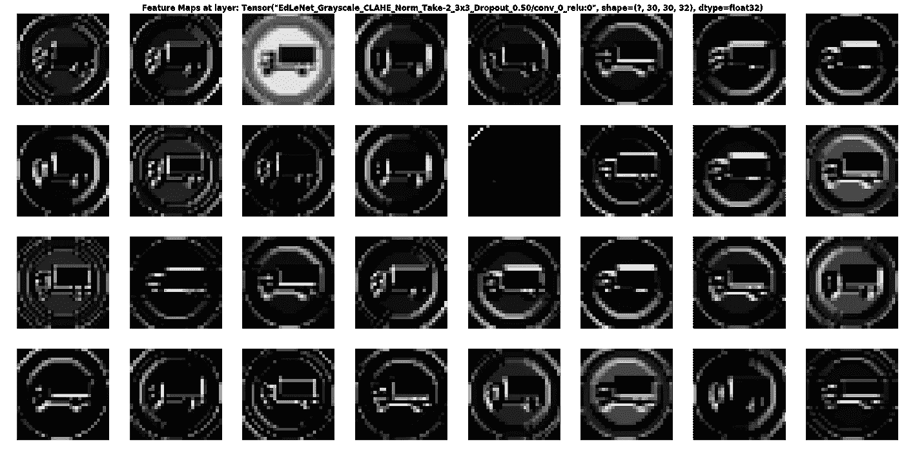

我们可以看到这个网络把很多注意力集中在圆圈的边缘，以及卡车上。背景大多被忽略。

## 第二层

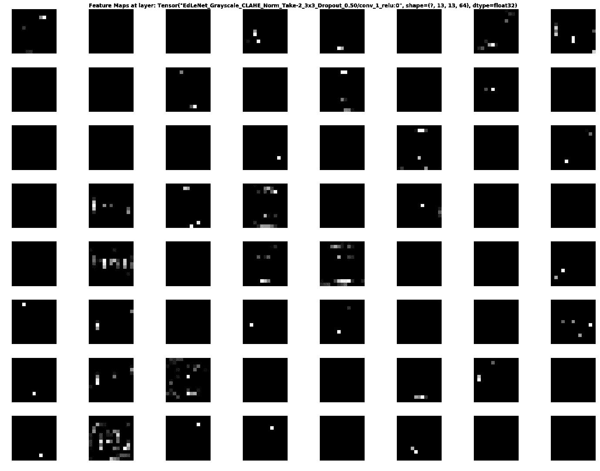

Activation Map Of Second Convolutional Layer

很难确定网络在第 2 层关注的是什么，但它似乎在圆圈的边缘和中间(卡车出现的地方)激活。

**第三层**

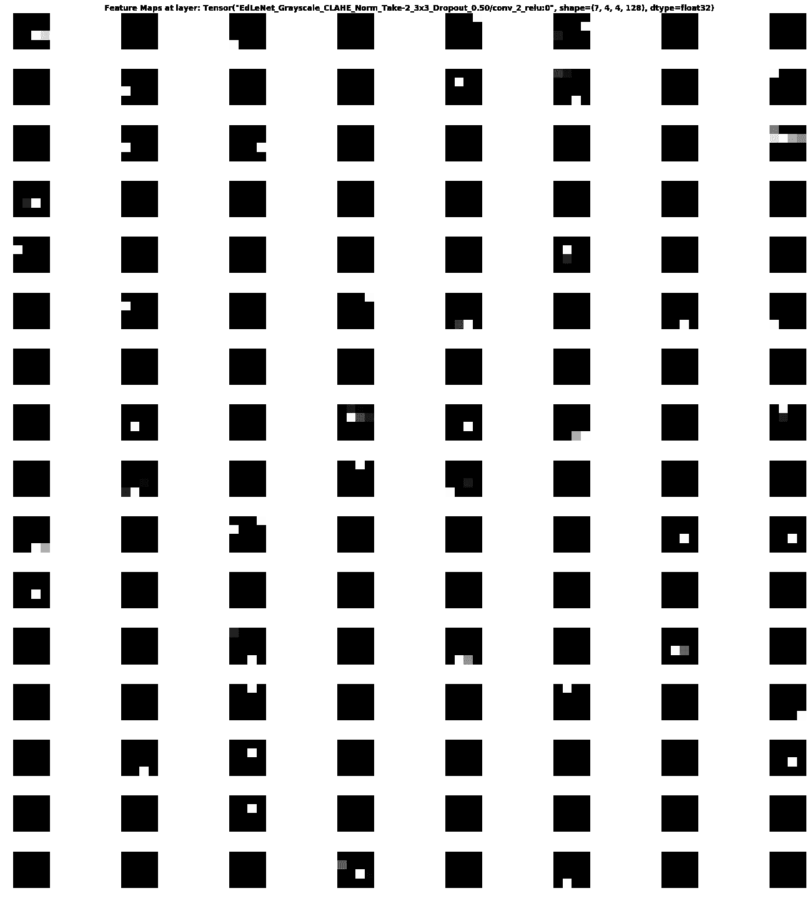

这个激活图也很难解读…但是看起来网络对边缘和中间的刺激有反应。

# 结论

我们介绍了如何使用深度学习对交通标志进行高精度分类，采用各种预处理和正则化技术(例如 dropout)，并尝试不同的模型架构。我们构建了高度可配置的代码，并开发了评估多种架构的灵活方法。我们的模型在测试集上达到了接近 98%的准确率，在验证集上达到了 99%。

就个人而言，我非常喜欢这个项目，并获得了使用 Tensorflow、matplotlib 和研究人工神经网络架构的实践经验。此外，我深入研究了该领域的一些开创性论文，这些论文加强了我的理解，更重要的是完善了我对深度学习的直觉。

在未来，我相信通过应用进一步的规范化技术，如[批处理规范化](https://www.quora.com/In-layman%E2%80%99s-terms-what-is-batch-normalisation-what-does-it-do-and-why-does-it-work-so-well)，以及采用更现代的架构，如 [GoogLeNet 的初始模块](https://arxiv.org/abs/1409.4842)、 [ResNet](https://arxiv.org/abs/1512.03385) 或 [Xception](https://arxiv.org/abs/1610.02357) ，可以实现更高的准确性。

*感谢阅读这篇文章。希望你觉得有用。我现在正在创建一个名为*[*env sion*](https://envsion.io)*的新公司！在 EnVsion，我们正在为 UX 的研究人员和产品团队创建一个中央存储库，以从他们的用户采访视频中挖掘见解。当然我们用人工智能来做这个。).*

*如果你是一名 UX 的研究人员或产品经理，对与用户和客户的视频通话感到不知所措，那么 EnVsion 就是为你准备的！*

*你也可以关注我的* [*推特*](https://twitter.com/Ed_Forson) *。*