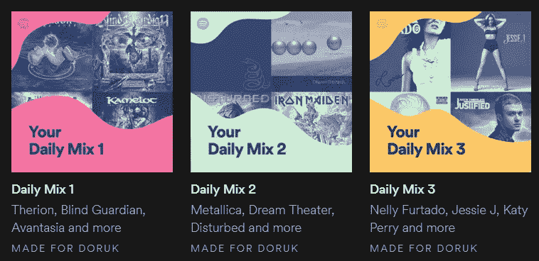
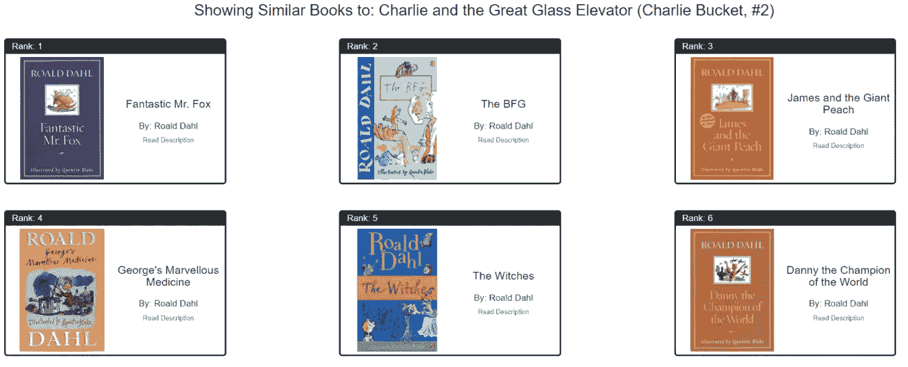
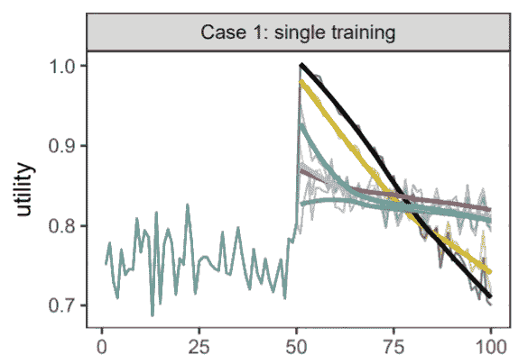
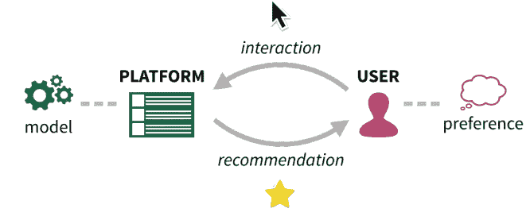

# 推荐系统:从过滤泡沫到意外收获

> 原文：<https://towardsdatascience.com/recommender-systems-from-filter-bubble-to-serendipity-4131930a738e?source=collection_archive---------14----------------------->

推荐系统为我们在互联网上看到的内容的日常互动提供了动力。随着每天创建超过 2.5 万亿字节的数据，仅过去两年就占了全球数据的 90%[1]。我们生产的内容是不可能在一生中消费的，这使得推荐系统不可避免。然而，正如本叔叔所说，权力越大，责任越大。在这里，我谈谈推荐系统引发的一些实践和伦理问题，以及我们如何着手解决这些问题。

# 推荐系统是做什么的？

推荐系统处于脸书、亚马逊、Spotify 等内容服务网站的最前沿。与用户互动。据说亚马逊网站 35%的收入是由其推荐引擎产生的[2]。在这种环境下，网站的目标是尽可能提供最好的个性化内容，这一点至关重要。

# 用户想要什么

作为一个超级推荐系统极客，每当我看到一个好的推荐系统时，我总是感到惊喜。我对消费大量内容感兴趣(我也是这样)，但是一天中没有足够的时间让我亲自浏览所有可供我消费的内容。我希望推荐系统能够理解我在那一刻真正想读/听/消费的内容，甚至在我不知道自己想要什么的时候。

My beautiful Spotify generated playlists

过去，当内容可供您使用时(无论是通过搜索结果，还是通过其他方式搜索可用内容，如前 100 名列表)，您必须使用某种过滤来缩小结果范围。这种过滤通常采用更长、更明确的搜索词、日期限制(包括和排除某些标签)等形式。

那些日子已经过去了。

作为一名用户，我**希望**能帮助我整理网站上的所有内容。我**相信**当我在谷歌上搜索`std::list`时，我会找到[相关链接](https://www.reddit.com/r/ProgrammerHumor/comments/9llazt/thanks_google_thats_exactly_what_i_wanted/?st=JMWQC8HO&sh=1946cc99)。与许多人相反，我也喜欢个性化广告。如果这些个性化广告真的让我意识到我正在失去生活中的一些重要物品，我会很乐意购买。然而，这也不意味着我喜欢看到同样的红木椅子跟随我在 12 个不同的网站上，仅仅因为我在 2003 年看过一把椅子。

听起来像被宠坏了吗？也许吧。但这就是我们现在生活的环境。当生成的内容呈指数级增长时，这是我们保持高效的唯一方法。

# 公司想要什么

如上所述，推荐系统为世界上许多主要品牌创造了大量收入。对某些人来说，这是用户与产品交互的最前端和最中心的方式(例如:脸书的新闻订阅)。对于其他人来说，它可能通过个性化(例如:谷歌的搜索引擎)来补充产品的核心功能，或者可能是尽可能长时间保持用户参与的一种方式(例如:YouTube 的 up next 功能)。

无论你如何定义它，企业就是企业，它们被不同于消费者的目标所驱动。改善客户体验对所有企业来说都是至关重要的，对于基于 web 的企业来说，这通常会导致试图使每个用户的体验更加个性化，从而产生对推荐系统的需求。

到目前为止一切顺利，对吧？

让我们仔细看看一个普通的网站如何利用推荐来改善用户体验:

1.  X 公司意识到，他们生成的内容比一个人能够互动的内容要多。此外，他们的竞争对手正在使用个性化，以便他们的用户可以更容易地访问相关内容。
2.  X 公司尝试个性化他们的搜索结果。他们选择一种可靠的方法，如矩阵分解，并利用他们的历史数据来训练模型。
3.  试验取得了巨大的成功！A/B 测试显示收入增长了 4%，他们的月活跃用户增长了 13%！
4.  X 公司在他们的个性化方面投入了更多的资源。多个数据科学家正在致力于实现更好的机器学习模型，随着他们获取越来越多的数据，这些模型对他们的历史数据的执行越来越好。
5.  他们将验证自动化，这样他们就可以以任何组合设置特定的收入/用户/转化率/其他 KPI 目标，并尝试使用 A/B/n 测试来优化它，这种测试会自动整合任何新的机器学习模型，不断提高推荐的质量，同时实现越来越好的目标。

[image credit](https://www.oxfordcollegeofprocurementandsupply.com/procurement-performance-kpis)

这确实是梦寐以求的场景。您拥有可以为您的机器学习模型提供一些训练目标(损失函数)和测试目标的历史数据点，即使您知道它们不一定是推荐系统真实世界价值的良好指标，您也有 A/B 测试来优化真实世界的结果。这里的一切都可以定量分析。

嗯，期待推荐的“质量”。说到这里，你怎么定义推荐的质量呢？

# 推荐系统应该做什么？

如前所述，这种方法存在一些实践和伦理问题。

在像谷歌这样的庞然大物的背景下，推荐系统有能力影响我们社会的结构，不幸的是，我们还没有理解它如何影响社会的全部含义。很明显，谷歌为互联网上的大量信息流动提供了便利，因此被谷歌切断联系是一件大事。但是，当谈到量化这种信息流的影响时，我们被难住了。

这并不意味着我们不能思考推荐*应该是什么样子的*，也不能讨论推荐的一些重要概念。请记住，所有这些概念都是依赖于产品的:你必须选择它是与你相关还是与你的客户相关。

# 访问相关内容

这是显而易见的，但是为了完整起见，这是一个不应该被忽略的领域。如果你有一个推荐系统，你要确保它推荐的内容与用户相关。如果我只看奇幻类的书，那么我得到的推荐应该主要是偏向奇幻类的。这并不意味着我不喜欢偶尔的动作片或非小说类的推荐，但是我不应该看到我的推荐被这样的类型所主导。

这种推荐的罪魁祸首之一是推荐的协同过滤方法。继续这本书的例子，如果在其余的幻想读者中有一个占主导地位的第二类型，即使你不想消费它，协同过滤也会向你推荐这个类型。更糟糕的是，如果推荐系统依赖于明确的评分(1-5)，你通常*不得不*消费并给它评分，以摆脱这样的推荐。

解决这个问题的一种方法是使用一种混合模式，这种模式也利用基于内容的推荐，这是我们为 [Books2Rec](https://dorukkilitcioglu.github.io/2018/05/14/introducing-books2rec.html) 采用的解决方案。这样，您可以平衡协同过滤和内容相似性。

# 平衡收益递减

收益递减是计量经济学和心理学中一个广为人知的概念。这个概念很简单:你拥有的东西越多，你想要的就越少。

举个个人的例子，我真的很喜欢听一首歌，直到我厌倦他们，或者痛饮朋友，直到我根本无法处理罗斯和瑞秋之间的另一场争吵。

[image credit](https://media3.giphy.com/media/ubpB6XcvpYMF2/giphy.gif)

当然，这似乎与之前获得相关推荐的概念相违背；这将达到收益递减点。这里的关键是时间:你可能会厌倦在一次访问网站时看到相同类型的推荐(基于你的历史数据)，但当你一周后回来时，你不想从远离你的历史数据的某个地方开始。

推荐系统通常区分历史推荐和上下文(基于会话的)推荐。历史推荐器利用你的全部历史数据来找到你想看的下一个节目，而上下文推荐器会查看你当前的会话(就像你在 Spotify/YouTube 会话的最后一个小时)，并预测现在最适合你的节目*。*

*当然，这两个系统不是一成不变的，肯定会有重叠，而合适的推荐系统介于两者之间。情境模型在机会成本低、快速消费可行的情况下效果最佳。收益递减也是情境模型的一个更大的问题。*

# *长期回报*

*一般来说，推荐者的另一个问题是最佳推荐优先策略。想象一个推荐系统，它可以完全捕捉你在一个视频中的价值，并向你推荐你将会观看的最好的 5 个视频。*

*当你消费完最好的内容后会发生什么？*

*推荐系统会继续向你推荐相同的*类型*的内容，但是因为你已经消费了最好的，所以它们中的每一个都会比上一个**差**。*

> *如果做得太好，推荐系统会减少你未来的享受。*

**

*what happens when no new content is added to a website, [image credit](https://arxiv.org/abs/1710.11214)*

*当然，现在每天都有大量的内容产生，很有可能对你来说最好的内容还没有产生。但事实是，对你来说，前 N 名内容(或对普通大众来说，前 N 名内容)是一个很难进入的列表，通过分隔最佳内容，你可能会获得更好的整体享受。*

*另一种思考方式是，我们应该把我们的建议的长期回报最大化作为目标。以这种方式，很容易将强化学习与 MDP(马尔可夫决策过程)和土匪等算法进行类比，特别是在探索与利用方面。毫无疑问，我们可以看到近年来人们对推荐系统的强化学习产生了浓厚的兴趣。*

# *过滤气泡*

*前一种情况的另一个结果是一种被称为过滤器泡沫的现象。过滤气泡是由伊莱·帕里泽(Eli Pariser)创造的，并因他的同名书籍而闻名。过滤气泡是指你被困在一个气泡中，只有个性化算法(过滤器)认为你会喜欢的信息才能通过。随着你给系统越来越多的数据，你的泡泡变得越来越小，成为利基中的利基。你被困在一个正反馈循环中，无法逃脱。*

**

*[image credit](https://www.smithsonianmag.com/innovation/have-scientists-found-a-way-to-pop-the-filter-bubble-180948265/)*

*这不仅会因为没有显示您可能喜欢的内容而限制您的选择，随着时间的推移，它会使您的兴趣趋于一致，从而导致您对不同类型的内容失去兴趣，这又会减少您的选择。更糟糕的是，因为回报递减，你开始越来越不喜欢推荐给你的内容。*

*不过，一切并没有失去。作为推荐系统的设计者，即使我们不能可靠地解决这个问题，我们也可以给用户一条出路。这并不需要太花哨——即使是一个不偏不倚的**和**去个性化的**搜索系统也可能给用户足够的工具来获取他们过滤泡沫之外的内容。即使您依赖隐式评级，用户也可以随着时间的推移将推荐转移到更多样化的地方。***

***注:一个与政治联系更紧密的相关术语是[回音室](https://en.wikipedia.org/wiki/Echo_chamber_(media))，它与人们与志趣相投的人的互动以及越来越相信他们的想法是正确的有更多的关系。我不会掩盖这一点。***

# ***多样化***

***多元化是我们对抗过滤泡沫和收益递减效应的一种方式。不幸的是，它不是推荐系统的自然副产品；相反，我们必须为此而努力。***

******

***My YouTube recommendations***

***我观察到，根据用户口味的多样性，他们可以大致分为两类:***

***社交用户是你的典型用户，他们有一些松散定义的流派偏好，但对消费排名前 N 名的项目感到满足。如果某个内容很受欢迎，并且/或者已经被他们的朋友分享了，他们也想消费它。如果将它们的味道分布建模为高斯混合模型，则它们会有浅峰和大量重叠。***

***超级用户更关心消费他们最关心的内容。与社交用户相比，他们的数量较少，但他们仍占相当大的一部分。这些用户中的一些人一开始就有各种各样的兴趣。根据高斯混合模型，它们会有很高的峰值，中间会有很多死区。***

***保持和培养这些不同的兴趣符合我们的最佳利益。一些研究人员明确地模拟了这些口味[3]，而另一些人则试图更有机地学习它们。正如稍后将解释的那样，即使对有高度特定兴趣的用户来说，强制使用某种多样性可能仍然符合您的最佳利益。***

> ****通过优化平均值，您最终会牺牲超级用户所依赖的高保真度推荐。****

***多样性的问题在于，很难准确衡量一组建议的多样性。在最近一集的 TWiML AI 中，Pinterest 数据科学家 Ahsan Ashraf 谈到了一套准则，你可以用它来检查任何推荐系统的健全性——多样性度量对:***

1.  ***稳定性:当我们给一个推荐系统相同主题/类型的项目时，它是否收敛到那个主题，导致推荐系统“过度适应”那个主题？收敛速度有多快？这些建议的差异有多大？***
2.  ***灵敏度:假设你有两个题目 *A* 和 *B* ，从 A*A*的 100 项开始。随着您从 *B* 添加越来越多的项目，这些建议是否涵盖了整个范围(从 *B* 的一小部分到所有 *B* s)？你的多样性是在 50:50 的比例下最大化，在 100:0 和 0:100 下最小化吗？***
3.  ***理智:完全随机的推荐比用户的平均推荐更多样化吗？特定主题列表的多样性是否低于给用户的平均建议？***

# ***意外收获***

***从多样性向前迈了一步，我们来到了意外收获的概念，这是在没有寻找的时候发现了一些有价值或有益的东西，一个快乐的巧合。它是找到让你震撼的东西。***

***我喜欢把意外收获分成两类:立即的和最终的。即时的意外收获，嗯，立即发生。你走在街上，不知道为什么，你抬头一看，看到了帝国大厦。***

******

***最终的意外收获(这可能是一个误称，但我还没有找到一个更好的名称来形容它)是当你回顾你的生活，并意识到一个随机事件引导你踏上了塑造你的一部分的旅程。***

***为了认识到意外收获的重要性，想想那个让你发现你最喜欢的艺术家或你最好的朋友的偶然事件，或者当你意识到这就是你一直在寻找的一切的那一刻。***

***如果我们作为推荐系统的设计者能够促成这一事件，那不是很好吗？***

***从分析的角度来看，我们可以用一个代理来代表实际的意外收获(这是很难量化的),用户听说过该项目的概率很低，而用户喜欢该项目的概率很高。然后，问题变成了计算这两个概率，我们可以使用任何数量的方法来近似。***

***当然，这种代理并不理想，目前正在进行研究，试图找出一种更好的方法来解决这个问题。我们知道的一件事是，我们需要某种多样性或随机性来促进这一点。***

***显然，这使得某些问题比其他问题更容易解决。歌曲推荐比书籍推荐更容易实验。这是由于经济学家所谓的“机会成本”。每次你与某物互动时，你选择不与他人互动。在音乐中，如果你全神贯注地听这首歌，你可能会损失 4 分钟的时间，你甚至可以选择跳过它。多亏了音乐流媒体服务，你可能不需要额外付费就能接触到这些内容。***

***然而，一本书是一项长期投资。你可能要花 100 页才能意识到这本书并不适合你，到那时你可能已经花了几个小时和 10 美元来买这本书。因此，重要的是(平均而言)在做书籍推荐时要比音乐推荐更保守。***

# ***算法混淆的案例研究***

***普林斯顿大学的研究人员最近发表的一篇论文[4]讨论了推荐系统产生的反馈回路的进一步影响。更具体地说，他们研究了当模型试图捕捉用户偏好时发生的混淆，而没有考虑到用户面临的选择也是由模型产生的这一事实，从而削弱了推荐对用户行为的因果影响。***

******

***[image credit](https://arxiv.org/abs/1710.11214)***

***该文件提出的主要主张如下:***

1.  ***并非所有算法都受益于使用混杂数据(即，作为推荐系统的结果而生成的数据)的再训练。***
2.  ***使用混淆的数据来评估模型会偏向于将数据向适合算法的方向移动，从而创建不应该存在于底层数据中的反馈循环。***
3.  ***先前的反馈循环使单个用户和整个用户群都变得一致。***

***在不涉及细节的情况下，研究人员模拟了被推荐项目的用户之间的现实交互序列，推荐系统获得这些交互的结果，并使用该数据和随着时间的推移引入的新项目更新其推荐。***

***研究人员表明，就总效用而言，使用混杂数据在基于内容的模型和社会(基于信任)模型中效果最好，但在与矩阵分解模型一起使用时没有明显优势。此外，他们表明，与使用不同模型生成的混杂数据相比，使用同一模型生成的混杂数据评估模型会导致分数的更大提高。***

***因此，用混杂的数据评估你的模型可能会夸大你的模型的性能。***

***对于用于研究的公开可用数据集来说，这也是一个令人担忧的情况，这些数据集本身可能由于用于创建数据的推荐系统而被混淆，因此可能对某些类型的模型有隐藏的偏见。***

***研究人员还测量了同质化对总效用的影响，声称同质化是好的，因为它意味着模型正在学习底层模式，但也可能阻止发现可能对用户有益的新项目。***

***他们发现，对于除随机模型之外的所有 4 种方法，均一化(捕获为下图的 y 轴)与总效用(x 轴)负相关，根据定义，随机模型不依赖于任何模型。***

******

***[image credit](https://arxiv.org/abs/1710.11214)***

***因此，重要的是，我们要尽可能地保持我们的建议的多样性，但同时，要用对用户有意义的建议来平衡它们。同样，我们可以用强化学习方法来类比探索/利用问题。如果我们真的想达到最好的结果，我们需要找到正确的平衡并努力保持它。***

# ***结论***

***由于学术界和工业界越来越多的关注，我们今天有很多工具来提供建议，并且对我们的工具有了更好的理解。然而，在构建推荐系统时，我们还没有完全理解我们的选择的后果。天下没有免费的午餐，我们的选择总会有后果，即使我们无法立即看到。***

***我希望这篇文章能让你对如果你想给用户最好的体验，你需要留意什么有一些大概的了解。作为推荐系统的设计者，我们有能力影响什么能到达用户，什么不能。明智地使用这一权力取决于我们。***

# ***参考***

***1. [Domo —数据从不睡觉](https://www.domo.com/learn/data-never-sleeps-5?aid=ogsm072517_1&sf100871281=1)
2。[麦肯锡](http://www.mckinsey.com/industries/retail/our-insights/how-retailers-can-keep-up-with-consumers)
3。[代表不同兴趣用户的混合口味模型](https://arxiv.org/abs/1711.08379)
4。[推荐系统中的算法混杂如何提高同质性并降低效用](https://arxiv.org/abs/1710.11214)***

****原载于 2018 年 10 月 9 日*[*dorukkilitcioglu . github . io*](https://dorukkilitcioglu.github.io/2018/10/09/recommender-filter-serendipity.html)*。****