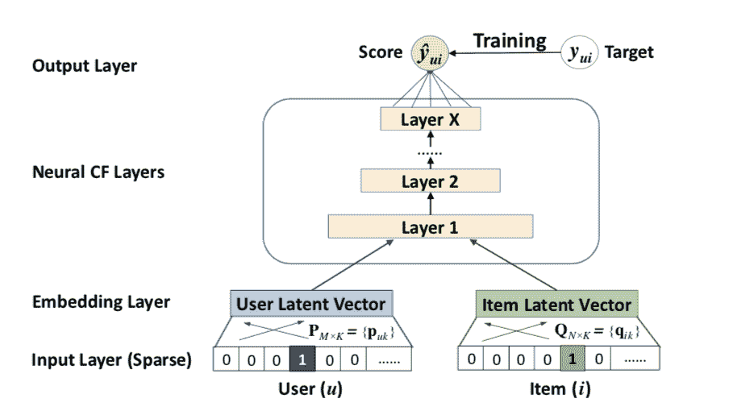

# PyTorch 中使用深度学习的推荐系统

> 原文：<https://towardsdatascience.com/recommender-systems-using-deep-learning-in-pytorch-from-scratch-f661b8f391d7?source=collection_archive---------11----------------------->

Photo by [Susan Yin](https://unsplash.com/@syinq?utm_source=medium&utm_medium=referral) on [Unsplash](https://unsplash.com?utm_source=medium&utm_medium=referral)

推荐系统(RS)已经存在很长时间了，最近深度学习的进展使它们更加令人兴奋。矩阵分解算法一直是 RS 的主力。在本文中，我假设您对基于协同过滤的方法略知一二，并具备在 PyTorch 中训练神经网络的基本知识。

在这篇文章中，我的目标是向您展示如何从头开始在 PyTorch 中实现 RS。这篇文章中提出的理论和模型在这篇[论文](https://www.comp.nus.edu.sg/~xiangnan/papers/ncf.pdf)中可用。这里是本文的 [GitHub 库](https://github.com/HarshdeepGupta/recommender_pytorch)。

# 问题定义

给定用户过去看过的电影记录，我们将构建一个推荐系统，帮助用户发现他们感兴趣的电影。

具体来说，给定 **< userID，itemID >** 出现对，我们需要为每个用户生成电影的排序列表。

我们将问题建模为 [**二元分类问题**](https://en.wikipedia.org/wiki/Binary_classification) **，**其中我们学习一个函数来预测特定用户是否会喜欢特定的电影。

Our model will learn this mapping

# 资料组

我们使用 MovieLens 100K 数据集，该数据集有来自 1000 个用户对 1700 部电影的 100，000 个评级。数据集可以从[这里](https://grouplens.org/datasets/movielens/100k/)下载。

评级以 **< userID、itemID、评级、时间戳>** 元组的形式给我们。每个用户至少有 20 个评级。

# 培养

我们放弃评级 *(1，2，3，4，5)* 的确切值，而是将其转换为隐式场景，即任何积极的互动都被赋予值 1。默认情况下，所有其他交互的值为零。

因为我们正在训练一个分类器，所以我们需要正样本和负样本。数据集中存在的记录被计为阳性样本。我们假设用户-项目交互矩阵中的所有条目都是负样本(一个强假设，并且容易实现)。

对于用户交互的每个项目，我们随机抽取 4 个没有被用户交互的项目。这样，如果一个用户有 20 次正面互动，他将有 80 次负面互动。这些负面交互不能包含用户的任何正面交互，尽管由于随机抽样，它们可能不都是唯一的。

# 估价

我们随机抽取 100 个没有被用户交互的项目，在这 100 个项目中对测试项目进行排序。这篇文章也采用了同样的策略，这也是这篇文章的灵感来源。我们在 10 处截断排名列表。

由于为每个用户排列所有项目太耗时，因为我们将不得不计算 1000*1700 个~10⁶值。采用这种策略，我们需要 1000*100 ~ 10⁵值，少了一个数量级。

对于每个用户，我们使用测试集中的最新评级(根据时间戳)，其余的用于训练。这种评估方法也称为留一策略，与参考文件中使用的方法相同。

# 韵律学

我们使用命中率(HR)和归一化折扣累积收益(NDCG)来评估 RS 的性能。

我们的模型为给定用户的测试集中出现的每个项目给出 0 到 1 之间的置信度得分。这些项目按得分降序排列，前 10 项作为推荐。如果测试项目(每个用户只有一个)出现在这个列表中，那么这个用户的 HR 就是 1，否则就是 0。在对所有用户进行平均后，报告最终 HR。对 NDCG 也进行了类似的计算。

训练时，我们将最小化交叉熵损失，这是分类问题的标准损失函数。RS 的真正优势在于给出用户最有可能与之交互的前 k 个项目的排序列表。想想为什么你大多只在第一页点击谷歌搜索结果，从来不去其他页面。像 NDCG 和人力资源这样的指标通过显示我们排名列表的质量来帮助捕捉这一现象。这里很好的介绍了[评价推荐系统](http://fastml.com/evaluating-recommender-systems/)。

## 基线:项目流行度模型

基线模型是我们用来为问题提供第一步、简单、不复杂的解决方案的模型。在推荐系统的许多用例中，向所有用户推荐相同的最受欢迎的项目列表给出了一个难以超越的基线。

在 GitHub 存储库中，您还可以从头开始找到实现项目流行度模型的代码。以下是基线模型的结果。

## 基于深度学习的模型

有了神经网络所有花哨的架构和行话，我们的目标是击败这个项目流行模型。

我们的下一个模型是深度多层感知器(MLP)。模型的输入是 userID 和 itemID，它们被送入嵌入层。因此，每个用户和项目都有一个嵌入。之后是多个致密层，接着是一个具有 s 形激活的单个神经元。确切的模型定义可以在文件 [MLP.py](https://github.com/HarshdeepGupta/recommender_pytorch/blob/master/MLP.py) 中找到。

乙状结肠神经元的输出可以被解释为用户可能与物品交互的概率。有趣的是，我们最终训练了一个用于推荐任务的分类器。

Figure 2: The architecture for Neural Collaborative Filtering

我们的损失函数是二元交叉熵损失。我们使用 Adam 进行梯度下降，使用 L-2 范数进行正则化。

# 结果

对于基于流行度的模型，训练时间少于 5 秒，以下是得分:

HR = 0.4221 | NDCG = 0.2269

对于深度学习模型，我们在近 30 个时期的训练(在 CPU 上约 3 分钟)后获得了这些结果:

HR = 0.6013 | NDCG = 0.3294

结果令人振奋。我们关心的指标有了巨大的飞跃。根据 HR，我们观察到误差减少了 **30%,这是巨大的减少。这些数字是从非常粗略的超参数调谐中获得的。通过超参数优化仍有可能提取更多汁液。**

# 结论

使用神经网络可以很容易地复制矩阵分解的最先进算法，以及更多。从非神经的角度来看，请阅读这篇关于推荐系统的[矩阵分解的精彩文章。](/paper-summary-matrix-factorization-techniques-for-recommender-systems-82d1a7ace74)

在这篇文章中，我们看到了神经网络如何提供一种构建推荐系统的简单方法。诀窍是把推荐问题想成一个分类问题。我们在 PyTorch 中实现了一个推荐系统。我们将我们的结果与非个性化基线算法进行了比较，观察到了显著的收益。

为了获得更深入的理解，我鼓励你阅读原文(链接如下)并前往 [GitHub 知识库](https://github.com/HarshdeepGupta/recommender_pytorch)阅读这篇文章。

# 参考资料:

1.  该论文还链接到作者在 Keras 中的实现:[https://www.comp.nus.edu.sg/~xiangnan/papers/ncf.pdf](https://www.comp.nus.edu.sg/~xiangnan/papers/ncf.pdf)