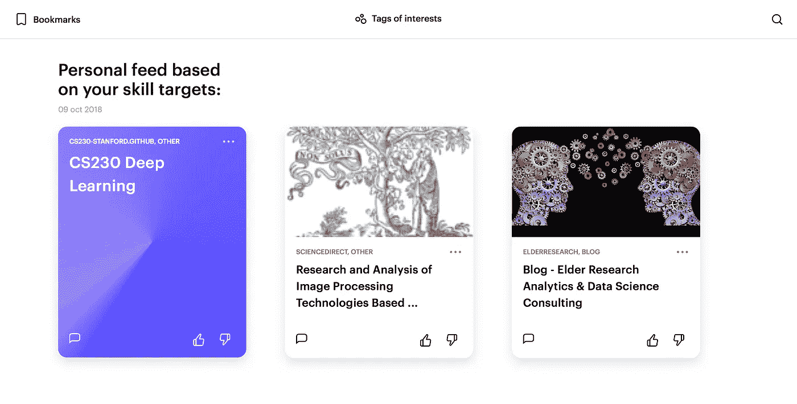
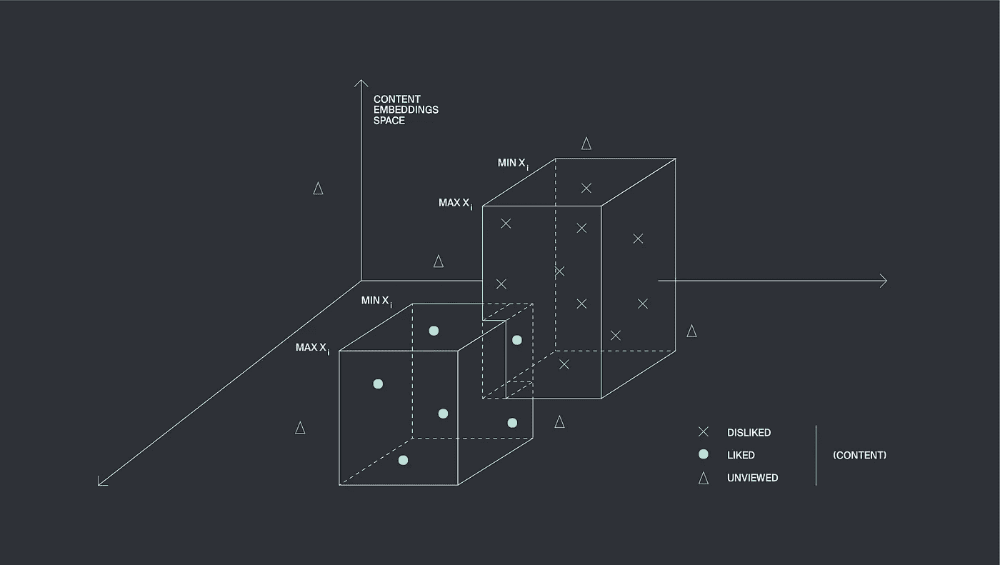
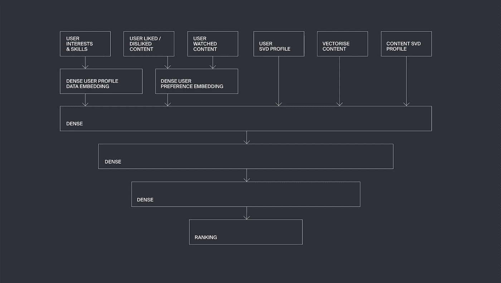

# 具有深度学习架构的推荐系统

> 原文：<https://towardsdatascience.com/recommender-systems-with-deep-learning-architectures-1adf4eb0f7a6?source=collection_archive---------4----------------------->

iki daily feed screenshot

**这篇文章解决了构建基于深度学习的推荐系统的一般问题。本文中描述的特定架构是为** [**iki 服务**](https://about.iki.ai) **的新智能馈送供电的架构，每天推送您的技能——要检查其性能，请尝试** [**产品测试版**](https://app.iki.ai/) **。**

如果你对推荐系统的一般概念和主流方法很熟悉，并且想直接了解我们解决方案的细节，请跳过本文的前两部分。

# 介绍

推荐系统改变了我们与许多服务互动的方式。他们提供的不是静态数据，而是互动体验，可以选择留下你的反馈，并对给你的信息进行个性化处理。推荐系统独立地为每个用户创建个性化信息流，但是也考虑服务的所有用户的行为。

用户通常不可能通过检查在线影院中的电影、在线商店中的消费品或任何其他内容中的每一个来在各种给定选项中进行选择。如果服务中有大量内容，用户会面临信息过载的问题。解决这个问题的方法之一是利用有针对性的建议。

目标内容扮演重要角色的服务的一个例子是 iki。iki 是您的个人职业生涯和专业顾问，由机器学习和人工智能相关技术提供动力。在用户定义了他的专业兴趣领域之后，iki 在具有下述深度学习架构的推荐系统的帮助下，创建每日内容提要，开发知识和选择的技能。

# 推荐系统问题设置概述

任何推荐系统中存在的主要对象是用户 U、项目 R 以及它们之间的一些交互。这些交互通常以矩阵 F(|U|x |R|)的形式呈现，每个单元格包含一些关于交互的信息——某个商品被浏览/购买的事实、给定的评分、喜欢/不喜欢或其他信息。根据系统中用户和项目的数量，F 矩阵可以变得非常大。但是每个用户通常给出一些评级或者仅与系统中的一小部分项目交互，这导致非常稀疏的评级矩阵。众所周知，可以减少稀疏模型的独立参数的数量，而不会显著损失信息。我们遇到了在推荐系统中正确表示评价数据的问题:我们必须借助于具有固定长度 n 的向量将每个用户映射到某个向量空间，F 矩阵的 n<奇异值分解，这给出了两个具有形状|U| x n 和 n x |R|的矩阵，对于给定的 n，它们的乘积是矩阵 F 的最佳近似。让我们把这些向量相应地称为用户和项目的“SVD 嵌入”。

推荐系统中产生预测**的**传统方法**是** **协同过滤**。这种方法的主要假设是，过去对某些项目给出相似评级的用户将来倾向于对其他项目给出相似的评级。解决协同过滤问题的最流行的方法之一是利用初始稀疏评级矩阵 f 的 SVD 创建用户和项目的密集嵌入。为了预测用户 u 对项目 I 的新评级值，我们必须计算相应用户和项目的 SVD 嵌入的标量积。

有几个开放库提供了基于用户评级矩阵构建各种推荐系统的工具。其中，我们可以列举各种矩阵分解方法(SVD，非负矩阵分解 NMF) *、*最近邻算法的不同变体、协同聚类方法、基于用户和基于项目的模型。这种解决方案的例子有[惊喜库](http://surpriselib.com/)和 [LightFM 库](https://github.com/lyst/lightfm)。

在推荐系统中，除了用户与项目的交互信息之外，通常还有一些其他数据分别描述用户和项目。这些数据可能是变化的和异构的——项目和用户可能包含一些文本描述、数字特征、分类特征、图像和其他类型的数据。处理和使用该数据的方式取决于特定的问题，并且不是推荐系统的通用部分。

> 推荐系统的 **主要**属性或**度量是**推荐**相关性**和**可扩展性**在用户或项目数量非常大的情况下。该设置带来了由两个连续**块** : **候选生成器**和**排序模块**组成的通用**推荐系统架构，候选生成器从大项目集中选择相对较小的子集，排序模块**对所选子集中的每个项目给出与用户兴趣相关的等级。此评级通常用于按照用户看到的顺序排列项目。

# 深度学习驱动的推荐系统架构

具有深度学习架构的基于内容的推荐系统与系统中存在的实际内容密切相关。接下来，我们将深入 iki 推荐系统的细节来描述 DL 方法。

在 iki 中，用户与内容的交互是视图和评级——用户可以喜欢或不喜欢任何内容元素。在我们的例子中，一个条目是一个包含博客、文章、教程、课程或其他提供专业知识的内容的网页。每个内容元素都有文本描述或者本身就是文本。

内容嵌入是文本矢量化过程的结果。我们使用具有 300 个维度的[手套语言模型](https://nlp.stanford.edu/projects/glove/)来对单独的单词进行矢量化。GloVe 是斯坦福大学开发的语言模型，类似于 word2vec(保留单词的语义相似性)。不同之处在于，除了保留语义手套之外，还利用了统计方法，考虑了文本语料库中出现的单词数量。

我们统计文本语料库中所有出现的单词的 tf-idf 权重，然后计算内容元素对应的向量，作为该内容元素中单词的手套向量与 tf-idf 权重的加权和。

用户可以向他的简档添加一些关于他当前和过去工作的信息(例如职位名称和每个工作的描述)。我们的系统处理这些数据，并使用专门开发的特殊语言模型[技能提取器](/deep-learning-for-specific-information-extraction-from-unstructured-texts-12c5b9dceada)提取每个用户的专业技能列表。简而言之，该模型的思想是在英语简历的语料库上学习“技能”的语义，并能够从非结构化的英语文本中提取以前未见过的技能。用户也可以手动添加一些技能。为了调整内容提要，用户必须在我们的分层标签云上选择一些专业兴趣领域，类似于苹果音乐机制。iki 提供了数百种专业兴趣作为用户内容提要的一部分。在推荐系统中，用户的技能和选择的标签被用作用户特征。

iki recommender system architecture

用于训练我们的推荐系统的另一组特征是在将 SVD 应用于用户评级矩阵之后获得的内容和用户嵌入。这不是关于系统中的评级和观看的信息的唯一用途——我们创建用户的向量表示来描述他的观看和评级的内容。这是通过以下方式实现的:拥有内容的向量表示让我们取用户观看内容的整个语料库上每个坐标的最小值、最大值和平均值。这个操作产生了三个与内容嵌入长度相同的向量。我们对喜欢和不喜欢的内容集执行相同的操作，获得具有相同长度的另外 6 个向量。在推荐系统的训练步骤中，这些密集嵌入也被用作用户的特征。

User’s liked, disliked and viewed content in content vector space depicted as a 3D space for simplicity

# 候选人生成

对于每个标签(内容主题)，我们的推荐系统创建一个单独的推荐集，特别是选择一个候选子集进行进一步排名。**iki 推荐系统的目标不仅是提供相应主题的内容，还根据质量和专业水平对内容元素进行排序，以使结果提要符合每个用户的专业水平**。

让我们更深入地了解候选人生成步骤的细节。对于每个标签，我们的系统在以下机制的帮助下选择用于排序的候选:选择最近已经接收到特定用户的正面评级的内容元素，并且将这些选择的内容元素周围的内容元素集合(我们取内容嵌入空间中的几个邻域的并集)添加到候选空间中。我们还考虑在所选标签上具有相似最近活动的用户集合(为这组用户计算评级和观看向量之间的余弦距离)。最近观看或评级的内容元素的集合也被添加到候选集合中。所描述的邻域半径的变化提供了不同数量的生成候选。

# 候选人排名

对于每个标签，单独的神经网络实例被训练并用于内容候选排序。每个神经网络实例被训练，然后用于在对应于该标签的内容子集上进行排名。排名网络将关于内容元素和用户的一些数据作为输入，并输出 1 和-1 之间的某个数字作为用于内容元素的最终排名的预测评级。该模型在给定评级和视图的集合上被训练；集合中的每个样本由一个用户和一个内容元素组成，目标值为 1 表示喜欢，-1 表示不喜欢，如果用户只是查看了内容而没有给出任何评级，则为 0。

iki ranking neural net architecture

排名网络有 6 个不同维度的输入。第一个输入获取关于用户选择的标签和他的技能的信息，该信息被转换成嵌入在下一层中的密集用户简档。该信息允许系统在对与特定兴趣相对应的内容进行排名时考虑特定用户的其他兴趣(标签)。iki 中的标签数量有限，因此关于它们的信息用固定长度的二进制编码向量进行编码(1 用于选定的标签，0 用于其余的标签)。

用 SkillsExtractor 从用户简历中提取的技能可能变化很大，所以我们从统计上对它们进行标准化，以消除真正罕见的短语，最终得到一个固定长度的集合。然后，我们用与标签相同的二进制方式对技能进行矢量化。在定期推荐系统训练期间，我们更新实际的技能集。

接下来的两个输入采用我们之前描述过的用户向量表示，包括评级和观看的平均内容嵌入。它们的输出在下一层中被合并，这在内容嵌入空间中创建了密集用户嵌入，我们称之为密集用户偏好嵌入。这两个嵌入与采用内容和用户的 SVD 嵌入以及内容嵌入的其他输入相结合。获得的向量向前传递，并通过神经网络的几个密集层。最后一个网络层的激活函数是 tanh，它给出了[-1，1]走廊中的输出值。

iki 中的冷启动问题通过以下方式解决:对于没有任何评级的特定标签，系统向新用户推荐一组彼此之间距离很大的随机内容元素。这为新用户在体验之初提供了各种完全不同的内容元素供其选择。

# 结果和模型的基准

在构建上述最终模型之前，我们已经在研究阶段测试了各种推荐系统模型和组合(如奇异值分解、NNMF 等人)。显然，我们最终得到的模型在特定的 iki 数据集上显示了最佳的结果准确性。**为基于深度学习的推荐系统提供有意义的基准并不是一项简单的任务，因为排名网络的架构是为特定类型的数据量身定制的**，很明显，这种特定的架构优于任何基于交互矩阵的推荐系统，因为它利用了更多用于形成预测得分的数据。

另一个问题是，当你没有足够大的真实用户群和所有的简档和收视率数据时，很难模拟真实的推荐系统性能。你可以生成一个数据集，但生成一个嘈杂的数据集是没有意义的，所以你会为一些用户定制一些技能、经验和偏好，你的推荐系统会解码这些信息，并根据你生成的人工用户配置文件定制推荐。这种方法没有给真正重要的真实世界的自发用户行为处理留下空间。