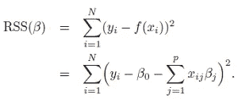
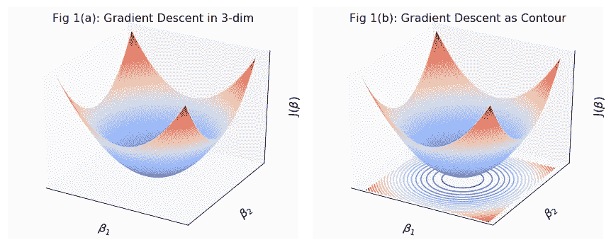
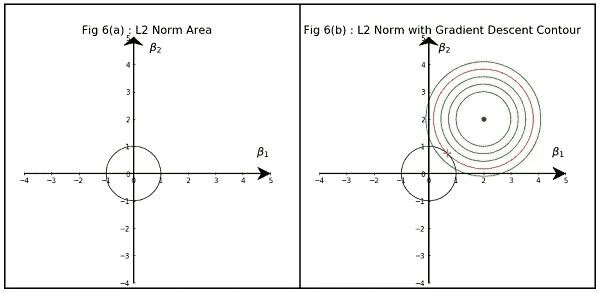
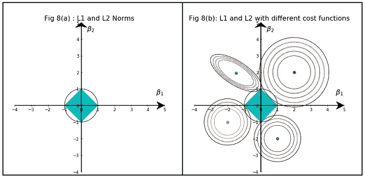

# 机器学习中的正则化:将点连接起来

> 原文：<https://towardsdatascience.com/regularization-in-machine-learning-connecting-the-dots-c6e030bfaddd?source=collection_archive---------3----------------------->

# 故障

以下是我们将一起走的各个步骤，并试图获得理解。

1.  语境

2.先决条件

3.过度拟合问题

4.目标

5.什么是正规化？

6.L2 范数或岭正则化

7.L1 范数或拉索正则化

8.拉索(L1) vs 里奇(L2)

9.结论

# 1.语境

在本文中，我们将把线性回归视为一种算法，其中目标变量“y”将由系数为β1 和β2 的两个特征“x1”和“x2”来解释。

# 2.先决条件

首先，让我们先弄清楚一些次要的先决条件，以便理解它们的用法。

## 线性回归

可选:参考下面链接中的第 3 章，了解线性回归。

 [## 统计学习的要素:数据挖掘、推理和预测。第二版。

web.stanford.edu](https://web.stanford.edu/~hastie/ElemStatLearn/) 

## 普通最小二乘(OLS)回归的成本函数

Source: [https://web.stanford.edu/~hastie/ElemStatLearn/](https://web.stanford.edu/~hastie/ElemStatLearn/)

N —样本数量

p——独立变量或特征的数量

x-特征

y —实际目标或因变量

f(x) —估计目标

β——对应于每个特征或独立变量的系数或权重。

## 表示为等高线图的梯度下降

在下面的图 1(a)中，梯度下降以三维形式表示。J (β)代表相应β1 和β2 的误差。红色代表误差高的区域，蓝色代表误差最小的区域。使用梯度下降，将在误差最小的地方识别系数β1 和β2。

Fig 1: Gradient Descent Projection as Contour

在上面的图 1(b)中，来自梯度下降的成本函数的相应误差被投影到具有相应颜色的 2-dim 上。

Fig 2: Gradient Descent on axes of β1 and β2

在左侧的图 2 中，简单线性回归的梯度下降轮廓在系数β1 和β2 的坐标系中以二维格式表示。

*让我们暂时把这个理解放在一边，继续讨论其他一些基本问题。*

# 3.过度拟合问题

假设我们已经在训练集上使用线性回归训练了一个模型，并将性能提高到令人满意的水平，我们的下一步是根据测试集/看不见的数据进行验证。在大多数情况下，准确性水平会下降。*发生了什么事？*

为了在训练过程中努力提高模型的准确性，我们的模型将尝试拟合和学习尽可能多的数据点。换句话说，随着拟合优度的增加，模型从线性到二次再到多项式(即模型复杂性在增加)。这是由于过度拟合。下图来自吴恩达的机器学习课程，有助于直观地理解这一点。

Source: [https://youtu.be/u73PU6Qwl1I?t=211](https://youtu.be/u73PU6Qwl1I?t=211)

*高次模型和大系数显著增加了方差，导致过度拟合。*

# 4.目标:

我们的模型需要稳健，以便在现实世界中进行良好的预测，即从样本数据或训练期间未见过的数据中进行预测。训练过程中的过度适应是阻止它变得健壮的原因。为了避免这种过度拟合的情况并提高模型的稳健性，我们尝试

1.缩小模型中要素的系数或权重

2.从模型中去除高次多项式特征

我们如何实现这一目标？随之而来的是正规化。现在就来探索一下吧。

# 5.什么是正规化？

假设说，我们已经训练了我们的线性回归模型，并且在全局最小值处识别了系数β1 和β2。为了达到我们的目标；如果我们尝试缩小先前学习的特征的系数，模型会失去准确性。这种准确度的损失需要用其他东西来解释，以保持准确度水平。这个责任将由模型方程的偏差部分承担(*偏差:不依赖于特征数据*的模型方程的一部分)。

*偏置部分将按以下方式调整:*

1.*方差需要减少，偏差需要增加:*由于方差是系数β1，β2 的函数；偏差也将被标记，并作为系数β1、β2 的函数而改变。使用系数β1、β2 的 L1 和 L2 范数的原因。

2.*推广:*这个系数β1，β2 的函数需要推广，在整个坐标空间(坐标轴上的正值和负值)都起作用。这就是我们在 L1 和 L2 范数方程中发现模算子的原因。

*3。* *正则化参数‘λ’:*由于方差和偏差都是系数β1、β2 的函数，所以它们将成正比。这样不行。因此，我们需要一个额外的参数来调节偏差项的大小。这个调节器是正则化参数‘λ’

4.*‘λ’是一个超参数:*如果‘λ’是一个参数，梯度下降会很好地将其设置为 0，并移动到全局最小值。因此，对‘λ’的控制不能用于梯度下降，需要排除在外。它将不是一个参数，而是一个超参数。

*在理解了偏差项的变化后，让我们进入将用于正则化的系数β1、β2 的一些函数。*

# 6.L2 范数或岭回归

L2 范数是|β1| + |β2|形式的欧氏距离范数。

具有 L2 正则化的修改的成本函数如下:

Source: [https://web.stanford.edu/~hastie/ElemStatLearn/](https://web.stanford.edu/~hastie/ElemStatLearn/)

*让我们假设λ = 1 并且暂时不在画面中*

在寻找全局最小误差的过程中，β1 和β2 可以变化。正则项(在上面的等式中用蓝色突出显示)；特定值(β1，β2)将产生偏置输出β1 + β2。可以有多个值产生相同的偏差，如(1，0)、(-1，0)、(0，-1)、(0.7，0.7)和(0，1)。在 L2 范数的情况下，产生*特定相同*偏差的β1 和β2 的各种组合形成一个圆。对于我们的例子，让我们考虑一个偏差项= 1。图 6(a)表示这个圆。

Fig 6: L2 Norm

图 6(b)表示线性回归问题的梯度下降等高线图。现在，这里有两股力量在起作用。

*力 1:偏项，将β1 和β2 拉至仅位于黑色圆圈上的某处。*

*力 2:梯度下降试图行进到绿点指示的全局最小值。*

这两个力都在拉动，最后停在由“红十字”表示的交点附近。

*记住我们之前对图 6(b)的假设是偏差项= 1 且λ = 1。现在去掉一个关于偏差项的假设。*

想象一下“黑色圆圈”的大小在变化，梯度下降落在成本最低的不同点上。λ = 1 的假设仍然存在。观察到的最小成本是λ = 1 时的

*接下来去掉另一个假设λ = 1。提供一个不同的值，比如λ = 0.5。*

对λ = 0.5 重复梯度下降过程，并检查成本。可以对不同的λ值重复该过程，以便识别成本函数给出最小误差的最佳λ值。

总的目标是在坡度下降后保持低成本。因此，λ、β1、β2 的值被确定为保持客观。

*在该过程结束时，方差将会减小，即系数的大小减小。让我们转到β1，β2 的另一类函数。*

# 7.L1 范数或拉索回归

L1 范数的形式是|β1| + |β2|。

L1 正则化的修正成本函数如下:

Source: [https://web.stanford.edu/~hastie/ElemStatLearn/](https://web.stanford.edu/~hastie/ElemStatLearn/)

图 7(a)显示了 L1 范数的形状。

Fig 7: L1 Norm

图 7(b)显示了具有梯度下降等高线图的 L1 范数。从减少差异的角度来看，上一节讨论的相同逻辑在这里也是有效的。

*让我们转到套索正则化的另一个重要方面，我们将在下一节讨论。*

# 8.拉索(L1)对岭(L2)正规化

图 8(a)显示了 L1 和 L2 标准的面积。对于产生的相同量的偏置项，L1 范数占据的面积很小。但是 L1·诺姆不允许任何靠近轴线的空间。这是导致 L1 范数和梯度下降轮廓之间的交点在轴附近*会聚的原因，从而导致特征选择。*

Fig 8: L1 vs L2 Norms

图 8(b)显示了 L1 和 L2 标准以及不同线性回归问题的梯度下降轮廓。除了一种情况，L1 范数收敛于或非常接近轴，因此从模型中移除特征。

这里的每个象限都有一个梯度下降轮廓，用于不同的线性回归问题。绿色、蓝色、棕色表示它们与不同的线性回归问题有关。每个等高线中的红色圆圈与山脊或 L2 范数相交。每个轮廓中的黑色圆圈与套索或 L1 范数相交。

这表明 L1 范数或 Lasso 正则化作为特征选择器，同时减少方差。

# 9.结论

方差减少等同于偏差方差权衡。

## 学分:

1.  *《统计学习的要素》,作者:特雷弗·哈斯蒂、罗布·蒂伯拉尼、杰罗姆·弗里德曼。链接:*【https://web.stanford.edu/~hastie/ElemStatLearn/】T4
2.  *正规化话题由吴恩达提出。链接:*[https://youtu.be/u73PU6Qwl1I?t=211](https://youtu.be/u73PU6Qwl1I?t=211)