# Tensorflow 中基于稀疏滤波自动编码器的正则化

> 原文：<https://towardsdatascience.com/regularization-via-sparse-filtering-auto-encoders-in-tensorflow-4880c73fcfd2?source=collection_archive---------6----------------------->

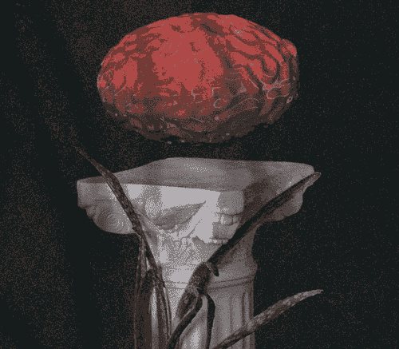

GIF from this [website](https://giphy.com/gifs/funny-art-lol-l4FGlGm5rfO6eduAo)

这个想法在我心中已经存在很长时间了。我们能做什么让神经元有效学习。更具体地说，我们如何在不执行数据扩充的情况下规范网络…..

我认为在机器学习中，一定会有样本偏差，因为我们无法收集世界上所有现有的数据。(人口数据)。并且数据的分布将会不同。(我把增加数据理解为最小化这种差异的一种方法。)但是有没有更好的办法……？

> ***请注意，这个帖子只是为了表达我的创意，当然也是为了好玩。***

**稀疏滤波介绍和我的天真想法**

Illustration of Sparse Filtering From this [website](https://www.researchgate.net/figure/Illustration-of-sparse-filtering-Sparse-filtering-is-applied-to-a-random-set-of-data-X_fig2_301837553)

稀疏过滤是一种无监督的学习方法，我们的目标是通过按行和列归一化数据来降低给定数据的维数。上面可以看到稀疏滤波如何修改数据的说明，以防我链接了解释理论概述的论文。

Paper from this [website](https://arxiv.org/pdf/1603.08831.pdf)

此外，如果您希望看到 tensorflow 中的实现，请[单击此处。稀疏过滤自动编码器背后我简单而天真的想法是这样的。通过更高级特征的聚类，我们的网络将能够区分什么是噪声，什么是我们希望学习的数据。换句话说，正规化。(或者我认为这是在训练过程中注入噪声的一种方式，类似于](/nips-2011-andrew-ng-first-glance-of-sparse-filtering-in-tensorflow-with-interactive-code-659c4e84658e)[抖振正则化](https://arxiv.org/abs/1705.07485)或者[在反向传播中加入梯度噪声](https://becominghuman.ai/only-numpy-implementing-adding-gradient-noise-improves-learning-for-very-deep-networks-with-adf23067f9f1)。)我想看看这个想法实际上是否有意义。

**数据集/训练详情**

Image from this [website](https://www.cis.upenn.edu/~jshi/ped_html/)

我希望我们的自动编码器解决的任务是简单的行人分割，我们将使用“ [**Penn-Fudan 数据库进行行人检测和分割**](https://www.cis.upenn.edu/~jshi/ped_html/) ”。数据集由 170 幅图像和它们的分割蒙版组成，我想看看当我们有 1:1 比例的训练数据和测试数据时，我们能做多少正则化工作。(每个有 85 张图片。)最后，让我们使用 mall 数据集测试我们模型的性能，可以在这里找到[。](http://personal.ie.cuhk.edu.hk/~ccloy/downloads_mall_dataset.html)

所有的网络都有相同的历元数、批量大小和学习速率。超参数的细节可以在下面看到。

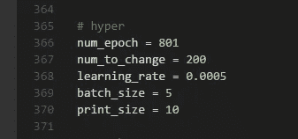

请注意，在培训期间，我发现将学习率乘以 10 是可以的。此外，我们将使用 Adam Optimizer。

我想提一件事，对于稀疏滤波自动编码器，我们不打算从头到尾训练网络，而是我们打算分割训练过程，其中，对于第一个 200 个时期，我们只打算集中于更高级特征的聚类，然后我们打算在执行端到端训练的同时增加学习率。

**结果:纯自动编码器**

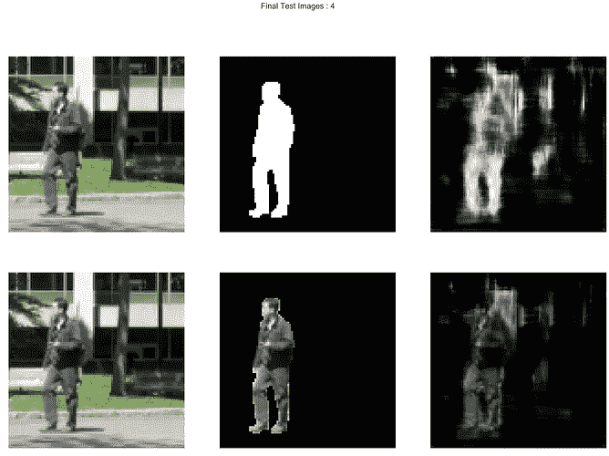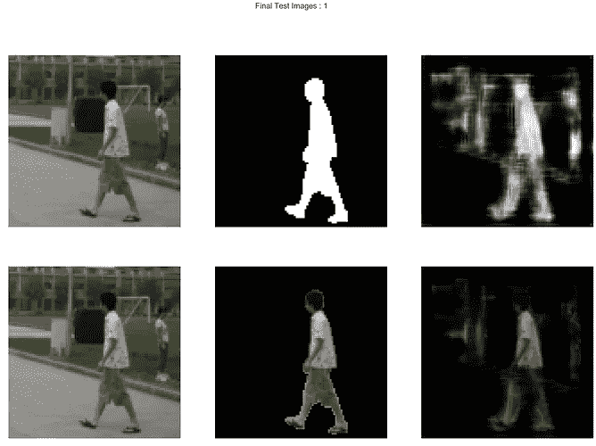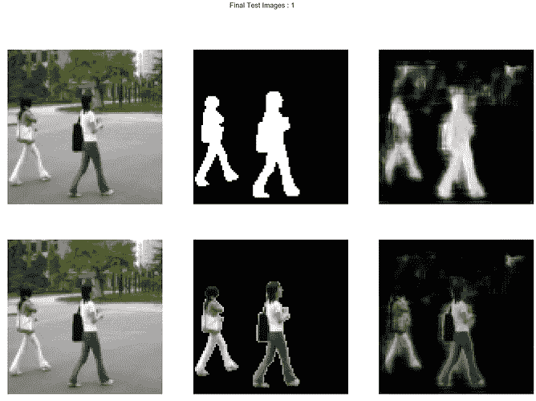

***对于上面的每一幅图像，最左边一列是原始图像，中间一列显示地面真实遮罩值以及重叠在图像上的地面真实遮罩值，最后右边一列图像表示网络生成的遮罩。*(而且是叠加版)**

我们可以清楚地看到，网络没有在分割行人方面做得很好，生成的掩膜的一些区域模糊不清。

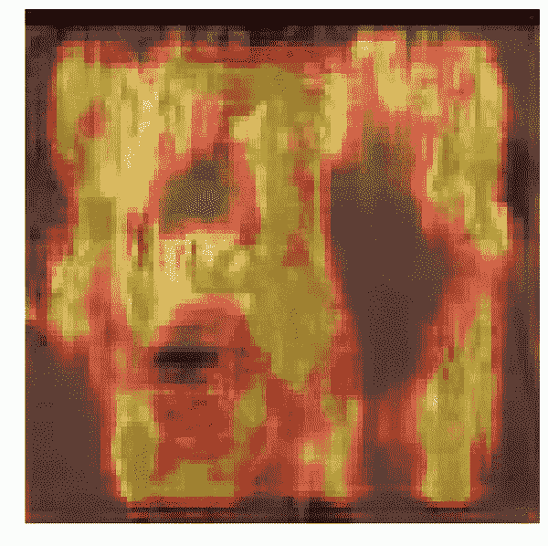

此外，当我们使用纯自动编码器网络从商场数据集中分割人时，我们可以观察到网络认为一切都是行人。(当我叠加生成的分割蒙版时，它看起来就像上面一样。)而且我们可以明确的说网络未能一般化。

**结果:带 L1 正则化的纯自动编码器**

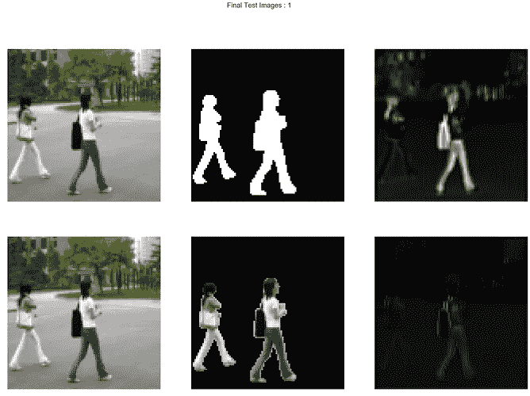

***For each image above, the left most columns are the original image, the middle column shows the ground truth mask values as well as the ground truth mask value overlapped on the image and finally the right column images represents the generated mask by the network. (and it’s overlay-ed version)***

当我们添加 l1 正则化时，从网络生成的分割掩模大部分是灰色和白色的，并且它没有清楚地显示分割的外部线。似乎由于正规化，网络很难决定行人的起点和终点。

乍一看购物中心的数据集，它可能看起来像是网络在分割行人方面做了惊人的工作。(它确实很好地勾勒出了行走的人。)然而，仔细观察我们可以发现，与其他商场数据集结果相比，生成的 GIF 更红。这表明生成的分割不具有行走行人的清晰边界线，但从分割的角度来看，它做了一项惊人的工作。

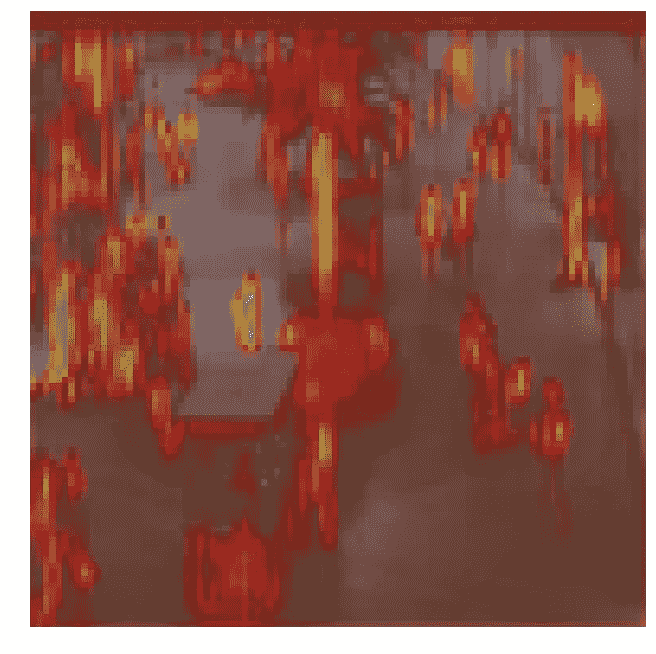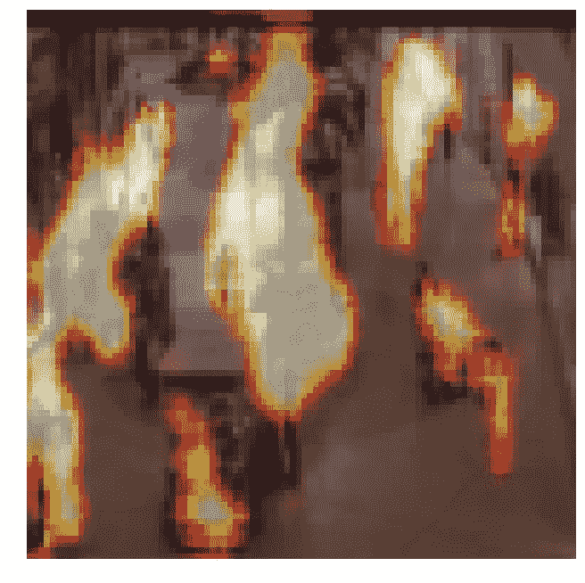

**左图** →来自 L1 正则化自动编码器的一帧
**右图** →来自稀疏滤波自动编码器的一帧(软赦免激活功能)

作为比较，我们可以看到与其他具有清晰边界线的网络相比，整体红色通道的差异。

**结果:采用 L2 正则化的纯自动编码器**

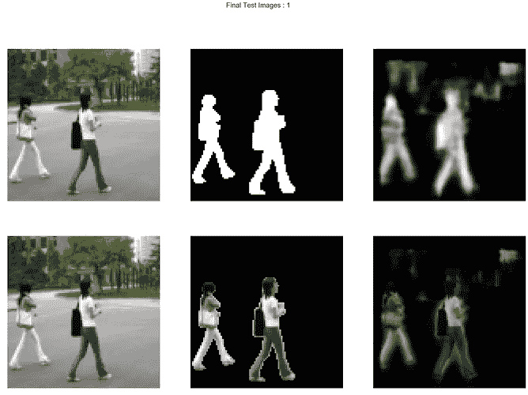

***For each image above, the left most columns are the original image, the middle column shows the ground truth mask values as well as the ground truth mask value overlapped on the image and finally the right column images represents the generated mask by the network. (and it’s overlay-ed version)***

L2 正则化与加入 L1 正则化具有相似的效果，但是生成的分割掩膜具有更清晰的边界线。仍然有一些区域的分割面具是模糊的，以及与黑点混合在一起。

如上所述，当网络通过 L1 正则化器进行正则化时，屏幕没有那么红。并且生成的分割掩膜更加清晰。

**结果:稀疏滤波自动编码器(软绝对激活)**

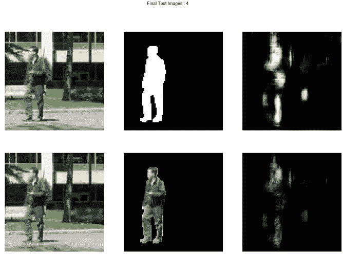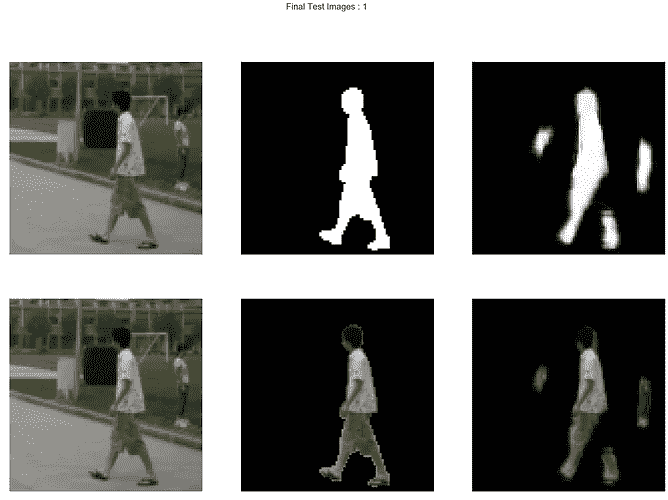

***For each image above, the left most columns are the original image, the middle column shows the ground truth mask values as well as the ground truth mask value overlapped on the image and finally the right column images represents the generated mask by the network. (and it’s overlay-ed version)***

对于稀疏滤波自动编码器，使用软绝对函数作为非线性变换函数。首先，我们可以看到，与 L1 或 L2 正则化网络相比，它有一个清晰的决策线。然而，这种方法也不像上面看到的那样完美。我们可以在生成的掩码中观察到一些漏洞，从那里我们可以得出结论，网络缺乏细节化的能力。(填空)。

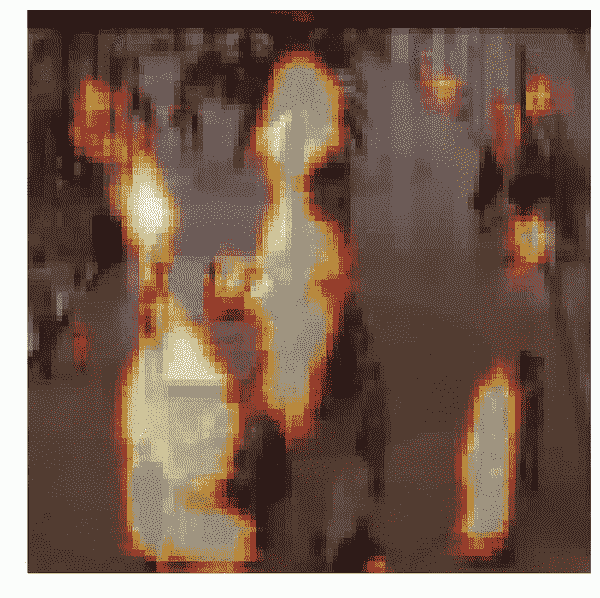

网络不可细化可以通过上面的 GIF 进一步证明。与我们上面看到的网络不同，这个网络不能清楚地从每一帧中分割出人，而是以 blob 格式分割。

**结果:稀疏滤波自动编码器(ELU 激活)**

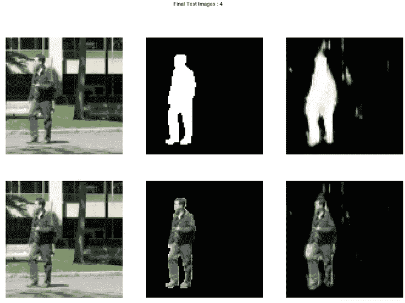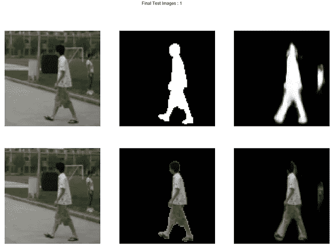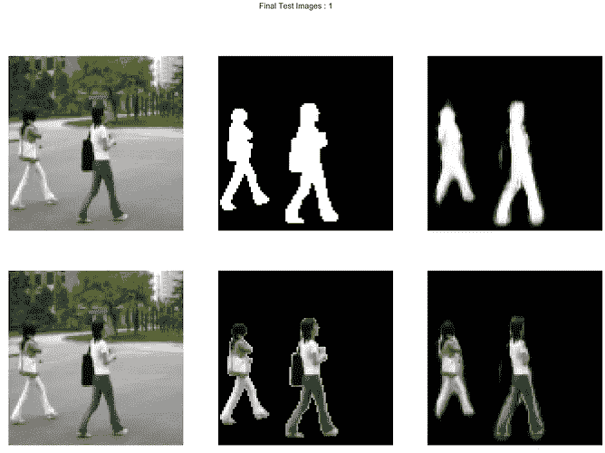

***For each image above, the left most columns are the original image, the middle column shows the ground truth mask values as well as the ground truth mask value overlapped on the image and finally the right column images represents the generated mask by the network. (and it’s overlay-ed version)***

对于样本图像，这个网络具有最清晰的轮廓。(我喜欢网络喜欢做自信的决定。)在上面的中间图像中可以看到一个非常令人印象深刻的事实。

**红框** →被分割的人那是连在地面上也不真实的分割面具。

如上所述，当我们第一次看到红框区域时，我们可能会认为它是图像中的一个区域，不应该被分割。然而，如果我们看得足够近，我们可以观察到网络注意到另一个人站在角落里，并决定分割该区域。(嗯部分。)

然而，当我们用 ELU()作为激活函数时，网络缺少了一样东西。**细节**。当我们考虑它时，它确实是有意义的，当执行维数减少时，在负区域中的每个值都被丢弃，因此它只在网络最有信心的区域上执行分割。

**撤回**

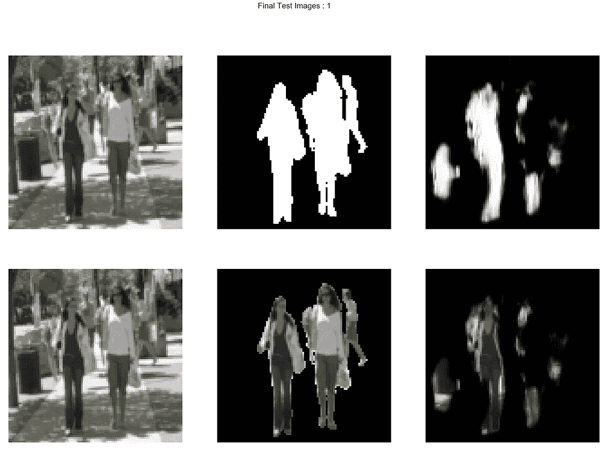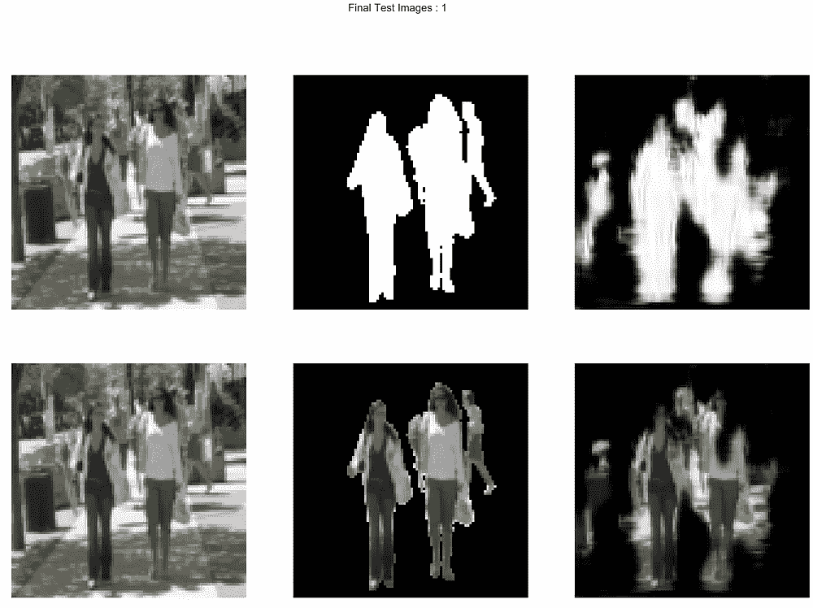

**左图** → ELU 激活功能自动编码器
**右图** →软绝对激活功能自动编码器

我注意到关于这种方法的一个事实是，它缺乏细节，一般来说，网络似乎知道一个人在图像中的位置，但以 blob 格式。但这也适用于其他网络。

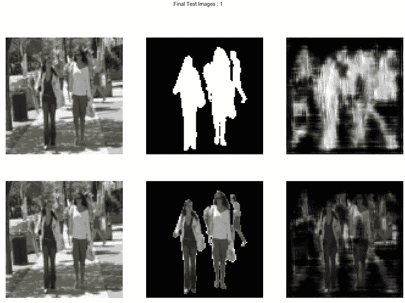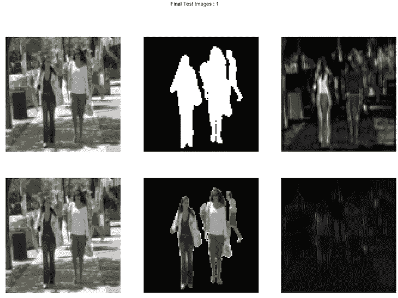

为了比较，我将来自其他网络的分割结果按照纯自动编码器、L1 正则化和 L2 正则化的顺序进行了链接。

**交互代码**

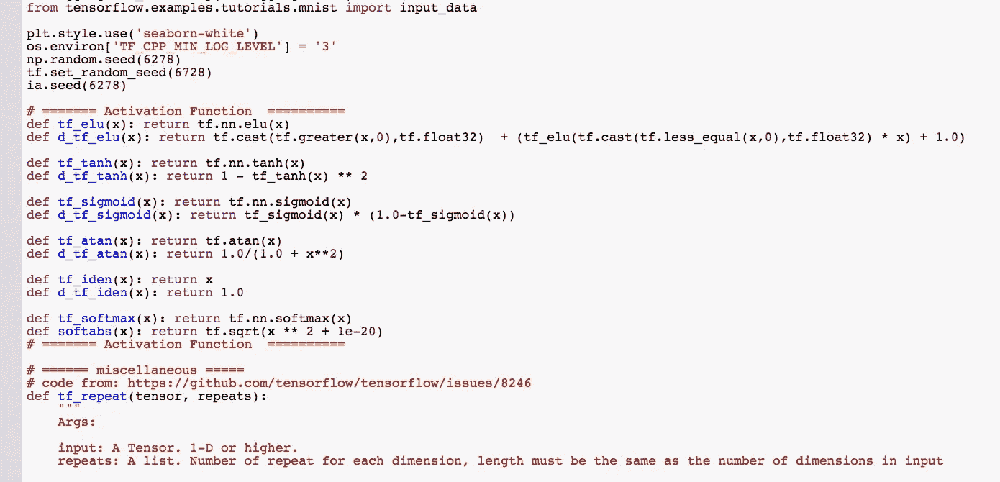

对于 Google Colab，你需要一个 Google 帐户来查看代码，而且你不能在 Google Colab 中运行只读脚本，所以在你的操场上复制一份。最后，我永远不会请求允许访问你在 Google Drive 上的文件，仅供参考。编码快乐！

要访问纯自动[编码器的代码，请点击这里。](https://colab.research.google.com/drive/1P5ZBt2PKOS61XslsSLdIrbt8djEhfb1U)
要访问 L1 汽车[编码器的代码，请点击此处。](https://colab.research.google.com/drive/1DvI6sX5r7rMHMYagii29Z6ss3ANEQtDY)
要访问 L2 汽车[编码器的代码，请点击此处。](https://colab.research.google.com/drive/1bfjIQkTMfh7sk2gtqrVLwQDpeHSNg7XX)
要访问软绝对稀疏自动编码器的代码[请点击此处。](https://colab.research.google.com/drive/1J1UWqFQ5u4u5NE1nEZxZXPcavbKNmEAT)
要访问 ELU 稀疏自动编码器的代码[请点击此处。](https://colab.research.google.com/drive/1WP079lfb8-PFv0EY_q2SpdU2sN4ttOai)

**遗言**

我真的没有看到这种方法的任何实际方面，但它是一个有趣的研究领域(对我个人来说)。).我希望继续这些研究。我在下面收集了一些结果。

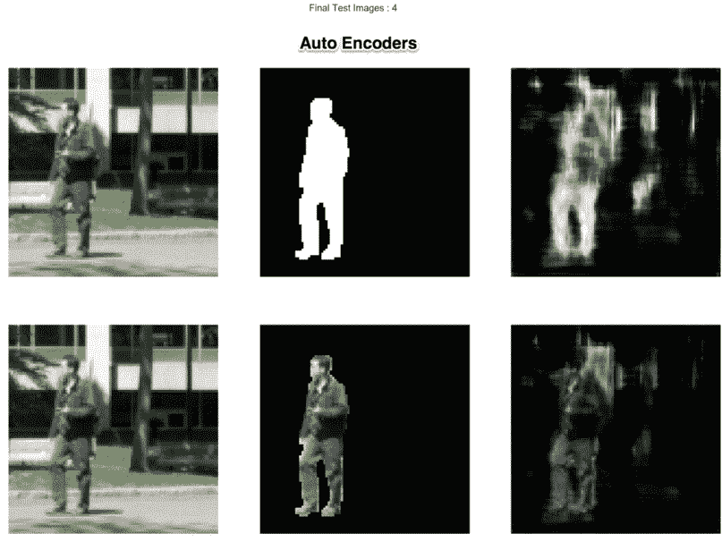

如果发现任何错误，请发电子邮件到 jae.duk.seo@gmail.com 给我，如果你想看我所有写作的列表，请在这里查看我的网站。

同时，在我的推特[这里](https://twitter.com/JaeDukSeo)关注我，并访问[我的网站](https://jaedukseo.me/)，或我的 [Youtube 频道](https://www.youtube.com/c/JaeDukSeo)了解更多内容。我还实现了[广残网，请点击这里查看博文 pos](https://medium.com/@SeoJaeDuk/wide-residual-networks-with-interactive-code-5e190f8f25ec) t。

**参考**

1.  何时使用 cla()，c. (2018)。什么时候使用 cla()、clf()或 close()来清除 matplotlib 中的绘图？。堆栈溢出。2018 年 7 月 25 日检索，来自[https://stack overflow . com/questions/8213522/when-to-use-cla-clf-or-close-for-clearing-a-plot-in-matplotlib](https://stackoverflow.com/questions/8213522/when-to-use-cla-clf-or-close-for-clearing-a-plot-in-matplotlib)
2.  Aubuchon，V. (2018)。2 的幂表——沃恩的总结。Vaughns-1-pagers.com。检索于 2018 年 7 月 25 日，来自[https://www.vaughns-1-pagers.com/computer/powers-of-2.htm](https://www.vaughns-1-pagers.com/computer/powers-of-2.htm)
3.  tf.tile |张量流。(2018).张量流。检索于 2018 年 7 月 25 日，来自 https://www.tensorflow.org/api_docs/python/tf/tile
4.  [ ICLR 2015 ]追求简单:具有交互码的全卷积网。(2018).走向数据科学。检索于 2018 年 7 月 25 日，来自[https://towards data science . com/iclr-2015-力争简单-所有卷积-网络-交互式代码-手册-b4976e206760](/iclr-2015-striving-for-simplicity-the-all-convolutional-net-with-interactive-code-manual-b4976e206760)
5.  [ NIPS 2011 /吴恩达 Tensorflow 中的稀疏滤波与交互式代码第一瞥。(2018).走向数据科学。检索于 2018 年 7 月 25 日，来自[https://towards data science . com/nips-2011-Andrew-ng-first-glance-of-sparse-filtering-in-tensor flow-with-interactive-code-659 c4e 84658 e](/nips-2011-andrew-ng-first-glance-of-sparse-filtering-in-tensorflow-with-interactive-code-659c4e84658e)
6.  谷歌合作实验室。(2018).Colab.research.google.com。检索于 2018 年 7 月 25 日，来自[https://colab . research . Google . com/drive/1 JZ 0 jhv 5 ozyzokgihvywy 3j 98 by-uysq 0 # scroll to = c 70 qbz 71 v9 ox](https://colab.research.google.com/drive/1Jz0jhV5ozYzokgIHVywY3j98By-Uysq0#scrollTo=c70qbZ71V9Ox)
7.  NumPy . dtype—NumPy 1.14 版手册。(2018).Docs.scipy.org。检索于 2018 年 7 月 25 日，来自[https://docs . scipy . org/doc/numpy-1 . 14 . 0/reference/generated/numpy . dtype . html](https://docs.scipy.org/doc/numpy-1.14.0/reference/generated/numpy.dtype.html)
8.  TF . image . resize _ images | tensor flow(2018).张量流。检索于 2018 年 7 月 25 日，来自[https://www . tensor flow . org/API _ docs/python/TF/image/resize _ images](https://www.tensorflow.org/api_docs/python/tf/image/resize_images)
9.  TensorFlow，R. (2018)。在 TensorFlow 中调整训练图像的大小。堆栈溢出。检索于 2018 年 7 月 25 日，来自[https://stack overflow . com/questions/40299704/resizing-images-for-training-in-tensor flow](https://stackoverflow.com/questions/40299704/resizing-images-for-training-in-tensorflow)
10.  float32，T. (2018)。TensorFlow:将 float64 张量转换为 float32。堆栈溢出。检索于 2018 年 7 月 25 日，来自[https://stack overflow . com/questions/35725513/tensor flow-cast-a-float 64-tensor-to-float 32](https://stackoverflow.com/questions/35725513/tensorflow-cast-a-float64-tensor-to-float32)
11.  (2018).[在线]可在:[https://www . researchgate . net/figure/Illustration-of-Sparse-filtering-Sparse-filtering-is-applied-to-a-random-set-of-data-X _ fig 2 _ 301837553](https://www.researchgate.net/figure/Illustration-of-sparse-filtering-Sparse-filtering-is-applied-to-a-random-set-of-data-X_fig2_301837553)[2018 年 7 月 29 日获取]。
12.  (2018).Arxiv.org。检索于 2018 年 7 月 29 日，来自 https://arxiv.org/pdf/1603.08831.pdf
13.  [ NIPS 2011 /吴恩达 Tensorflow 中稀疏滤波与交互式代码的第一瞥。(2018).走向数据科学。检索于 2018 年 7 月 29 日，来自[https://towards data science . com/nips-2011-Andrew-ng-first-glance-of-sparse-filtering-in-tensor flow-with-interactive-code-659 c4e 84658 e](/nips-2011-andrew-ng-first-glance-of-sparse-filtering-in-tensorflow-with-interactive-code-659c4e84658e)
14.  行人检测数据库。(2018).Cis.upenn.edu。检索于 2018 年 7 月 29 日，来自[https://www.cis.upenn.edu/~jshi/ped_html/](https://www.cis.upenn.edu/~jshi/ped_html/)
15.  洛伊，C. (2018)。购物中心数据集-人群计数数据集。Personal.ie.cuhk.edu.hk。检索于 2018 年 7 月 29 日，来自[http://personal . ie . cuhk . edu . hk/~ cc loy/downloads _ mall _ dataset . html](http://personal.ie.cuhk.edu.hk/~ccloy/downloads_mall_dataset.html)
16.  张量流正则化。(2018).ritchieng . github . io . 2018 年 7 月 30 日检索，来自[https://www . ritchieng . com/machine-learning/deep-learning/tensor flow/regulation/](https://www.ritchieng.com/machine-learning/deep-learning/tensorflow/regularization/)
17.  Matplotlib 图:移除轴，l. (2018)。Matplotlib 绘图:删除轴、图例和空白。堆栈溢出。检索于 2018 年 7 月 30 日，来自[https://stack overflow . com/questions/9295026/matplotlib-plots-removed-axis-legends-and-white-spaces](https://stackoverflow.com/questions/9295026/matplotlib-plots-removing-axis-legends-and-white-spaces)
18.  情节，一.(2018)。散点图中的单个 alpha 值。堆栈溢出。检索于 2018 年 7 月 30 日，来自[https://stack overflow . com/questions/24767355/individual-alpha-values-in-scatter-plot](https://stackoverflow.com/questions/24767355/individual-alpha-values-in-scatter-plot)
19.  [https://stack overflow . com/questions/332289/how-do-you-change-the-size-of-figures-drawn with-matplotlib](https://stackoverflow.com/questions/332289/how-do-you-change-the-size-of-figures-drawn-with-matplotlib)？，H. (2018)。如何改变用 matplotlib 绘制的图形的大小？。堆栈溢出。检索于 2018 年 7 月 30 日，来自[https://stack overflow . com/questions/332289/how-do-you-change-the-size-of-figures-drawn-with-matplotlib](https://stackoverflow.com/questions/332289/how-do-you-change-the-size-of-figures-drawn-with-matplotlib)
20.  [https://stack overflow . com/questions/9295026/Matplotlib-plots-remove-axis-legends-and-white-Matplotlib](https://stackoverflow.com/questions/9295026/matplotlib-plots-removing-axis-legends-and-white-Matplotlib)plots:remove axis，l. (2018)。Matplotlib 绘图:删除轴、图例和空白。堆栈溢出。检索于 2018 年 7 月 30 日，来自[https://stack overflow . com/questions/9295026/matplotlib-plots-removed-axis-legends-and-white-spaces](https://stackoverflow.com/questions/9295026/matplotlib-plots-removing-axis-legends-and-white-spaces)
21.  matplotlib，O. (2018)。用 numpy 和 matplotlib 覆盖图像分割。堆栈溢出。检索于 2018 年 7 月 30 日，来自[https://stack overflow . com/questions/31877353/overlay-an-image-segmentation-with-numpy-and-matplotlib](https://stackoverflow.com/questions/31877353/overlay-an-image-segmentation-with-numpy-and-matplotlib)
22.  [复本]，H. (2018)。如何用 python 把图像做成电影？堆栈溢出。检索于 2018 年 7 月 30 日，来自[https://stack overflow . com/questions/44947505/how-to-make-a-movie-out-of-images-in-python](https://stackoverflow.com/questions/44947505/how-to-make-a-movie-out-of-images-in-python)
23.  函数，H. (2018)。如何在张量流误差函数中加入 L1 正则化？堆栈溢出。检索于 2018 年 7 月 30 日，来自[https://stack overflow . com/questions/36706379/how-to-exact-add-L1-regularization-to-tensor flow-error-function](https://stackoverflow.com/questions/36706379/how-to-exactly-add-l1-regularisation-to-tensorflow-error-function)
24.  阿什温诉弗吉尼亚州(2015 年)。如何在 Python 中自然排序？编码纱线👨‍💻。检索于 2018 年 7 月 30 日，来自[https://code yarns . com/2015/01/23/how-to-natural-sort-in-python/](https://codeyarns.com/2015/01/23/how-to-natural-sort-in-python/)
25.  OpenCV:视频入门。(2018).Docs.opencv.org。检索于 2018 年 7 月 30 日，来自[https://docs . opencv . org/3 . 1 . 0/DD/d43/tutorial _ py _ video _ display . html](https://docs.opencv.org/3.1.0/dd/d43/tutorial_py_video_display.html)
26.  Gastaldi，X. (2017)。抖抖正则化。Arxiv.org。检索于 2018 年 7 月 30 日，来自 https://arxiv.org/abs/1705.07485
27.  Only Numpy:实现“添加梯度噪声改善非常深度网络的学习”来自…(2018).成为人类:人工智能杂志。检索于 2018 年 7 月 30 日，来自[https://becoming human . ai/only-numpy-implementing-adding-gradient-noise-improves-learning-for-very-deep-networks-with-ADF 23067 F9 f1](https://becominghuman.ai/only-numpy-implementing-adding-gradient-noise-improves-learning-for-very-deep-networks-with-adf23067f9f1)