# 现实生活规划问题的强化学习

> 原文：<https://towardsdatascience.com/reinforcement-learning-for-real-life-planning-problems-31314491e5c?source=collection_archive---------1----------------------->

最近，我发表了一些例子，其中我为一些现实生活中的问题创建了强化学习模型。例如，根据设定的预算和个人偏好使用[强化学习进行膳食计划](/reinforcement-learning-for-meal-planning-based-on-meeting-a-set-budget-and-personal-preferences-9624a520cce4)。强化学习可以用于各种各样的计划问题，包括旅行计划、预算计划和商业策略。使用 RL 的两个优点是，它考虑了结果的概率，并允许我们控制环境的一部分。因此，我决定写一个简单的例子，以便其他人可以考虑如何开始使用它来解决他们的一些日常或工作问题。

## 什么是强化学习？

强化学习(RL)是通过基本的反复试验来测试哪种行为对于环境的每种状态是最好的过程。该模型引入了一个随机策略，每次采取行动时，都会有一个初始数量(称为奖励)输入到模型中。这种情况会持续到达到最终目标，例如，你赢得或输掉游戏，此时该回合(或情节)结束，游戏重置。随着模型经历越来越多的情节，它开始学习哪些行动更有可能将我们引向积极的结果，并因此找到任何给定状态下的最佳行动，这被称为最优策略。

Reinforcement Learning General Process

许多在线 RL 应用在游戏或虚拟环境中训练模型，其中模型能够重复地与环境交互。例如，你让模型一遍又一遍地玩井字游戏，以便它观察成功和失败或尝试不同的动作。

在现实生活中，我们很可能无法以这种方式训练我们的模型。例如，在线购物中的推荐系统需要一个人的反馈来告诉我们它是否成功，这是基于有多少用户与购物网站交互而限制其可用性的。相反，我们可能有显示一段时间内购物趋势的样本数据，我们可以使用这些数据来估计概率。使用这些，我们可以创建所谓的部分观察马尔可夫决策过程(POMDP ),作为概括潜在概率分布的一种方式。

## 部分观察马尔可夫决策过程

马尔可夫决策过程(MDP)提供了一个框架，用于在结果部分是随机的，部分在决策者控制下的情况下对决策进行建模。MDP 的关键特征是它们遵循马尔可夫性质；所有未来的状态都是独立于过去的。换句话说，进入下一个状态的概率只取决于当前状态。

POMDPs 的工作方式类似，只是它是 MDP 的一般化。简而言之，这意味着模型不能简单地与环境相互作用，而是根据我们观察到的情况给出一个设定的概率分布。更多信息可在这里找到[。我们可以在 POMDP 上使用值迭代方法，但是在这个例子中我们决定使用蒙特卡罗学习。](http://www.pomdp.org/tutorial/)

# 示例环境

想象一下，你回到了学校(或者可能仍然在学校),在教室里，老师对废纸有严格的政策，要求任何纸片**都必须在教室前面**递给他，他会把垃圾放入垃圾桶。然而，班上有些学生不在乎老师的规定，宁愿省去在教室里传纸条的麻烦。相反，这些麻烦的人可能会选择从远处把废纸扔进垃圾箱。这激怒了老师，这样做的人会受到惩罚。这引入了一个非常基本的行动奖励概念，我们有一个示例教室环境，如下图所示。

我们的目的是为每个人找到最好的说明，以便论文到达老师手中并放入垃圾箱，避免被扔进垃圾箱。

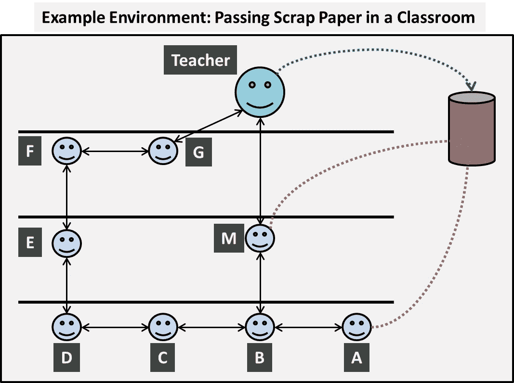

## 状态和动作

在我们的环境中，每个人都可以被视为一个**状态**，他们可以对废纸采取各种**行动**。他们可能会把它传给邻近的同学，自己拿着，或者有些人会把它扔进垃圾箱。因此，我们可以将我们的环境映射到一个更标准的网格布局，如下所示。

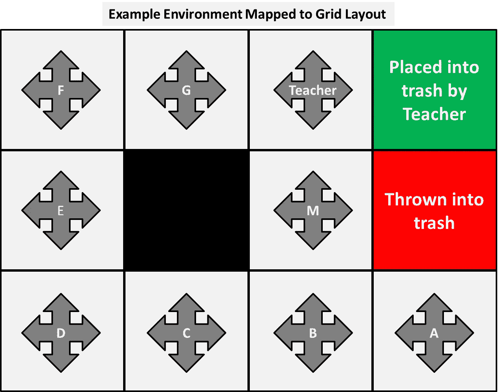

这是有目的地设计的，这样每个人或每个状态都有四个动作:上、下、左或右，并且每个动作都将基于谁采取了该动作而有不同的“真实生活”结果。把人放到墙上(包括中间的黑色方块)的动作表示这个人抓住了纸。在某些情况下，这个动作是重复的，但在我们的例子中不是问题。

例如，人 A 的行为导致:

*   向上=扔进垃圾箱
*   向下=抓住纸张
*   左=传给人 B
*   右=抓住纸

# 概率环境

目前，部分控制环境的决策者是我们。我们会告诉每个人他们应该采取什么行动，这就是所谓的**政策**。

我在学习中面临的第一个挑战是理解环境可能是概率性的，以及这意味着什么。概率环境是指当我们指示一个州根据我们的政策采取行动时，有一个与此是否成功执行相关的概率。换句话说，如果我们告诉人 A 把纸递给人 B，他们可以决定不按照我们政策中的指示行动，而是把废纸扔进垃圾箱。另一个例子是，如果我们推荐网上购物产品，不能保证人们会看到每一个。

## 观察到的转移概率

为了找到观察到的转移概率，我们需要收集一些关于环境如何作用的样本数据。在我们收集信息之前，我们首先介绍一个初始策略。为了开始这个过程，我随机选择了一个看起来会带来积极结果的方法。

现在我们观察每个人在这个政策下采取的行动。换句话说，假设我们坐在教室的后面，简单地观察课堂，观察到 A 的以下结果:

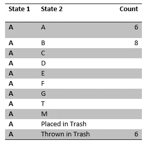

Person A’s Observed Actions

我们看到一张纸经过这个人 20 次；6 次他们拿着它，8 次他们把它传给了 B，还有 6 次他们把它扔进了垃圾桶。这意味着，在我们最初的策略下，这个人持有或将其扔进垃圾桶的概率是 6/20 = 0.3，同样地，传给人 b 的概率是 8/20 = 0.4。我们可以观察班上的其他人，以收集以下样本数据:

Observed Real Life Outcome

同样地，我们计算出下面的概率矩阵，我们可以用它来模拟经验。该模型的准确性将在很大程度上取决于概率是否真实地代表了整个环境。换句话说，我们需要确保我们的样本足够大，数据足够丰富。

Observed Transition Probability Function

# 多武装土匪，集，奖励，返回和折扣率

因此，我们在 POMDP 下从样本数据中估计了转移概率。在我们引入任何模型之前，下一步是引入奖励。到目前为止，我们只讨论了最后一步的结果；要么这张纸被老师扔进垃圾箱，得到正奖励，要么被 A 或 M 扔出去，得到负奖励。结束这一集的最终奖励被称为**最终奖励**。但是，也有不太理想的第三种结果；这张纸不断地被传来传去，从来没有(或者花了比我们希望的长得多的时间)到达垃圾箱。因此，总而言之，我们有三个最终结果

*   老师将纸放入垃圾箱，并获得积极的最终奖励
*   一个学生把纸扔进垃圾箱，得到一个负的最终奖励
*   纸张不断在教室里传来传去，或者粘在学生身上的时间比我们希望的要长

为了避免纸被扔进垃圾箱，我们提供了一个大的负奖励，比如说-1，因为老师很高兴它被放入垃圾箱，这净得一个大的正奖励+1。为了避免在房间里不断传递的结果，我们将所有其他行为的奖励设置为一个小的负值，比如-0.04。如果我们将它设置为正数或空数，那么模型可能会让论文循环往复，因为获得小的正数比冒险接近负数要好。这个数字也很小，因为它只会收集一个单一的最终奖励，但它可能需要许多步骤来结束这一集，我们需要确保，如果论文被放入垃圾箱，积极的结果不会被抵消。请注意，奖励总是相对于另一个，我选择了任意的数字，但如果结果不理想，这些可以改变。

尽管我们无意中讨论了示例中的情节，但我们还没有正式定义它。**一集就是每张纸通过教室到达垃圾箱的动作，这是最终状态并结束一集**。在其他例子中，比如玩井字游戏，这将是一场你赢或输的游戏的结尾。

理论上，论文可以从任何状态开始，这介绍了为什么我们需要足够的片段来确保每个状态和动作都经过足够的测试，这样我们的结果就不会被无效的结果所驱动。然而，另一方面，我们引入的剧集越多，计算时间就越长，并且根据环境的规模，我们可能没有无限量的资源来做这件事。

这就是所谓的**多兵种土匪问题**；在有限的时间(或其他资源)下，我们需要确保对每个状态-动作对进行足够的测试，以确保我们的策略中选择的动作实际上是最优的。换句话说，我们需要证明，在过去导致我们取得好结果的行动并不是纯粹的运气，而是事实上是正确的选择，对于那些看起来糟糕的行动也是如此。在我们的例子中，这看起来很简单，因为我们的状态很少，但是想象一下，如果我们增加规模，这将会变成一个越来越大的问题。

我们 RL 模型的总体目标是选择最大化预期累积回报的行动，即回报。换句话说，**回报**就是该集获得的总回报。一个简单的计算方法是把每集的所有奖励加起来，包括最终奖励。

一种更严格的方法是，通过在下面的公式中应用一个折扣因子γ，认为第一步比后面的步骤更重要:

换句话说，我们将所有的奖励相加，但是将后面的步骤加权一个系数，该系数是达到这些奖励所需的步骤数的幂。

如果我们想一想我们的例子，使用折扣回报会变得更加清晰，因为老师会奖励(或相应地惩罚)任何参与该事件的人，但会根据他们离最终结果的距离来衡量这一点。例如，如果纸从 A 传到 B，再传到把它扔进垃圾箱的 M，M 应该受到最大的惩罚，然后是 B 把它传给他，最后是 A，他仍然参与最终结果，但比 M 或 B 参与得少。这也强调了从一个状态开始并到达垃圾箱所花的时间越长(基于步骤数), is 得到的奖励或惩罚就越少，但采取更多步骤会累积负奖励。

# 将模型应用于我们的示例

由于我们的示例环境很小，我们可以应用每一个并显示一些手动执行的计算，并说明更改参数的影响。

对于任何算法，我们首先需要初始化状态值函数 V(s ),并且已经决定将它们中的每一个设置为 0，如下所示。

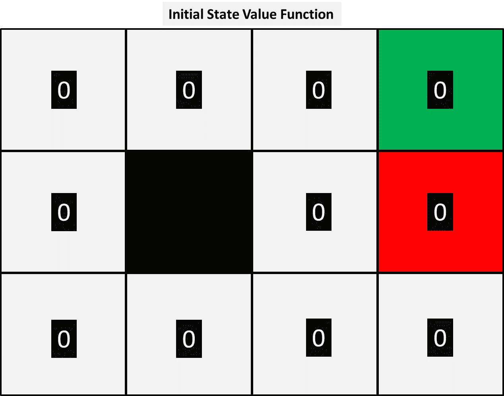

接下来，我们让模型基于我们观察到的概率分布来模拟对环境的体验。该模型从一张随机状态的纸开始，在我们的策略下，每个行动的结果都基于我们观察到的概率。例如，假设我们有如下的前三个模拟情节:

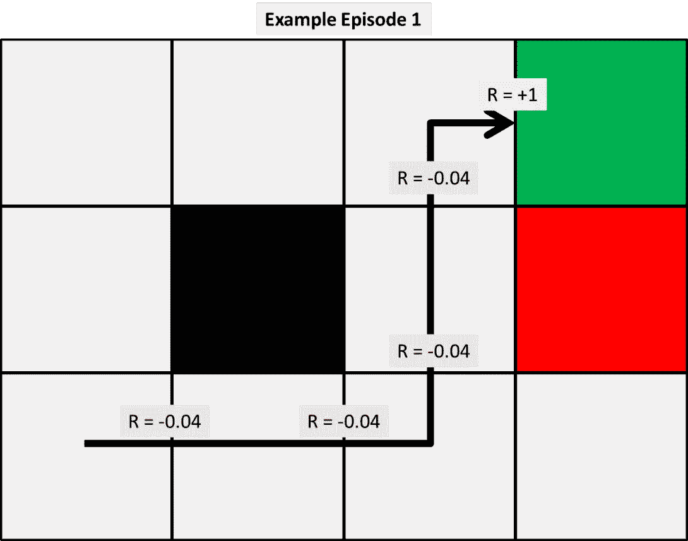

有了这些片段，我们可以使用给定的三个模型中的每一个来计算我们的状态值函数的最初几次更新。现在，我们选择一个任意的 alpha 和 gamma 值为 0.5 来简化我们的手工计算。我们将在后面展示这个变量对结果的影响。

首先，我们应用时间差异 0，这是我们最简单的模型，前三个值更新如下:

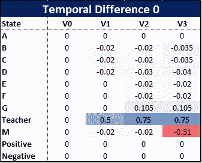

那么这些是如何计算的呢，因为我们的例子很小，我们可以手工显示计算结果。

那么在这个早期阶段我们能观察到什么呢？首先，使用 TD(0)似乎对某些国家不公平，例如 D 人，他在现阶段从三分之二到达垃圾箱的纸张中一无所获。他的更新只受到下一阶段价值的影响，但这强调了积极和消极的奖励如何从角落向外传播到各个州。随着我们拍摄的剧集越来越多，正面和负面的最终奖励将会越来越分散到各个州。这大致显示在下面的图表中，我们可以看到，导致正面结果的两个事件影响了状态 Teacher 和 G 的值，而单个负面事件惩罚了人 m。

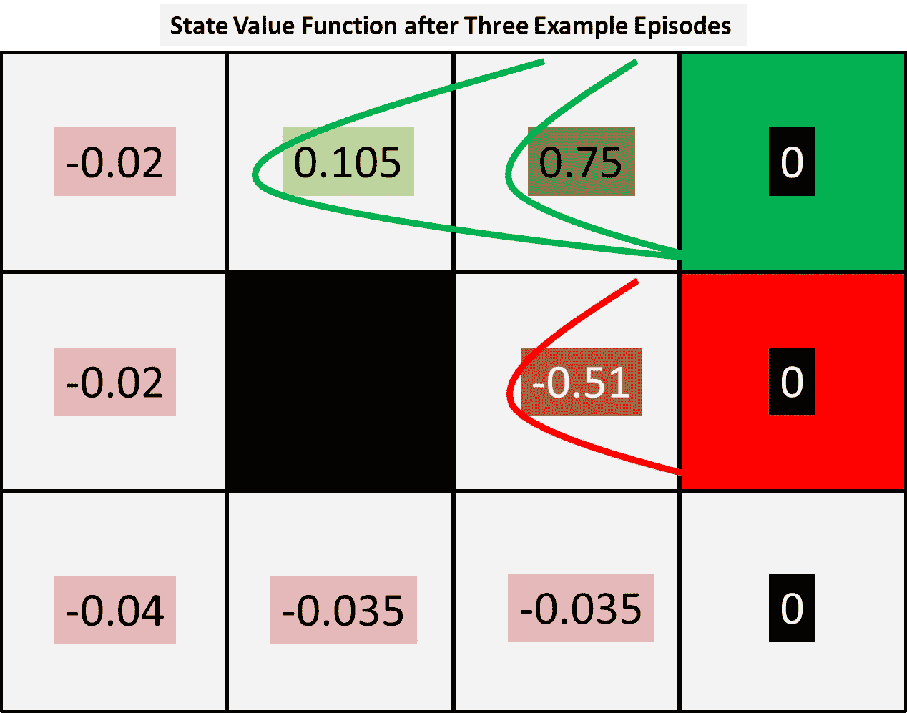

为了显示这一点，我们可以尝试更多的情节，如果我们重复已经给出的相同的三个路径，我们产生以下状态值函数:

**(请注意，为简单起见，我们在本例中重复了这三集，但实际模型会有几集的结果基于观察到的转移概率函数)**

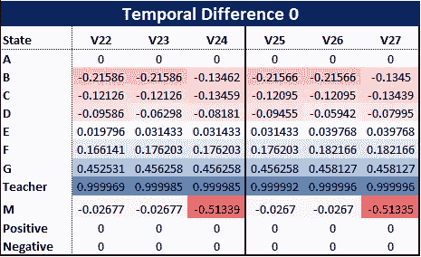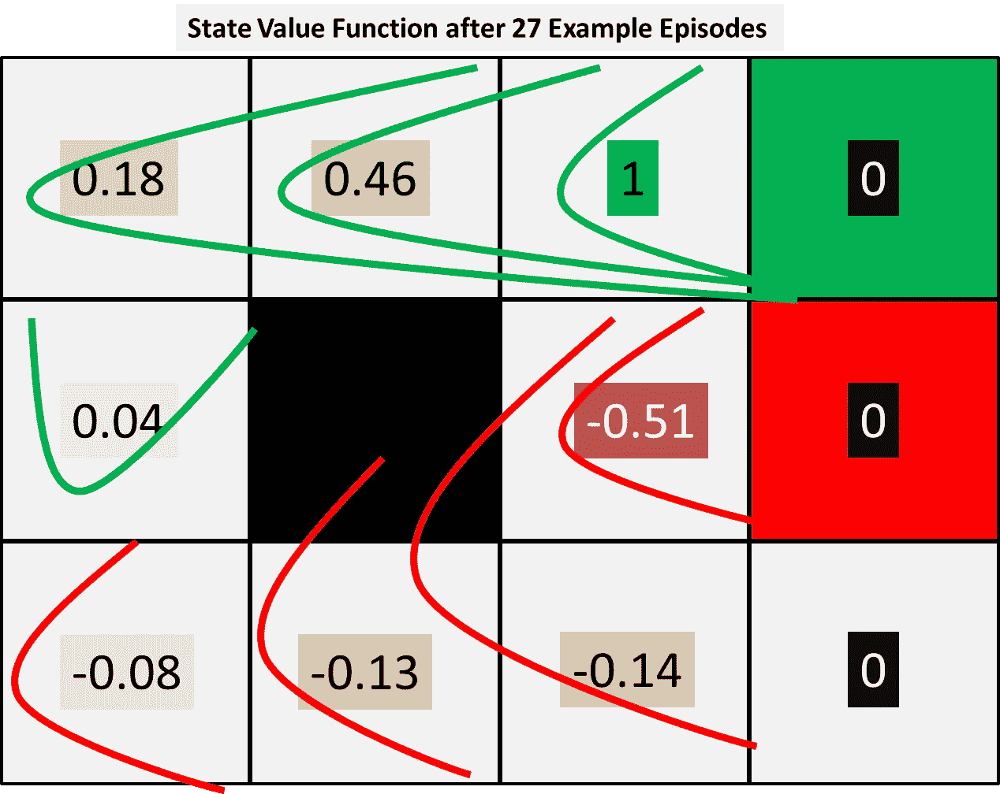

上图显示了终端奖励从右上角向外传播到各州。由此，我们可以决定更新我们的政策，因为很明显，负的终端报酬通过人 M 传递，因此 B 和 C 受到负面影响。因此，基于 V27，对于每个状态，我们可以决定通过为每个状态选择下一个最佳状态值来更新我们的策略，如下图所示

在这个例子中有两个值得关注的原因，第一个是 A 的最佳行动是把它扔进垃圾箱，净得一个负回报。这是因为没有一集访问了这个人，并强调了多武装匪徒的问题。在这个小例子中，只有很少几个州，所以需要很多集才能访问所有的州，但我们需要确保做到这一点。这个行动对这个人来说更好的原因是因为两种最终状态都没有价值，而是积极和消极的结果都在最终回报中。然后，如果我们的情况需要，我们可以根据结果用终态的数字初始化 V0。

其次，人 M 的状态值在-0.03 和-0.51 之间来回翻转(大约。)之后，我们需要解决为什么会发生这种情况。这是我们的学习率α造成的。目前，我们只介绍了我们的参数(学习率α和贴现率γ),但没有详细解释它们将如何影响结果。一个大的学习率可能会导致结果振荡，但反过来，它不应该太小，以至于永远收敛。下图进一步显示了每集的总 V(s ),我们可以清楚地看到，尽管总体趋势是上升的，但它在各集之间来回变化。学习率的另一个很好的解释如下:

“在高尔夫球比赛中，当球离球洞很远时，球员要尽可能地靠近球洞。后来，当他到达标记区域时，他选择了一根不同的棍子来获得准确的短杆。

所以不是说他不选短杆就不会把球送进洞，他可能会把球送到目标前面两三次。但是，如果他发挥最佳状态，使用正确的力量到达球洞，那将是最好的。"

 [## Q 学习代理的学习速率

### 学习率如何影响收敛率和收敛本身的问题。如果学习率是…

stackoverflow.com](https://stackoverflow.com/questions/33011825/learning-rate-of-a-q-learning-agent) 

Episode

对于一个问题，有一些复杂的方法来建立最佳学习速率，但是，与任何机器学习算法一样，如果环境足够简单，您可以迭代不同的值，直到达到收敛。这也被称为随机梯度下降。在最近的 RL 项目中，我用动画演示了减少 alpha 的效果，如下所示。这演示了当 alpha 较大时的振荡，以及当 alpha 减小时振荡如何变得平滑。

同样，我们也必须有一个介于 0 和 1 之间的折现率，通常这个值接近 0.9。贴现因子告诉我们未来的回报有多重要；大数值表示它们将被认为是重要的，而将这个数值移向 0 将使模型越来越少地考虑未来的步骤。

考虑到这两个因素，我们可以将 alpha 从 0.5 更改为 0.2，将 gamma 从 0.5 更改为 0.9，并获得以下结果:

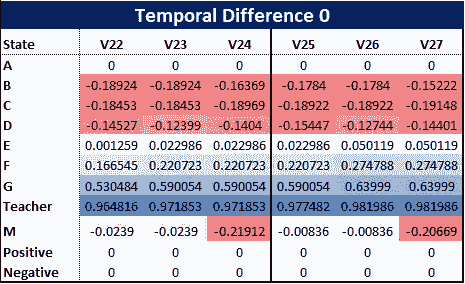

因为我们的学习率现在小得多，所以模型需要更长的时间来学习，并且值通常更小。最明显的是对于老师来说，这显然是最好的状态。然而，这种增加计算时间的折衷意味着我们的 M 值不再像以前那样振荡。我们现在可以在下图中看到，根据我们更新的参数，V(s)的总和。虽然它并不完全平滑，但总 V(s)以比以前平滑得多的速度缓慢增加，并像我们希望的那样收敛，但需要大约 75 集才能收敛。

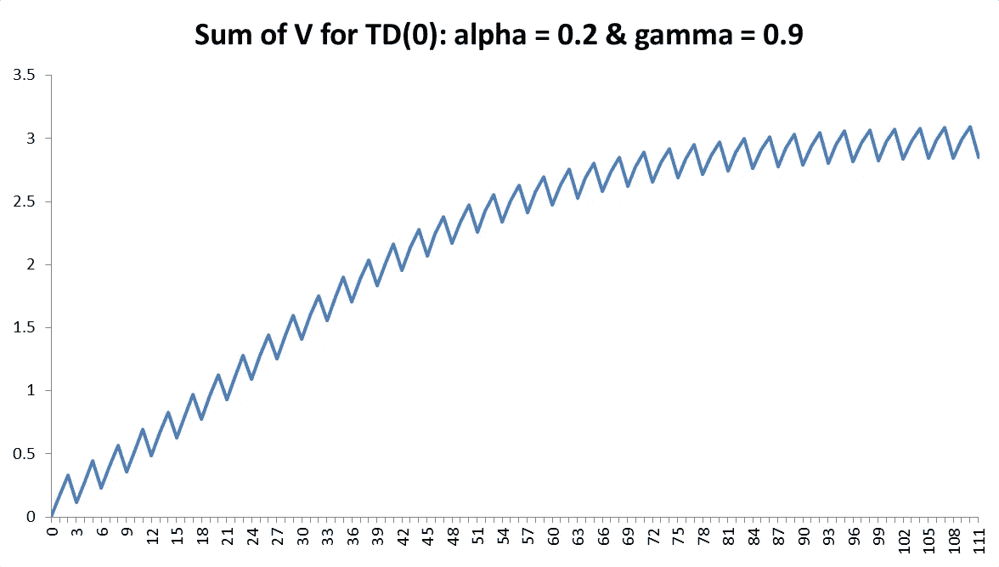

# 改变目标结果

RL 的另一个至关重要的优势是我们对环境有一定的控制权，这一点我们还没有详细提及。目前，奖励是基于我们的决定，即让模型以尽可能少的步骤达到积极的结果是最好的。然而，假设老师换了，新老师不介意学生把纸扔进垃圾箱，只要它够得着。然后我们可以围绕这个改变我们的负回报，最优策略就会改变。

这对于商业解决方案尤其有用。例如，假设您正在计划一项战略，并且知道某些转变不如其他转变理想，那么这可以被考虑在内并随意改变。

# 结论

我们现在已经根据观察到的数据创建了一个简单的强化学习模型。有许多事情可以改进或进一步发展，包括使用更复杂的模型，但对于那些希望尝试并应用于自己现实生活中的问题的人来说，这应该是一个很好的介绍。

我希望你喜欢阅读这篇文章，如果你有任何问题，请随时在下面评论。

谢谢

哲学（philosophy 的缩写）