# 从头开始强化学习:在 Python 笔记本中设计和解决任务

> 原文：<https://towardsdatascience.com/reinforcement-learning-from-scratch-designing-and-solving-a-task-all-within-a-python-notebook-48c40021da4?source=collection_archive---------6----------------------->

## 第 1 部分:定义环境，用价值迭代找到最优策略，并引入 Q 学习

## 摘要

在本文中，我将介绍一个新项目，它试图通过在 Python 笔记本中完全定义和解决一个简单的任务来帮助那些学习强化学习的人。环境和基本方法将在本文中解释，所有代码都发布在 Kaggle 的下面的链接中。此外，我已经创建了一个“元”笔记本，可以很容易地分叉，只包含定义的环境，供其他人尝试、适应和应用他们自己的代码。

 [## Python 中从头开始的强化学习

### 寻找特定环境下最佳行动的初学者指南

www.kaggle.com](https://www.kaggle.com/osbornep/-reinforcement-learning-from-scratch-in-python) 

## 语境

当我第一次开始学习强化学习时，我直接复制在线指南和项目，但发现我迷路了，感到困惑。“为什么结果会显示这一点？这个参数有什么作用？环境这样做是为了什么？”都是我开始问自己的一些问题。直到我后退一步，从基础开始，首先完全理解概率环境是如何定义的，并建立一个我可以在纸上解决的小例子，事情才开始变得更有意义。然而，我发现很难找到一个不需要从外部资源导入的环境来应用我的知识。

因此，我给自己设定了一个挑战:

我能否在一个 Python 笔记本中完全独立地定义并找到任务环境的最佳行动？

通过关注我的工作，我希望其他人可以将此作为学习自己的基本起点。

# 阶段 1:定义环境

## 任务

很简单，我想知道从房间的任何位置将一张纸放入垃圾桶的最佳动作。我可以把纸扔向任何方向，或者一次移动一步。

尽管对于可以通过视觉判断箱子位置并且具有大量关于机器人必须从零开始学习的距离的先验知识的人来说很简单。

这定义了一个环境，在该环境中，根据纸张投掷的方向和当前距离垃圾箱的距离来计算成功投掷的概率。

例如，在下图中，我们有三个人，分别标为 A、B 和 c。A 和 B 都朝正确的方向投掷，但 A 比 B 更近，因此更有可能击中目标。

人 C 比人 B 更近，但是投掷方向完全错误，因此击中垃圾箱的概率非常低。这可能看起来不合逻辑，人 C 会朝这个方向扔，但正如我们稍后将展示的那样，算法必须首先尝试一系列方向，以找出成功在哪里，并且没有关于箱子在哪里的视觉引导。

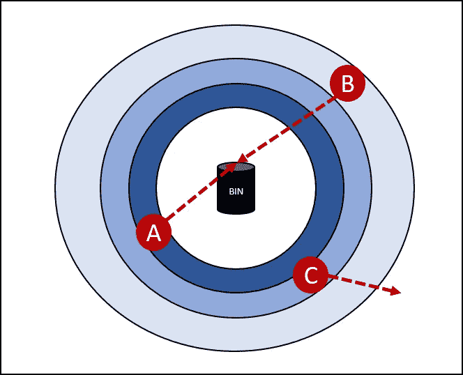

Task Environment Example

为了在 python 中创建环境，我们将图表转换为 x 和 y 值的二维尺寸，并使用方位数学来计算投掷的角度。我们使用标准化的整数 x 和 y 值，因此它们必须以-10 和 10 为界。

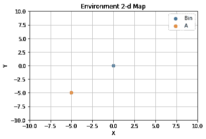

Environment Mapped to 2-d Space

## 环境概率

投掷成功的概率与投掷的距离和方向有关。因此，我们需要计算两个度量:

*   当前位置离箱子的距离
*   纸被扔出的角度和垃圾箱的真实方向之间的差异

**距离测量** 如上图所示，A 人在 set 中的位置为(-5，-5)。这是它们的当前状态，并且可以使用欧几里德距离度量来计算它们与容器的距离:

对于最终计算，我们对此进行归一化并反转该值，以便高分指示该人更接近目标箱:

因为我们已经将二维维度固定在(-10，10)之间，所以这个人可能的最大距离是 sqrt{(100) + (100)} = sqrt{200}。因此，我们对人 A 的距离得分是:

**方向测量**

然后，人 A 要做一个决定，他们是移动还是向一个选定的方向扔东西。现在，让我们想象他们选择扔纸，他们的第一次投掷是在 50 度，第二次是在正北 60 度。来自人 A 的面元的方向可以通过简单的三角学来计算:

因此，第一次投掷偏离真实方向 5 度，第二次投掷偏离真实方向 15 度。

当我们考虑好的投掷以实际方向的任一侧 45 度为界时(即，没有以错误的方式投掷)，那么我们可以使用下面的公式来计算这个选择的方向有多好。超过 45 度界限的任何方向将产生负值，并映射到概率 0:

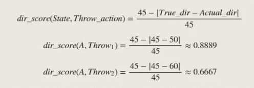

两者都相当接近，但他们的第一次投掷更有可能击中垃圾箱。

**概率计算**

因此，我们计算成功投掷的概率与这两个测量值相关:

## 创建广义概率函数

尽管之前的计算相当简单，但当我们概括这些计算并开始考虑仓位或当前仓位不固定时，需要考虑一些因素。

在我们之前的例子中，人 A 在箱子的西南方向，因此角度是一个简单的计算，但是如果我们同样将一个人放在东北方向，那么这是不正确的。此外，因为容器可以放置在任何地方，所以我们需要首先找到人相对于它的位置，而不仅仅是原点，然后用于建立所需的角度计算。

下图总结了这一点，其中我们根据人与箱子的相对位置概括了每个三角计算:

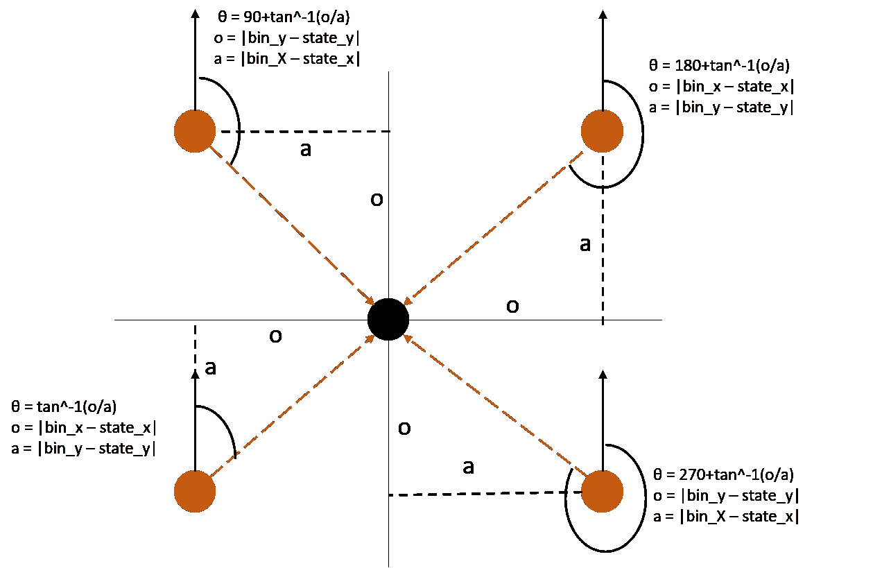

Angle Calculation Rules

记住这个图表，我们创建一个函数，它只从相对于箱子的给定位置计算投掷成功的概率。

然后，我们按照前面的图计算从人到容器的方位，并计算限制在+/- 45 度窗口内的分数。最接近真实方位的投掷得分较高，而较远的投掷得分较低，任何大于 45 度(或小于-45 度)的投掷都是负的，然后被设置为零概率。

最后，如前所示，给定当前位置，总概率与距离和方向相关。

**注意:我选择了 45 度作为边界，但是你可以选择改变这个窗口，或者手动调整概率计算，以不同的方式加权方向测量的距离。**

我们重新计算了前面的例子，发现结果和预期的一样。

## 绘制每个状态的概率

现在我们有了这个函数，我们可以很容易地计算和绘制出二维网格中所有点在固定投掷方向上的概率。

概率是由我们在前面的函数中设置的角度定义的，目前是 45 度，但如果需要的话，可以减少或增加，结果会相应地改变。我们可能还想对距离的概率进行不同的缩放。

例如，对于每个 x/y 位置，纸张以 180 度角(正南)投掷的概率如下所示。

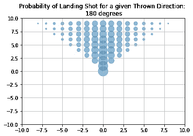

**所有投掷方向的动画剧情**

为了进一步演示这一点，我们可以迭代多个投掷方向，并创建一个交互式动画。代码变得有点复杂，您总是可以简单地使用前面的代码块，并手动更改“throw_direction”参数来探索不同的位置。然而，这有助于探索概率，可以在 Kaggle 笔记本中找到。

 [## RL 从头开始第 1 部分:定义环境| Kaggle

### 编辑描述

www.kaggle.com](https://www.kaggle.com/osbornep/rl-from-scratch-part-1-defining-the-environment) 

# 阶段 2:在概率已知的情况下，为环境寻找最佳策略

## 基于模型的方法

我们的目标是在每种状态下，通过投掷或向给定方向移动来找到最佳动作。因为我们知道概率，所以我们实际上可以使用基于模型的方法，我们将首先证明这一点，并可以使用**值迭代**通过以下公式实现这一点:

Value Iteration Update Rules

值迭代从任意函数 V0 开始，并使用以下等式从 k 个阶段的函数得到 k+1 个阶段的函数([https://artint.info/html/ArtInt_227.html](https://artint.info/html/ArtInt_227.html))。

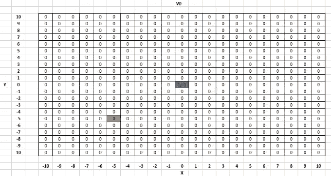

Initial Value of Each State

移动动作的计算相当简单，因为我已经定义了保证移动成功的概率(等于 1)。因此，例如，来自状态(-5，-5)的动作(1，1)的 Q 值等于:

Q((-5，-5)，MOVE(1，1)) = 1*( R((-5，-5)，(1，1)，(-4，-4))+ gamma*V(-4，-4))

现在，回报也全是 0，因此第一次计算的值很简单:

Q((-5，-5)，(1，1))= 1 *(0+伽马*0) = 0

First Q update for Move Actions

第一次更新中的所有移动操作都将以类似方式计算。成功的投掷给系统增加了价值。因此，我们可以计算特定投掷动作的 Q 值。之前，我们发现投掷方向与(-5，-5)成 50 度的概率等于 0.444。因此，此动作的 Q 值会相应更新:

Q((-5，-5)，THROW(50)) =

0.444*(R((-5，-5)，(50)，bin)+gamma * V(bin+))+

(1–0.444)*(R((-5，-5)，(50)，bin) + gamma*V(bin-))

再次，奖励被设置为 0，并且容器的正值是 1，而容器的负值是-1。因此，我们有:

Q((-5，-5)，THROW(50)) =

0.444*(0 +伽玛*1) +

(1–0.444)*(0+gamma * 1)= 0.3552–0.4448 =-0.0896

很明显，虽然第一次更新后的移动没有改变初始值，但由于距离和错过的概率，以 50 度投掷更糟。

一旦为所有状态和动作计算了每个 Q(s，a ),每个状态的值 V(s)就被更新为该状态的最大 Q 值。这个过程反复进行，直到结果收敛。

Value-Iteration Update Procedure

对于需要重复的次数没有设定限制，这取决于问题。因为我们的环境如此简单，它实际上在仅仅 10 次更新内就收敛到最优策略。

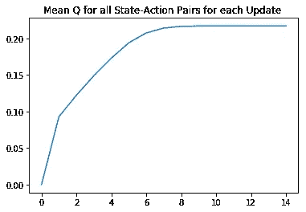

Convergence of Value-Iteration Updates

我们首先展示了基于投掷或移动的最佳动作，如下图所示。

Optimal Policy Plot v1

**改善最佳策略的可视化**

尽管图表显示了最佳行动是投掷还是移动，但它并没有告诉我们这些行动的方向。因此，我们将把每个最优动作映射到一个向量 u 和 v，并使用这些来创建一个箭图([https://matplotlib . org/API/_ as _ gen/matplotlib . axes . axes .颤图. html](https://matplotlib.org/api/_as_gen/matplotlib.axes.Axes.quiver.html) )。

我们定义箭头的比例，并使用它来定义标记为 u 的水平分量。对于移动动作，我们简单地将 x 方向上的移动乘以该因子，对于投掷方向，我们向左或向右移动 1 个单位(说明 0 或 180 度没有水平移动，90 或 270 度没有垂直移动)。

然后，利用一些基本的三角学，水平分量被用于计算垂直分量，其中我们再次考虑了会在计算中引起误差的某些角度。

我们看到一些州有多个最佳行动。那些直接朝北、朝东、朝南或朝西的可以向多个方向移动，而状态(1，1)、(1，-1)、(-1，-1)和(-1，1)可以向容器移动或投掷。

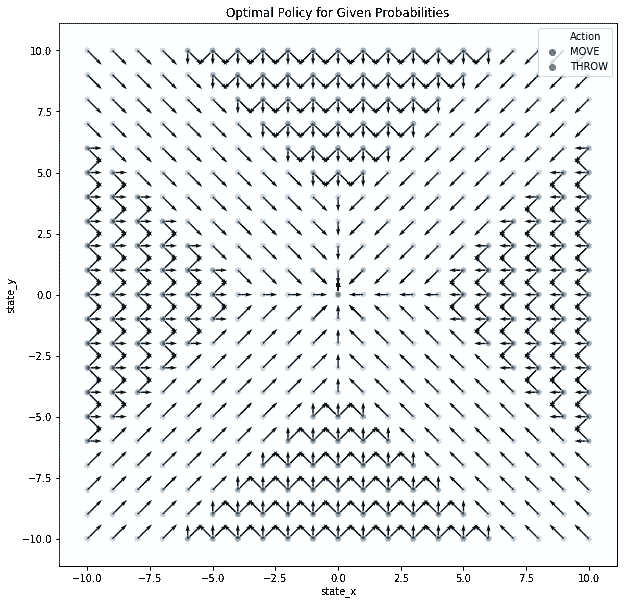

最后，我决定通过导出每个图并传递到一个小动画中来显示每次更新时最优策略的变化。

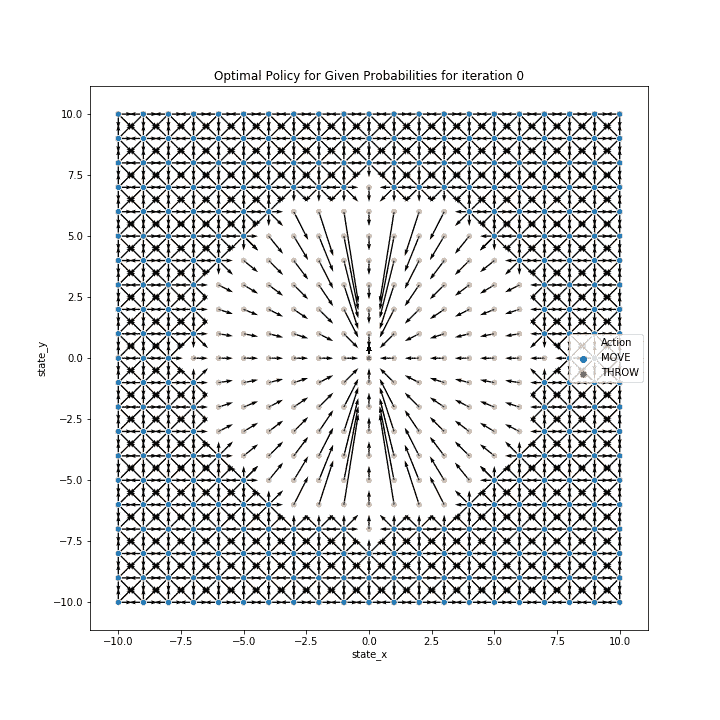

# 阶段 3:用强化学习寻找最优策略，其中概率是隐藏的

## q 学习算法

我们现在将假设概率对人来说是未知的，因此需要经验来找到最佳行动。

首先，让我们试着找到一个最优的行动，如果这个人从一个固定的位置开始，bin 像以前一样固定在(0，0)。

我们将应用 Q-learning 并用值 0 初始化所有状态-动作对，并使用更新规则:

Q learning Update Rule

我们给算法选择扔在任何 360 度方向(到一个完整的角度)或移动到当前的任何周围位置。因此有 8 个地方可以移动:北方，东北，东方等。

当它选择扔纸时，它将根据它是否击中垃圾箱而获得+1 的正奖励或-1 的负奖励，这一集结束。

需要通过多次反复试验来确定箱子的位置，然后确定是先移动还是从当前位置投掷更好。

**Q-学习伪代码**

首先，和以前一样，我们用 0 的任意值初始化 Q 表。

现在，每集的开始位置将固定为一个状态，我们还引入了每集动作数量的上限，这样就不会意外地无休止地持续下去。

如果扔出纸，每集自然结束，算法执行的动作由ε-贪婪动作选择程序决定，由此以概率ε和贪婪(当前最大)随机选择动作，否则。为了平衡移动或投掷动作之间的随机选择(因为只有 8 个移动动作，但有 360 个投掷动作)，我决定给算法 50/50 的移动或投掷机会，然后从这些动作中随机选择一个动作。

如前所述，随机移动动作不能超出房间的边界，并且一旦发现，我们根据所有可能的后续动作的最大 Q(s’，a)来更新当前 Q(s，a)。例如，如果我们从-9，-9 移动到-8，-8，Q( (-9，-9)，(1，1))将根据 Q 的最大值((-8，-8)，a)更新所有可能的动作，包括投掷动作。

如果算法投掷该纸，则计算这次投掷的成功概率，并且我们模拟在这种情况下它是成功的并且接收正的终端奖励，还是不成功的并且接收负的终端奖励。

该算法继续更新每个状态-动作对的 Q 值，直到结果收敛。

我们将在下一篇文章中分析不同参数的影响，但现在只介绍一些任意选择的参数:
—次数= 100
—阿尔法= 0.5
—伽马= 0.5
—ε= 0.2
—最大动作= 1000
—pos _ terminal _ reward = 1
—neg _ terminal _ reward =-1

用这些参数运行算法 10 次，我们为状态-5，-5 产生以下“最佳”动作:

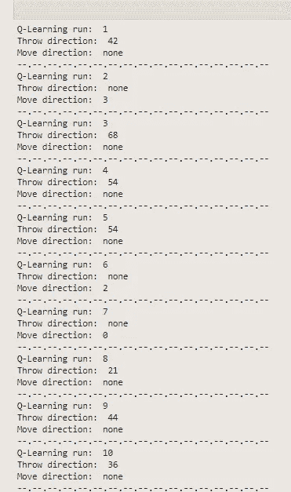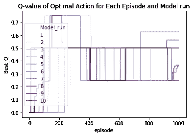

显然，这些并不一致，这严重表明这些行动实际上并不是最佳的。因此，我们需要考虑我们选择的参数如何影响输出，以及如何改进结果。

# 结论

我们在 Python 中从头引入了一个环境，并找到了最佳策略。此外，我已经开始介绍用 Q-learning 寻找最优策略的方法。

我将在后续文章中继续这一点，并通过改变参数来改善这些初始结果。现在，我希望这足以让你开始在这个例子中尝试他们自己的算法。

如果您有任何问题，请随时在下面或 Kaggle 页面上发表评论。

谢谢

哲学（philosophy 的缩写）