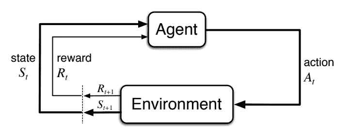
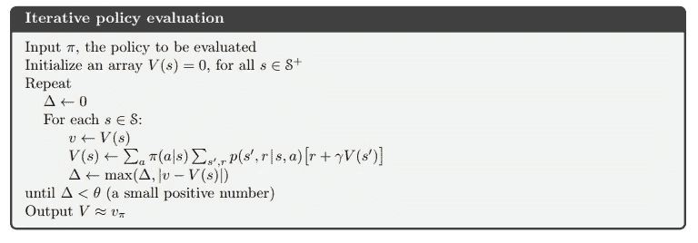
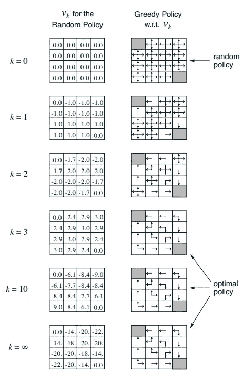

# 使用 Python 的强化学习(RL) 101

> 原文：<https://towardsdatascience.com/reinforcement-learning-rl-101-with-python-e1aa0d37d43b?source=collection_archive---------1----------------------->

## 动态规划(DP)、蒙特卡罗(MC)和时间差分(TD)来求解 gridworld 状态值函数

在这篇文章中，我们将介绍经典 RL 的一些基本概念，这些概念应用于一个名为 gridworld 的非常简单的任务，以解决所谓的状态值函数，该函数告诉我们在某个状态 *t* 下有多好，这是基于从该状态可以实现的未来奖励。为此，我们将使用三种不同的方法:(1)动态规划，(2)蒙特卡罗模拟和(3)时间差分(TD)。

## 基础知识

强化学习是一门学科，它试图开发和理解算法，以建模和训练能够与其环境交互的代理，从而最大化特定目标。这个想法非常简单:代理知道它自己的状态 *t* ，采取动作 A *t* ，这导致它进入状态 *t+1* 并接收奖励 R *t* 。下面的方案总结了这个 St →At →Rt →St+1 →At+1 →Rt+1 →St+2…的迭代过程:

**Agent-environment interaction cycle.** Source: Reinforcement Learning: An Introduction (Sutton, R., Barto A.).

这个过程的一个例子是一个机器人，它的任务是从地上收集空罐子。例如，机器人每捡一个罐头就可以得到 1 分，其余时间为 0 分。你可以想象机器人的动作可以是多种多样的，例如向前/向后/向左/向右移动，手臂向上/向下伸展等等。如果机器人足够花哨，环境的表现(感知为状态)可以是机器人前面街道的简单图片。机器人可以自由走动并学会捡罐子，为此我们会给每个罐子+1 的正奖励。然后我们可以设置一个终止状态，例如挑选 10 罐(达到奖励= 10)。机器人将在代理-环境循环中循环，直到达到终止状态，这将意味着任务或*集*的结束，众所周知。

## **grid world 任务**

**A representation of the gridworld task.** Source: Reinforcement Learning: An Introduction (Sutton, R., Barto A.).

gridworld 任务类似于前面提到的例子，只是在这种情况下，机器人必须在网格中移动，以终止状态(灰色方块)结束。每个方格代表一个州。可以采取的动作是向上、向下、向左或向右，我们假设这些动作是确定性的，这意味着每当机器人选择向上时，机器人就会向上。有一个例外，就是机器人碰壁的时候。在这种情况下，最终状态与初始状态相同(不能破壁)。最后，对于每一次对墙的移动或尝试，将给予-1 的奖励，除非初始状态是结束状态，在这种情况下，奖励将是 0，并且不需要采取进一步的行动，因为机器人将会结束游戏。

现在，机器人可以用不同的方式选择动作。机器人选择行动所依据的这些规则就是所谓的*策略*。在最简单的情况下，想象机器人将以相同的概率向每个方向移动，即有 25%的概率移动到顶部，25%移动到左侧，25%移动到底部，25%移动到右侧。让我们称之为*随机政策*。遵循这个随机策略，问题是:机器人在网格世界的每个状态/方格中有什么价值或有多好？

## **动态规划与政策迭代:评估与改进**

如果目标是以灰色方块结束，很明显灰色方块旁边的方块更好，因为遵循随机策略，有更高的机会以最终状态结束。但是我们如何量化这些方块/状态中的每一个有多好呢？或者，同样的，我们如何计算一个函数 V(S *t* )(称为*状态值函数*)，对于每个状态 S *t* 给我们它的真实值？

先说一下*值*的概念。价值可以计算为从状态 *t* 可以获得的所有未来奖励的总和。价值和回报之间的直观区别就像幸福和快乐一样。虽然即时的快乐可以令人满足，但它并不能确保长久的快乐，因为它没有考虑到所有未来的回报，它只关心下一个即时的回报。在 RL 中，一个状态的价值是相同的:总价值不仅是眼前的回报，而且是所有未来可以实现的回报的总和。

解决上述状态值函数的一种方法是使用*策略迭代*，这是一种包含在数学领域动态规划中的算法。该算法显示在下面的框中:

**Iterative policy evaluation algorithm.** Source: Reinforcement Learning: An Introduction (Sutton, R., Barto A.).

算法的关键是对 V(s)的赋值，你可以在这里找到注释:

Source: edited from Reinforcement Learning: An Introduction (Sutton, R., Barto A.)

这个想法是，我们从一个值函数开始，这个值函数是一个带有零的 4x4 维度(与网格一样大)的数组。现在，我们对每个状态进行迭代，并且我们将它的新值计算为奖励(-1)加上每个邻居状态的值的加权和(*s’*)。注意两件事:*V(s’)*是最终/邻居状态 s’的期望值(开始时，期望值为 0，因为我们用 0 初始化 value 函数)。最后， *V(s')* 乘以一个*γ*，这就是折现因子。在我们的例子中，我们使用 *gamma* =1，但是贴现因子的概念是，即时回报(等式中的 *r* )比未来回报(由*s’*的值反映)更重要，我们可以调整 *gamma* 来反映这一事实。

最后，请注意，我们可以一遍又一遍地重复这个过程，其中我们“扫描”并更新所有状态的状态值函数。这些值可以迭代更新，直到达到收敛。事实上，在迭代策略评估算法中，您可以看到我们计算了一些增量，这些增量反映了状态值相对于之前值的变化程度。这些增量随着迭代而衰减，并且应该在无穷远处达到 0。

以下是如何更新值函数的示例:

Source: Reinforcement Learning: An Introduction (Sutton, R., Barto A.)

请注意，在右栏中，随着我们更新状态值，我们现在可以生成越来越有效的策略，直到我们达到机器人必须遵循的最佳“规则”，以尽可能快地结束终止状态。

最后，这里是迭代策略评估和更新的 Python 实现。最后观察当我们达到收敛时，每个状态的增量如何衰减到 0。

## **蒙特卡罗方法**

虽然前面的方法假设我们对环境有完整的了解，但很多时候情况并非如此。蒙特卡罗(MC)方法能够直接从*经验*或*事件*中学习，而不依赖于环境动力学的先验知识。

> 术语“蒙特卡洛”通常被广泛用于任何其操作包含显著随机成分的估计方法。

有趣的是，在许多情况下，有可能根据期望的概率分布产生经验样本，但不可能获得显式形式的分布。

下面是根据 MC 估计价值函数的算法:

Source: Reinforcement Learning: An Introduction (Sutton, R., Barto A.)

解决 gridworld 任务的蒙特卡罗方法有些幼稚，但却是有效的。基本上，我们可以从网格的随机点开始产生 *n* 个模拟，并让机器人随机向四个方向移动，直到达到终止状态。对于每个模拟，我们保存 4 个值:(1)初始状态，(2)采取的行动，(3)收到的奖励和(4)最终状态。最终，模拟只是一个包含这些值的 *x* 数组的数组， *x* 是机器人在到达终点状态之前必须走的步数。

现在，从这些模拟中，我们从“体验”数组的末尾开始迭代，并将 G 计算为同一体验中的前一个状态值(由 gamma，折扣因子加权)加上该状态下收到的奖励。然后，我们将 *G* 存储在一个数组 *Returns(St)* 中。最后，对于每个状态，我们计算回报率(St)的平均值，并将其设置为特定迭代的状态值。

在这里，您可以找到这种方法的 Python 实现，它应用于前面的相同任务:worldgrid。

请注意，改变伽玛可以减少收敛时间，正如我们在伽玛=1 和伽玛=0.6 的最后两个图中看到的。这种方法好的一面是:

1.  从技术上讲，如果我们不想的话，我们不必计算所有状态的所有状态值。我们可以只关注一个特定的网格点，并从该初始状态开始所有的模拟，以采样包括该状态的情节，忽略所有其他的。这可以从根本上减少计算费用。
2.  如前所述，这种方法不需要完全了解环境动态，我们可以直接从经验或模拟中学习。

## 时差学习

最后，我们将探讨的最后一种方法是时间差分(TD)。据说第三种方法融合了动态规划和蒙特卡罗方法的优点。这里我们列举了它的一些优点:

1.  作为动态规划方法，在优化初始状态的值函数时，我们使用下一个状态的期望值来丰富预测。这个过程称为引导。
2.  和蒙特卡洛一样，我们不需要环境动力学的模型，可以直接从经验中学习。
3.  再者，不像 MC，我们不用等到一集结束才开始学习。事实上，在 TD(0)或单步 TD 的情况下，我们在每一步都在学习。这一点尤为重要，因为:一方面，学习的本质是真正的“在线”,另一方面，我们可以处理没有明确终端状态的任务，学习和无限逼近价值函数(适用于非确定性、非偶发性或时变价值函数)。

以下是使用时间差计算值函数的算法:

Source: Reinforcement Learning: An Introduction (Sutton, R., Barto A.)

这是带有 Python 实现的 jupyter 笔记本

请注意，在这种情况下，调整 alpha 和 gamma 参数对于达到收敛至关重要。

## 承认

最后，我想提一下，这里的大部分工作都是从安德鲁 g .和理查德 s .的最新版本的书《强化学习:简介》中得到启发或借鉴的，这本书是这些作者在[这里](https://drive.google.com/file/d/1opPSz5AZ_kVa1uWOdOiveNiBFiEOHjkG/view)公开的惊人的作品。