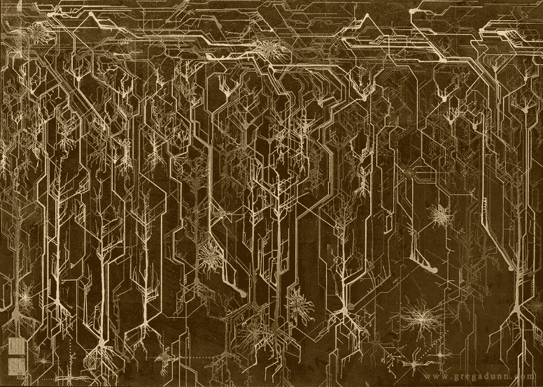
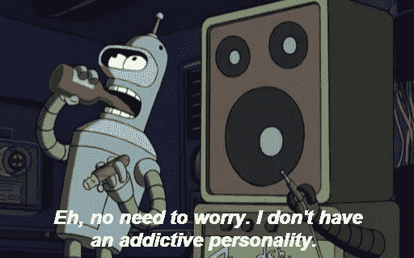
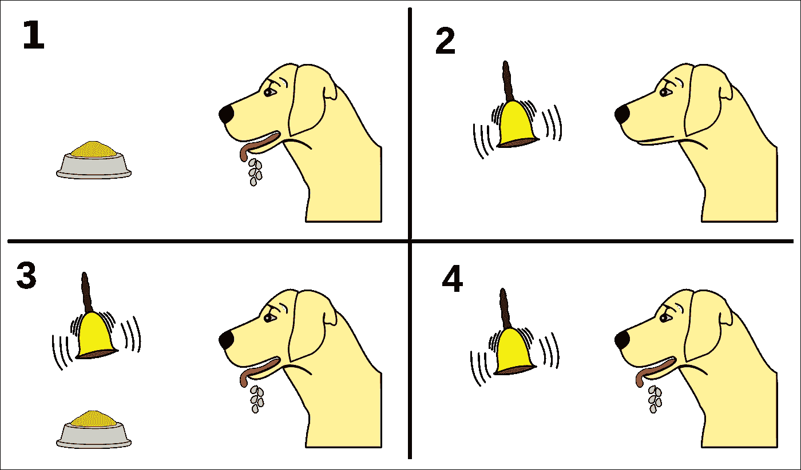

# 强化学习:自然主义者、享乐主义者和自律主义者

> 原文：<https://towardsdatascience.com/reinforcement-learning-the-naturalist-the-hedonist-and-the-disciplined-fc335ac9289c?source=collection_archive---------16----------------------->

## 塑造强化学习的思想史

Embracing the chaos of a biological brain and the order of an electronic one. — Image credit: [http://www.gregadunn.com/microetchings/cortical-circuitboard/](http://www.gregadunn.com/microetchings/cortical-circuitboard/)

对人工智能的追求总是与另一场斗争交织在一起，这场斗争更富有哲理，更浪漫，却不那么有形。对人类智能的理解。

尽管目前监督学习的突破似乎是基于优化的硬件、复杂的训练算法和过于复杂的神经网络架构，但强化学习仍然是一所老派学校。

这个想法很简单:你是一个环境中的学习者。如果我们做一般假设，你有满足自己的目标(我们不都是吗？)，然后你执行动作。基于这些行为，环境会以奖励来回应，而你，基于这些奖励，会调整你的行为来最大化你的满意度。

Does RL have limits? “The day will never come when a computer defeats a pro *shogi* player”, a proclamation by the deceased shogi player Satoshi Murayama, found its refutant in the face of [AlphaGo Zero](https://arxiv.org/abs/1712.01815). — Image Credit: [https://www.hokusai-katsushika.org/shogi-chess-board.html](https://www.hokusai-katsushika.org/shogi-chess-board.html)

没过多久，我们就在生物通过强化学习的能力和人工智能之间找到了联系。早在 1948 年，[图灵](http://www.alanturing.net/turing_archive/archive/l/l32/L32-022.html)描述了一个快乐-痛苦系统，该系统遵循几十年后建立的强化学习的当前规则。

> 智力是适应变化的能力——斯蒂芬·霍金斯

社区的第一次尝试针对的是[双陆棋](http://www.bkgm.com/articles/tesauro/tdl.html)游戏，因为它简单，提供了少量的离散状态和简单的规则。如今，我们有人工智能代理使用强化学习来玩[雅达利游戏](https://deepmind.com/research/publications/playing-atari-deep-reinforcement-learning/)、[《我的世界》](https://arxiv.org/abs/1604.07255)和[翻煎饼](https://www.youtube.com/watch?v=W_gxLKSsSIE&list=PL5nBAYUyJTrM48dViibyi68urttMlUv7e&index=2&t=0s)。那么，我们是如何完成这一切的呢？

简单的答案是深度学习。

这篇文章将冒险给出一个更长的答案。它将探索我们已经使用了几十年的强化学习算法背后的思想来源。我们最近的成功不仅仅是深度神经网络的产物，而是观察、结论和试图理解学习机制的深刻历史。

强化学习是一个起源很难追溯的领域。它的大部分理论基础要归功于控制理论家。马尔可夫决策过程是最优控制问题的离散随机版本，因此几乎所有的强化学习算法都基于控制理论中导出的解决方案，这并不奇怪。

然而，控制理论提供的背景并不足以创造强化学习。我们今天仍在使用的算法需要一些想法，如经典条件反射和时差学习，来形式化学习过程。

如果没有少数好奇的生物学家、心理学家和不墨守成规的计算机科学家，人工智能社区可能不会拥有实现学习的工具。

我们如何在不可预见的情况发生前采取行动？如何采纳我们的行为？环境如何影响我们的行为？我们如何改进？一项技能是如何习得的？

# **这是一个试错的世界**

1898 年，桑代克要么对他的猫非常生气，要么对动物的行为非常好奇。他把它放在一个配有门闩的笼子里，并在外面放了一盘诱人的鱼。那只猫只有拉一下杠杆才能逃出笼子。

猫会有什么反应？

> 没有推理，没有推论或比较的过程；没有对事物的思考，没有把两两放在一起；没有想法——动物不会想到盒子、食物或它要做的动作。

桑代克观察到，这只猫的行为似乎并不聪明:它开始在盒子里随意移动和行动。只有当它偶然拉动杠杆并释放自己时，它才开始提高逃跑的技巧。

基于这一观察，桑代克提出了一个**效应定律**，该定律指出，任何伴随着令人愉快的后果的行为都有可能被重复，任何伴随着令人不快的后果的行为都有可能被停止。

这个定律催生了操作性条件作用领域，由[斯金纳](http://psycnet.apa.org/record/1939-00056-000)在 1938 年正式定义。对于强化学习社区来说，它提供了制定代理的理由，这些代理基于奖励和它们与环境的交互来学习策略。

它也为我们提供了一个关于动物学习的新观点，因为效果定律可疑地类似于另一个当时众所周知的定律:自然选择。我们的知性可能只是一种适者生存的想法吗？

然而，有两个特征使得强化学习成为一个独特的过程:

*   这是选择性的。这使它不同于监督学习，因为一个代理通过比较它们的结果来尝试和选择它们。
*   它是联想的。这意味着，通过选择找到的替代方案与特定的情况或状态相关联，从而形成代理人的策略。自然选择是选择过程的一个主要例子，但它不是联合的。

> 我们就是我们反复做的事情。因此，优秀不是一种行为，而是一种习惯。”
> ― **亚里士多德**

# **享乐主义者的学习指南**

谈到分析人类思维，Klopf 相当简洁:

> “人的根本本性是什么？
> 
> 人是享乐主义者。"

在他备受争议的著作《享乐主义神经元——记忆、学习和智力理论》中， Klopf 运用神经科学、生物学、心理学以及他推理中令人信服的简单性和好奇心来说服我们，我们的神经元是享乐主义者。是的，你的神经元和你一样追求快感。

当面对他那个时代占主导地位的神经元模型，罗森布拉特的感知机(这是今天神经网络的构建模块)时，克洛普夫想知道:

*“如果神经元被假设为非目标寻求组件，那么目标寻求大脑功能必须被视为一种涌现现象。这种观点能解释记忆、学习以及更普遍的智力吗？*

他提出了一个新的构建模块，称为基本异质状态，作为未来人工智能研究的基础。Klopf 还认为，体内平衡，即追求良好、稳定的状态，并不是复杂系统(如人类和动物)的目的。解释植物的目的可能已经足够好了，但我们可以假设，人类在确保体内平衡后，会追求快乐的最大化，而不是稳定快乐。为什么我们的神经元会不同？

这些想法听起来可能难以置信，但它们可能会撼动人工智能的世界。Klopf 认识到，随着学习研究者几乎完全专注于监督学习，适应性行为的基本方面正在消失。根据 Klopf 的说法，所缺少的是行为的享乐方面，即从环境中获得某种结果的驱动力，控制环境朝着期望的目标发展，远离不期望的目标。

在批评当前控制论原理(机器学习在当时被称为控制论)的广泛章节中，人们可以强调三条攻击路线:

**我们应该使用深度神经网络吗？**

明确一点，两层足以让 50 年代的网络被称为深度网络。Klopf 似乎对感知器模型感到满意，但他质疑将其置于深度网络中的学习能力。Klopf 提出了一个问题，即使在今天，任何机器学习科学家都无法回避这个问题:

*“[…]然而，该算法仅适用于单层自适应网络。许多后来的研究未能为多层网络的更一般情况产生真正可行的确定性自适应机制。一般情况下的中心问题是，当系统行为不适当时，确定任何给定的网络元件应该做什么。这被证明是非常困难的，因为在一个深层网络中，单个元素的大部分输出与系统的最终输出有着高度间接的关系。”*

**AI 的目的是什么？**

Klopf 也质疑人工智能研究的追求。在他试图接近学习的正确目标时，他使用了一个论点，我在 l[after 强化学习研究者](https://www.sciencedirect.com/science/article/pii/S0921889005800259)中也发现了这个论点:

*“生命已经在这个星球上进化了大约 30 亿年。在那段时间里，90%的时间花在进化我们和爬行动物共有的神经基质上。从爬行动物时代开始，到人类的出现，只有相对短暂的 3 亿年。一个关于通向智慧的过程的问题出现了。如果进化过程花了 90%的时间开发神经基质，剩下的 10%制定有效的高级机制，为什么人工智能研究人员试图反过来做呢？”*

**智力是聪明的吗？**

在下面的摘录中，感觉桑代克和克洛普夫是强化学习的伙伴:

还有另一种方式，人工智能研究人员对智力的感知似乎与生命系统现象的本质不一致。[……]在生命系统中，智能经常不是智能的，至少不是研究人员有时看待这一现象的那种智能意义上的智能。更确切地说，生命系统中的智能常常是简单有效的。如果智能生物在日常信息处理中具有“蛮力”的天性，那将会出现很多问题。[……]即使对最聪明的人来说，更聪明的活动形式也是困难的。[……]因此，人们不禁要问，智能与更高级信息处理的联系是否让人工智能研究者对这一现象的看法过于狭隘和狭隘。在短期内，一个更温和的观点会产生更多的理论吗？

# **巴甫洛夫的狗玩双陆棋**

到目前为止，我们可能一直在谈论强化学习，但事实是，这个术语是由巴甫洛夫首先使用的，在巴甫洛夫关于条件反射的专著的 [1927 年英译本中。](https://academic.oup.com/brain/article-abstract/51/1/129/268769?redirectedFrom=PDF)

巴甫洛夫在他著名的实验[中观察到的是，当给狗提供食物并且在接近喂食时间时发出声音时，狗学会了将喂食与这种声音联系起来，并且即使在没有食物的情况下，当听到这种声音时也会分泌唾液。](https://www.simplypsychology.org/pavlov.html)

通过这一观察，巴甫洛夫为经典条件反射奠定了基础，这是第一个将时间纳入学习过程的理论。现在，RL 算法主要采用时间差学习，这意味着当计算一个动作的“质量”以做出决定时，我们还会考虑未来的回报。

1989 年，Chris Watkins 开发了 Q-learning，这是最著名的强化学习算法之一，这使得时间差和最优控制线程完全结合在一起。

1992 年，特索罗在玩双陆棋的代理人身上运用了时差学习的概念。这是说服研究界这种类型的机器学习有潜力的时刻和应用。

尽管目前的研究思路集中在深度学习和游戏上，但如果不是一群人在谈论猫、神经元和狗，我们今天就不会有强化学习领域。

可以说，我们从解决双陆棋中获得的回报，直到那一点难以想象的困难任务，激励我们进一步探索强化学习的潜力。这个强化学习的例子怎么样？