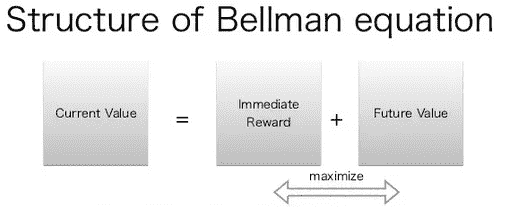
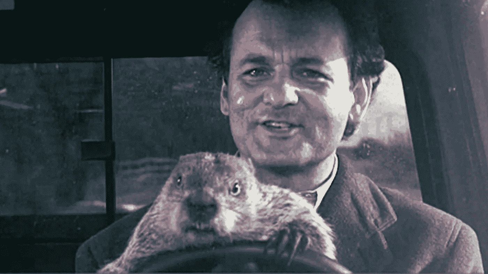
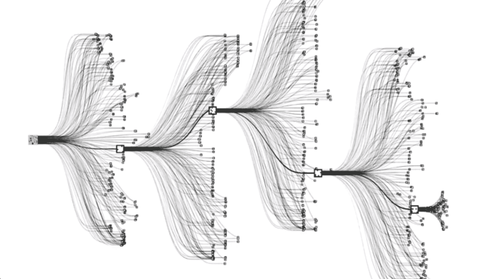
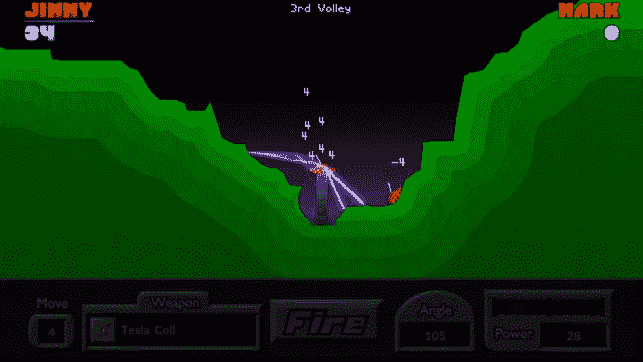
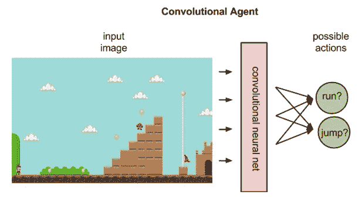

# 简介:用 OpenAI Gym 强化学习

> 原文：<https://towardsdatascience.com/reinforcement-learning-with-openai-d445c2c687d2?source=collection_archive---------0----------------------->

## 强化学习快速入门& OpenAI 健身房的基础知识。欢迎使用导航和驾驶任务实用 RL 入门指南。

了解基本的 goto 概念，快速开始强化学习，并学习使用 OpenAI gym 测试您的算法，以获得以研究为中心的可重复结果。

本文首先向您介绍强化学习的基础知识、其当前的进步以及一个有点详细的自动驾驶实际用例。在那之后，我们开始学习代码，并了解 OpenAI Gym，这是一个经常被研究人员用于标准化和基准测试结果的工具。当编码部分到来时，请打开您的终端，准备好动手操作。一个节省时间的提示:如果你想跳过基础，只想直接尝试开放式人工智能健身房，你可以直接跳到“概念理解”部分。


Earlier behavioral psychology experiments somewhat did pave the way for current **RL movement** in computer science by providing strong theoretical understanding behind the agent’s motivation. Image Courtesy: verywell

# 这里有什么区别？

主要有三类学习:监督学习、非监督学习和强化学习。让我们看看它们之间的基本区别。在监督学习中，我们试图预测一个目标值或类，其中用于训练的输入数据已经被分配了标签。而无监督学习使用未标记的数据来查看模式以形成聚类，或者进行 PCA/异常检测。RL 算法类似于寻找最佳方法以获得最大回报的优化程序，即**给出获胜策略以实现目标。**


**Consider a Banking Use Case of Different Learning Types.** Image Courtesy: [Preydata](http://preydata.com/machine-learning-use-cases/)

在强化学习中，有多种范例以自己的方式实现这种成功的策略。在复杂的情况下，计算精确的获胜策略或精确的奖励价值函数变得非常困难，特别是当我们的代理人开始从互动中学习而不是从先前获得的经验中学习时。例如，一只狗发现它最喜欢的玩具藏在新房子里。这只狗会搜索房子，并根据它的互动得到一个关于房子示意图的大概想法。但是，仍然有一个很好的机会，如果它位于一个新的未探索的位置，狗会发现很难再找到隐藏的玩具。

这种基于交互的学习通常也被称为**无模型学习**，其中代理不具有环境的确切知识，即代理不存储状态-动作概率转移函数的知识。它试图接近成功的策略(即政策)或回报-价值收益(即价值函数)。在主人的房子里寻找他的隐藏玩具的同一只狗将具有先前的经验，即先前的环境知识，并且将在房子内的任何位置舒适地寻找玩具。这种寻找隐藏玩具的学习在 RL 中被称为**基于模型的学习**。

# 强化学习:导论

根据强化学习的定义，一个主体在给定的环境中以连续或离散的方式采取行动，以最大化编码在其中的某种回报概念。听起来太深奥了，但它的研究基础可以追溯到经典的行为主义心理学、博弈论、优化算法等。但是，对我们有好处的是，已经为我们做了很多*‘搭建舞台’*的工作，让我们直接进入问题公式化的世界，发现新事物。

本质上，其中最重要的是，在完全已知/可观测的确定性环境中，智能体的强化学习场景可以被公式化为动态规划问题。从根本上说，这意味着代理人必须以系统的方式执行一系列步骤，以便它能够学习理想的解决方案，并从奖励值中获得指导。用数学术语表达这种情况的方程被称为贝尔曼方程，我们将在某个时候看到它的作用。



It takes into account some initial choices and future choices to come to formulate decision problems at a certain point.

# 代理和环境

在进一步理解关于 RL 的技术细节之前，让我们首先定性地正式定义*主体*和*环境*的概念。环境是智能体的世界，它通过在其上执行给定的动作来改变智能体的状态。智能体是通过传感器感知环境并用执行器执行动作的系统。在下面的情况中，Homer(左)和 Bart(右)是我们的 ***代理*** ，世界是他们的 ***环境*** 。他们在其中采取行动，并通过获得快乐或满足作为回报来改善他们的存在状态。


**Positive and Negative rewards increase and decrease the tendency of a given behavior respectively. Eventually leading to better results in that environment over a period of time. Image Courtesy:** [**psychestudy**](https://www.psychestudy.com/behavioral/learning-memory/operant-conditioning/reinforcement-punishment/positive-negative-reinforcement)

# 最近的进展和范围

从 IBM 的深蓝 v/s Kasparov 以来最受欢迎的游戏系列开始，它为 AI 创造了巨大的宣传。以及围棋比赛系列中 AlpaGo v/s Lee Sedol 对于深度强化学习智能体的类人感知。控制一个棋盘配置比宇宙中的原子还要多的游戏来对抗一个 *den 9* master 显示了这样的智能系统所拥有的力量。此外，最近 RL 的研究突破和用 OpenAI 的 Dota 机器人战胜世界职业选手也值得称赞。随着代理人接受处理如此复杂和动态环境的训练，掌握这些游戏是测试人工智能代理人处理非常复杂的类似等级的情况的极限的一个例子。就应用而言，像无人驾驶汽车、智能无人机这样已经很复杂的应用正在现实世界中运行。

我们再了解一些强化学习的基础知识，然后从 OpenAI 健身房开始做自己的代理。之后，我会建议你向深度学习迈进，处理更复杂的情况。所有 RL 应用的范围超出想象，可以应用于许多领域，如时间序列预测、医疗保健、供应链自动化等。但是，这里我们将讨论自动驾驶汽车和导航任务中最受欢迎的应用用例之一。



**Got the reference ?**

> 一遍又一遍地在同一状态上运行算法的独特能力有助于它学习特定状态的最佳行动，以前进到理想的下一个状态，这本质上相当于打破时间的构造，让人类几乎在任何时间都可以获得无限的学习经验。



**Restricting Lookaheads with Monte Carlo Look Search Tree:** AlphaGo must restrict Breath and Depth of search among all board configurations with heuristics information supplied by neural network training and determining winning policy for max reward. Image Courtesy: [ajudaily](http://ajudaily.com)

# 概念理解

以 RL 为框架，agent 通过一定的动作来改变 agent 的状态，每个动作都与奖励值相关联。它还使用一个策略来确定它的下一个动作，该策略由一系列步骤组成，这些步骤将状态-动作对映射到计算出的奖励值。策略可以定性地定义为代理在给定时间的行为方式。现在，策略可以是确定性的和随机的，找到一个最优策略是解决给定任务的关键。

同样，**不同*动作*在不同*状态*会有不同的关联*奖励值*。**就像*口袋坦克游戏中的“开火”命令一样*不能总是有相同的奖励值与之相关，因为有时最好保留一个战略上有利的位置。为了以有计划的方式处理这种具有如此巨大组合的复杂动态问题，我们需要一个 Q 值(*或动作值*)表，该表存储一个 ***映射*** 或 ***状态-动作对以进行奖励。***



Depending on terrain and position along with power combinations being available our reward values will vary even after being present in the same state.

现在，将 RL 环境中的**环境**定义为功能组件，它简单地将给定状态下的动作作为输入，并返回与动作-状态对相关联的新状态和奖励值。



For Atari Environments like Mario, Atari, PAC-MAN etc.; Q-learning with CNN loss approximation can be used. Image Courtesy: [leonardoaraujosantos](https://leonardoaraujosantos.gitbooks.io/artificial-inteligence/content/deep_reinforcement_learning.html)

然而，有趣的是，当环境变得非常复杂，难以用计算限制性迭代算法处理时，神经网络凭借其学习状态-动作对的能力轻松进入画面，这被称为深度 RL。喜欢玩早期的游戏，如马里奥，雅达利，吃豆人等。

这里，我们将只限于简单的 Q 学习，即 w/o 神经网络，其中 Q 函数将状态-动作对映射到最大值，并结合即时奖励和未来奖励，即对于新状态，学习值是当前奖励加上未来奖励估计值。将其量化为一个具有不同参数的方程，如学习率和折扣因子，以指导代理的行动选择。我们得出以下方程:在结构上，它与贝尔曼方程有许多相似之处。


**Q-Function Equation, tells about the maximum expected cumulative award for a given pair.** Image Courtesy: Wikipedia

# 动手:为什么要开健身房？

> 2016 年《自然》杂志的一项调查表明，超过 70%的研究人员试图重现另一位科学家的实验，但失败了，超过一半的人没能重现他们自己的实验。

OpenAI 是为了消除论文中缺乏标准化的问题而创建的，其目的是通过提供易于设置的多种多样的环境来创建更好的基准。这个工具的目的是增加人工智能领域的可复制性，并提供工具让每个人都可以学习人工智能的基础知识。

> 打开你的终端，准备一些 CTRL+C 和 CTRL+V 的工作！！但是，我当然会建议反对。

# 让我们一起去健身吧

什么是 OpenAI 健身房？这个 python 库给了我们大量的测试环境来处理我们的 RL 代理的算法，这些算法带有用于编写通用算法和测试它们的共享接口。让我们开始吧，只需在终端上键入`pip install gym`即可轻松安装，您将获得一些经典环境来开始在您的代理上工作。复制下面的代码并运行它，你的环境将被加载。您可以在这里查看其他可用的环境，如 Algorithmic、Atari、Box2D 和 Robotics [，并使用下面列出的第二个代码片段组件列出所有可用的环境。](https://gym.openai.com/envs)

```
# 1\. It renders instances for 500 timesteps, performing random actions.
import gym
env = gym.make('Acrobot-v1')
env.reset()
for _ in range(500):
    env.render()
    env.step(env.action_space.sample())
# 2\. To check all env available, uninstalled ones are also shown.
from gym import envs 
print(envs.registry.all())
```

当对象通过一个动作与环境交互时，然后 *step()* 函数返回通常表示环境下一个状态的`observation`、`reward`前一个动作的奖励浮动、`done`当该重置环境或实现的目标时，以及`info`用于调试的 *dict* ，如果它包含环境上一个状态的原始概率，它可以用于学习。从下面的代码片段看它是如何工作的。另外，观察`Space`类型的`observation`在不同环境下有何不同。

```
import gym
env = gym.make('MountainCarContinuous-v0') # try for different environments
observation = env.reset()
for t in range(100):
        env.render()
        print observation
        action = env.action_space.sample()
        observation, reward, done, info = env.step(action)
        print observation, reward, done, info
        if done:
            print("Finished after {} timesteps".format(t+1))
            break[Output For Mountain Car Cont Env:] 
[-0.56252328  0.00184034]
[-0.56081509  0.00170819] -0.00796802138459 False {}[Output For CartPole Env:]
[ 0.1895078   0.55386028 -0.19064739 -1.03988221]
[ 0.20058501  0.36171167 -0.21144503 -0.81259279] 1.0 True {}
Finished after 52 timesteps
```

上面代码中的*动作空间*是什么？`action-space` & `observation-space`描述了特定环境的动作&状态参数的有效格式。只需看看返回值。

```
import gym
env = gym.make('CartPole-v0')
print(env.action_space) #[Output: ] Discrete(2)
print(env.observation_space) # [Output: ] Box(4,)
env = gym.make('MountainCarContinuous-v0')
print(env.action_space) #[Output: ] Box(1,)
print(env.observation_space) #[Output: ] Box(2,)
```

离散为非负的可能值，大于 0 或 1 相当于左右移动*横拉杆*平衡。方框代表 n 维阵列。这些标准接口有助于为不同的环境编写通用代码。因为我们可以简单地检查边界`env.observation_space.high/[low]`并将它们编码到我们的通用算法中。

# 一幅插图

这里，我们使用 *Python3.x* 作为下面 Q-Learning 算法的高亮代码样本。

```
sudo pip install 'gym[all]' 
```

让我们开始构建我们的 Q 表算法，它将尝试解决 FrozenLake 导航[环境](https://gym.openai.com/envs/FrozenLake8x8-v0/)。在这种环境下，我们的目标是在一个可能有洞的冰湖上达到目标。这是这个玩具文本环境是如何描绘表面的。

```
SFFF       (S: starting point, safe)
FHFH       (F: frozen surface, safe)
FFFH       (H: hole, fall to your doom)
HFFG       (G: goal, where the frisbee is located)
```

q 表包含映射到奖励的状态-动作对。因此，我们将构建一个数组，在算法执行期间将不同的状态和动作映射到奖励值。它的维度将清楚地|陈述| x |动作|。让我们用 Q 学习算法的代码来写。

```
import gym
import numpy as np # 1\. Load Environment and Q-table structure
env = gym.make('FrozenLake8x8-v0')
Q = np.zeros([env.observation_space.n,env.action_space.n])
# env.observation.n, env.action_space.n gives number of states and action in env loaded# 2\. Parameters of Q-learning
eta = .628
gma = .9
epis = 5000
rev_list = [] # rewards per episode calculate# 3\. Q-learning Algorithmfor i in range(epis):
    # Reset environment
    s = env.reset()
    rAll = 0
    d = False
    j = 0
    #The Q-Table learning algorithm
    while j < 99:
        env.render()
        j+=1
        # Choose action from Q table
        a = np.argmax(Q[s,:] + np.random.randn(1,env.action_space.n)*(1./(i+1)))
        #Get new state & reward from environment
        s1,r,d,_ = env.step(a)
        #Update Q-Table with new knowledge
        Q[s,a] = Q[s,a] + eta*(r + gma*np.max(Q[s1,:]) - Q[s,a])
        rAll += r
        s = s1
        if d == True:
            break
    rev_list.append(rAll)
    env.render()print("Reward Sum on all episodes " + str(sum(rev_list)/epis))
print("Final Values Q-Table")
print(Q)
```

如果您对使用其他环境感兴趣，您可以选择使用下面突出显示的代码片段。


**Frozen Lake Environment Visualization Diagram.**

```
# Reset environment
s = env.reset()
d = False
# The Q-Table learning algorithm
while d != True:
    env.render()
    # Choose action from Q table
    a = np.argmax(Q[s,:] + np.random.randn(1,env.action_space.n)*(1./(i+1)))
    #Get new state & reward from environment
    s1,r,d,_ = env.step(a)
    #Update Q-Table with new knowledge
    Q[s,a] = Q[s,a] + eta*(r + gma*np.max(Q[s1,:]) - Q[s,a])
    s = s1
# Code will stop at d == True, and render one state before it
```

但是请记住，即使有一个公共接口，不同环境的代码复杂度也是不同的。在上面的环境中，我们只有一个简单的 64 状态环境，只需要处理很少的动作。我们能够非常容易地将它们存储在一个二维数组中用于奖励映射。现在，让我们考虑更复杂的环境案例，如 *Atari envs* ，看看需要什么方法。

```
env = gym.make("Breakout-v0")
env.action_space.n
Out[...]: 4
env.env.get_action_meanings()
Out[...]: ['NOOP', 'FIRE', 'RIGHT', 'LEFT']
env.observation_space
Out[...]: Box(210, 160, 3)
```

需要用 210×160×3 张量来表示，这使得我们的 Q 表更加复杂。同样，每个动作在 **k** 帧的持续时间内重复执行，其中 **k** 是从{2，3，4}中均匀采样的。RGB 通道中有 33，600 个像素，值的范围从 0 到 255，环境显然变得过于复杂。这里不能使用简单的 Q 学习方法。深度学习及其 CNN 架构是这个问题的解决方案，也是这篇介绍性文章后续应该关注的主题。

# 结论

现在，有了上面的教程，你就有了关于健身房的基本知识，以及开始健身所需要的一切。Gym 也兼容 TensorFlow & PyTorch，但为了保持教程简单，我没有在这里使用它们。在试用了*体育馆* *软件包*之后，你必须开始使用[稳定基线 3](https://stable-baselines3.readthedocs.io/en/master/) 来学习 RL 算法的良好实现，以比较你的实现。要查看所有 OpenAI 工具，请查看它们的 [github](https://github.com/openai) 页面。人工智能是一个不断扩展的领域，在许多领域都有应用，它将在未来的人工智能突破中发挥重要作用。希望你继续你的 RL 之旅&感谢阅读！！

# 光荣的插头


**C’Mon… What did you expect?** Image Courtesy: MCU

是的，和你分享*可耻的*然而 ***光荣的*** 入门项目插头，以防你刚入门强化学习。选择这些实践项目的额外优势是获得完整的导师支持&美妙的免费强化学习资源，如书籍、视频等。有趣的是，有两个现场项目我会推荐给你进一步研究:

*   如果你想在*初级/中级***水平的*完整强化学习概念*的基础上开始一个实践项目，你可以选择下面嵌入的 liveProject。在这里，在这个 liveProject 中，我讨论了实现最佳性能的自动驾驶汽车所需的研究原则。****

*[](https://www.manning.com/liveproject/reinforcement-learning-for-self-driving-vehicles?utm_source=ashishrana&utm_medium=affiliate&utm_campaign=liveproject_rana_reinforcement_7_6_21&a_aid=ashishrana&a_bid=8f38c809) [## 自动驾驶车辆的强化学习

### 在这个 liveProject 中，您将开发一个可以模拟独立驾驶的 AI 驾驶代理。你的代理应该是…

www.manning.com](https://www.manning.com/liveproject/reinforcement-learning-for-self-driving-vehicles?utm_source=ashishrana&utm_medium=affiliate&utm_campaign=liveproject_rana_reinforcement_7_6_21&a_aid=ashishrana&a_bid=8f38c809) 

另外，第一个里程碑是这个 liveProject 的 ***免费*** 练习。即使你不推进 liveProject，我保证你会从第一个里程碑的*中了解到很多关于 ***自动驾驶*** RL 任务的信息。干杯！*

***重要提示:**如果你在 2021 年 7 月 26 日*之前来到这里，并且有兴趣继续进行第一个 liveProject。请使用代码 ***lprana*** 在这个项目上你会得到 45%的折扣。太棒了。！**

*   **第二，如果你特别想把你的注意力和努力放在 RL 的深度 Q 学习概念上。请随时查看下面的 liveProject。第一个里程碑是免费练习！**

**[](https://www.manning.com/liveproject/deep-reinforcement-learning-for-self-driving-robots?utm_source=ashishrana&utm_medium=affiliate&utm_campaign=liveproject_galbraith_deep_6_2_21&a_aid=ashishrana&a_bid=e4173afc) [## 自动驾驶机器人的深度强化学习

### 在这个 liveProject 中，您将研究强化学习方法，它将允许自动机器人推车…

www.manning.com](https://www.manning.com/liveproject/deep-reinforcement-learning-for-self-driving-robots?utm_source=ashishrana&utm_medium=affiliate&utm_campaign=liveproject_galbraith_deep_6_2_21&a_aid=ashishrana&a_bid=e4173afc) 

朝现在！如果你选择了第一个项目，我们在那里见…***