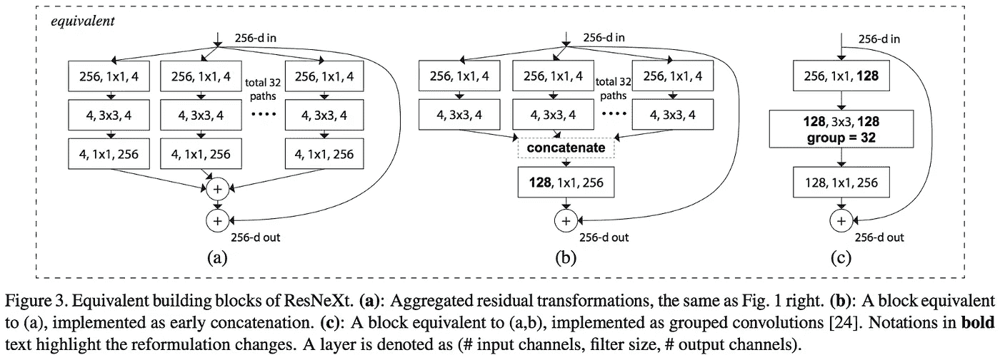
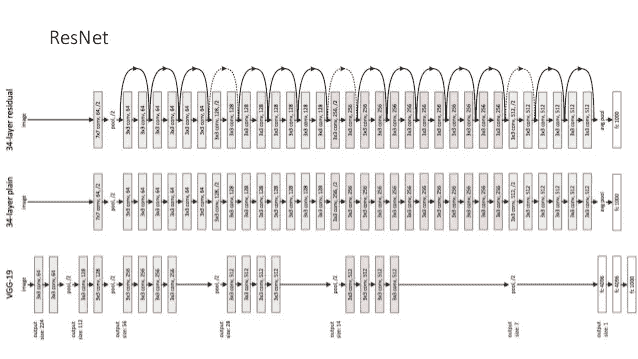

# 剩余块 ResNet 的构建块

> 原文：<https://towardsdatascience.com/residual-blocks-building-blocks-of-resnet-fd90ca15d6ec?source=collection_archive---------1----------------------->

理解一个剩余块是相当容易的。在传统的神经网络中，每一层都反馈到下一层。在有剩余块的网络中，每一层都馈入下一层，并直接馈入大约 2-3 跳之外的层。就是这样。但是，理解为什么首先需要它，为什么它如此重要，以及它看起来与其他一些最先进的架构有多么相似，这是我们要关注的地方。关于残差块为什么如此棒，以及它们如何&为什么是可以使神经网络在广泛的任务中表现出最先进性能的关键思想之一，有不止一种解释。在深入细节之前，这里有一张残余岩块的实际样子的图片。


Single Residual Block. (img [src](https://arxiv.org/abs/1512.03385))

我们知道神经网络是通用的函数逼近器，并且精度随着层数的增加而增加。但是导致精度提高的增加的层数是有限的。因此，如果神经网络是通用函数逼近器，那么它们应该能够学习任何简单或复杂的函数。但事实证明，由于一些问题，如消失梯度和维数灾难，如果我们有足够深的网络，它可能无法学习像身份函数这样的简单函数。这显然是不可取的。

此外，如果我们不断增加层数，我们会发现精度会在某一点饱和，最终会下降。并且，这通常不是由于过度配合造成的。因此，看起来较浅的网络比较深的网络学习得更好，这是非常违背直觉的。但这是在实践中看到的，通常被称为退化问题。

没有根导致退化问题和深度神经网络无法学习身份函数，让我们开始考虑一些可能的解决方案。在退化问题中，我们知道较浅的网络比添加了几层的较深的网络表现得更好。那么，为什么不跳过这些额外的层，至少匹配浅层子网的精度。但是，如何跳过层呢？

可以使用跳过连接或剩余连接跳过几层的训练。这就是我们在上图中看到的。事实上，如果你仔细观察，我们可以只依靠跳过连接直接学习一个恒等式函数。这就是为什么跳过连接也被称为标识快捷连接的确切原因。所有问题的一个解决方案！

但为什么称之为残余呢？残渣在哪里？是时候让我们内心的数学家浮出水面了。让我们考虑一个神经网络块，它的输入是 *x，*，我们想知道真实的分布 *H(x)* 。让我们将这两者之间的差(或残差)表示为

```
*R(x)* = Output — Input = *H(x)* — *x*
```

重新排列，我们得到，

```
*H(x)* = *R(x)* + *x*
```

我们的残差块总体上试图学习真实输出， *H(x)。如果*你仔细观察上面的图像，你会意识到，既然我们有一个来自 *x* 的身份连接，那么这些层实际上是在试图学习剩余的， *R(x)* 。总而言之，传统网络中的各层正在学习真实输出( *H(x)* )，而残差网络中的各层正在学习残差( *R(x)* )。因此得名:*残块*。

还观察到，学习输出和输入的残差比只学习输入更容易。作为一个额外的优势，我们的网络现在可以通过简单地将残差设置为零来学习身份函数。如果你真正理解反向传播，以及随着层数的增加，梯度消失的问题变得有多严重，那么你可以清楚地看到，由于这些跳跃连接，我们可以将更大的梯度传播到初始层，这些层也可以像最终层一样快速地学习，使我们能够训练更深的网络。下图显示了如何为最佳梯度流排列剩余块和标识连接。已经观察到，批量标准化的预激活通常给出最好的结果(即，下图中最右边的剩余块给出最有希望的结果)。


Types of Residual Block. (img [src](https://arxiv.org/abs/1603.05027))

除了上面已经讨论过的解释之外，还有更多对剩余块和结果的解释。在训练 ResNets 时，我们或者训练残差块中的层，或者使用跳过连接来跳过这些层的训练。因此，基于误差在网络中如何反向流动，网络的不同部分将以不同的速率针对不同的训练数据点进行训练。这可以被认为是在数据集上训练不同模型的集合，并获得尽可能好的准确性。

跳过一些剩余块层中的训练也可以从乐观的角度来看。通常，我们不知道神经网络所需的最佳层数(或残差块),这可能取决于数据集的复杂性。不是将层数作为一个重要的超参数来调整，而是通过在我们的网络中增加跳过连接，我们允许网络跳过对那些无用的和不增加整体精度的层的训练。在某种程度上，跳跃连接使我们的神经网络动态地在训练过程中优化调整层数。

下图显示了残差块的多种解释。



Different interpretations of Residual Block. (img [src](https://arxiv.org/abs/1611.05431))

让我们稍微了解一下跳跃连接的历史。跳过层间连接的想法最初是在高速公路网络中提出的。高速公路网络与控制通过它们的信息量的门有跳跃连接，这些门可以被训练成有选择地打开。在 LSTM 网络中也可以看到这种想法，它控制着网络所看到的过去数据点的信息流量。这些门的工作方式类似于控制来自先前看到的数据点的内存流。下图显示了同样的想法。


Similar to LSTM Block. (img [src](https://colah.github.io/posts/2015-08-Understanding-LSTMs/))

剩余块基本上是高速公路网络的特例，其跳跃连接中没有任何门。实质上，残余块允许内存(或信息)从初始层流向最后一层。尽管在它们的跳跃连接中没有门，剩余网络在实践中表现得和任何其他公路网络一样好。在结束本文之前，下面是所有剩余块的收集如何完成到 ResNet 中的图像。



ResNet architectures. (img [src](https://arxiv.org/abs/1512.03385))

如果您有兴趣了解更多关于 ResNet 及其不同变体的信息，请查看这篇[文章](/an-overview-of-resnet-and-its-variants-5281e2f56035)。