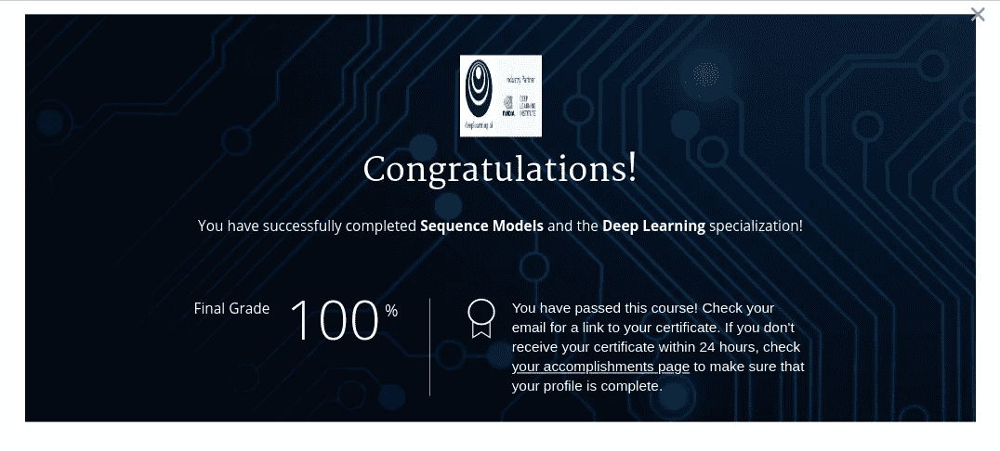

# Deeplearning.ai 课程回顾

> 原文：<https://towardsdatascience.com/review-of-deeplearning-ai-courses-aed1328e4ffe?source=collection_archive---------2----------------------->

最近在 [Coursera](https://www.coursera.org/specializations/deep-learning) 上完成了[吴恩达](https://medium.com/u/592ce2a67248?source=post_page-----aed1328e4ffe--------------------------------)的 [deeplearning.ai](https://www.deeplearning.ai/) 专精的最后一门课程，想分享一下自己上这套课程的想法和体会。我发现 [Arvind N](https://medium.com/u/6e6d06d4b300?source=post_page-----aed1328e4ffe--------------------------------) 对前三门课程的[评论在决定参加第一门课程时非常有用，所以我希望，也许这也能对其他人有用。](/thoughts-after-taking-the-deeplearning-ai-courses-8568f132153)

# TL；博士；医生

选修这五门课很有教育意义。内容结构良好，对于至少对矩阵代数有一点了解的每个人来说都很容易理解。需要一些编写 Python 代码的经验。总体来说，编程作业设计得很好。除了它们有益的特性之外，研究它们也是非常令人愉快的。最后，在我看来，进行这种专业化是让你开始深度学习的各种主题的一种奇妙方式。在参加完这些课程后，你应该知道你想进一步专攻深度学习的哪个领域。

# 背景

我必须承认，在选修这些课程之前，我对神经网络(NN)持怀疑态度。我来自传统的机器学习(ML)，我不认为一种黑盒方法，如将一些功能(*神经元*)切换在一起，我无法单独训练和评估，可能会胜过一个经过微调和良好评估的模型。深度学习(DL)和人工智能(AI)成为如此热门的词汇，这一事实让我更加怀疑。

尽管如此，我还是不时地从我认真对待的人那里听说 DL。尤其是他在苏黎士[Apache Spark meetup](https://www.meetup.com/de-DE/spark-zurich/)上由 [Shoaib Burq](https://medium.com/u/3f167de073a?source=post_page-----aed1328e4ffe--------------------------------) 所做的一次演讲，是一次思想转变。所以去年我决定去看看，在所有的喧嚣背后到底是什么。首先，我从看一些视频、读博客和做一些教程开始。不幸的是，这助长了我的假设，即它背后的数学对我来说可能有点太高级了。我非常喜欢数学的实用方面，但是当谈到为了推导而推导或抽象理论时，我绝对不喜欢。

当我第一次听说 [deeplearning.ai](https://www.deeplearning.ai/) 专业化时，我真的很兴奋。在之前的课程中，我体验到 Coursera 是一个非常适合我学习方式的平台。从他的第一个大型开放式在线课程(MOOC)的视频中，我知道[吴恩达](https://medium.com/u/592ce2a67248?source=post_page-----aed1328e4ffe--------------------------------)是一个伟大的 ML 领域的讲师。但是我从来没有做过那门课的作业，因为[八度](https://www.gnu.org/software/octave/)。读到实际课程的作业现在是用 [Python](https://www.python.org/) (我的主要编程语言)编写的，最终让我相信，这一系列课程可能是以结构化方式进入 DL 领域的一个好机会。但是首先，我没有足够的时间做课程作业。

这种情况发生了变化，去年年中，我遭遇了一场健康问题(并不严重，但无论如何都很麻烦)。当我感觉好一点的时候，我决定最终报名参加第一个课程。通常情况下，我只参加我想学的主题的特定课程，看完内容后尽快完成作业。但这一次，我决定彻底地、一步一步地、一门一门地做。我希望，关于认知挑战性话题的工作可以帮助我尽快康复。做编程作业是一个受欢迎的机会，可以让你重新回到编程和在电脑上正常工作的状态。事实上，在最初的几个星期里，我只能坐在显示器前很短很有限的时间。所以我必须打印出作业，在一张纸上解决，然后在提交给评分员之前输入缺失的代码。此外，一个积极的，意想不到的副作用在开始时发生了。在前三门课程中有可选的视频，安德鲁采访 DL 的英雄(辛顿，本吉奥，卡帕西等)。这些视频不仅信息量大，而且很有激励性，至少对我来说是这样——尤其是和伊恩·古德菲勒一起的那个。

# 期待什么

在专业层面上，当你对这个话题相当陌生时，你可以通过做 [deeplearning.ai](https://www.deeplearning.ai/) 专业化学到很多东西。首先，你学习神经网络的基本概念。简单序列模型中的*正向传递*是什么样子，什么是*反向传播*等等。我偶尔读到和听说过 NN 的基本构建模块。但从来没有像吴恩达[和 T7]所呈现的那样清晰和有条理。因此，我觉得这套课程是一种非常省时的学习基础知识的方式，比我之前浏览的所有教程、博客帖子和讲座都更有价值。](https://medium.com/u/592ce2a67248?source=post_page-----aed1328e4ffe--------------------------------)

顺便提一下，第一堂课很快证明了这个假设是错误的，即数学对我来说可能太深奥了。事实上，对于大多数我从上学或学习时就熟悉的概念——我没有技术硕士学位，所以不要让你被公式中一些看起来很花哨的希腊字母吓跑。有了关于如何做矩阵代数的肤浅知识，利用导数计算梯度，以及对线性回归和梯度下降算法的基本理解，你就可以开始了——Andrew 会教你剩下的。

尽管在围绕该技术的大量营销材料中另有说明，但你也在第一堂入门课中了解到，神经网络在生物模型中没有对应的内容。神经元中的信号处理与神经网络所包含的函数(线性函数和非线性函数)非常不同。

对新手非常有用的是了解 DL 项目的不同方法。是使用*预先训练好的*模型进行*迁移学习*还是采取*端到端学习*的方式。此外,*数据扩充*的概念也被提出，至少在方法论层面上。

在更高级的课程中，您将了解到*图像识别*(课程 4)和*序列模型*(课程 5)的主题。这里分别教授了*卷积神经网络*(CNN)*递归神经网络* (RNN)的最常见变体。我认为这是这个专业的主要优势，你可以获得广泛的最先进的模型和方法。这可能不会让你成为数字图书馆的专家，但你会感觉到在这个领域的哪个部分你可以进一步专业化。

我发现对加深理解非常有用的是用 Franç ois Chollet 的书“用 Python 进行深度学习”来补充课程工作。这门技术的方法论基础不在本书的讨论范围之内，在课程讲座中有很好的阐述。另一方面，DL 项目的实践方面，在课程中有所涉及，但在作业中没有广泛实践，在书中有很好的涵盖。尤其是数据预处理部分，在课程的编程作业中肯定是缺失的。在第二次和第四次 MOOC 中，你确实得到了关于使用 DL 框架的教程( [tensorflow](https://www.tensorflow.org/) 和 [Keras](https://keras.io/) )，但是很明显，Keras 的最初创建者写的一本书将教你如何更深刻地实现 DL 模型。

你能从这五门课程中具体期待什么，以及做课程工作的一些个人经验，列在下面的部分。之后，我会以一些最后的想法来结束。

# 神经网络和深度学习

本课程教你神经网络的基本构建模块。您将了解*逻辑回归*、*成本函数*、*激活*以及(*sochastic-*&*mini-batch-*)*梯度下降*如何工作。您还可以快速了解 Python 中 numpy 的矩阵代数。

Sho ya right, it’s a cat picture & it’s >magic< Bert :)

这门课程是一门简单的入门课程。吴恩达是一个很棒的讲师，即使是数学背景不太好的人也能很好地理解课程内容。

对于这些任务，你从一个用于二进制分类的*单感知器*开始，升级到一个用于相同任务的*多层感知器*，最后用 numpy 编码一个深度神经网络。特别是这两个图像分类作业在某种意义上是有益的，你将从中获得一个工作的猫分类器。正如你在图片上看到的，它决定了一只猫是否在图像上— *咕噜声*；)

# 改进深度神经网络:超参数调整、正则化和优化

顾名思义，在这门课程中，你将学习如何微调你的深层神经网络。最常见的问题，如*过度拟合*或*消失/爆炸渐变*在这些讲座中得到解决。你学习如何找到正确的*权重初始化*，使用*辍学*、*正规化*和*正规化*。当然，不同的优化算法*的变体*是如何工作的，以及哪一个是适合你的问题的选择。

对我来说，本课程最有用的见解是使用随机值进行超参数调整，而不是更结构化的方法。事实证明，在一个确定的空间和正确的尺度上选取随机值，比使用网格搜索更有效，你应该熟悉传统的 ML。

这门课的作业有点枯燥，我猜是因为他们要处理的内容。但是，每一个都很有启发性——尤其是关于*优化方法*的那一个。作为奖励，你将在课程结束时获得一份关于如何使用 tensorflow 的教程，这对后续课程中即将到来的作业非常有用。

# 构建机器学习项目

这绝对是一只黑天鹅。因为它的内容只有两周的学习时间，我期望在前两门入门课程和之后的高级课程之间有一个快速填充，关于 CNN 和 RNN。此外，我认为我很习惯如何构建 ML 项目。然而，事实证明，这成了对我最有价值的课程。

在本课程中，您将学习开发 DL 模型的良好实践。将你的数据分成*个训练-* 、*个开发-* 和*个测试集*对大多数 ML 从业者来说应该很熟悉。在开始一个项目之前，彻底决定你想要优化哪些指标。你应该量化你的模型执行领域的贝叶斯最优误差(BOE)，分别是什么样的人因失误(HLE)。这是重要的一步，我之前并没有意识到这一点(通常，我将性能与基线模型进行比较——尽管如此，这也很重要)。当您必须评估模型的性能时，您可以将*开发误差*与该 BOE(分别为。HLE)和*训练失误*，当然。这样你就可以比较你的模型的*可避免偏差* (BOE 对训练误差)和*方差*(训练对开发误差)。这两者中哪一个更大取决于你应该使用什么策略来进一步提高性能。例如，如果*方差*有问题，您可以尝试获取更多数据，添加*正则化*或尝试完全不同的方法(例如*替代架构*或*不同超参数搜索*)。

您还将了解建立一个项目的不同策略以及分别在*转移*和*端对端学习*的具体内容。

# 卷积神经网络

由于我对*计算机视觉*不是很感兴趣，至少在选修这门课之前，我对它的内容并没有那么高的期望。但事实证明，这成了我整个系列课程中最有启发性的一课。

在本课程中，你主要学习 CNN 以及它们如何应用于计算机视觉任务。从讲座视频中，你可以一瞥 CNN 的构建模块，以及它们如何能够转变*张量*。有些视频还专门介绍了*残网* (ResNet)和*盗梦空间*架构。

Detect ANIMALS, not CARS — with YOLO

我个人觉得视频，分别是作业，关于 [YOLO 算法](https://arxiv.org/abs/1508.06576)很吸引人。基本功能在讲座中非常直观，我以前从未想过*物体检测*会是如此令人愉快的任务。同样具有启发性的是，有时仅仅构建一个杰出但复杂的模型是不够的。在 YOLO 的背景下，尤其是它的后继者，很明显，预测的速度也是一个需要考虑的重要指标。

所有五门课程中最有启发性的作业变成了一门，在这门课中，你在一个低层次的抽象上实现一个 CNN 架构。编写*反向传播*的可选部分加深了我对反向学习步骤实际上是如何工作的理解。

在*人脸验证*上有两个作业，分别在*人脸识别*上。这是一个很好的举动，在关于这些主题的讲座和作业中，你开始了解 [deeplearning.ai](https://www.deeplearning.ai/) 团队成员——至少从他们的照片中，因为这些照片被用作验证的示例图像。

Neural Style Transfer — me in a neobrutalist scenery. Model as the proposed one by Gatys et. al, 2015 with an alpha/beta ratio of 10e-3

一个艺术作业是关于*神经类型转移*的作业。基本上你要在 tensorflow 中实现 [Gatys et al .，2015](https://arxiv.org/abs/1508.06576) 论文的架构。我也用这个模型玩了一会儿，有些精彩，但也有些相当怪异的结果。当您浏览中间记录的结果时，您可以看到您的模型如何在各个时期学习并应用样式到输入图片。有一次我觉得自己有点像弗兰肯斯坦，因为我的模型从它的源图像中学习了一个人的眼睛区域，并将其应用到输入照片上的人的脸上。所以一不小心就成了 *DeepFake* 。

# 序列模型

最后一条，我觉得是最难的。你学习 RNN、*门控循环单元* (GRU)和*长短期记忆* (LSTM)的概念，包括它们的*双向*实现。尽管我的最终目标是通过这种专业化来理解和使用这些类型的模型，但我发现其中的内容很难理解。这可能是因为概念的复杂性，如*通过时间的反向传播，单词嵌入*或*波束搜索*。我还认为，这些重要话题的数量最好分成四部分，而不是实际的三周。

另一方面，这门课的测验和程序作业看起来很简单。您将学习如何开发 RNN，它从字符序列中学习，以产生新的、相似的内容。例如，你必须编写一个能给恐龙起名字的模型。LSTMs 在各种任务中弹出。你建立了一个以莎士比亚风格写诗的程序，给定了一个序列。在另一项任务中，你可以再次成为艺术家。你必须建立一个 LSTM，它可以在爵士音乐的语料库中学习音乐模式。然后，你可以用这个模型创作一首新的爵士乐即兴作品。我的声音听起来像这个 T1——在蒙特勒听不出什么，但至少，它听起来确实像爵士乐。这又是一个 LSTM，预先结合了一个嵌入层，它可以检测输入序列的情绪，并在句子末尾添加最合适的表情符号。是的，它瞬间改变了*所有的事情*！

**Emojify all the things!** Using Word Embeddings and LSTM

很棒的是，你在第二周不仅学到了*的单词嵌入*，还学到了嵌入中包含的社会偏见问题。最重要的是，你学会了如何用三步法解决这个问题:*识别* — *中和* — *均衡*。最后，一个很有启发性的是最后一个编程作业。你可以建立一个*触发单词检测器*，就像你在亚马逊 Echo 或谷歌 Home 设备中发现的那样，来唤醒它们。我郑重发誓，我的模型比谷歌助手更了解我——它甚至有一个更令人愉快的唤醒词；)

# 最后的想法

最后，我想说的是，如果你对这个主题相对较新，你可以从这个专业中受益最多。如果你已经熟悉神经网络的基础，跳过前两门课程。如果你也非常熟悉图像识别和序列模型，我建议你只学习“构建机器学习项目”的课程。

另一方面，要清楚自己是哪种学习类型。如果你是一个严格的动手型的人，这个专业可能不适合你，有最可能的课程，更适合你的需求。人们说， [fast.ai](http://www.fast.ai/) 提供了更多这样的体验。此外，如果你只对没有实际应用的理论感兴趣，你可能不会对这些课程感到满意——也许在你当地的大学学习一些课程。也许你只对数字图书馆的某个特定领域感兴趣，也可能有更适合你的课程。比如说，如果你只想学习*自动驾驶*，在 [Udacity](https://udacity.com) 报名“[自动驾驶汽车](https://udacity.com/course/self-driving-car-engineer-nanodegree--nd013)”nano degree 可能会更有效率。你在 [deeplearning.ai](https://www.deeplearning.ai/) 的第三个课程中学到的关于这个话题的东西，可能太肤浅，缺乏实际的执行。但是，如果你重视对方法论的全面介绍，并希望将这与 DL 各个领域的一些实践经验结合起来，我绝对可以推荐你参加 [deeplearning.ai](https://www.deeplearning.ai/) 专业化。

做这个专精大概不止是进入 DL 的第一步。我会说，每门课程都是朝着正确方向迈出的一小步，所以你最终总共走了五步。尽管如此，我很清楚这绝对不足以让我在人工智能领域继续发展。我认为它建立了对这个领域的基本理解。但是更进一步，你必须大量练习，最终阅读更多关于 DL 变体的方法论背景可能也是有用的(例如，在讲座中提到的更高级的论文中)。但是做课程作业让你以一种结构化的方式开始——这是很有价值的，尤其是在一个如此热门的领域。

如果你想了解更多关于 [deeplearning.ai](https://www.deeplearning.ai/) 专业化的信息，并听到关于它的另一个(但相当类似的)观点:我可以推荐观看 [Christoph Bonitz](https://twitter.com/christophbonitz) 在[深度学习会议](https://www.meetup.com/de-DE/Vienna-Deep-Learning-Meetup)上讲述他参加这一系列 MOOCs 的经历。你可以在这里观看录像。

最重要的是，我不会后悔在 Coursera[Coursera](https://www.coursera.org/)上花时间做这个专业。我的大部分希望都实现了，在职业层面上我学到了很多。这也是一个很好的决定，彻底完成所有的课程，包括选修部分。我非常感谢[吴恩达](https://medium.com/u/592ce2a67248?source=post_page-----aed1328e4ffe--------------------------------)鼓励你阅读论文以深入挖掘特定主题。因此，你可以从 MOOC 的讲座中获得一份精选的阅读清单，我发现这非常有用。

最后，我从这种专门化中得到的关键收获是:现在我完全相信 DL 方法及其威力。它的主要优势在于拥有大量数据的可伸缩性，以及一个模型归纳类似任务的能力，这可能是传统 ML 模型所不具备的。所以，我要感谢[吴恩达](https://medium.com/u/592ce2a67248?source=post_page-----aed1328e4ffe--------------------------------)，整个 [deeplearning.ai](https://www.deeplearning.ai/) 团队和 [Coursera](https://www.coursera.org/) 在 DL 上提供了这么有价值的内容。我非常希望，在不久的将来，这个专业可能会有第六个课程——主题是*深度强化学习*！

仅供参考，我不属于 deeplearning.ai、Coursera 或其他 MOOCs 提供商。我写了我在 2017-11 至 2018-02 期间参加这些课程的个人经历。此外，这个故事并没有声称是课程内容的普遍来源(因为它们可能会随着时间的推移而发生)。但是我绝对可以推荐报名，形成自己对这个专业的看法。