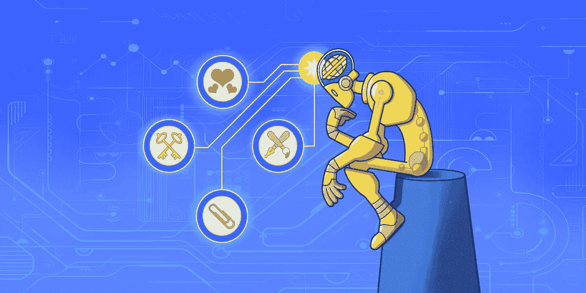
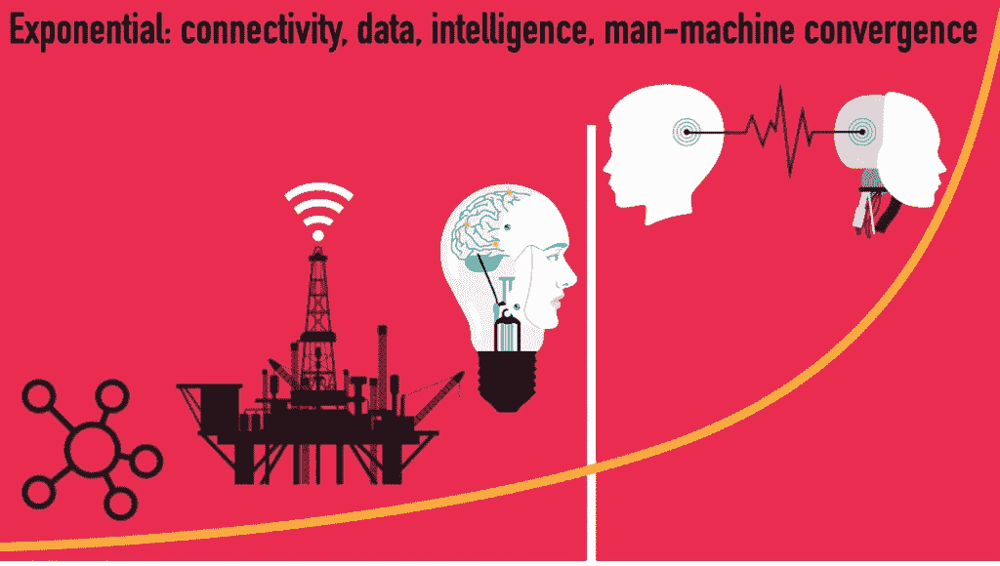
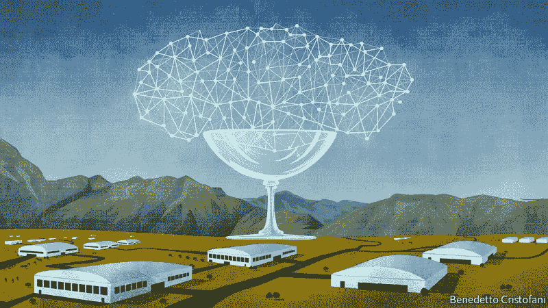

# 人工智能解决方案

> 原文：<https://towardsdatascience.com/risks-of-ai-solutionism-dangers-of-machine-learning-and-artificial-intelligence-in-politics-and-government-728b7577a243?source=collection_archive---------2----------------------->

## 机器学习对人类的未来有着巨大的潜力——但它不会解决我们所有的问题

尽管媒体标题暗示我们已经生活在一个人工智能已经渗透到社会各个方面的未来，但这实际上对人工智能真正能为人类做什么设定了不切实际的期望。世界各国政府都在竞相承诺支持人工智能倡议，但他们往往低估了在现实世界中部署先进的机器学习系统的复杂性。这篇文章反思了“人工智能解决方案主义”的风险:越来越流行的观点认为，只要有足够的数据，机器学习算法就可以解决人类的所有问题。没有万能的人工智能解决方案。所有的解决方案都是有成本的，并不是所有可以自动化的都应该有成本。

关于人工智能(AI)未来的预言无处不在。关于人工智能如何[治愈疾病](http://bigthink.com/philip-perry/how-artificial-intelligence-will-revolutionize-healthcare)、[加速人类创新](http://www3.weforum.org/docs/Harnessing_Artificial_Intelligence_for_the_Earth_report_2018.pdf)和[提高人类创造力](https://venturebeat.com/2018/05/17/evolutionary-computation-will-drive-the-future-of-creative-ai/)的耸人听闻的新闻并不缺乏。单从标题来看，你可能会认为我们已经生活在一个人工智能已经渗透到社会各个方面的未来。

不可否认的是，人工智能已经开启了[大量充满希望的机会](https://www.technologyreview.com/s/545416/could-ai-solve-the-worlds-biggest-problems/)，它也导致了一种心态的出现，这种心态可以被最好地描述为“[人工智能解决方案主义](http://bigthink.com/the-conversation/why-ai-cant-solve-everything)”。这就是 *en vogue* 哲学，给定足够的数据，机器学习算法可以[解决人类所有的问题](https://www.technologyreview.com/s/545416/could-ai-solve-the-worlds-biggest-problems/)。

但是这个想法有一个很大的问题。它没有支持人工智能的进步，而是通过忽视重要的人工智能安全原则和对人工智能真正能为人类做什么设定不切实际的期望，实际上危害了机器智能的价值。

# 人工智能梦想和妄想

仅仅几年时间，人工智能解决方案主义就从硅谷的技术传道者传播到了世界各地的政府官员和政策制定者。钟摆已经从反乌托邦观念[人工智能将毁灭人类](https://www.independent.co.uk/life-style/gadgets-and-tech/news/elon-musk-artificial-intelligence-openai-neuralink-ai-warning-a8074821.html)转向新发现的乌托邦信念，即我们的[算法救世主](https://www.weforum.org/agenda/2018/01/8-ways-ai-can-help-save-the-planet/)已经到来。

在世界各地，我们现在看到各国政府承诺支持国家人工智能倡议，并在技术和言论上展开[军备竞赛](https://www.ft.com/content/e33a6994-447e-11e8-93cf-67ac3a6482fd)，以主导蓬勃发展的机器学习领域。例如，英国政府誓言投资 3 亿英镑在人工智能研究上，将自己定位为该领域的领导者。着迷于人工智能的变革潜力，法国总统埃马纽埃尔·马克龙已经[承诺将法国](https://techcrunch.com/2018/03/29/france-wants-to-become-an-artificial-intelligence-hub/)变成一个全球人工智能中心。与此同时，中国政府正在增加其人工智能实力，制定了一项国家计划，到 2030 年创造价值 1500 亿美元的中国人工智能产业。

正如预言科幻作家威廉·吉布森曾经写道的，“未来已经在这里了——只是分布得不太均匀。“因此，许多国家都希望主导第四次工业革命。人工智能解决方案主义正在兴起，并将继续存在。

> “当谈到机器学习时，政府应该停下来深呼吸一下。仅仅为了人工智能而使用人工智能可能并不总是有成效或有用的。”

# 虚假承诺或有缺陷的前提？

虽然许多政治宣言吹捧即将到来的“[人工智能革命](https://publications.parliament.uk/pa/ld201719/ldselect/ldai/100/100.pdf)”的积极变革效应，但他们往往低估了在现实世界中部署先进机器学习系统的复杂性。自然，人工智能的能力是有限的，这些限制与机器学习技术的实际工作方式有关。为了理解这些错误观念背后的原因，让我们来看看基础知识。

最有前途的人工智能技术之一是神经网络。这种形式的机器学习是松散地模仿人脑的神经元结构，但规模要小得多。许多基于人工智能的产品使用神经网络从大量数据中推断模式和规则。但许多政治家不明白的是，简单地将神经网络添加到问题中并不意味着你会自动找到解决方案。

> “简单地给民主添加一个神经网络，并不意味着它会立刻变得更加包容、公平或个性化。”

如果政策制定者开始在左右和中间部署神经网络，他们不应该假设[人工智能会立即使我们的政府机构更加敏捷或高效](https://www.centreforpublicimpact.org/why-ai-cant-solve-all-governments-problems/)。简单地给民主添加一个神经网络，并不意味着它会立刻变得更加包容、公平或个性化。

通过类比，考虑将一个实体购物中心转变为一家公司，比如亚马逊。仅仅增加一个脸书页面或推出一个网站不足以让实体购物中心成为一家真正的数字技术公司。需要更多的东西。

# 挑战数据官僚主义

人工智能系统需要大量数据才能运行。但是公共部门通常没有合适的[数据基础设施](https://www.centreforpublicimpact.org/beware-ai-high/)来支持高级机器学习。其大部分数据仍然存储在离线档案中。现存的为数不多的数字化数据来源往往被官僚机构所掩盖。通常情况下，数据分散在不同的政府部门，每个部门都需要特殊许可才能访问。最重要的是，公共部门通常缺乏具备适当技术能力的人才来获得机器智能的全部好处。

此外，部署机器学习系统的许多困难之一是，AI 极易受到[对抗性攻击](https://ai.google/research/pubs/pub46154)。这意味着恶意的 AI 可以针对另一个 AI，迫使它做出错误的预测或以某种方式行事。许多[研究人员](https://arxiv.org/abs/1412.6572)警告不要在没有适当的[安全标准和防御机制](https://blog.openai.com/adversarial-example-research/)的情况下推出人工智能。然而，令人震惊的是，在政策制定者的政治言论中，人工智能安全仍然是一个经常被忽视的话题。

由于这些原因，媒体对艾的炒作吸引了许多批评。伯克利大学计算机科学教授斯图尔特·拉塞尔(Stuart Russell)长期以来一直倡导对神经网络采取更现实的方法，专注于人工智能的简单日常应用，而不是假设的超级智能人工智能接管机器人。

同样，麻省理工学院的机器人学教授[罗德尼·布鲁克斯](https://www.technologyreview.com/s/609048/the-seven-deadly-sins-of-ai-predictions/)写道“*几乎所有机器人和人工智能的创新都需要比领域内外的人想象的*更长、更长的时间才能真正广泛部署”。真正的进步是痛苦而缓慢的。而在 AI 的情况下，需要大量的数据。

# 制造机器，而不是魔法

如果我们要获得人工智能的好处，并最大限度地减少其潜在危害，我们必须开始思考如何将机器学习有意义地应用于政府、企业和社会的特定领域。这意味着我们需要就[人工智能伦理](https://medium.com/@drpolonski/can-we-teach-morality-to-machines-three-perspectives-on-ethics-for-artificial-intelligence-64fe479e25d3)和许多人仍然对机器学习[的不信任](https://medium.com/@drpolonski/ai-trust-and-ai-fears-a-media-debate-that-could-divide-society-52e16a74c979)进行长期的多方利益相关者讨论。

最重要的是，我们需要意识到人工智能的局限性，以及人类仍然需要领先的领域。我们不应该描绘人工智能机器人所提供的超能力的不切实际的画面，而是应该后退一步，将人工智能的实际技术能力与魔法分开。机器学习既不是神奇的仙尘，也不是解决一切的方法。

就连脸书最近也承认，人工智能并不总是答案。很长一段时间，[社交网络相信](https://www.theinformation.com/briefings/3b2d34)错误信息和仇恨言论的传播等问题可以通过算法识别和阻止。但在最近来自立法者的压力下，该公司迅速承诺用一支超过 [10，000 人的审查队伍](https://www.theguardian.com/technology/2018/jan/22/facebook-too-slow-social-media-fake-news-hiring)取代其算法。

医学界也认识到人工智能不能作为解决所有问题的灵丹妙药。IBM 肿瘤学沃森项目是人工智能的一部分，旨在帮助医生治疗癌症。即使它被开发来提供最好的算法建议，人类专家发现很难信任机器。结果，尽管在技术上进行了大量投资，人工智能程序[在大多数医院被放弃](https://www.forbes.com/sites/matthewherper/2017/02/19/md-anderson-benches-ibm-watson-in-setback-for-artificial-intelligence-in-medicine/#440310203774)。

类似的问题也出现在法律领域，当[算法被用于美国法院](https://www.wired.com/2017/04/courts-using-ai-sentence-criminals-must-stop-now/)对罪犯进行判决时。一种不透明的算法被用来计算风险评估分数，并确定某人再次犯罪的可能性。人工智能旨在帮助法官在法庭上做出更多以数据为中心的[决定](https://www.wicourts.gov/sc/opinion/DisplayDocument.pdf?content=pdf&seqNo=171690)。然而，该系统被发现放大了结构性的种族歧视，导致法律专业人士和公众的强烈反对。

# 人工智能仪器的法律

这些例子表明没有万能的人工智能解决方案。仅仅为了人工智能而使用人工智能可能并不总是高效或有用的。并不是每个问题都可以通过应用机器智能得到最好的解决。

在 1964 年出版的一篇近乎预言性的论文中，美国哲学家亚伯拉罕·卡普兰(Abraham Kaplan)将这种趋势描述为“[工具法则](https://books.google.de/books?id=kOg7AAAAIAAJ&redir_esc=y&hl=en)”。

它被表述为:“*给一个小男孩一把锤子，他会发现他遇到的一切都需要敲打*”。只是这一次，卡普兰小男孩的心态被有影响力的世界领袖所分享，而 AI 锤子不仅非常强大，而且非常昂贵。

因此，这对于所有旨在加大对昂贵的人工智能投资和国家人工智能项目的投资的人来说都是至关重要的一课:所有解决方案都有成本，并非所有可以自动化的东西都应该有成本。

我们不能坐以待毙，直到我们在遥远的未来达到一般水平的感知人工智能。也不能靠狭隘的 AI 来为我们解决今天所有的问题。我们今天需要自己解决这些问题，同时积极塑造新的人工智能系统来帮助我们完成这项艰巨的任务。

*关于作者:* [*维亚切斯拉夫·波隆斯基*](https://www.vyacheslavpolonski.com) *博士是牛津大学***的研究员，研究复杂的社会网络和集体行为。他拥有计算社会科学博士学位，之前曾就读于哈佛大学、牛津大学和伦敦政治经济学院。他积极参与了* [*世界经济论坛*](http://www.weforum.org/) [*专家网*](https://www.weforum.org/communities/expert-network) *和* [*WEF 全球塑造者*](http://www.weforum.org/community/global-shapers) *社区，在那里他担任了* [*牛津中心*](https://twitter.com/OxfordShapers) *的馆长。2018 年，《福布斯》杂志在欧洲的* [*《福布斯》30 岁以下 30 人*](https://www.forbes.com/30-under-30-europe/2018/#7ab751f47eaa) *榜单上专题报道了他的工作和研究。他写的是社会学、网络科学和技术的交集。**

**本文的早期版本出现在***[*大众影响中心*](https://www.centreforpublicimpact.org/why-ai-cant-solve-all-governments-problems/)**大思考**[*世界经济论坛议程*](https://www.weforum.org/agenda/2018/06/ai-cannot-solve-all-our-problems) *。******

**非常感谢 2017 年关于机器学习的 [*迪奇利会议*](http://www.ditchley.co.uk/conferences/past-programme/2010-2019/2017/machine-learning) *给了我一个独特的机会来完善我的想法，并获得该领域领先的人工智能研究人员、政策制定者和企业家的早期反馈。***