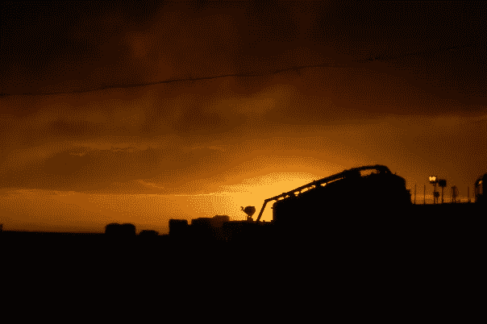
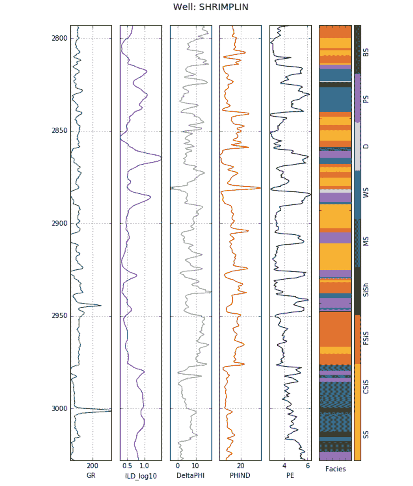
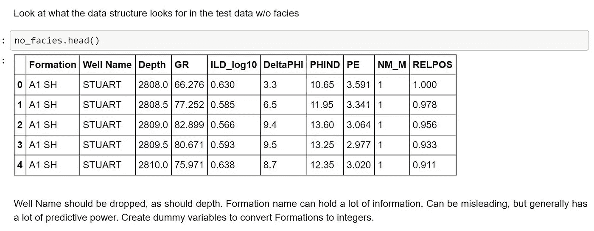
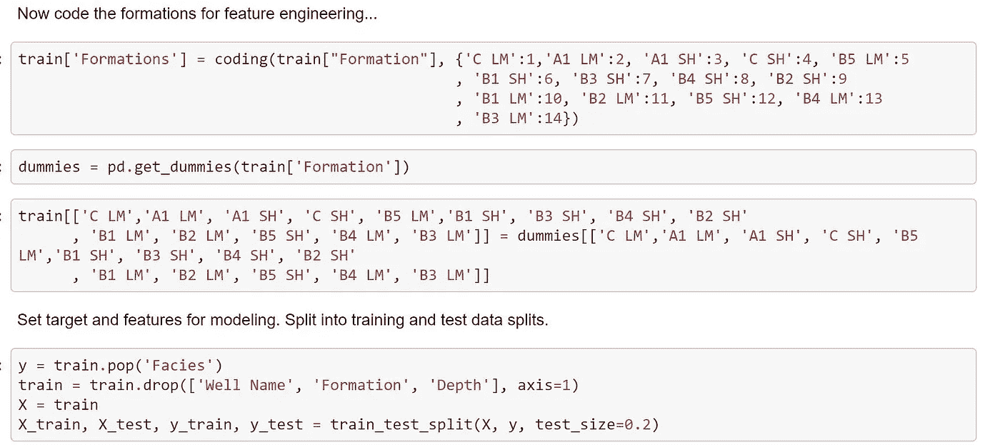
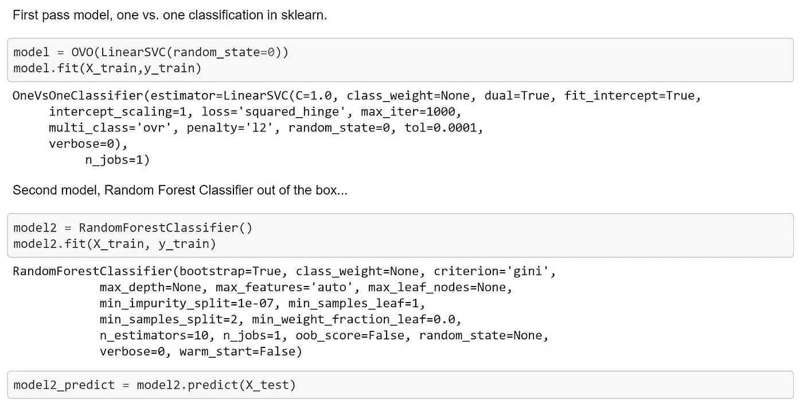
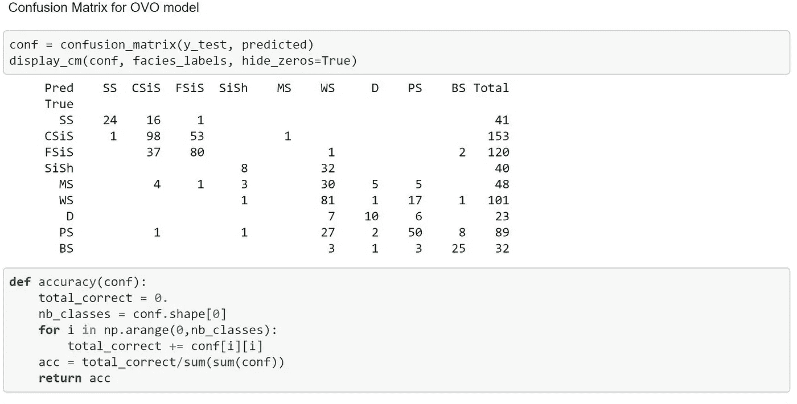
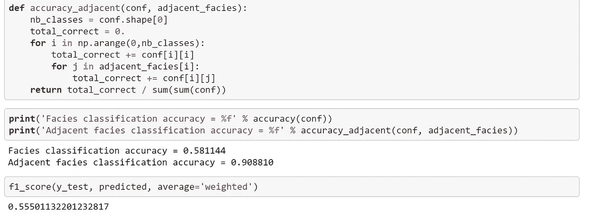
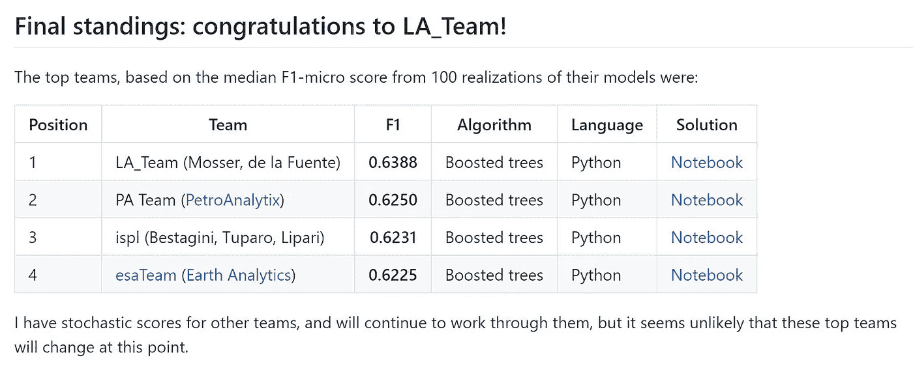
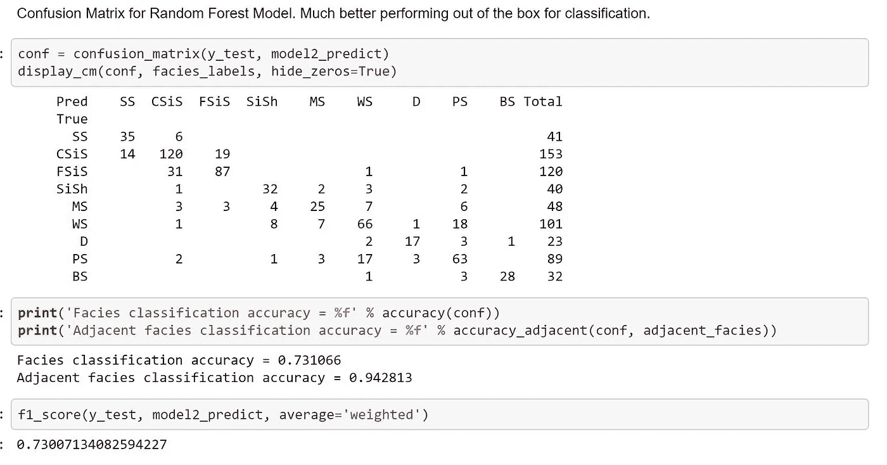

# 坚如磐石的预测——预测…岩石？

> 原文：<https://towardsdatascience.com/rock-solid-predictions-predicting-rocks-c0138a8994f6?source=collection_archive---------4----------------------->

# 序幕——在战场上翻滚

许多年前，我在(超级)大石油公司的第一个任务期间，我负责陆上气田钻井的重大决策。每口井都钻得很快，平均需要 5-7 天。地质情况是众所周知的，一般来说，储层是经济的，钻井的作业风险相当低且易于管理。

尽管该油田的区域地质具有明显的同质性(地质学中没有什么是真正同质的)，但作业地质学家(比如我自己)不得不做一些非常手工的工作。

当我们接近每口井的储油层部分时，我被要求根据钻井时获得的数据确认我们正在接近储油层。在行业中，这被称为随钻测井或 LWD 测井。

Sunset in Wyoming at the rig site

在确认我们到达了储油层部分后，我被要求根据我们绘制的储油层厚度图来确认油井的总深度(TD)。最后，在确认 TD 后，我被要求观察最终的测井记录，以决定为生产目的关闭油井。尽管我们尽了最大努力，但并不是每口井都是经济井，因此我必须决定储层中是否有足够的天然气(产层)来保证在井眼中放置生产质量的套管。

At the rigsite. I still cherish the helmet the mudloggers bought specifically for me.

这一切都非常有趣和酷，直到人们意识到**两个主要问题**:

1.  钻井作业是全天候的，因此，你可以(也将会)全天候接到电话
2.  这些井钻得很快。负责 2-3 条钻井管线意味着我必须定期处理这些电话，几乎没有停机时间

除了清晨的钻机呼叫之外，这需要许多个深夜。我一直在想，一定有更好的方法…

这显然是一个可以通过机器学习来解决的问题！

然而，这是在 2007-2008 年，现代机器学习刚刚起步，在石油和天然气等行业还不存在。

快进到去年秋天。2016 年，SEG(勘探地球物理学家协会)在 Github 上提出了一项挑战，要求使用机器学习来解释岩石类型/地层的样本测井记录。

渴望有趣的项目，我一头扎进去，看看我能做些什么…

# 摇滚是个大问题

> “最近人们对*大数据*非常兴奋，并且迫切需要能够从中提取意义的*数据科学家*。与此同时，地球科学家多年来一直在利用大量数据进行科学研究，不需要吹嘘数据有多大。但是现在大而复杂的数据集随处可见，分析它们的工具和技术也随之激增。现在存在许多免费和开源的软件包，为地球科学家的工具箱提供了强大的补充，其中许多以前只能在专有(且昂贵)的软件平台上获得…
> 
> …在我们的例子中，特征将是来自九口气井的测井数据。这些井已经根据岩心描述进行了岩相分类。一旦我们训练了一个分类器，我们将使用它来分配尚未描述的井的相。"

好吧，说真的，对于那些不是地球科学家或者不精通这个主题的人来说，这毫无意义。然而，它可以被提炼为简单的…

> 我们能预测岩石相吗？

对于非地球科学家来说，什么是真正的岩石相？

Classic alluvial depositional environment. In this case, a braided stream. The sandstone will be deposited and recorded where the streams are today.

沉积岩相是*根据其沉积环境对*不同类型的沉积岩进行分类的基本方法。 ***这是一个冲积砂岩的简单例子，这种砂岩形成于溪流或河流中。岩石相让我们知道石油和天然气可能在哪里，也可能不在哪里。***

# 尽我们所能从数据中提取信息

数据集来自堪萨斯大学，重点是 Hugoton 和 Panoma 气田。它有 7 个特征(来自测井的 5 个电缆测量和 2 个指示变量)以及每 6 英寸一个的相标签。

Sample Well log. The facies labels are on the far right of the log.

左边是一个示例测井记录。该数据通常在钻井作业期间或在钻井完成后通过钻柱上的工具或下降到井内的测井电缆工具来记录。除了通过钻孔向上循环的岩屑的岩石描述之外，这些结果通常是地质学家关于所讨论的井的唯一信息。

通常情况下，地球科学家会手动获取测井记录并进行对比。他们必须从一条测井曲线到另一条测井曲线，以获得岩石类型/岩相、其特征(孔隙度/渗透率/保持和流动流体的能力)及其含量(水、油、气等)的整体视图。).这在成熟的领域中会变得单调乏味，并且在新的领域中容易被误解。

本项目的目标是预测维持组的相标签(不在下表中，而是在上面测井记录的最右侧),作者可以在其上运行模型以评估模型的成功。

Example of dataset features. What the fields mean are of relatively little importance in this case. Assume it’s just standard data obtained from every well in a given field.

# 退出石器时代…

我取了上面的数据，做了一些简单的特征工程。

首先，我使用虚拟变量对地层名称进行编码(这些名称包含有价值的沉积环境信息)。

然后，我将数据分成训练集和测试集，从数据集中删除相信息。

既然我已经把数据整理好了，现在是选择模型的时候了。

这个多类分类模型对我来说是一个新的模型，因为它没有预测二元结果。我想探索的不仅仅是一个简单的随机森林，还想探索我能用这些数据做些什么。

因此，我选择评估两种不同的模型:

1.  OVO(一对一分类器)
2.  随机森林

我让事情非常简单，因为这是一个下午的项目，但结果非常有趣…

# 摇滚明星的结果！

如上所述，这个问题将使用 F1 分数进行评估。

[https://www.slideshare.net/DhianaDevaRocha/qcon-rio-machine-learning-for-everyone](https://www.slideshare.net/DhianaDevaRocha/qcon-rio-machine-learning-for-everyone)

相对于对数损失、AUC 和其他指标，我最初对这个指标并不熟悉，所以我做了一点研究。

F1 分数是精确度和召回率的调和平均值。

该模型将对相预测的准确性和相邻相预测的准确性进行评分。

我对我的两个模型都进行了评分，结果相当疯狂:

## OVO 分类器—

OVO 分类器将问题分解成许多 1:1 的比较，并学习如何区分不同的输出。需要 K (K-1) / 2 个二元分类器来将多类问题分成二元类。然后，它对每次运行中的每次观察的投票进行评分，并根据这些投票对最终的类读数进行排序。

OVO 的 F1 分数低于 Github repo 上其他人的模型结果。

然而，看看我的随机森林模型测试集的结果…

**随机森林—**

在我的测试集上，我的分数比非正式比赛的最高分高出 0.1 分。玩了一下午还不错…

不过，差不多是**的*太*的**好…

***我从来没有正式提交过我的模型*** ，所以我一直无法实际验证我在官方 holdout set 中的 F1 分数。

# 滚过我的不安全感…

> 冒名顶替综合症——恐惧…

# 然而，摇滚可以拯救你的灵魂！

> 我知道你们每个人都在为此挣扎。
> 
> 谈论它是有帮助的。写下来会有帮助。唱出来会有帮助！通过任何对你有意义的方式来表达自己会有帮助。

感谢文字，表达思想，思考和学习，我每天都在克服这些挑战。

每天谈论和做让你感到不舒服的事情。我拿了一个自己比较舒服的东西，地学，和一开始让我不舒服的东西混在一起，编程。

现在，通过每天做一些不舒服的事情，我对自己的数据科学和编码技能更有信心了。

喜欢你正在读的书吗？请在未来几周继续关注我正在撰写的关于营销分析以及如何使用数据作为工具讲述令人信服的以客户为中心的故事的文章。

错过了我的职业支点系列？我是如何从地球科学转向数据科学的？阅读[此处](https://medium.com/towards-data-science/career-change-wait-what-3c687f05fc49)跟随我的旅程…

更多阅读:[http://library.seg.org/doi/10.1190/tle35100906.1#_i2](http://library.seg.org/doi/10.1190/tle35100906.1#_i2)

[https://github.com/seg/2016-ml-contest](https://github.com/seg/2016-ml-contest)

[https://en.wikipedia.org/wiki/Impostor_syndrome](https://en.wikipedia.org/wiki/Impostor_syndrome)