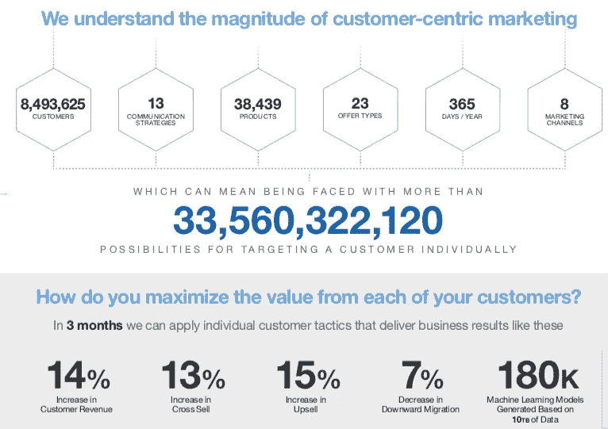
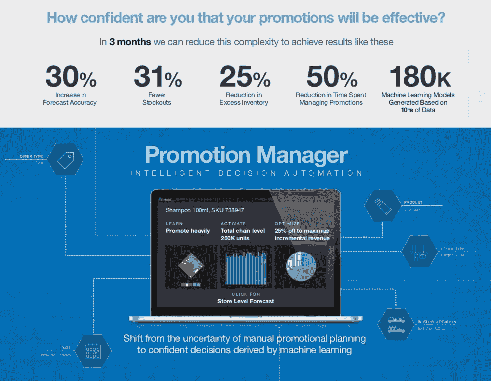

# Rubikloud 兑现了全渠道的承诺

> 原文：<https://towardsdatascience.com/rubikloud-delivers-on-the-promise-of-omnichannel-37e44cca2547?source=collection_archive---------7----------------------->

大约在十年前，全渠道的理念开始深入人心。传统零售商认为这是一个“概念”，因为他们主要的实体店仍然是服务客户的重点渠道。快进到 2018 年，机器学习正在将这个概念变成现实。根据定义，

> 全渠道承诺通过满足消费者对购物即时性、便利性和无处不在的更高期望，拉近零售商与消费者的距离。它还认识到一个不可避免的现实:购物者越来越需要超越网上购物和商店购物之间障碍的零售体验。

我很荣幸地会见了首席执行官刘可莉和数据科学经理坎查纳·帕德马纳班，他来自 [Rubikloud](https://rubikloud.com/) ，这是一家总部位于多伦多的软件公司，今天最接近实现这一承诺。

# “全球领先的零售机器学习平台”

这是公司的价值主张。Rubikloud 是一个先进的零售机器学习平台，提供促销和忠诚度营销的市场内建议。影响:优化个性化，在正确的时间，通过正确的渠道，向正确的客户提供正确的产品和正确的信息。

现在，Rubikloud 拥有 100 名员工，在全球范围内拥有 10 多家零售客户，风投融资 4500 万美元，它正在进行零售革命。

# 开始:永远改变了企业软件的融合

五年前，凯瑞在一次收购后退出了一家初创公司。当时，他注意到了 3 个重要事件，这些事件有助于形成 Rubikloud 的推动力:

*   云:三巨头——亚马逊、谷歌和微软在弹性计算方面进行了大量投资，为开发者提供云访问和计算可扩展性。
*   数据框架:开源和各种数据框架的快速部署和采用。
*   人工智能:人工智能开始在消费者领域变得越来越普遍，为脸书的新闻推送、网飞的推荐引擎和亚马逊的动态定价提供动力。

这三种趋势正在推动内部人工智能系统，它们正在汇聚成一种新形式的企业软件。一家新公司正是基于这一理念成立的:

> *我们成立 Rubikloud 最初是为了用一个垂直领域解决这三个挑战，随着我们的扩张，我们会进入新的垂直领域。我们决定关注全球零售业，即在市场成熟的世界关键地区拥有多样化终端用户体验的传统零售商。*

克里的信念是，传统零售商没有死。他们只是需要技术来帮助他们转型和发展。

# 协调客户从线下到线上的旅程

测量客户购买的影响以确定倾向是困难的，因为直到现在，由于不同的系统和数据库，一次关注一个客户以及他/她在每个在线或离线购买点的购买的机制在很大程度上是分散的。

Rubikloud 的零售客户已经收集这些数据很长时间了，在许多情况下，他们被困在多个遗留系统中，而没有采取任何措施。

协调来自数据的见解并使其与业务目标相匹配不可能一蹴而就。然而，通过了解每个业务利益相关者(即销售和营销团队)的目标和挑战，Rubikloud 从根本上使这些团队的预测更加精确，执行更加无缝，并创建了更强大的绩效系统。

正如 Kerry 指出的，销售团队需要知道在几十万个 SKU 下订购多少库存，以什么价格设定，以及为每个渠道和商店分配多少。

Rubkiloud 的价格和促销经理将向零售商提供商店级分配和在线级分配。它还会告诉零售商对该库存使用什么促销策略，以及在促销过程中他们需要多久补充一次库存。

所有这些变量都由系统以自动化的方式进行计算，并由系统发送到沿途的各个接触点，无论是供应链系统、商店运营还是 ERP……它旨在解决零售商目前面临的最困难的计算问题之一:有多少库存、什么价位、哪些特定的 SKU 正在移动、在什么地区，最重要的是，哪些客户群受到这些 SKU、该价位和库存量的影响。

这些见解的价值注定会吸引更大的 CPG 玩家，他们传统上无法控制或获得其营销或推广工作的投资影响。在过去，接触零售数据在很大程度上是难以捉摸的。像尼尔森这样的推断数据源提供了 CPGs 的价格、市场份额和销售信息。相比之下，Rubikloud 收集了与 SKU 相关的数百个数据点，因为它们与客户细分、促销策略、购买、价格和位置相关。

# 零售数据的状态

数据是新的货币。它现在是、将来也将是近乎实时地在市场上做出决策的驱动力。然而，考虑到当今在转换数据以进行分析方面的普遍挑战(一些行业估计称 80%的模型开发工作处于清理阶段)，再加上大型零售商之间缺乏对数据的使用、聚合和分析，数据转换可能需要 1-6 个月的时间。Kerry 指出，这不仅高度依赖于数据及其系统的状态，还依赖于零售目标的要求。

数据科学家 Kanchana Padmanabhan 认为，好的数据是关键。Rubikloud 吸收所有客户数据——交易数据、促销数据和其他相关数据源。零售商之间的差异可能导致可扩展性挑战:如不同的模式、遗留系统、不同的技术堆栈和数据量差异。加入数据，尤其是验证数据变得至关重要。

随着时间的推移，在许多用例及客户中，Rubikloud 在数据处理、管理和加工方面做得越来越好。他们已经学会并善于在数据进入他们的系统之前预先提出正确的问题。坎查纳补充道:

> 我们也有稳定的产品，所以我们知道我们在构建什么样的模型。我们知道我们提供的解决方案，更重要的是，我们知道我们需要什么数据。

Kanchana 指出，他们可以处理各种格式:从调查，到广告，电子邮件，交易，CRM，ERP 和社交媒体等。在某些情况下，鼓励营销人员一致且正确地输入信息，以确保数据的有用性。

除了主要信息外，Kanchana 表示，他们还覆盖了人口统计数据、竞争性定价信息、产品图片和描述。虽然社交媒体具有价值，但如今这些数据非常混乱，试图从社交媒体中找出交易也很困难…这就让我们想到了房间里的大象…

# 以客户为中心和隐私可以共存吗？

考虑到欧洲通用数据保护条例(GDPR)，像 Rubikloud 这样的智能系统会受到威胁吗？通过生活方式管理器解决个性化的圣杯将需要在理想的环境和情况下，增加背景来确定顾客的购买意图。然而，克里强调，

> *我们不会收集个人身份信息(PII):我们不会收集您的姓名、电子邮件、信用卡号码和电话号码。原因是:这对我们没有帮助。了解 PII 对我们的模型没有任何帮助。我们更喜欢客户给我们一个哈希 ID 的客户…我们正在下降到 1-1 客户级别，但我们不知道这个人的名字或 PII。*

该散列 ID 将通过 Adobe Campaign 或 Salesforce Marketing Cloud 发送回营销自动化堆栈，并将与 Rubikloud 及其系统范围之外的客户端系统中的客户信息进行匹配。

对于许多营销人员来说，使用任何和所有可用的数据进行分析和细分都是理所当然的。使用人工智能，在整个客户群的数千/数百万数据属性中搜索模式，不需要像 Kerry 那样需要个人信息来建立有效的模型。

虽然《今日 PII》是当今隐私辩论中的一个强大支柱，但即将到来的从元数据中进行的推理(人工智能在其中找到这些模式来定义上下文并预测客户倾向)肯定会成为一个辩论的话题。随着 GDPR 起飞，我们将继续关注此事。

# 零售业的未来意味着回归基础

凯瑞认为，零售业作为一个整体正在增长。客户的期望发生了显著变化。衡量零售商的技术能力也是一个品牌发展的标志。客户想要相关的推荐；他们喜欢亚马逊的动态定价；他们希望每次与零售商互动时，体验会更熟悉一些。

> 我们认为零售商不会消亡，但他们只有很短的时间来修正技术。他们不能再在大型遗留项目或临时创新项目上浪费时间了。他们必须解决消费者问题或产品问题。

克里指出，零售商把问题复杂化了。挑战在于他们如何以产品化的方式部署解决方案。我们生活在一个人工智能实验猖獗的时代。Rubikloud 已经进入全面生产阶段，他们已经学会了如何构建一个适用于该行业的整体解决方案。

> *你购买打包了所有用例及输入的软件，并与了解你业务细微差别的公司合作。在我们看来，您购买软件是为了解决可以解决的核心问题。*

这意味着零售商将重新成为零售商。对于购买者来说，他们会将财务分析从工作描述中删除。相反，他们会将自己的核心能力应用于价格谈判、产品资源配置以及新产品和新客户的试验中。

通过采用技术，它允许客户做他们最擅长的事情。在 Rubikloud 的例子中，它肯定影响了这个咒语。

**关于:**

**Kerry Liu** is the Co-Founder & CEO at Rubikloud, where he leads three important functions: people, sales, and technology disruption. In his role, Kerry works to manage and maintain a thriving company culture that recruits the best and brightest in the industry, while also maintaining relationships with global retailers and investors. Kerry is passionate about machine learning and big data, and enjoys providing enterprise retailers with the tools and knowledge needed to enhance their overall business goals.

**Kanchana Padmanabhan** is the Manager of Data Science at Rubikloud. Kanchana received her PhD from North Carolina State University in Raleigh, NC with a focus on Graph Mining and Analytics, Computational Biology, and Network Modeling. Prior to Rubikloud, Kanchana spent 3 years at Sysomos, a social media analytics company for research projects that use machine learning, network analysis and NLP techniques in conjunction with big data technologies such as Hadoop, MapReduce, and Spark. She currently focuses her time on solving big data problems in retail. She has 4 patent filings and co-edited a book titled “Practical Graph Mining with R“ CRC Press.

本帖原载[认知世界](http://cognitiveworld.com)。