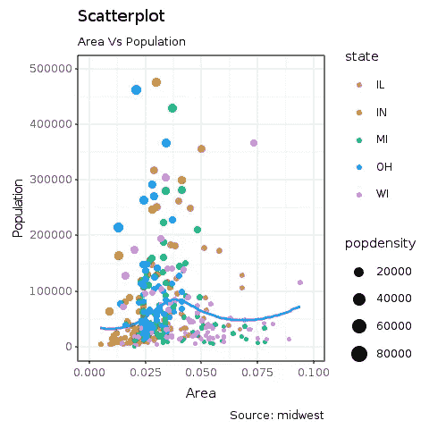
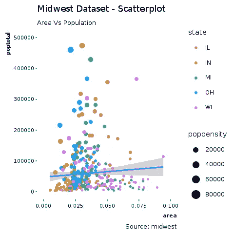

# 用 Galaaz 绘制 Ruby:GraalVM 中 Ruby 和 R 紧密耦合的一个例子

> 原文：<https://towardsdatascience.com/ruby-plotting-with-galaaz-an-example-of-tightly-coupling-ruby-and-r-in-graalvm-520b69e21021?source=collection_archive---------8----------------------->

# 介绍

Galaaz 是一个紧密耦合 Ruby 和 r 的系统。Ruby 是一种强大的语言，有一个大型社区，一个非常大的库集，非常适合 web 开发。然而，它缺乏数据科学、统计学、科学绘图和机器学习的图书馆。另一方面，R 被认为是解决上述所有问题的最强大的语言之一。也许 R 最强的竞争对手是 Python，它有诸如 NumPy、Panda、SciPy、SciKit-Learn 等库。

对于 Galaaz，我们不打算在 R 中重新实现任何科学库，我们允许两种语言之间非常紧密的耦合，以至于 Ruby 开发人员不需要知道有一个 R 引擎在运行。为此，我们使用了 Oracle 提供的新技术:GraalVM、TruffleRuby 和 FastR:

```
GraalVM is a universal virtual machine for running applications written in JavaScript, Python 3, Ruby, R, JVM-based languages like Java, Scala, Kotlin, and LLVM-based languages such as C and C++. GraalVM removes the isolation between programming languages and enables interoperability in a shared runtime. It can run either standalone or in the context of OpenJDK, Node.js, Oracle Database, or MySQL. GraalVM allows you to write polyglot applications with a seamless way to pass values from one language to another. With GraalVM there is no copying or marshaling necessary as it is with other polyglot systems. This lets you achieve high performance when language boundaries are crossed. Most of the time there is no additional cost for crossing a language boundary at all.Often developers have to make uncomfortable compromises that require them to rewrite their software in other languages. For example: * “That library is not available in my language. I need to rewrite it.” 
  * “That language would be the perfect fit for my problem, but we cannot run it in our environment.” 
  * “That problem is already solved in my language, but the language is too slow.”With GraalVM we aim to allow developers to freely choose the right language for the task at hand without making compromises.
```

感兴趣的读者还应该查看以下网站:

*   [GraalVM Home](https://www.graalvm.org/)
*   [松露红宝石](https://github.com/oracle/truffleruby)
*   [FastR](https://github.com/oracle/fastr)
*   [用 FastR 加快 R](https://medium.com/graalvm/faster-r-with-fastr-4b8db0e0dceb)

# 加拉茨是什么意思

加拉茨是“加拉哈德”的葡萄牙语名称。来自维基百科:

```
Sir Galahad (/ˈɡæləhæd/; sometimes referred to as Galeas /ɡəˈliːəs/ or Galath /ˈɡæləθ/), in Arthurian legend, is a knight of King Arthur's Round Table and one of the three achievers of the Holy Grail. He is the illegitimate son of Sir Lancelot and Elaine of Corbenic, and is renowned for his gallantry and purity as the most perfect of all knights.Emerging quite late in the medieval Arthurian tradition, Sir Galahad first appears in the Lancelot–Grail cycle, and his story is taken up in later works such as the Post-Vulgate Cycle and Sir Thomas Malory's Le Morte d'Arthur. His name should not be mistaken with Galehaut, a different knight from Arthurian legend.
```

# Galaaz 演示

# 先决条件

*   GraalVM (>= rc7)
*   松露红宝石
*   FastR

以下 R 包将在必要时自动安装，但如果需要，也可以在演示之前安装:

*   ggplot2
*   gridExtra

安装 R 包需要一个开发环境。在 Linux 中，gnu 编译器和工具应该足够了。

为了运行“规范”,以下 Ruby 包是必需的:

*   gem 安装 rspec

# 准备

*   gem 安装 galaaz

# 运行演示

这个演示的 ggplot 是从这里的[中提取的](http://r-statistics.co/Top50-Ggplot2-Visualizations-MasterList-R-Code.html)

在控制台上做

```
> galaaz master_list:scatter_plot
```

# 运行其他演示

在控制台上做什么

```
> galaaz -T
```

将显示所有可用演示的列表。要运行列表中的任何演示，请将对“rake”的调用替换为“galaaz”。例如，列表中的一个示例是“rake sthda:bar”。为了运行这个示例，只需执行“galaaz sthda:bar”。执行“galaaz sthda:all”将运行 sthda 类别中的所有演示，在本例中，幻灯片放映中有 80 多个用 Ruby 编写的 ggplot 图形。

一些示例要求“rspec”可用。要安装“rspec ”,只需执行“gem install rspec”。

# 演示代码

以下是上述示例的 Ruby 代码和绘图。示例中的代码和下面的代码有一点不同。如果运行该示例，绘图将出现在屏幕上，如下所示，我们生成一个“svg”图像，然后将其包含在本文档中。为了生成和成像，使用了 R.svg 设备。要在屏幕上生成绘图，请使用 R.awt 设备，如代码中所述。

```
require 'galaaz'
require 'ggplot'# load package and data
R.options(scipen: 999)  # turn-off scientific notation like 1e+48
R.theme_set(R.theme_bw) # pre-set the bw theme.midwest = ~:midwestR.svg                   # run the svg device to generate an
                        # image in .png format# Scatterplot
gg = midwest.ggplot(E.aes(x: :area, y: :poptotal)) + 
     R.geom_point(E.aes(col: :state, size: :popdensity)) + 
     R.geom_smooth(method: "loess", se: false) + 
     R.xlim(R.c(0, 0.1)) + 
     R.ylim(R.c(0, 500000)) + 
     R.labs(subtitle: "Area Vs Population", 
            y: "Population", 
            x: "Area", 
            title: "Scatterplot", 
            caption: "Source: midwest")R.png('midwest.png')     
puts ggR.dev__off               # R.dev__off turns off the device.  
                         # If using awt, the plot window will 
                         # be closed
```



Midwest Scatterplot

在 R 中，生成该图的代码如下

```
# install.packages("ggplot2")
# load package and data library(ggplot2)options(scipen=999)    # turn-off scientific notation like 1e+48
theme_set(theme_bw())  # pre-set the bw theme.data("midwest", package = "ggplot2")# Scatterplot
gg <- ggplot(midwest, aes(x=area, y=poptotal)) + 
      geom_point(aes(col=state, size=popdensity)) + 
      geom_smooth(method="loess", se=F) + 
      xlim(c(0, 0.1)) + 
      ylim(c(0, 500000)) + 
      labs(subtitle="Area Vs Population", 
           y="Population", 
           x="Area", 
           title="Scatterplot", 
           caption = "Source: midwest")plot(gg)
```

请注意，这两个代码非常相似。Ruby 代码要求在调用任何函数之前使用“R”，例如，在 Ruby 中，R 函数“geom_point”变成了“R.geom_point”。r 命名参数如(col = state，size = popdensity)，在 Ruby 中变成(col: :state，size: :popdensity)。

需要注意的最后一点是对‘AES’函数的调用。在 Ruby 中，我们不用“R.aes ”,而是使用“E.aes”。为什么需要 E.aes 的解释是 R 中的一个高级主题，取决于 R 中的非标准求值(NSE)。简而言之，函数“aes”在 R 中是延迟求值的，即在 R 中调用 geom_point(aes(col=state，size=popdensity))时，函数 geom_point 接收类似于包含“aes(col=state，size=popdensity)”的字符串作为参数，aes 函数将在 geom_point 函数内部求值。在 Ruby 中，没有懒惰求值，做 R.aes 会尝试立即求值。为了延迟函数 aes 的评估，我们需要使用 E.aes。对 R 中的 NSE 感兴趣的读者可参考此处的。

# 该示例的扩展

如果这两个代码如此相似，那么为什么要用 Ruby 而不是 R 呢？galaaz 到底有什么好处呢？

Ruby 是一种现代的面向对象语言，有许多非常有用的结构，比如类、模块、块、过程等等。上面的例子关注于两种语言的耦合，并没有展示其他 Ruby 结构的使用。在下面的例子中，我们将展示一个使用其他 Ruby 结构的更复杂的例子。这当然不是一个写得很好的健壮的 Ruby 代码，但是它给出了 Ruby 和 R 是如何紧密耦合的想法。

让我们想象一下，我们在一家公司工作，这家公司有自己的情节主题。因此，它定义了一个“CorpTheme”模块。该公司的地块不应有网格，标签中的数字不应使用科学符号，首选颜色是蓝色。

```
# corp_theme.rb
# defines the corporate theme for all plots

module CorpTheme#----------------------------------------------------------------
# Defines the plot theme (visualization).  In this theme we
# remove major and minor
# grids, borders and background.  We also turn-off scientific
# notation.
#---------------------------------------------------------------

  def self.global_theme # turn-off scientific notation like 1e+48    
    R.options(scipen: 999)
    # remove major grids
    global_theme = R.theme(panel__grid__major: E.element_blank())
    # remove minor grids
    global_theme = global_theme + 
       R.theme(panel__grid__minor: E.element_blank)
    # remove border
    global_theme = global_theme + 
       R.theme(panel__border: E.element_blank)
    # remove background
    global_theme = global_theme + 
       R.theme(panel__background: E.element_blank)
    # Change axis font
    global_theme = global_theme +
                   R.theme(axis__text: E.element_text(size: 8,
                                color: "#000080"))
    # change color of axis titles
    global_theme = global_theme +
                   R.theme(axis__title: E.element_text(
                             color: "#000080", 
                             face: "bold",
                             size: 8,
                             hjust: 1))
  end

end
```

我们现在定义一个散点图类:

```
# ScatterPlot.rb
# creates a scatter plot and allow some configuration

class ScatterPlot attr_accessor :title
  attr_accessor :subtitle
  attr_accessor :caption
  attr_accessor :x_label
  attr_accessor :y_label

  #----------------------------------------------------------------
# Initialize the plot with the data and the x and y variables
#---------------------------------------------------------------- def initialize(data, x:, y:)
    @data = data
    @x = x
    @y = y
  end#----------------------------------------------------------------
# Define groupings by color and size
#--------------------------------------------------------------- def group_by(color:, size:)
    @color_by = color
    @size_by = size
  end#----------------------------------------------------------------
# Add a smoothing line, and if confidence is true the add a
# confidence interval, if false does not add the confidence
# interval
#-_-------------------------------------------------------------- def add_smoothing_line(method:, confidence: true)
    @method = method
    @confidence = confidence
  end 
  #---------------------------------------------------------------
# Creates the graph title, properly formated for this theme
# @param title [String] The title to add to the graph
# @return textGrob that can be included in a graph
#---------------------------------------------------------------- def graph_params(title: "", subtitle: "", caption: "", 
                   x_label: "", y_label: "")
    R.labs(
      title: title, 
      subtitle: subtitle, 
      caption: caption,
      y_label: y_label, 
      x_label: x_label, 
    )
  end#---------------------------------------------------------------
# Prepare the plot's points
#--------------------------------------------------------------- def points
    params = {}
    params[:col] = @color_by if @color_by
    params[:size] = @size_by if @size_by
    R.geom_point(E.aes(params))
  end#----------------------------------------------------------------
# Plots the scatterplot
#---------------------------------------------------------------- def plot(device = 'awt') device == 'awt' ? R.awt : R.svg

    gg = @data.ggplot(E.aes(x: @x, y: @y)) +
      points + 
      R.geom_smooth(method: @method, se: @confidence) +
      R.xlim(R.c(0, 0.1)) +
      R.ylim(R.c(0, 500000)) + 
      graph_params(title: @title,
                   subtitle: @subtitle, 
                   y_label: @y_label, 
                   x_label: @x_label, 
                   caption: @caption) +
      CorpTheme.global_theme R.png('scatter_plot.png') if !(device == 'awt')
    puts gg
    R.dev__off

  end

end
```

这是用中西部数据制作散点图的最终代码

```
require 'galaaz'
require 'ggplot'sp = ScatterPlot.new(~:midwest, x: :area, y: :poptotal)
sp.title = "Midwest Dataset - Scatterplot"
sp.subtitle = "Area Vs Population"
sp.caption = "Source: midwest"
sp.x_label = "Area"
sp.y_label = "Population"
sp.group_by(color: :state, size: :popdensity)    # try sp.group_by(color: :state)
# available methods: "lm", "glm", "loess", "gam"
sp.add_smoothing_line(method: "glm") 
sp.plot('svg')
```



Midwest Plot with ‘glm’ function and modified theme

# 结论

r 是一种非常强大的语言，用于统计分析、数据分析、机器学习、绘图和许多其他具有非常大的软件包生态系统的科学应用。然而，R 通常被认为很难学，缺乏现代计算机语言的结构，如面向对象的类、模块、lambdas 等。正因如此，许多开发人员已经开始或从 R 转向 Python。

有了 Galaaz，R 程序员几乎可以透明地从 R 移植到 Ruby，因为语法几乎是一样的，而且他们用 fastR 作为 R 引擎。根据大多数基准测试，FastR 可以比 Gnu R 快几个数量级。此外，通过使用 Galaaz，R 开发人员可以开始(如果需要的话，可以慢慢地)使用 Ruby 的所有构造和库来很好地补充 R 包。

对于 Ruby 开发人员来说，Galaaz 允许完全透明地直接使用 R 函数。如上面第二个例子所示，类 ScatterPlot 完全隐藏了 R 调用 Ruby 开发者的所有细节，此外，Galaaz 由 TruffleRuby 提供支持，也可以比 MRI Ruby 快几个数量级。