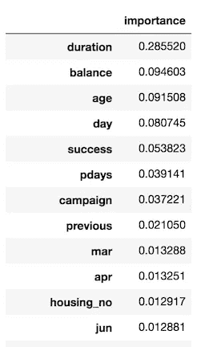

# 运行随机森林？使用此代码检查特性的重要性

> 原文：<https://towardsdatascience.com/running-random-forests-inspect-the-feature-importances-with-this-code-2b00dd72b92e?source=collection_archive---------2----------------------->


A Random Forest | FPhoto by [Robert Bye](https://unsplash.com/@robertbye?utm_source=medium&utm_medium=referral) on [Unsplash](https://unsplash.com?utm_source=medium&utm_medium=referral)

随机森林和其他集成方法是一些数据科学任务的优秀模型，尤其是一些分类任务。它们不像其他方法那样需要太多的预处理，并且可以接受分类变量和数值变量作为输入。简单的决策树不是很健壮，所以集成方法运行许多决策树并聚集它们的输出进行预测。该过程控制过度拟合，并且通常可以产生非常健壮、高性能的模型。随机森林和其他一些 boosting 方法是简单的现成模型，我经常在建模过程的早期使用它们来查看它们如何处理我的数据。此外，它们还有一个非常有用的特性，叫做特性重要性。

这些方法最常用于预测，但是查看特征重要性可以让您了解哪些变量在这些模型中影响最大。您可以使用该信息来设计新的功能，删除看起来像噪音的功能，或者只是在您继续构建模型时通知您。

决策树以及基于决策树的集成方法通过将数据分成子集来工作，这些子集主要属于一个类别。该树将继续构建不同的子集，直到它理解并表示变量与目标的关系。提升集成树更进一步，从错误中学习，迭代地调整树以更好地分类数据。所有种类的树方法都是通过数学方法来计算它们的分裂，确定哪一个分裂将最有效地帮助区分类。因为这是他们的方法，所以这些模型的 sklearn 实例有一个`.feature_importances_`属性，它返回每个特性在确定分割时的重要性的数组。

查看这些会非常有帮助，但是`.feature_importances_`属性只是打印一个数字数组。它不会告诉你哪些数字对应哪些变量。我将运行一段代码，这段代码将在一个日期框中返回特性的重要性以及它们各自的变量名。

这是我将要使用的数据集。我曾在其他帖子中使用过这套工具，所以你可能会认出它。这是银行营销数据集，在这里[可以从 UCI 机器学习资料库](https://archive.ics.uci.edu/ml/datasets/bank+marketing)获得。看一看:


任务是对银行在营销活动中的哪些目标将认购新的定期存款进行分类。以下是运行随机森林模型的代码:

```
## Import the random forest model.
from sklearn.ensemble import RandomForestClassifier 
## This line instantiates the model. 
rf = RandomForestClassifier() 
## Fit the model on your training data.
rf.fit(X_train, y_train) 
## And score it on your testing data.
rf.score(X_test, y_test)
```

如您所见，这很容易实现。现在谈谈特性的重要性。下面的代码片段将从模型中检索特性的重要性，并将它们制作成数据帧。

```
import pandas as pd
feature_importances = pd.DataFrame(rf.feature_importances_,
                                   index = X_train.columns,
                                    columns=['importance']).sort_values('importance',                                                                 ascending=False)
```

运行该代码将得到以下结果:



现在，您可以很容易地看出哪些功能对您的模型很重要，哪些不重要。尽情享受吧！