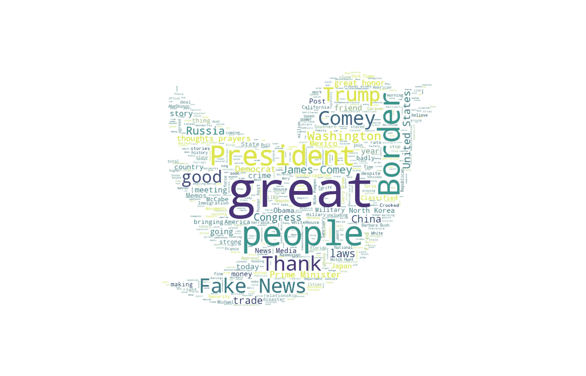
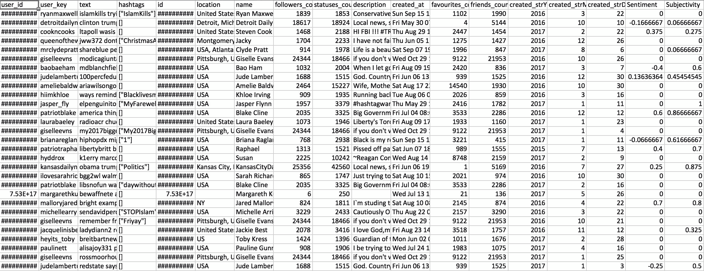

# 俄罗斯虚假推文可视化

> 原文：<https://towardsdatascience.com/russian-fake-tweets-visualized-6f73f767695?source=collection_archive---------6----------------------->

Fake Tweet Cloud

合著者:[大卫·凯斯](https://medium.com/u/a4635b8feb06?source=post_page-----6f73f767695--------------------------------)

随着俄罗斯调查扭曲了总统选举的热情，以及臭名昭著的脸书/剑桥分析丑闻仍然占据国内每日头条，我们清楚地看到，“假新闻”和俄罗斯用户仍然普遍存在，但概念模糊。这些假用户伪装成谁？这些假用户是怎么忽悠人的？他们是如何影响人们的？因此，凭借我们在自然语言处理、数据可视化方面的背景，以及对技术和政治相结合的兴趣，用 Python 和 Plotly 检查假俄罗斯用户的 Tweet 数据是很自然的。特别是，我们分析了:

用户和推文概述

1.  这些假冒用户的身份——姓名和描述
2.  当假账户被创建的时候
3.  当虚假账户在推特上最活跃的时候
4.  这些报道涵盖了哪些主题

大多数成功(或不成功)用户的案例研究

1.  推特速度
2.  推特极性
3.  推特主观性

**数据**

*NBC 新闻发布了超过 20 万条推文的数据库，推特将其与 2016 年美国总统大选期间与俄罗斯相关的账户的“恶意活动”联系在一起。这些账户，作为大型网络的一部分，协同工作，发布了数十万条煽动性的推文。这里的数据可以找到***。**

**

*Figure 1: Joined User and Tweet Data Provided by NBC*

**

*Figure 2: Example of a (non-fake) Twitter Account with Highlighted Description and Tweet*

*现在我们有了数据，让我们开始分析:*

***这些假冒用户是谁？***

*Figure 3: First and Last “Names” of the Users*

*如果我们看看我们的假用户的面值，我们可以看到有三个不同类别的假帐户名称。第一个组合由美国发音的名(如“Chris”、“Rick”或“Jeremy”)和美国发音的姓(如“Green”、“Roberts”或“Cox”)组成。第二个组合由正式的新闻来源组成，如“纽约时报”或“今日亚特兰大”。最后，第三种组合由纯粹的外国名字组成。从这一点上，我们可以看到，仅仅根据名字很难判断哪些账户是假的，因为它可能是任何普通人、新闻网站或无法识别的名字。*

***他们的简介是什么？***

**

*Figure 4: Topics Within the Descriptions of Fake Users*

*创建 Twitter 账户的一个独特之处在于，你可以选择简单描述自己是谁。用户经常发布他们的总结和意识形态给其他人看。具体来说，上图显示了一个与虚假账户相同的话题——宗教。通过使用诸如“上帝”、“InGodWeTrust”和“GodBlessAmerica”这样的词，这些虚假账户可以与一大群人联系起来。其他 bios 包括黑人生活问题主题、官方新闻声音描述(如“体育”、“天气”和“官方”)以及外国主题。因此，通过快速地(如果不是立即地)与这个虚假用户相关联，用户更有可能关注或同意虚假账户的推文。更多关于这种相似吸引现象的信息可以在这里阅读[。](https://www.sciencedirect.com/science/article/pii/0092656676900854)*

***它们是什么时候制造的？***

*Figure 5: Russian Fake Accounts Created from 2009 to 2017*

*在被认为是假俄罗斯账户的 454 个账户中，我们可以看到假账户的创建始于 2009 年，并在 2013 年达到创建高峰，然后在 2017 年初慢慢减少。有趣的是，这意味着大多数虚假账户是在 2016 年总统选举前几年创建的，可能是为了在选举前引起我们读者的冲突和分裂。*

***他们来自哪里？***

*我们查看了假冒用户的来源，发现在 454 个值中，大约有一半的值丢失了。在列出的 287 个地点中，124 个被列为某种形式的“美国”，68 个被列为美国的大型大都市(即:旧金山、纽约、亚特兰大、洛杉矶)，37 个值在外国，其余 58 个值是虚构的，如“位于幸福健康的拐角处”或“沿街的街区”。因此，由于数据大部分缺失并且很可能是假的，我们选择不进一步分析数据。*

*他们的影响力有多大？*

*Figure 6: Followers vs. Number of Tweets of Fake Accounts*

*从高层次来看，我们可以看到推文的数量随着关注者的数量而增加。这是有道理的，因为这些假账户正在利用他们在社交媒体上的受欢迎程度来接触和影响更多的人。其中一个著名的虚假用户是臭名昭著的 Jenna Abrams 账户，其种族主义、有争议和虚假的推文一度被主流媒体报道。在这一点上，可以肯定地说，这些推文肯定对大众有影响。*

*他们什么时候发布？*

*Figure 7: Heat Map of Fake User Tweet Activity*

*从上面的热图中，我们可以看到，假用户主要在一年中的后几个月(即:8 月、9 月、10 月、11 月和 12 月)的周日和周二发帖。因此，我们可以预料这不是偶然的；当下半年选举和其他重大事件发生时，假冒用户明白他们的内容在周末而不是工作日到达更多的个人。*

*他们在说什么？*

**

*Figure 8: Topical Modeling of Tweet Content*

*类似于对虚假用户的描述，我们看了一下实际 tweet 内容中包含的主题。在上图中，我们可以看到，黑人生活问题和其他种族问题是俄罗斯报道的一个主题，其中包括“警察”、“黑人生活问题”、“犯罪”等词，以及圣贝纳迪诺的[枪击事件，特别是关于罪犯是少数族裔的问题。用户关注的其他话题包括希拉里·克林顿的私人电子邮件服务器、ISIS、支持特朗普的口号、对选举辩论的诽谤以及校园枪击事件。这些令人心酸和受欢迎的事件是一个特别容易的话题，虚假的报道可以添加他们的宣传观点，因为个人已经愤怒了，并对如何对这些事件做出反应产生了分歧。](https://www.cnn.com/2015/12/02/us/san-bernardino-shooting/index.html)*

***案例研究—深入了解前 20 名用户***

*我们现在知道了典型的假账户是什么样的，但是一个成功的(或者不成功的)俄罗斯假账户是什么样的呢？他们是如何获得关注的？从图(散点图)中，我们看到了关注者数量和推文数量之间的正相关关系。因此，下面的图表从速度、情绪和主观性的角度考察了他们的推特行为，随着时间的推移，前 20 名被关注的虚假俄罗斯账户。*

***推文速度***

*Figure 9: Number of Tweets Tweeted by Fake Accounts*

*就纯粹的推文量而言，我们可以看到假账户几乎不存在的趋势，直到 2016 年 6 月左右，推文量急剧增加——在 2016 年 10 月达到顶峰。2016 年 11 月(选举月)后，推文数量下降，2016 年 12 月左右最后一次复苏，然后回到几乎不活跃的状态。这种令人担忧的趋势显示了虚假账户的机会主义行为，在选举热情最紧张和最重要的时刻发布推文。*

***推特情绪和主观性***

*下图是前 20 名被关注用户所发推文的平均情绪和主观性。在推文中，情绪被定义为一种态度、思想或判断。特别是，可以通过使用 Textblob 包来分析推文的情绪，负面情绪推文的得分为-1，正面情绪推文的得分为+1。最后，推特环境中的主观性通常被视为给定推特的固执己见程度。在 Textblob 中，分数从 0 到 1 不等，0 代表非常客观，1 代表非常主观或固执己见。*

*Figure 10: Average Sentiment and Subjectivity of Top 20 Followed Users*

***时间序列点分析***

*Figure 11: Time Series Tweets with Hash Tags*

*利用后见之明的力量和美国时事的[维基百科，我们可以看到一些值得注意的峰值与什么有关:](https://en.wikipedia.org/wiki/Portal:Current_events)*

*2016 年 8 月 4 日:散列标签#obamaswishlist 的峰值，这些帖子是关于奥巴马“想要”的稀奇古怪和被认为虚伪的物品*

*2016 年 8 月 17 日:散列标签#trumpsfavoriteheadline 的峰值，这些是关于唐纳德·特朗普将支持的讽刺性标题的推文*

*2016 年 9 月 28 日:# ihavearighttoknow 通过虚假账户了解希拉里·克林顿的电子邮件*

*2016 年 10 月 5 日:#ruinadinnerinonephrase 实际上被视为政治支持和非政治支持，有些人提到了希拉里·克林顿，而其他人则利用这个标签制作了迷因*

*2016 年 10 月 17 日:#makemehateyouinonephrase，另一个被视为模因文化或政治制度一部分的哈希标签运动*

*2016 年 11 月 14 日:# reallifemagicspells 用于参考黑人生活问题和特朗普的家人*

*2016 年 12 月 7 日:#idrunforpresidentif“我早知道我需要毫无经验”和其他关于总统选举的讽刺性评论*

*也许巧合与否，最初的峰值都与同时使用标签嘲笑总统和总统候选人的虚假账户有关。这些推文显然是基于政治的，实际候选人的名字被删除了。然而，随着时间的推移，这些推文之间的区别因素变得不那么明显，因为虚假账户使用的是实际流行的标签，而不是明显的政治标签。此外，在特朗普实际当选之前，这些推文似乎是针对所有候选人而不是某个特定候选人的——此时所有的攻击都是针对特朗普的。*

***结论***

*从我们的分析中，我们了解到，这些虚假账户伪装成(1)普通美国人，(2)以大都市名字命名的新闻网站，或(3)以相关话题如政治和宗教信仰描述自己的国际名字；他们通过在机会性时间发布主观和极端的推文来达到影响 Twitter 用户的目的，比如在丑闻和大型公告发生的周末。最后，他们通过微妙地加入流行标签并在其中注入宣传，对自己明显的帖子变得有感觉。*

*感谢您花时间阅读我们对俄罗斯虚假推文的分析。如果你现在可以谈论虚假的推文而不听起来虚假，认为我们应该分析任何其他事情，或者有任何意见，请留下赞或评论。欢迎在 LinkedIn 上关注或联系[斯蒂芬](https://www.linkedin.com/in/stephenjhsu/)和/或[大卫](https://www.linkedin.com/in/david-kes/)，因为我们将发布更多有趣的文章和教程！*

***参考文献**:*

1.  *[Plotly](https://plot.ly/) 用于可视化*
2.  *[Pyldavis](http://pyldavis.readthedocs.io/en/latest/) 用于局部建模*
3.  *[NBC 俄罗斯虚假推文](https://www.nbcnews.com/tech/social-media/now-available-more-200-000-deleted-russian-troll-tweets-n844731)数据集*
4.  *[詹娜·艾布拉姆斯在主流媒体上的报道](http://variety.com/2016/tv/news/cnn-porn-boston-rcn-cable-operator-1201926702/)*
5.  *[文本块](http://textblob.readthedocs.io/en/dev/)用于自然语言处理(NLP)*
6.  *[美国历史事件](https://en.wikipedia.org/wiki/Portal:Current_events)*
7.  *[相似吸引心理学](https://www.sciencedirect.com/science/article/pii/0092656676900854)*
8.  *[圣贝纳迪诺枪击案](https://www.cnn.com/2015/12/02/us/san-bernardino-shooting/index.html)*
9.  *[图形和预处理代码 Github](https://github.com/stephenjhsu/Fake-Tweets-Visualized)*