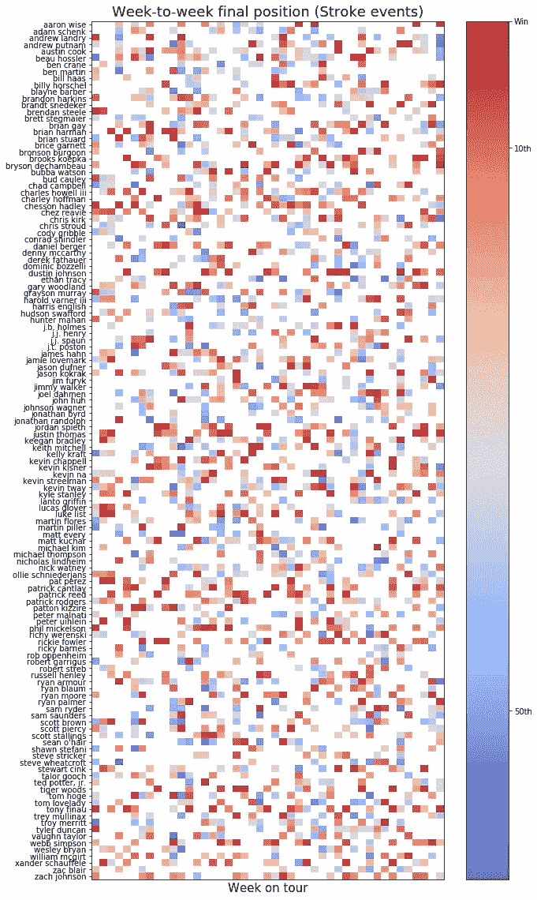
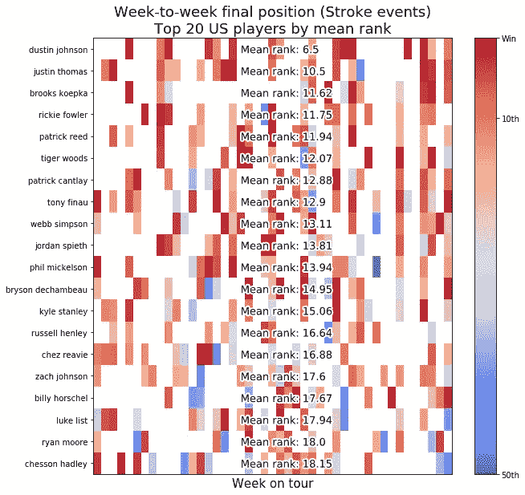
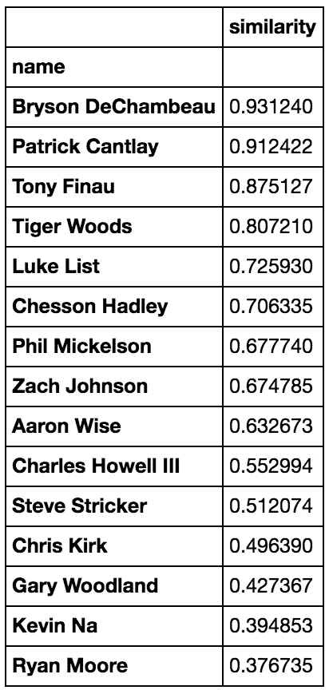

# 2018 年莱德杯-美国通配符(来自数据)

> 原文：<https://towardsdatascience.com/ryder-cup-2018-us-wildcards-from-the-data-d53d5e0c843f?source=collection_archive---------12----------------------->

Photo by [Markus Spiske](https://unsplash.com/@markusspiske?utm_source=medium&utm_medium=referral) on [Unsplash](https://unsplash.com?utm_source=medium&utm_medium=referral)

随着 2018 年莱德杯的快速临近，对于双方的团队组成有很多猜测。自动资格赛已经有以下球员参加了 Le Golf National 的比赛:

Rankings accurate as of August 30th 2018, ahead of the Dell Technologies C’ship & Made in Denmark

欧洲队仍然有一些有潜力的人可以加入积分争夺最后一名，丹麦制造活动是索比约恩·奥尔森、马特·菲茨帕特里克和埃迪·佩珀雷尔争夺第 8 号球衣的机会。

然而，美国已经锁定了他们的八个人。剩下的就是吉姆·福瑞克选择他的四个外卡球员来组成球队。每个人都有自己的观点，认为哪些人应该被选中，以及他们拥有什么样的品质使他们成为理想的人选。在做出选择时，经验和性格都是典型的考虑因素，高尔夫媒体已经指定了一些他们认为应该出现在福瑞克球队名单上的明星球员。

在这么多意见被公布的情况下，做出这样的决定并不容易。数据告诉我们什么？在这篇博文中，我们将使用几个不同的指标来更深入地了解美国顶级非自动化项目的形式(不仅仅是 RC 点)。

(所有 Python 代码可在[https://github.com/jjaco/rydercup2018](https://github.com/jjaco/rydercup2018)获得)

一个有趣的起点是看看本赛季美国球员 PGA 巡回赛每周的结束情况。如果我们获得了到目前为止至少 10 次出局的每个球员的最终位置，我们就可以粗略估计他们每周在球场上的表现。

Weekly rank data in 2018 for US players making 10 cuts in the regular season (thru Northern Trust)

上面的插图概括了每个球员的所有每周排名数据:空白对应于错过的比赛或跳过的比赛，蓝色越多意味着成绩越差，而红色越多表明成绩越好，最深的红色表示获胜。如果我们计算一下*每周的平均排名*，按照这个值对玩家进行排序，看看表现最好的玩家，事情会变得更清楚一些:

Top 20 US players by mean weekly rank (thru Northern Trust)

不出意外，世界排名第一的达斯汀·约翰逊以非常出色的平均排名第 6 位遥遥领先。他是本赛季唯一一个平均最终排名前 10 的球员。

美国其他自动入围者也表现不错:除了布巴沃森(Bubba Watson)之外，所有人都排在前 20 名，他的每周平均排名约为 36 位。这可能是因为布巴在戴尔技术比赛中的胜利没有被计算在内(抱歉，布巴，至少这与莱德杯有关)。

非资格赛的名人是(按平均排名):老虎伍兹(12.07)，帕特里克坎特莱(12.88)，托尼菲瑙(12.9)，菲尔米克尔森(13.94)和布赖森德尚博(14.95)。这一结果让泰格的回归更加令人印象深刻，本赛季他每次出场的场均排名都在前 15 名之内。与菲尔一起，你必须预计这些人将是福瑞克的前两个选择:他们所有的经验加上 2018 年的良好表现将是无价的。

对于剩下的两个槽点，让我们继续从目前的分析来看领跑者:菲瑙、德尚博和坎特莱。由于平均每周成绩不考虑平局或最终位置之间的相对差距，让我们看看一个不同的指标来找出更多信息:*与最终赢家的相对击球数*。这是该球员相对于该周最佳球员表现的大致情况。

这是通过计算一名选手四轮比赛的总成绩和最终获胜者的总成绩之差得出的:请注意，赢得一场比赛的结果是相对击球数为 0，这是理想值。

Histograms of relative strokes from winner for Finau, DeChambeau & Cantlay, with average relative strokes annotated

Finau 在这 3 项指标中的平均得分最低，但本赛季没有赢过 DeChambeau 和 Cantlay 的 2 场和 1 场。从这个角度来看，只有达斯汀·约翰逊和贾斯汀·托马斯在相对击球方面比菲瑙好，分别为+5.31 和+7.33。同样值得注意的是，Cantlay 和 DeChambeau 在美国选手中的相对击球数分别排名第 5 和第 9。

这三个家伙本赛季显然打得很好，他们每个人都有很强的理由成为球队的一部分。但是只剩下两个名额了。

有大量的统计数据和指标可以用来量化高尔夫表现，包括球员比赛的细节。也许我们需要开始审视这些个人属性，以确定最适合这份工作的两个人。PGA 巡回赛跟踪一切，从驾驶距离，到从接近获得的击球，到反弹能力——几乎有太多的选择来做出决定性的选择。为了解决这个问题，我们为每个玩家构建了一个被称为*的特征向量*，由以下关键绩效指标组成(旨在涵盖尽可能多的“精彩表现”支柱):

*   击球次数:开球，接近，果岭周围，推杆，球座到果岭，总杆数
*   驾驶:距离、准确度
*   百分比:规则中的果岭，节省的沙地
*   平均分:老鹰(每洞数)，小鸟，得分

这个 13 分量向量充当每个玩家的表现签名。利用这一点，我们可以开始直接比较球员，测量相似性，并将相似的比赛风格聚集在一起。

以下是加工前达斯汀·约翰逊的特征示例:

Pre-scaling feature vector for Dustin Johnson

每一个都相对于巡回赛中的其他活跃球员(不仅仅是美国人，就像之前的分析一样)进行缩放，以使他们在全球特征空间中直接可比。所有这些都是通过减去平均值并除以每列的标准偏差来对值进行范围归一化。

这为每个球员创建了一个较少人工解释但更具统计鲁棒性的签名，这使我们能够测量两个给定球员的每个特征之间的距离，例如，谁在驾驶*和*推杆时最像 DJ？在特征空间中有几种计算距离的方法，但是我们使用一种叫做[余弦相似度](https://en.wikipedia.org/wiki/Cosine_similarity)的技术来衡量两个玩家有多相似。这提供了一个在[1，-1]范围内的值，1 是最大相似度，-1 是完全不相似。

如果我们假设自动合格的团队成员代表了美国莱德杯球员的理想品质，我们可以通过*对他们的后处理特征向量*取平均值来构建他们的组合。这已经充当了团队中八个玩家的某种“重心”,并且是团队围绕其存在的特征向量空间中的锚点。我们可以看看谁的特征向量和这个最相似。

Overview of ‘most like US Ryder Cup team’ method

那么三位候选人中谁最像这位‘理想的美国莱德杯选手’或者‘美国队主播’呢？计算所有不合格美国选手的余弦相似度:

德尚博，坎特雷，菲瑙都还在上面！这可能并不令人惊讶，因为好的锦标赛结果是建立在好的发挥上的，但请注意，我们的特征向量表示并不像前两个指标那样考虑锦标赛位置或获胜者的击球数(尽管获得的击球数肯定是相关的)。

从这个结果中，我们可以得出结论，从统计数据来看，布赖森是最像自动合格的非合格人员，从数据来看，他将是团队的一个极好的补充(这并不奇怪)。

至于 Finau vs. Cantlay，那真的是一个很艰难的选择。这种势头可能与 Finau 最近的结果和更高姿态的巡回赛有关，但正如我们在这里看到的，Cantlay 确实有数据支持它(实际上在某些方面胜过 Tony)。

祝吉姆·福瑞克和他的选择好运，也祝美国好运。我们去欧洲吧！

**致谢**

*   PGA 巡回赛的所有数据和球员图像(https://pgatour.com)
*   来自[https://github.com/jacoduplessis/golf](https://github.com/jacoduplessis/golf)的 Go PGA 巡回赛 API 包装器的启示