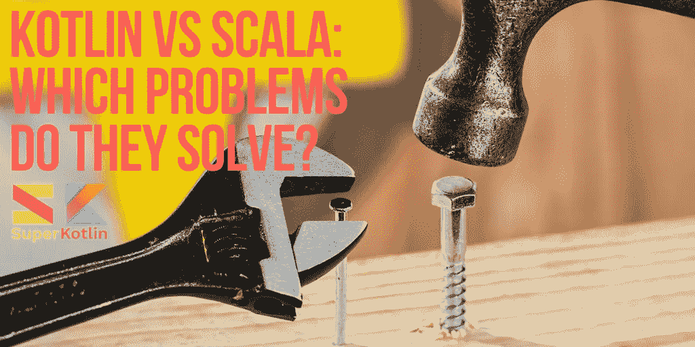

# Scala vs Kotlin:务实程序员的实际考虑

> 原文：<https://towardsdatascience.com/scala-vs-kotlin-practical-considerations-for-the-pragmatic-programmer-d50bcc96765f?source=collection_archive---------0----------------------->

source: superkotlin.com

Java 不仅仅是一门语言；这是一个生态系统。您可以不用编写任何 Java 就能为 JVM 编写代码。这让你可以选择使用更现代的语言。Java 的一些缺点是很明显的。这会让你写很多样板代码。它只在事后才支持函数式编程；lambda 特性是一个组装品。NullPointerException 是每个 Java 程序员的祸根。

2004 年，由马丁·奥德斯基领导的一个小组发布了该语言的更新版本，名为 [Scala](http://scala-lang.org/) (“可扩展语言”)。它增加了一些特性，比如所有事物的对象、作为可分配数据的函数、类型推断和模式匹配。它编译成 Java 字节码，并且可以与 Java 代码混合使用。

另一种目标相同的语言是由 JetBrains 于 2012 年发布的 [Kotlin](https://kotlinlang.org/) 。它建立在人们使用 Scala 的经验之上。对 Scala 的一个常见抱怨是编译速度慢，而 Kotlin 提供了与 Java 相当的编译速度。它最近得到了谷歌的大力支持，谷歌宣称它是安卓开发的一流语言。

如果 Java 的一些特性经常让你烦恼，你会发现两种语言都有你喜欢的地方。如果你烦到要跳下去，你该走哪条路？应该选择 Scala 的成熟还是 Kotlin 的新鲜？对双方都有好处。

**解题方法不同**

Kotlin 和 Scala 和 Java 一样，都是静态类型的。无论一个变量开始是什么类型，它都将在整个生命周期中保持不变。但是这两种方法都省去了你声明每个变量的努力。可以用初始值设定项隐式声明类型。用任何一种语言你都可以写

**var count = 1**

这使得**计数**为整数。请注意，不需要分号。这两种语言的区别在于 Scala 在允许隐式转换方面走得更远。如果你使用了 **x.transmogrify()** ，并且 **x** 属于一个没有 transmogrify 函数的类，那不一定是错误。你可以创建一个*隐式*类，它有一个**转换**方法，编译器会在不需要你做任何转换的情况下，判断出它是否可以介入来完成这项工作。

科特林的创造者发现这有点太自由了。它允许您在一个类上定义*扩展方法*，添加自定义功能。即使在标准数据类型上也可以这样做。(记住，一切都是对象，所以每个数据类型都是一个类。不再需要简单数据类型的装箱。)

空值在 Java 中是一个非常令人头疼的问题。Scala 从几个方面缓解了这个问题。首先，变量必须初始化。您可以将它们初始化为默认值( **var a:Int = _** )，这个值通常为空，但至少它让您意识到您正在这么做。其次，Option 类有助于保证参数和返回值的空安全性。这是这种语言中比较难理解的特性之一，但是它给了你很大的控制权。

科特林直奔主题。默认情况下，它不允许变量的值**为空**。如果你真的需要，你可以声明一个变量为可空，方法是在类型后面加一个问号。如果您使用过 Swift，这种方法听起来会很熟悉。如果使用可为空的值，编译器会进行大量的检查，以确保不会使它们面临 NullPointerException 的风险，如果会，它会给出一个编译时错误。

如果您只想将一些数据打包到一个对象中，Java 会让您使用常规类或枚举。Scala 和 Kotlin 提供了一些更好的选择。Scala 为您提供了 **case 类**，它是数据对象的专用类。它自动定义访问器函数(为什么 Java 不这样做呢？).实例通过结构而不是引用进行比较。自动提供一个**复制**功能来进行浅层复制。

Kotlin 的**数据类**做了几乎相同的事情。主要区别是 Scala 有一个强大的模式匹配特性，这是 Kotlin 没有的。一个**匹配**语句就像一个仿生增强的 **case** 语句。模式不仅可以检查文字值，还可以检查类型、列表和范围。Scala 可以对所有类型的对象进行匹配，但是这个特性对于 case 类尤其强大。

Scala 为 XML 提供了强大的支持。您可以将 XML 直接放入 Scala 代码中，并将其分配给一个 XML 对象。这造成了复杂性，因为后面没有空格的 **<** 操作符可能被解读为 XML 表达式的开始。Kotlin 使用更传统的类方法来处理 XML 对象。

类型类是 Scala 的一个特性，在 Kotlin 中没有对应的特性。类型类定义了一组成员类必须支持的操作。这不像 Java 中的子类化；可以将类型类添加到已经存在的类型中。它允许开发人员用现有类型创建新的多态类型。Kotlin 中的扩展函数不是一回事，但是它们允许您为不同的类型添加共同点，因此它们解决了一些相同的需求。

**语言的感觉**

好吧，这两种语言之间是有差异的，但它们的目标或多或少是一样的。哪个都可以学。选择这个或那个有更大的，更哲学的原因吗？

对一些人来说，区别在于 Scala 更旨在探索新的想法，而 Kotlin 更专注于获得结果。Kotlin 对快速编译的强调和对 Scala 一些深奥特性的去除反映了这一点。Scala 只是让你做很多事情。操作员姓名**？:+** 看起来是合法的，也许你想用它是有原因的。科特林的限制更多。有人会说更理智。

如果你喜欢函数式编程，Scala 比 Kotlin 拥有更多的特性。类型类是一种函数式编程特性。再比如，Scala 支持 currying 和 partial application，这是分解接受多个参数的函数的方法。这为使用参数列表提供了额外的灵活性。科特林提供了做同样事情的方法，但它们可能没有数学上的优雅。

学过 Scala 的人彻底爱死它了。这需要更多的努力，但它让开发人员可以做他们在 Kotlin 中做不到的事情。科特林的追随者经常发现，灵活性更令人困惑，而不是有用的。

**实际考虑**

有时候你想做的事情的现实是主要因素。你需要选择能让你做这项工作的语言，即使你不太喜欢它。如果你打算做 Android 开发，Kotlin 是唯一的选择。Android 不使用 Oracle 的 JVM，所以你不能使用任何旧的兼容 JVM 的语言。Kotlin 拥有在 Android 上编译、调试和运行软件的工具。是 Android Studio 内置的[，从 3.0 版本开始。](https://developer.android.com/kotlin/index.html)

在 Android 之外，Kotlin 的选择更加有限。您致力于为您的 IDE 开发 Eclipse 吗？在某种程度上，您可以使用它来处理这两种语言。Eclipse 的 [Scala IDE 比](http://scala-ide.org/) [Kotlin 插件](https://github.com/JetBrains/kotlin-eclipse)更成熟，设置起来有点痛苦。一些用户报告说他们很难使用后者。NetBeans 的情况类似。随着科特林越来越受欢迎，一两年后情况可能会更加平等。如果您喜欢从命令行工作，IDE 环境不是问题，Kotlin 有所有必要的工具。

Kotlin 仍在不断成熟，但许多 Java 人发现采用它比 Scala 更容易。哪一个最适合你的需求将取决于你的个人风格和你的实际目标。在做决定之前仔细看看这两者。