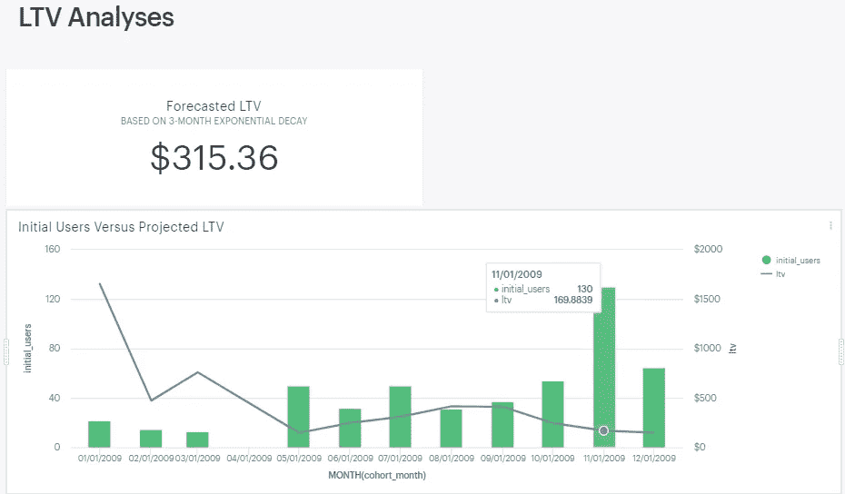
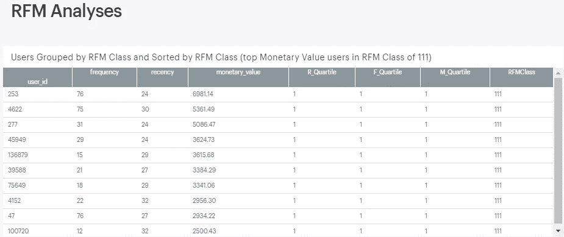

# 用 Python 扩展分析洞察力(第 2 部分)

> 原文：<https://towardsdatascience.com/scaling-analytical-insights-with-python-part-2-73b45ce9584e?source=collection_archive---------6----------------------->


**在这篇第二部分的文章中(第一部分可以在这里找到**[](https://medium.com/@kevinboller/scaling-analytical-insights-with-python-part-1-ba889b97bef9)****)，我将结合几个我认为非常有用的资源，这篇文章将结合一些关键的分析，以便更好地了解直接面向消费者的订阅/ SaaS 客户群。** *为了将所有这些融合在一起，我还将使用我最喜欢的数据分析/数据科学工具之一，* [*模式分析*](https://modeanalytics.com/) *。*最后，我希望你会发现既有用又酷的是一份开源模式分析报告，可以在这里找到；这是我在 FloSports 担任数据仓库和数据分析主管时制作的报告类型的精简版本，所有代码和可视化都可以克隆到您自己的模式报告中，并重新用于类似的数据集(假设您创建了一个帐户，该帐户对公共数据集是免费的)。*如果你没有 Mode Analytics 帐户，并且还没有被说服注册，你应该仍然能够访问 Python 笔记本，并且你还将在* [*这个链接*](https://modeanalytics.com/kdboller/reports/92f412a53aaf/python) 看到所有底层 SQL 查询。**

****快速总结这篇文章将涵盖的内容(注意，每一部分都将使用 Greg Reda 在他的原始文章中引用的相同电子商务用户数据集，在此处找到**[](http://dmanalytics.org/wp-content/uploads/2014/10/chapter-12-relay-foods.xlsx)****):******

1.  ****重新创建第 1 部分的订户群组和保留分析，这次使用 Mode 的 SQL + Python****
2.  ****利用 Ryan Iyengar 的一篇出色的博客文章，使用指数衰减在 SQL 中创建一个预计的 LTV 分析，这篇文章可以在[这里](https://ryaniyengar.com/projecting-customer-lifetime-value-in-sql-using-exponential-decay-b9bf984cef0c)找到****
3.  ****开发 RFM(近期、频率、货币价值)分析，这是电子商务网站用来细分和更好地了解用户/订户购买行为的一种方法****
4.  ****在一份全面的开源模式报告中，使用 SQL 和 Python 的简要记录和可视化展示所有这些是如何联系在一起的****

****同样，模式分析报告在此处[可用](https://modeanalytics.com/kdboller/reports/92f412a53aaf) —您不需要创建模式分析帐户来查看报告，但是，克隆它需要一个免费帐户。原始数据集可以在之前提供的链接中找到，其他所有内容(SQL、Python 代码、如何构建图表和 Python 可视化)都可以在链接的报告中找到。****

****首先，我将 relay-foods 数据集作为一个公共文件添加到 Mode 上— [这里](https://help.modeanalytics.com/articles/upload-public-data-to-mode/)是 Mode 关于如何做的说明(我还添加了一个空前数据集，在计划的 LTV 部分会有更多)。这部分帖子中的 Python 代码可以在报告的笔记本部分[这里](https://modeanalytics.com/kdboller/reports/92f412a53aaf/python)找到；这与我在上一篇文章中使用的代码相同——不同之处在于，从 SQL 查询创建的数据帧是在模式 Python 笔记本中使用的。此外，下面提供的 SQL 代码显示了我在这个数据集上采取的一个小的数据丰富步骤，其中我将用户的第一次付款归类为“初始”，将任何后续付款归类为“重复”。这是可以应用于数据源的业务逻辑类型的一个相当小但快速的例子，通常使用我在过去提到过的聚合事实表。****

```
**with payment_enrichment as (

  select

    order_id
    , order_date
    , user_id
    , total_charges
    , common_id
    , pup_id
    , pickup_date
    , date_trunc('month', order_date) as order_month
    , row_number() over (partition by user_id order by order_date) as payment_number

  from kdboller.relay_foods_v1  
  )

  select
    pe.*
    , case when payment_number = 1 then 'Initial' else 'Repeat' end as payment_type

  from payment_enrichment as pe**
```

****作为这一分析的下一步，我将建立一个预测的 LTV 分析，参考我之前提到的另一个有用的在线资源——Ryan Iyengar 一年多前在 Medium 上发布了这篇预测 LTV 邮报，在这里找到了。如果您曾经在 Excel 中进行过 LTV 分析，您会知道这可能相当耗时，并且这些模型可能会变得非常大，并且远不如您所希望的那样动态。**您可能认为必须有更好的方法来计算单个值，这对于了解订阅业务的健康状况至关重要。幸运的是，至少有一些更好的、高度可重复的方法可以做到这一点。此外，评估群组的不同开始/结束日期范围以包括，例如，对特别强的“早期采用者”群组进行标准化，是在 SQL 和/或 Python 中进行这种类型的分析的显著优势。******

****综上所述，Ryan 的文章肯定需要对 SQL 有一个相当透彻的理解，特别是考虑到公共表表达式(cte)的重要用途。鉴于结果查询的长度，我没有直接粘贴到这篇文章中，但是您可以在模式报告中找到最终查询的几个构建。如果你对我这篇文章的背景或理由有任何疑问，我会推荐你参考他颇有见地和丰富的解释。出于我的文章和报告的目的，我已经展示了如何从我们正在使用的原始数据集创建所需的数据返回，从下面的数据集提供了一些观察数据，还展示了 LTV 部分的一些关键图表，Mode 允许我轻松地将这些图表添加到我的整体报告中。****

******LTV 部分—查询摘要******

****与 LTV 相关的 SQL 查询，借用了 Ryan 非常有用的工作，从报告中的编号 2-8 开始。在 Mode 中，我尝试使用该系统对我的查询进行排序，以便跟踪在一个项目中编写的查询的自然进展— **一个很好的功能请求是拥有某种类型的文件夹系统，以便将这些查询组织到支付、LTV 和 RFM 查询部分。**查询#2 操作数据集，以便拉回与 Ryan 在他的帖子中使用的数据集一致的返回结果——因此，这有望使它更容易理解。我还构建了查询中断来模拟 Ryan 在他的博客帖子中暂停的地方，这样就可以更容易地在他的帖子和我创建的模式报告之间进行跟踪。****

****在查询 4–6 中，您将看到在执行此操作时，我在一个群组中检测到异常情况(参见本段下方的屏幕截图)。在 2009/04/01 年度，在最近的三个月中，该集团的收入份额实际上大幅增加；虽然用户离开一个群组然后又回来的情况并不少见，但这明显扭曲了预测收入，因此也扭曲了这个特定群组的 LTV。因此，该模型并没有预测收入的下降，而是预测每月增长 20%以上(整个预测)。虽然可能有一些首选的方法来规范这一点，但出于时间的考虑，我决定从整体分析中排除这一群体——我要说的是，几乎每个分析中都有类似的事情发生，显然审查数据并确定如何根据需要进行调整至关重要。考虑到公司的行业、未来前景和成熟度，调整决策会有所不同。****

********

****查询 7 和 8 以最终预期回报完成查询，一个显示每个群组的预计 LTV，一个显示考虑所有群组的预测预测和初始用户时的总体预测 LTV。正如您从下面的屏幕截图中看到的，从模式报告输出中复制的，总的 LTV 是大约 315 美元。除此之外，我们看到初始群组(最有可能是“早期采用者”)的 LTV 比随后几个月中看到的要高得多——注意，我们只有 12 个月的群组进行评估，这是一家很少出现的新公司。鉴于此示例，接下来的步骤可能包括进一步细分用户并找到每个 LTV，以及通过从该分析中排除“早期采用者”的贡献来潜在地标准化整体 LTV。*同样值得注意的是，随着最近队列数量的增加，LTV 会降低很多，我们希望了解，随着时间的推移，我们是否能够更有效地扩大我们的用户群，同时理想地扩大或至少维持我们的 LTV。* **请注意，在完成此类分析时，您还应该计算毛利润，或者最好是边际贡献，以反映每个订户的真实基础经济和 LTV。******

********

******RFM 分析******

****在这最后一节，我已经包括了一个近期，频率，货币价值(RFM)分析。在回顾有效的用户细分方法的过程中，在发现这种方法后，我在 Joao Correia 的 GitHub 上找到了[这个有用的笔记本](https://github.com/joaolcorreia/RFM-analysis/blob/master/RFM%20Analysis.ipynb)。这里是 RFM 的一个非常简短的纲要。****

******新近度:**从评估日期起，例如今天，用户/订户已经从网站购买了多近。****

******频率:**用户/订户一生中在特定网站上购买的次数。****

******货币价值:**用户/订户在其作为客户的整个生命周期中从其所有购买中支付的美元总额。****

****虽然有几种方法可以完成 RFM 分析，包括通过 SQL，但我在这里的部分意图是展示如何使用一个相当简单的初始数据集来重新利用其他人的有用工作。在《Python 笔记本》中，RFM 分析了第部分，你会发现我在很大程度上遵循了若昂的笔记本。正如在他的笔记本结论中，我在下面显示了 RFMClass 111 中的前十名客户—这代表了在所有三个 RFM 指标中处于前四分之一的用户；这些用户是最近才付费的，而且比该网站 75%的其他用户付费次数更多，货币价值也更高。因此，这些用户是定性调查的主要对象，这些调查要求对他们喜欢什么和什么可以做得更好进行反馈，你也可以研究他们的网站行为，了解他们可能在做什么，发现哪些与其他访问者不同，以及你可以接受的几种不同的评估。****

********

****在模式报告中使用 Plotly，然后我添加了三个可视化工具，帮助我更好地理解数据，也是为了预测来自业务利益相关者的潜在问题。第一个显示了每个 RFMClass 中的用户分布。积极的一面是，81 名用户属于 111 类，但 75 名属于 344 类，65 名属于 444 类——这些用户已经有一段时间没有付费了，他们的付费次数和货币价值也远低于所有用户的中值。我们想看看我们是否能复活这些用户，或者是否发生了什么事情导致他们(几乎)再也不会回到我们的网站。****

****最后，我想知道每一个 RFMClass 指数是如何根据群体分组的——早期的群体是那些主要在 111 类中的群体吗？如果是这样的话，这可能是一个令人担忧的原因。为了完成这一部分，您将在 Python 笔记本中找到“合并数据以显示按群组划分的 RFM 等级”一节，在这里，我提取了初始付款数据帧的子集，并将其与创建的 rfmSegmentation 数据帧合并。如果你需要一本关于在 Python 中合并数据帧的入门书，类似于 SQL 中的 join，我会推荐你到另一个 Greg Reda 帖子[这里](http://www.gregreda.com/2013/10/26/working-with-pandas-dataframes/)。****

****回顾下面的两个图表，第一个是按群组划分的总用户，第二个是按群组划分的 RFM 111 级用户，我们看到 RFM 111 级的最大贡献者来自 2009 年 11 月和 2010 年 1 月。然而，当我们回顾第一张有每个群组用户总数的图表时，我们看到 2009 年 11 月是一个特别大的群组，相对来说，并不是 RFM 顶级用户的主要来源。更好的输出将为每个群组计算每个月群组中 RFMClass 111 用户所占的百分比；但是我将把它留给下一次/可能是后续的帖子。****

********

****这是一篇我很喜欢整理的分析文章的结尾。希望这传达了超越 Excel 的价值，利用有洞察力的人的公共贡献以及 SQL 和 Python 等工具的好处。****

******关于使用 Mode 的好处的一些快速说明(** [**)此外，这里有一篇来自 Mode 的博客的帖子**](https://blog.modeanalytics.com/learn-sql-using-excel) **，关于他们如何从 Excel 转向 SQL 和 Python:******

*   ****可以用 SQL(内置图表功能)或 Python 轻松创建图表；然后，这些图表与您的数据查询相关联，并将自动更新****
*   *****报告具有很高的可复制性，如果您想保留以前的报告，例如季度业务回顾*****
*   ****减少了创建数据集并以 CSV 格式读入 Jupyter 笔记本的需求；您可以将每个查询作为数据帧直接读入 Mode 的 Python 笔记本中****
*   ****我说这些是有警告的，并不是所有的 Python 库在 Mode 中都可用，尽管有相当一部分是可用的，并且计算能力是 Mode 不断寻求改进的一个领域****

******从一个非常基本的用户数据集开始，利用模式分析的全部功能，我们能够完成以下工作:******

*   ****在 Mode 的平台上贡献两个公共数据集****
*   ****通过 SQL 和 Python 将用户按月分组****
*   ****在 Python 中为这些月度群组构建保留曲线/保留热图****
*   ****在 Python 中计算群组的加权平均保留曲线****
*   ****使用 SQL 为整个公司和每个团队设计 LTV 项目****
*   *****进行 RFM 分析，了解 Python 中每个类的分布以及每月群组的贡献——这是通过在 Mode 的 Python 笔记本中合并两个数据框架(一个由 SQL 和 Python 共同创建，另一个由 Python 直接创建)来完成的*****
*   ****最后，我们创建了一个(希望如此)直观、全面的开源报告****
*   ****就添加额外的分析而言，该报告是相当可扩展的，并且也可以随着新的每月数据的滚动而容易地更新****

****希望你发现这篇文章和我发现的 Mode 一样有帮助，以及参考的文章被用来制作这份 Mode 报告，如果你有任何问题或想法，请在评论区告诉我。****