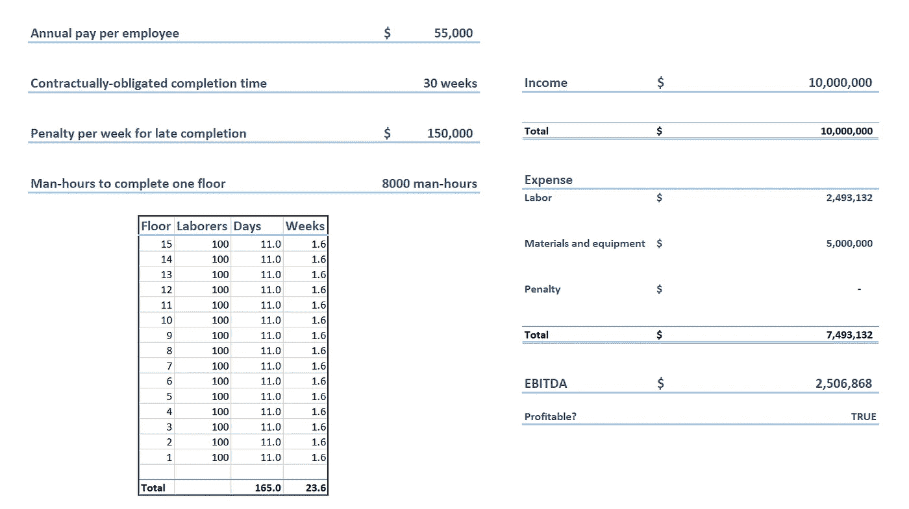
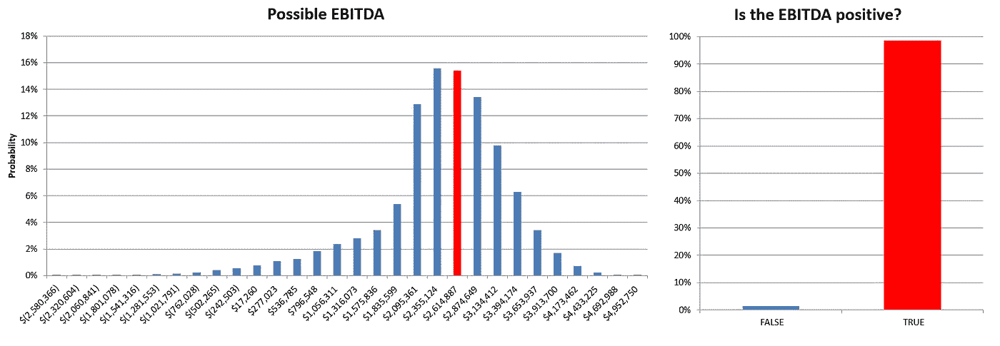
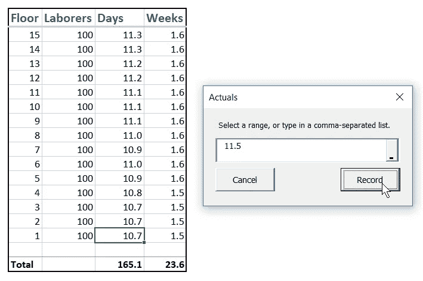
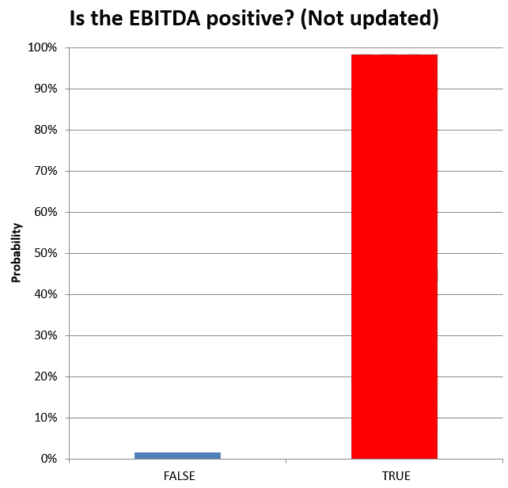
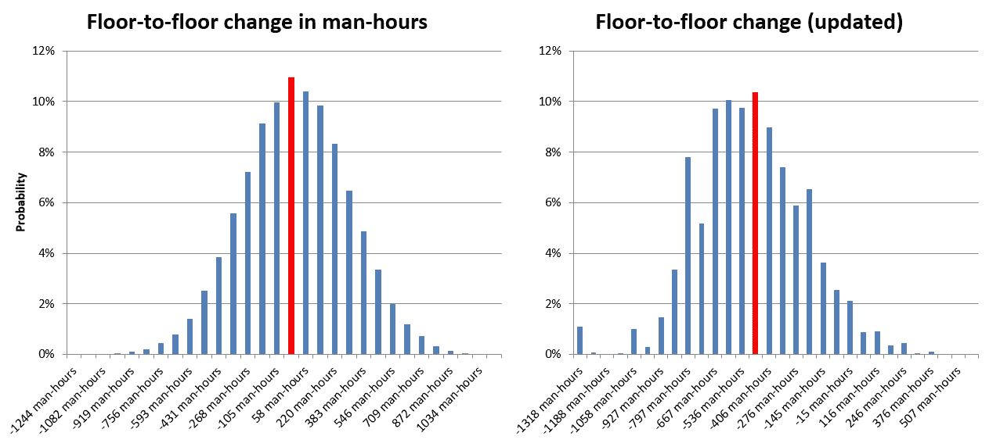

# 建设方案

> 原文：<https://towardsdatascience.com/scenarios-for-construction-d7f55306168?source=collection_archive---------8----------------------->

在本帖中，我们给出了我们应用程序的一个用例的扩展说明，*场景*:对一个城市建设任务的劳动力成本和预算建模。(这是我们的第二个扩展示例用例；我们之前已经讨论过使用场景进行[会计和管理](http://invrea.com/blog/accounting_predictions.php)。)在此过程中，我们将提供示例 Excel 模型，您可以下载并自己运行(如果您有*场景*)。要下载*场景*，请点击加入我们的 alpha 计划[。](http://invrea.com/download.php)

# 敏感性分析

考虑下面的假设情况。你是一家建筑公司的主管，该公司承包了一栋 15 层的大楼，要价 1000 万美元。固定成本(如设备和材料)占该价格的 500 万美元，在计入劳动力成本之前，收益为 500 万美元。

然而，计算劳动力成本并不那么简单。作为建筑行业中经验丰富的专业人士，你知道预算中写的内容往往与实际情况不尽相同。在规划预算时，您使用了施工经理提供给您的数字。施工经理告诉会计，假设你的 100 名工人，每人每年支付 55，000 美元，每天工作 8 小时，将在 11 天内完成每一层，在 24 周内完成建筑。

更具体地说，他假设完成每层楼总共需要 8，000 个工时，可以分配给多个工人，加上每层楼一天的准备时间。根据这一假设，您的预算指定了 2，493，132 美元的劳动力成本，导致税前收益为 2，506，868 美元，折旧和摊销( **EBITDA** )。施工经理的假设正确吗？你的利润率取决于此。

如果对完成建筑所需的劳动力数量判断错误，你的公司将付出比劳动力直接成本更多的代价。根据合同条款，你的公司必须在 30 周内完成这座大楼，否则你将面临罚款:超过合同规定的完工时间，每超过一周，你将支付 15 万美元的罚款，从而侵蚀你的利润率。

这些假设以及由此产生的预算在以下电子表格模型中进行了详细说明(请访问我们的网站下载该模型):

上述给计划者和决策者提出的第一个问题叫做**敏感性分析**。这项工作的利润率对每层楼需要多长时间的假设有多敏感？如果出于某种原因，每个楼层需要 15 天而不是 11 天，这是否会破坏利润率？如果每完成一层楼，建筑的速度就会加快，那么后续的楼层也会很快完成——如果速度变慢了呢？两者都是可行的，取决于项目的类型。

解决这些问题的卓越工具是**蒙特卡洛模拟**。我们，建模者，通过将某些量指定为未知数，作为**假设**，来增加上述预算。这就考虑到了施工经理做出的假设可能并不准确的可能性。在这种情况下，未知数是 a)完成一个楼层所需的工时数，b)楼层与楼层之间的工时变化，以及 c)完成每个楼层所需时间的可变性都是未知的。使用*场景*，将先前的模型改变成概率模型是简单的:简单地用分布替换将要变得随机的单元。同样，请访问我们的网站下载模型:

这个模型增加了三个新的假设。首先，我们假设完成一层楼所需的工时是**正态分布**，期望值为 8000 小时，标准差为 1000 小时。本质上，这意味着建模者预计该值为 8，000 小时，但也考虑到了低至 5，000 小时、高至 11，000 小时的可能性。

我们的第二个假设与施工进度有关。我们考虑到施工速度可能会随着每层楼的完工而减慢或加快。我们认为最有可能的情况是施工速度不会减慢或加快，但我们考虑到了施工速度减慢或加快的可能性，即每层楼在任一方向上可能会增加多达 900 个工时。我们考虑到了这种可能性，因为我们不知道它会减速还是加速，而且如果它真的减速，正如我们将看到的，这对我们的利润率非常不利。

最后，在上图右下方的公式中，我们进行第三个假设。我们假设每个楼层施工时间的可变性也是不确定的——虽然大多数楼层预计需要大约 8，000 个工时才能完成，但我们不知道同一栋建筑内楼层完成时间的差异有多大。高可变性表明楼层完成时间非常不可预测，而低可变性表明如果第一层需要 8，500 小时，其余楼层可能也需要非常相似的时间。

(注意:这些假设仅利用了打包在*场景*中的几个概率分布——正态分布和伽玛/厄兰分布。关于*场景*中包含的发行版的完整列表，请参见[场景*文档*](http://invrea.com/doc/dists.php)。有关如何解释这些假设和理解由*场景*执行的分析的更多信息，请参见此处的[和此处](http://invrea.com/blog/bayes_tutorial.php)的[。)](http://invrea.com/blog/weltanschauung.php)

通过使用*场景*为上述模型生成 100，000 个场景，我们可以分析利润率对我们做出的特定假设的敏感度。以下是这些模拟结果的报告:

左边的图表显示了*场景*运行的 100，000 个模拟中每个模拟产生的 EBITDA。右边的图表只是左边图表的压缩版本，只显示了在每种情况下 EBITDA 是否为正。

因此，在大多数模拟运行中(约 98%)，EBITDA 大于零。在其余 2%的场景中，要么是每层楼的完工时间比专家预计的时间长得多，要么是楼层完工时间呈明显上升趋势，导致上层楼的完工时间比下层楼长得多。如果 2%是你和你的公司可以承受的风险水平，敏感性分析已经做出了你的决定——你应该同意这个提议，继续这个项目。

# 合并实际值

然而，一旦你决定继续这个项目，决策就不会停止。事实上，Invrea 的洞察力是，最重要和最困难的决定还在前面。如果您的团队没有对建筑项目的实际数据做出正确的反应，如果您的团队没有将实际数据纳入决策过程，那么您可能会损失惨重。这就是我们的意思。

决策不是一个静态的过程。通常，商业决策需要根据新数据重新评估。以您的建筑项目为例，考虑一下如果您的公司开始该建筑项目，前四层分别用了 11.5 天、11 天、14.5 天和 15.8 天，您会处于什么位置。

这些结果使你陷入困境。这些最低完工时间是否代表一种明显的上升趋势，从而导致完工时间的显著延迟？或者这仅仅是由于不可预见的因素，使得第三层和第四层的时间比预期的要长？如果有明显的上升趋势，那么由此导致的延误可能会使你的劳动力规模增加一倍，以便在合同规定的时间内完成项目，这样你仍然可以盈利。然而，如果这些数据点只是异常值(T1)和 T2(T3 ),而不是趋势的指示，那么将员工数量增加一倍就是浪费，会侵蚀你的利润率。

具体来说，您必须解决的问题是，在构建模型的过程中，我们做了两个相互有些矛盾的假设。我们对楼层间的工时变化做了一个假设，指出这种幅度的上升趋势是完全可能的。我们对每层建筑时间的可变性做了另一个假设，假设这种程度的异常值是完全合理的，并且可能与恒定的楼层完工时间一致。我们有[非常少量的数据](http://invrea.com/blog/small_data.php)。你如何权衡这两种假设，以便最好地解释观察到的数据，然后使用结果来通知并可能重新评估你的决定？这正是*场景*的核心独有技术**概率编程**新技术所要解决的问题。

在*场景*中，有一个特殊的构造告诉模型它必须以这种方式从新数据中学习。我们称之为模型必须从**实际值**中学习的数据点。向模型添加实际数据点就像右击单元格并按下“记录实际数据”一样简单:

通过按下该对话框中的“记录”,用户告诉*场景*,他们只对观看第四层需要 15.8 天完成的场景感兴趣。(这个过程可以很容易地对前面的三层楼重复；或者访问我们的网站下载生成的模型。)*场景*以一种在商业应用中从未见过的方式使用这些实际数据点:同时验证和改进我们建模者输入的假设。 *Scenarios* 然后根据新的数据和修改后的假设产生新的预测和建议。(关于*场景*如何解决这些问题的深入讨论，见[这里](http://invrea.com/blog/bayes_tutorial.php)和[这里](http://invrea.com/blog/weltanschauung.php)。)

因此，使用*场景*，我们又生成了 500，000 个场景，这次考虑了前四层的结果。我们发现我们的预测发生了重大转变:

考虑到前四层的完工时间，EBITDA 小于零的几率超过 35%。所以，为了保证公司在这个项目上不赔钱，我们必须雇用更多的工人。*情景*告诉我们，根据新数据，我们关于楼层完工时间的最初假设是错误的，并将其修正为更准确的假设。

不使用*场景*就无法得到这种分析。如果您不是按“记录实际”而是简单地将观察到的楼层完成时间输入到相应的单元格中，我们就不会修改我们的初始假设，我们仍然会在一个错误的模型上操作，我们将有超过 35%的机会损失数十万美元。要了解这一点，请从我们的网站下载模型并运行*场景*:

当被指示从数据中学习时，*场景*使用这些数据来检查其用户输入的假设是否正确，改进这些假设，然后使用这些改进的假设来建立对未来的改进预测。在这种情况下，it 部门了解到，实际上建造楼层需要将近 9，000 个工时(而不是我们最初假设的 8，000 个工时)，而且很有可能会导致楼层越高，建造时间越长。

为了检查*场景*对构建过程了解了什么，比较下面两个直方图。左边的是我们对楼层间工时趋势的最初假设，以零为中心，右边的是*场景*推断的分布，以更好地代表实际发生的数据:

因此，这些实际情况——楼层完工时间——迫使你重新考虑你未来的假设。作为对这些新数据的反应，你应该改变你的决定——增加劳动力的规模，这样这个项目最终将在 30 周内完成。然而，你不想增加太多的劳动力，因为这将在劳动力成本上浪费金钱。那么，你如何选择何时增加员工数量，以及增加多少？

场景，使用上面的模型，也可以解决这个问题。只需改变模型中使用的劳动者数量，保留前四层的结果来训练模型，有关 EBITDA 的预测就会更新。例如，假设您正在考虑在建造 10 至 15 层时将员工人数增加一倍。下图显示了 EBITDA 为正的概率，如果您决定按照此方案增加员工人数:

仅在后几层就将员工人数增加了一倍，这大大降低了因罚款而超出预算的风险。因此，尽管劳动力成本增加，但将 10 至 15 层的劳动力规模增加一倍是一个好主意。

*场景*的应用绝不仅限于建筑。如果你面临一个不确定性很高且数据可用的决策问题，考虑使用*场景*来为你的分析提供信息。决策和数据都不是静态的，在几乎所有情况下，最重要的数据都是最新的数据。一旦新的数据出现，预测就会改变。*场景*可以自动为你做到这一点。在这里加入阿尔法计划[。](http://invrea.com/download.php)

*原载于*[*invrea.com*](http://invrea.com/blog/construction.php)*。*