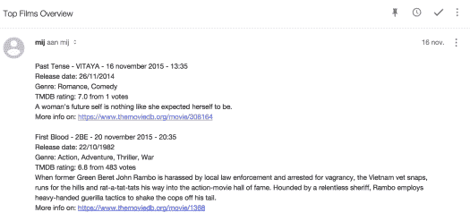

# 在网上搜寻收视率最高的电视电影

> 原文：<https://towardsdatascience.com/scrape-the-web-for-top-rated-movies-on-tv-ac66df0bd502?source=collection_archive---------8----------------------->


Photo by [Frank Okay](https://unsplash.com/@frankokay?utm_source=medium&utm_medium=referral) on [Unsplash](https://unsplash.com?utm_source=medium&utm_medium=referral)

在这篇文章中，我将展示如何使用 [***Scrapy 框架***](http://scrapy.org/) 在互联网上搜索顶级电影。这个网页抓取器的 ***目标*** 是找到在[电影数据库](https://www.themoviedb.org/)上具有高用户评级的电影。这些影片的列表将存储在一个 ***SQLite 数据库*** 和 ***中，并通过电子邮件发送给*** 。这样你就知道你再也不会错过电视上的大片了。

# 寻找一个好的网页来抓取

我从在线电视指南开始寻找比利时电视频道上的电影。但是您可以轻松地修改我的代码，将其用于任何其他网站。为了让你刮电影的时候更轻松，确定你要刮的网站

*   具有带 ***的可理解类或 id*** 的 HTML 标签
*   以一种 ***一致*** 的方式使用类和 id
*   有 ***结构良好的网址***
*   在一个页面上包含所有相关的 ***电视频道***
*   每个工作日都有一个 ***单独的页面***
*   ***只列出电影*** ，没有其他节目类型，如现场表演、新闻、报道等。除非你能轻易地将电影与其他节目类型区分开来。

有了发现的结果，我们将从电影数据库[](https://www.themoviedb.org/)*【TMDB】中获取电影评级和其他一些信息。*

# *决定存储什么信息*

*我将收集以下关于电影的信息:*

*   *电影名称*
*   *电视频道*
*   *电影开始的时间*
*   *这部电影在电视上播出的日期*
*   *类型*
*   *情节*
*   *出厂日期*
*   *链接到 TMDB 的详细页面*
*   *TMDB 评级*

*你可以用所有演员、导演、有趣的电影事实等等来补充这个列表。所有你想知道更多的信息。*

*在 Scrapy 中，该信息将存储在 ***项*** 的字段中。*

# *创建 Scrapy 项目*

*我假设你已经安装了 Scrapy。如果没有，可以按照 Scrapy 优秀的[安装手册。](http://doc.scrapy.org/en/latest/intro/install.html)*

*安装 Scrapy 后，打开命令行并转到您想要存储 Scrapy 项目的目录。然后运行:*

```
*scrapy startproject topfilms*
```

*这将为 top films 项目创建一个文件夹结构，如下所示。现在可以忽略 topfilms.db 文件。这是我们将在下一篇关于管道的博客文章中创建的 SQLite 数据库。*

**

# *定义废料项目*

*在这个故事中，我们将使用文件 ***items.py* 。**创建你的 Scrapy 项目时默认创建 Items.py。*

*一个`scrapy.Item`是一个容器，将在网页抓取过程中被填充。它将保存我们想要从网页中提取的所有字段。该项目的内容可以用与 ***Python dict*** 相同的方式访问。*

*打开 items.py 并添加一个包含以下字段的`Scrapy.Item class`:*

```
*import scrapyclass TVGuideItem(scrapy.Item):
    title = scrapy.Field()
    channel = scrapy.Field()
    start_ts = scrapy.Field()
    film_date_long = scrapy.Field()
    film_date_short = scrapy.Field()
    genre = scrapy.Field()
    plot = scrapy.Field()
    rating = scrapy.Field()
    tmdb_link = scrapy.Field()
    release_date = scrapy.Field()
    nb_votes = scrapy.Field()*
```

# *用管道处理项目*

*在开始一个新的 Scrapy 项目后，您将拥有一个名为 **pipelines.py** 的文件。打开该文件，复制粘贴如下所示的代码。之后，我将一步一步地向您展示代码的每一部分是做什么的。*

```
*import sqlite3 as lite
con = None  # db connection
class StoreInDBPipeline(object):
    def __init__(self):
        self.setupDBCon()
        self.dropTopFilmsTable()
        self.createTopFilmsTable()def process_item(self, item, spider):
        self.storeInDb(item)
        return itemdef storeInDb(self, item):
        self.cur.execute("INSERT INTO topfilms(\
        title, \
        channel, \
        start_ts, \
        film_date_long, \
        film_date_short, \
        rating, \
        genre, \
        plot, \
        tmdb_link, \
        release_date, \
        nb_votes \
        ) \
        VALUES( ?, ?, ?, ?, ?, ?, ?, ?, ?, ?, ? )",
        (
        item['title'],
        item['channel'],
        item['start_ts'],
        item['film_date_long'],
        item['film_date_short'],
        float(item['rating']),
        item['genre'],
        item['plot'],
        item['tmdb_link'],
        item['release_date'],
        item['nb_votes']
        ))
        self.con.commit()def setupDBCon(self):
        self.con = lite.connect('topfilms.db')
        self.cur = self.con.cursor()def __del__(self):
        self.closeDB()def createTopFilmsTable(self):
        self.cur.execute("CREATE TABLE IF NOT EXISTS topfilms(id INTEGER PRIMARY KEY AUTOINCREMENT NOT NULL, \
        title TEXT, \
        channel TEXT, \
        start_ts TEXT, \
        film_date_long TEXT, \
        film_date_short TEXT, \
        rating TEXT, \
        genre TEXT, \
        plot TEXT, \
        tmdb_link TEXT, \
        release_date TEXT, \
        nb_votes \
        )")def dropTopFilmsTable(self):
        self.cur.execute("DROP TABLE IF EXISTS topfilms")

    def closeDB(self):
        self.con.close()*
```

*首先，我们从导入 [SQLite 包](https://docs.python.org/2/library/sqlite3.html)开始，并给它起别名`lite`。我们还初始化了一个用于数据库连接的变量`con`。*

## *创建一个类来存储数据库中的项*

*接下来，您创建一个具有逻辑名称的 [***类***](https://docs.python.org/2/tutorial/classes.html) 。在设置文件中启用管道后(稍后将详细介绍)，这个类将被调用。*

```
*class StoreInDBPipeline(object):*
```

## *定义构造函数方法*

*构造函数方法是名为`__init__`的方法。当创建一个`StoreInDBPipeline`类的实例时，这个方法会自动运行。*

```
*def __init__(self):
        self.setupDBCon()
        self.dropTopFilmsTable()
        self.createTopFilmsTable()*
```

*在构造函数方法中，我们启动了在构造函数方法下面定义的另外三个方法。*

## *SetupDBCon 方法*

*通过方法`setupDBCon`，我们创建了 topfilms 数据库(如果它还不存在的话)并用`connect`函数连接到它。*

```
*def setupDBCon(self):
        self.con = lite.connect('topfilms.db')
	self.cur = self.con.cursor()*
```

*这里我们将 alias lite 用于 SQLite 包。其次，我们用`cursor`函数创建一个光标对象。使用这个游标对象，我们可以在数据库中执行 SQL 语句。*

## *DropTopFilmsTable 方法*

*构造函数中调用的第二个方法是`dropTopFilmsTable`。顾名思义，它删除 SQLite 数据库中的表。*

*每次运行 web scraper 时，数据库都会被完全删除。如果你也想这样做，那就看你自己了。如果你想对电影数据进行一些查询或分析，你可以保存每次运行的抓取结果。*

*我只想看接下来几天的顶级电影，仅此而已。因此，我决定在每次运行时删除数据库。*

```
*def dropTopFilmsTable(self):
        self.cur.execute("DROP TABLE IF EXISTS topfilms")*
```

*使用光标对象`cur`我们执行`DROP`语句。*

## *CreateTopFilmsTable 方法*

*放下 top films 表后，我们需要创建它。这是通过构造函数方法中的最后一个方法调用来完成的。*

```
*def createTopFilmsTable(self):
        self.cur.execute("CREATE TABLE IF NOT EXISTS topfilms(id INTEGER PRIMARY KEY AUTOINCREMENT NOT NULL, \
        title TEXT, \
        channel TEXT, \
        start_ts TEXT, \
        film_date_long TEXT, \
        film_date_short TEXT, \
        rating TEXT, \
        genre TEXT, \
        plot TEXT, \
        tmdb_link TEXT, \
        release_date TEXT, \
        nb_votes \
        )")*
```

*我们再次使用游标对象 cur 来执行`CREATE TABLE`语句。添加到桌面电影中的字段与我们之前创建的 Scrapy 项目中的字段相同。为了简单起见，我在 SQLite 表中使用了与 Item 中完全相同的名称。只有`id`字段是额外的。*

> ***旁注**:查看 SQLite 数据库的一个很好的应用是 Firefox 中的 [SQLite 管理器插件。你可以在 Youtube](https://addons.mozilla.org/nl/firefox/addon/sqlite-manager/) 上观看这个 [SQLite 管理器教程来学习如何使用这个插件。](https://youtu.be/y-yA7YT-7gw)*

## *流程项目方法*

*此方法必须在 Pipeline 类中实现，并且必须返回 dict、Item 或 DropItem 异常。在我们的网络刮刀，我们将返回项目。*

```
*def process_item(self, item, spider):
        self.storeInDb(item)
	return item*
```

*与解释的其他方法相比，它有两个额外的参数。被刮的`item`和刮物品的`spider`。从这个方法中，我们启动`storeInDb`方法，然后返回项目。*

## *StoreInDb 方法*

*这个方法执行一个`INSERT`语句将抓取的条目插入 SQLite 数据库。*

```
*def storeInDb(self, item):
        self.cur.execute("INSERT INTO topfilms(\
        title, \
        channel, \
        start_ts, \
        film_date_long, \
        film_date_short, \
        rating, \
        genre, \
        plot, \
        tmdb_link, \
        release_date, \
        nb_votes \
        ) \
        VALUES( ?, ?, ?, ?, ?, ?, ?, ?, ?, ?, ? )",
        (
        item['title'],
        item['channel'],
        item['start_ts'],
        item['film_date_long'],
        item['film_date_short'],
        float(item['rating']),
        item['genre'],
        item['plot'],
        item['tmdb_link'],
        item['release_date'],
        item['nb_votes']
        ))
        self.con.commit()*
```

*表字段的值来自 item，这是此方法的一个参数。这些值被简单地称为一个字典值(记住一个条目只不过是一个字典？).*

## *每个构造函数都有一个…析构函数*

*与构造函数方法相对应的是名为`__del__`的析构函数方法。在 pipelines 类的析构函数方法中，我们关闭了与数据库的连接。*

```
*def __del__(self):
	self.closeDB()*
```

## *CloseDB 方法*

```
*def closeDB(self):
	self.con.close()*
```

*在最后一个方法中，我们用`close`函数关闭数据库连接。所以现在我们已经写了一个全功能的管道。还剩下最后一步来启用管道。*

## *在 settings.py 中启用管道*

*打开 ***settings.py*** 文件，添加以下代码:*

```
*ITEM_PIPELINES = {
    'topfilms.pipelines.StoreInDBPipeline':1
}*
```

****整数值*** 表示流水线运行的顺序。因为我们只有一个管道，所以我们给它赋值 1。*

# *在 Scrapy 中创建一个蜘蛛*

*现在我们就来看看刺儿头的核心， ***蜘蛛*** 。这是你的刮网器将完成的地方。我将一步一步地向您展示如何创建一个。*

## *导入必要的包*

*首先，我们将导入必要的包和模块。我们使用`CrawlSpider`模块跟踪在线电视指南中的链接。*

*`Rule`和`LinkExtractor`用于确定我们想要关注的链接。*

*`config`模块包含一些在蜘蛛中使用的常量，如`DOM_1, DOM_2`和`START_URL`。配置模块位于当前目录的上一个目录。这就是为什么你在配置模块前看到两个点。*

*最后，我们导入了`TVGuideItem`。该 TVGuideItem 将用于包含抓取过程中的信息。*

```
*import scrapy
from scrapy.spiders import CrawlSpider, Rule
from scrapy.linkextractors import LinkExtractor
from fuzzywuzzy import fuzz
from ..config import *
from topfilms.items import TVGuideItem*
```

## *告诉蜘蛛去哪里*

*其次，我们创建了 CrawlSpider 类的子类。这是通过插入 CrawlSpider 作为`TVGuideSpider`类的参数来实现的。*

*我们给蜘蛛一个`name`，提供`allowed_domains`(例如 themoviedb.org)和`start_urls`。在我的例子中，start_urls 是电视指南的网页，所以您应该通过自己的首选网站来更改它。*

*通过`rules`和`deny` 参数，我们告诉爬行器在起始 URL 上跟随(不跟随)哪些 URL。不跟随的 URL 是用正则表达式指定的。*

**

*我对昨天放映的电影不感兴趣，所以我拒绝蜘蛛跟踪以“ *gisteren* ”结尾的 URL。*

*好吧，但是蜘蛛应该跟踪哪些 URL 呢？为此，我使用了`restrict_xpaths`参数。它说要关注所有带有 class = " button button–beta "的 URL。这些事实上是未来一周每天的电影链接。*

*最后，通过`callback`参数，我们让蜘蛛知道当它跟踪一个 URL 时该做什么。它将执行功能`parse_by_day`。我将在下一部分解释这一点。*

```
*class TVGuideSpider(CrawlSpider):
    name = "tvguide"
    allowed_domains = [DOM_1, DOM_2]
    start_urls = [START_URL]# Extract the links from the navigation per day
    # We will not crawl the films for yesterday
    rules = (
        Rule(LinkExtractor(allow=(), deny=(r'\/gisteren'), restrict_xpaths=('//a[@class="button button--beta"]',)), callback="parse_by_day", follow= True),
    )*
```

## *解析跟踪的 URL*

*TVGuideScraper 的一部分功能`parse_by_day`每天从网页上抓取每个频道所有电影的概览。`response`参数来自运行网络抓取程序时启动的`Request`。*

*在被抓取的网页上，你需要找到用来显示我们感兴趣的信息的 HTML 元素。两个很好的工具是 Chrome 开发者工具和 Firefox 中的 Firebug 插件。*

*我们想要存储的一个东西是我们正在抓取电影的`date`。这个日期可以在带有`class="grid__col__inner"`的 div 中的段落(p)中找到。显然，这是您应该为自己的网页修改的内容。*

**

*利用响应对象的`xpath method`，我们提取段落中的文本。在这篇关于如何使用 xpath 函数的教程中，我学到了很多东西。*

*通过使用`extract_first`，我们确保不会将这个日期存储为一个列表。否则，在 SQLite 数据库中存储日期时会出现问题。*

*之后，我对 film_date_long 执行了一些数据清理，并创建了格式为 YYYYMMDD 的`film_date_short`。我创建了这种 YYYYMMDD 格式，以便稍后按时间顺序对电影进行排序。*

*接下来，刮电视频道。如果是在`ALLOWED_CHANNELS`(在 config 模块中定义)的列表中，我们继续刮标题和开始时间。该信息存储在由`TVGuideItem()`启动的项目中。*

*在这之后，我们想继续刮电影数据库。我们将使用 URL[**https://www.themoviedb.org/search?query=**](https://www.themoviedb.org/search?query=)来显示被抓取的电影的搜索结果。对于这个 URL，我们要添加电影标题(代码中的`url_part`)。我们只是重复使用在电视指南网页上的链接中找到的 URL 部分。*

*有了这个 URL，我们创建了一个新的请求，并继续 TMDB。使用`request.meta['item'] = item`，我们将已经抓取的数据添加到请求中。这样我们可以继续填充我们当前的 TVGuideItem。*

*`Yield request`实际发起请求。*

```
*def parse_by_day(self, response):film_date_long = response.xpath('//div[@class="grid__col__inner"]/p/text()').extract_first()
        film_date_long = film_date_long.rsplit(',',1)[-1].strip()  # Remove day name and white spaces# Create a film date with a short format like YYYYMMDD to sort the results chronologically
        film_day_parts = film_date_long.split()months_list = ['januari', 'februari', 'maart',
                  'april', 'mei', 'juni', 'juli',
                  'augustus', 'september', 'oktober',
                  'november', 'december' ]year = str(film_day_parts[2])
        month = str(months_list.index(film_day_parts[1]) + 1).zfill(2)
        day = str(film_day_parts[0]).zfill(2)film_date_short = year + month + dayfor col_inner in response.xpath('//div[@class="grid__col__inner"]'):
            chnl = col_inner.xpath('.//div[@class="tv-guide__channel"]/h6/a/text()').extract_first()if chnl in ALLOWED_CHANNELS:
                for program in col_inner.xpath('.//div[@class="program"]'):
                    item = TVGuideItem()
                    item['channel'] = chnl
                    item['title'] = program.xpath('.//div[@class="title"]/a/text()').extract_first()
                    item['start_ts'] = program.xpath('.//div[@class="time"]/text()').extract_first()
                    item['film_date_long'] = film_date_long
                    item['film_date_short'] = film_date_shortdetail_link = program.xpath('.//div[@class="title"]/a/@href').extract_first()
                    url_part = detail_link.rsplit('/',1)[-1]# Extract information from the Movie Database [www.themoviedb.org](http://www.themoviedb.org)
                    request = scrapy.Request("https://www.themoviedb.org/search?query="+url_part,callback=self.parse_tmdb)
                    request.meta['item'] = item  # Pass the item with the request to the detail pageyield request*
```

## *抓取电影数据库中的附加信息*

*正如您注意到的，在函数`parse_by_day`中创建的请求中，我们使用了回调函数`parse_tmdb`。这个函数在请求抓取 TMDB 网站时使用。*

*在第一步中，我们获取 parse_by_day 函数传递的商品信息。*

*带有 TMDB 搜索结果的页面可能会列出同一个电影名称的多个搜索结果(查询中传递了 url_part)。我们也用`if tmddb_titles`检查是否有结果。*

**

*我们使用 [fuzzywuzzy](https://pypi.python.org/pypi/fuzzywuzzy) 包对电影片名进行模糊匹配。为了使用 fuzzywuzzy 包，我们需要将`import`语句与前面的导入语句一起添加。*

```
*from fuzzywuzzy import fuzz*
```

*如果我们找到 90%匹配，我们使用搜索结果来做剩下的搜集工作。我们不再看其他搜索结果。为此，我们使用了`break`语句。*

*接下来，我们从搜索结果页面中收集`genre`、`rating`和`release_date`，收集方式与之前使用 xpath 函数的方式类似。为了获得发布日期的 YYYYMMDD 格式，我们使用`split`和`join`函数执行一些数据处理。*

*我们想再次对 TMDB 的详细信息页面发起一个新的请求。这个请求将调用`parse_tmdb_detail`函数来提取电影情节和 TMDB 的票数。这将在下一节中解释。*

```
*def parse_tmdb(self, response):
        item = response.meta['item']  # Use the passed itemtmdb_titles = response.xpath('//a[@class="title result"]/text()').extract()if tmdb_titles:  # Check if there are results on TMDB
            for tmdb_title in tmdb_titles:
                match_ratio = fuzz.ratio(item['title'], tmdb_title)
                if match_ratio > 90:
                    item['genre'] = response.xpath('.//span[@class="genres"]/text()').extract_first()
                    item['rating'] = response.xpath('//span[@class="vote_average"]/text()').extract_first()
                    release_date = response.xpath('.//span[@class="release_date"]/text()').extract_first()
                    release_date_parts = release_date.split('/')
                    item['release_date'] = "/".join([release_date_parts[1].strip(), release_date_parts[0].strip(), release_date_parts[2].strip()])
                    tmdb_link = "https://www.themoviedb.org" + response.xpath('//a[@class="title result"]/@href').extract_first()
                    item['tmdb_link'] = tmdb_link# Extract more info from the detail page
                    request = scrapy.Request(tmdb_link,callback=self.parse_tmdb_detail)
                    request.meta['item'] = item  # Pass the item with the request to the detail pageyield request
                    break  # We only consider the first match
                else:
                    return*
```

## *从详细信息页面抓取电影情节*

*我们要讨论的最后一个函数是一个短函数。像以前一样，我们获取 parse_tmdb 函数传递的项目，并抓取`plot`和`number of votes`的详细信息页面。*

**

*在这个阶段，我们已经完成了为这部电影搜集信息的工作。换句话说，这部电影的项目已经满员了。Scrapy 然后将使用管道中编写的代码来处理这些数据，并将其放入数据库。*

```
*def parse_tmdb_detail(self, response):
        item = response.meta['item']  # Use the passed item item['nb_votes'] = response.xpath('//span[@itemprop="ratingCount"]/text()').extract_first()
        item['plot'] = response.xpath('.//p[@id="overview"]/text()').extract_first() yield item*
```

# *在 Scrapy 中使用扩展*

*在关于管道的部分，我们已经看到了如何将抓取结果存储在 SQLite 数据库中。现在我将向您展示如何通过电子邮件 ***发送刮擦结果。通过这种方式，你可以在邮箱里看到下周收视率最高的电影。****

## *导入必要的包*

*我们将使用文件 ***扩展名. py*** 。当您创建 Scrapy 项目时，这个文件会自动创建在根目录中。我们首先导入我们将在本文件后面使用的包。*

```
*import logging
from scrapy import signals
from scrapy.exceptions import NotConfigured
import smtplib
import sqlite3 as lite
from config import **
```

*并不真正需要`logging`包。但是这个包可以用来调试你的程序。或者只是向日志中写入一些信息。
`signals`模块将帮助我们知道蜘蛛何时被打开和关闭。我们将在蜘蛛完成工作后发送带有电影的电子邮件。*

*我们从`scrapy.exceptions`模块导入方法`NotConfigured`。当在 ***settings.py*** 文件中没有配置扩展名时，会出现这个问题。具体来说，参数`MYEXT_ENABLED`必须设置为`True`。我们将在后面的代码中看到这一点。*

*导入`smtplib`包以便能够发送电子邮件。我使用我的 Gmail 地址发送电子邮件，但是你可以修改 config.py 中的代码来使用另一个电子邮件服务。*

*最后，我们导入`sqlite3`包来从数据库中提取收视率最高的电影，并导入`config`来获取我们的常量。*

## *在扩展中创建 SendEmail 类*

*首先，我们定义了`logger`对象。通过这个对象，我们可以在特定事件时将消息写入日志。然后我们用构造函数方法创建了`SendEmail`类。在构造函数中，我们将`FROMADDR`和`TOADDR`分配给类的相应属性。这些常量设置在 ***config.py*** 文件中。这两个属性我都用了我的 Gmail 地址。*

```
*logger = logging.getLogger(__name__)class SendEmail(object):
    def __init__(self):
        self.fromaddr = FROMADDR
        self.toaddr  = TOADDR*
```

## *实例化扩展对象*

*`SendEmail`对象的第一个方法是`from_crawler`。我们做的第一项检查是在 settings.py 文件中是否启用了`MYEXT_ENABLED`。如果不是这种情况，我们抛出一个`NotConfigured`异常。发生这种情况时，扩展中的其余代码不会被执行。*

*在 ***settings.py*** 文件中我们需要添加以下代码来启用这个扩展。*

```
*MYEXT_ENABLED = True
EXTENSIONS = {
    'topfilms.extensions.SendEmail': 500,
    'scrapy.telnet.TelnetConsole': None
}*
```

*所以我们将布尔标志`MYEXT_ENABLED`设置为`True`。然后我们将自己的扩展`SendEmail`添加到`EXTENSIONS`字典中。整数值 500 指定了扩展必须执行的顺序。我还不得不禁用了`TelnetConsole`。否则发送电子邮件不起作用。通过放置`None`而不是整数顺序值来禁用该扩展。*

*接下来，我们用`cls()`函数实例化扩展对象。我们将一些`signals`连接到这个扩展对象。我们对`spider_opened`和`spider_closed`信号感兴趣。最后我们返回`ext`对象。*

```
*@classmethod
    def from_crawler(cls, crawler):
        # first check if the extension should be enabled and raise
        # NotConfigured otherwise
        if not crawler.settings.getbool('MYEXT_ENABLED'):
            raise NotConfigured# instantiate the extension object
        ext = cls()# connect the extension object to signals
        crawler.signals.connect(ext.spider_opened, signal=signals.spider_opened)
        crawler.signals.connect(ext.spider_closed, signal=signals.spider_closed)# return the extension object
        return ext*
```

## *定义 spider_opened 事件中的操作*

*当蜘蛛被打开时，我们只是想把它写到日志中。因此，我们使用在代码顶部创建的`logger`对象。使用`info`方法，我们向日志中写入一条消息。`Spider.name`替换为我们在 TVGuideSpider.py 文件中定义的名称。*

```
*def spider_opened(self, spider):
        logger.info("opened spider %s", spider.name)*
```

## *在 spider_closed 事件后发送电子邮件*

*在`SendEmail`类的最后一个方法中，我们发送包含顶级电影概述的电子邮件。*

*我们再次向日志发送通知，告知蜘蛛已经关闭。其次，我们创建一个到 SQLite 数据库的连接，该数据库包含 ***ALLOWED_CHANNELS 下周的所有电影。*** 我们选择带有`rating >= 6.5`的影片。您可以根据需要将评级更改为更高或更低的阈值。然后，生成的影片按格式为 YYYYMMDD 的`film_date_short`和开始时间`start_ts`排序。*

*我们获取游标`cur`中的所有行，并检查是否有一些使用`len`函数的结果。例如，当您将阈值等级设置得太高时，可能会没有结果。*

*用`for row in data`我们浏览每一个结果电影。我们从`row`中提取所有有趣的信息。对于一些数据，我们用`encode('ascii','ignore')`进行编码。这是为了忽略一些特殊字符，如é、à、è等。否则，我们会在发送电子邮件时出错。*

*当收集了关于电影的所有数据后，我们编写了一个字符串变量`topfilm`。每个`topfilm`然后连接到变量`topfilms_overview`，这将是我们发送的电子邮件的信息。如果我们的查询结果中没有电影，我们会在短消息中提到这一点。*

*最后，由于有了`smtplib`包，我们用 Gmail 地址发送邮件。*

```
*def spider_closed(self, spider):
        logger.info("closed spider %s", spider.name)# Getting films with a rating above a threshold
        topfilms_overview = ""
        con = lite.connect('topfilms.db')
        cur = con.execute("SELECT title, channel, start_ts, film_date_long, plot, genre, release_date, rating, tmdb_link, nb_votes "
                          "FROM topfilms "
                          "WHERE rating >= 6.5 "
                          "ORDER BY film_date_short, start_ts")data=cur.fetchall()if len(data) > 0:  # Check if we have records in the query result
            for row in data:
                title = row[0].encode('ascii', 'ignore')
                channel = row[1]
                start_ts = row[2]
                film_date_long = row[3]
                plot = row[4].encode('ascii', 'ignore')
                genre = row[5]
                release_date = row[6].rstrip()
                rating = row[7]
                tmdb_link = row[8]
                nb_votes = row[9]
                topfilm = ' - '.join([title, channel, film_date_long, start_ts])
                topfilm = topfilm + "\r\n" + "Release date: " + release_date
                topfilm = topfilm + "\r\n" + "Genre: " + str(genre)
                topfilm = topfilm + "\r\n" + "TMDB rating: " + rating + " from " + nb_votes + " votes"
                topfilm = topfilm + "\r\n" + plot
                topfilm = topfilm + "\r\n" + "More info on: " + tmdb_link
                topfilms_overview = "\r\n\r\n".join([topfilms_overview, topfilm])con.close()if len(topfilms_overview) > 0:
            message = topfilms_overview
        else:
            message = "There are no top rated films for the coming week."msg = "\r\n".join([
          "From: " + self.fromaddr,
          "To: " + self.toaddr,
          "Subject: Top Films Overview",
          message
          ])
        username = UNAME
        password = PW
        server = smtplib.SMTP(GMAIL)
        server.ehlo()
        server.starttls()
        server.login(username,password)
        server.sendmail(self.fromaddr, self.toaddr, msg)
        server.quit()*
```

## *通过分机发送电子邮件的结果*

*这段代码的最终结果是在你的邮箱里有一个顶级电影的概览。太好了！现在，您不必再在在线电视指南上查找这些内容了。*

**

# *规避知识产权禁令的技巧*

*当你在短时间内发出许多请求时，你就有被服务器禁止的风险。在这最后一部分，我将向你展示一些避免 IP 封禁的技巧。*

## *推迟你的请求*

*避免 IP 禁止的一个简单方法是在每个请求 之间 ***暂停。在 Scrapy 中，只需在 ***settings.py*** 文件中设置一个参数即可。您可能已经注意到，settings.py 文件中有很多参数被注释掉了。****

*搜索参数`DOWNLOAD_DELAY`并取消注释。我将 ***暂停长度设置为 2 秒*** 。根据您必须发出的请求数量，您可以更改这一点。但我会把它设置为至少 1 秒。*

```
*DOWNLOAD_DELAY=2*
```

## *避免 IP 封禁的更高级方法*

*默认情况下，每次你做一个请求，你用 ***同一个用户代理*** 来做。由于有了包`fake_useragent`，我们可以很容易地为每个请求改变用户代理。*

*这段代码的所有功劳归于 Alecxe，他写了一个很好的 python 脚本来使用 fake_useragent 包。*

*首先，我们在 web scraper 项目的根目录下创建一个文件夹***scrapy _ fake _ user agent***。在这个文件夹中，我们添加了两个文件:*

*   ****__init__。py*** 是一个空文件*
*   ***middleware . py***

*要使用这个[中间件](http://doc.scrapy.org/en/latest/topics/spider-middleware.html)，我们需要在 ***settings.py*** 文件中启用它。这是通过代码完成的:*

```
*DOWNLOADER_MIDDLEWARES = {
    'scrapy.downloadermiddleware.useragent.UserAgentMiddleware': None,
    'scrapy_fake_useragent.middleware.RandomUserAgentMiddleware': 400,
}*
```

*首先，我们通过指定 *None* 而不是一个整数值来禁用 Scrapy 的默认值`UserAgentMiddleware`。然后我们启用自己的中间件`RandomUserAgentMiddleware`。直观地说，中间件是在请求 期间 ***执行的一段代码。****

*在文件***middleware . py***中，我们为每个请求添加代码到 ***随机化用户代理*** 。确保您安装了 fake_useragent 包。从[fake _ user agent 包](https://pypi.python.org/pypi/fake-useragent)中，我们导入了`UserAgent`模块。这包含了 ***不同用户代理*** 的列表。在 RandomUserAgentMiddleware 类的构造函数中，我们实例化了 UserAgent 对象。在方法***process _ request***中，我们将用户代理设置为来自`ua`对象的随机用户代理。在请求的报头中。*

```
*from fake_useragent import UserAgentclass RandomUserAgentMiddleware(object):
    def __init__(self):
        super(RandomUserAgentMiddleware, self).__init__()self.ua = UserAgent()def process_request(self, request, spider):
        request.headers.setdefault('User-Agent', self.ua.random)*
```

# *结论*

*就是这样！我希望你现在对如何在你的网页抓取项目中使用 Scrapy 有一个清晰的认识。*