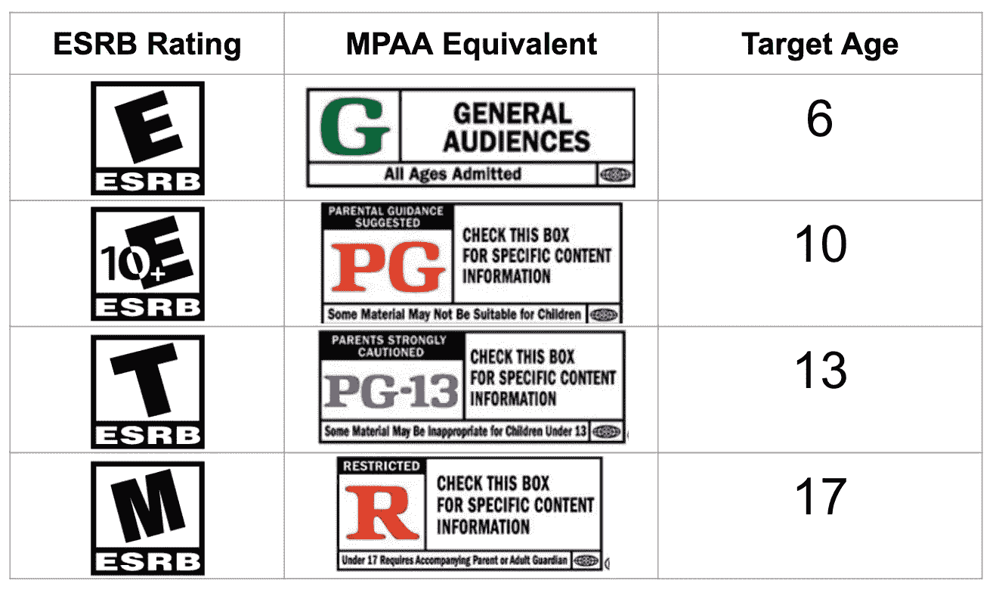
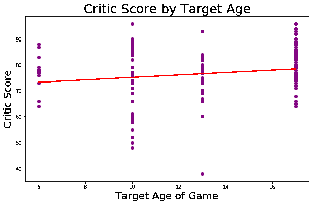

# 刮痧和模型和游戏，天啊！

> 原文：<https://towardsdatascience.com/scraping-and-models-and-games-oh-my-8c6c5d4a7204?source=collection_archive---------15----------------------->

(Beautiful) Soup of the Day

*注意:这不是一个高科技博客。然而，如果你是一个对这种事情感兴趣的男人或女人，这里是我的 GitHub* *上这个项目的代码* [*！*](https://github.com/aflugel/02_WebScrape-LinearRegression)

完全披露:我累坏了。今天早上我在 Metis 展示了我的第一个重要的个人项目。这是一个为期两周的项目，巧合的是，这是我两周内的第一篇博文。我认为这其中可能存在一种有意义的关联——称之为有抱负的数据科学家的直觉吧。

不管怎样，这个项目完成了，我的报告结束了，冷的那份被打开了。因此，我在这里记录下我最后几周的神秘启蒙之旅和技术能力。

Data trumps features trumps algorithms... one of the main morals of this fable

在这个项目中，我们可以自由支配。唯一的方向是:

1.  通过网络搜集搜集某种类型的数据集
2.  使用线性回归预测你搜集的数据中的某种目标变量

我知道“乞讨”有负面含义。那是因为我选择从[MobyGames.com](http://www.mobygames.com)收集数据。对于那些不熟悉的人来说，莫比游戏是“最古老、最大、最准确的视频游戏数据库”… *根据莫比游戏*的说法。我有疑问。

我的**目标**(我试图预测的变量)是**综合评价分数**。**特征**(用于产生预测的变量)是每个游戏的**特征，例如:ESRB 等级、流派、游戏风格、发布日期、控制台等。
*注意:有技术倾向的人可能会注意到这些特征都是绝对的。哦天啊。***

我**喜欢**刮数据。然后我**讨厌**它。然后我又喜欢上了它。这样的循环重复了几次，我却降落在了爱的一边(awww)。使用 BeautifulSoup，我写了几个刮刀。一个抓取了一个主游戏列表并收集了所有游戏的 URL，另一个实际上从这些页面中抓取了数据。

单个页面刮刀需要多次更换。因此，爱恨循环。尽管莫比游戏公司提出了很高的要求，但这些页面是不一致的，包含不同的字段，并且一般来说不能很好地使用通用的页面抓取器。然而，我克服了这个巨大的困难，写了一个对所有 8000 页都有效的 scraper。

That blank look on the whale’s face should have been a red flag

**所以刮刮太棒了！我手里拿着一个数据框。一个包含所有现代家用游戏机游戏数据的数据框架——至少我是这么认为的。**

不要误会我的意思:我*的确*成功地获取了莫比奥运会的所有数据，但对我来说不幸的是，只有 250 个条目包含了我的目标变量:**综合评论家得分**。

所以我减少到一个 250 行的数据集。虽然没有 8000 英镑好，但至少也算不错了。当然，一旦我开始清理数据，我发现在那些*包含评论家分数的 250 款游戏中，**其中大约有 160 款有一套很好的功能**没有任何 NaNs 不是一个数字’——也就是莫比游戏中另一个缺失的值)。*

*当我进行实际的线性回归时，我正在处理一个非常小的数据集。哦，我所有的特征都是绝对的。我尝试对各种特性的组合进行建模，但是由于要处理的观察数据如此之少，而特性又如此之多(一旦类别被分解到各自的列中)，我只能对噪声进行建模。*

*这个故事的一个重要寓意是:当涉及到一堆分类变量时，线性回归并不好。*

**

*My pesudo-ordinal feature. Along with MPAA equivalents for those supposed ‘real adults’ out there who don’t know the ESRB scale.*

*这是我开始有创造力的时候。我没有数字特征作为输入，*但这并不意味着我不能强制使用一个*。如果你真的斜视，ESRB 评级可以被视为序数值。从适合孩子的到更成熟的，ESRB 组织对每个等级都设定了最低年龄。因此，我的“目标年龄”功能诞生了。*

*我的“万福玛利亚”特征工程起作用了…技术上。它*确实*给了我一个有一点点预测能力的模型。该模型采用游戏的目标年龄并预测评论家得分。*

**

*Can you even fathom the analytical beauty you see before you? The purple points are the actual data, the red line is the predicted scores from my model.*

*我的模型*比 100 分制的随机猜测要好*，所以为我欢呼吧！(我在等谷歌招聘人员的电话)。平均而言，两个方向都只相差大约 9.7 点。印象深刻，对吧？*

*嗯……没有。*

*我还建立了一个“虚拟模型”,不管游戏特征如何，它都能简单地猜出 77.5 分(平均值)。平均而言，该模型在任一方向上都偏离了 9.9 个百分点。不需要一个数据科学家就能看出 9.7 并不是一个巨大的进步，但它确实是一个进步。*

*由于数据如此不完整且充满了分类变量，要挤出任何预测值，需要极其不确定的特征工程辅助。我在数据收集和建模方面投入了大量的时间和精力，但最终，一切都回到了这篇博客条目顶部的白板寓意:*

> *数据胜过特征胜过算法。*

*我可能没有造出世界上最好的模型，但我学到了从石头中吸取血液的重要一课。另外，构建过多无用的模型也无妨。它不仅给了我一些关于模型构建的很好的实践，而且给了我*甚至更好的*经验来评估糟糕的模型并确定它们实际上是糟糕的。*

*我们已经被介绍了项目 3，所以是时候开始了。我不是 100%确定我接下来会处理什么，但我知道一件事:*

***我将彻底检查我的下一个数据来源。***