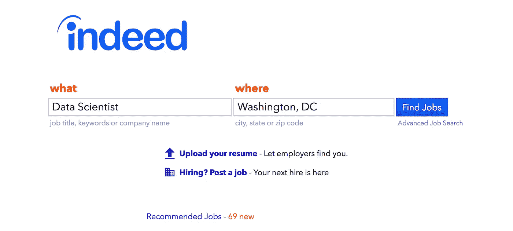

# 刮实际和预测工资

> 原文：<https://towardsdatascience.com/scraping-indeed-for-job-salaries-e7ede688f169?source=collection_archive---------4----------------------->



我最近参与的一个最有趣的项目涉及收集数据科学工作的工资信息，以便根据位置、职位和工作摘要来预测某些工作的工资。该项目是对一些新获得的数据科学技能的真正测试，如网络搜集、自然语言处理和建立分类预测模型。回归可以用于这样的任务，但由于工作工资存在相当大的差异，我将这视为一个分类问题，目标是预测工作工资是高于还是低于数据科学家的工资中位数。

这个问题的第一部分包括从 Indeed.com 上列出的招聘信息中收集数据，包括职位名称、公司、工作摘要、地点和薪水。这一部分是通过抓取大量不同的搜索页面来完成的。正如我在我的其他帖子中多次提到的，抓取是我最喜欢的，也可能是我最好的数据科学技能之一，所以在这一部分我有一点乐趣。首先，我创建了一个全国 30 个主要城市的列表，希望从中收集工作数据。然后，为了能够从一个网页上获得尽可能多的职位发布，我使用了 indeed 上的高级搜索功能来显示 50 个结果，但后来意识到我可以调整 url 来显示 100 个结果。

```
https://www.indeed.com/jobs?q=data+scientist&**l=Washington+DC**&**limit=50**&radius=25&**start=0**&pp=ADIAAAFbp-95iAAAAAEMMobjAQEBD3MzvjaRN_DEggu9hUHO3jOZTkJ2Z7SvcZJ1pEgnRjAhqUC21q96H2LZRAEACYLb_gg9TZj-Uiq9LmLnHRNRQqKGAQPQktPTwy4n4Swd39sFFyyDrS9wQYcfRpSo64YDtw
```

正如你在上面的 url 链接中看到的，为了让页面显示 100 个搜索结果，我只需将`limit=50`改为`limit=100`。然后，为了过滤搜索结果页面，我可以将`start=0`改为`start=100`、`start=200`，一直到`start=900`，以获得相应城市的 1000 个结果。然后，我可以通过简单地将 url 中的`l=Washington+DC`更改为另一个城市名，比如`l=Pittsburgh`，为列表中的所有 30 个城市做这件事。

为了做到这一点，我创建了一个 for 循环，它将遍历我的 30 个城市，然后遍历每个搜索页面，为每个城市收集多达 1000 个职位发布。数据收集过程中出现的第一个问题是，并不是所有的招聘信息都列出了薪水。为了解决这个问题，我创建了一个简单的 try/except 语句，如果没有列出薪水，就返回`'NA'`。一旦我有了一个可用的 web 刮刀，我就在两三天的时间里运行刮刀几次，以便收集尽可能多的结果。然后我把我的结果放入熊猫的数据框架中，以便进行我的分析。因为我试图预测工资，所以我必须过滤我的结果，只包括列出工资的招聘信息，我决定只包括年薪。下一步是计算我的结果的中位数工资，结果是 110，000 美元，然后我为每份工作创建了一个二元变量——如果工资高于中位数，则为 1，如果工资低于中位数，则为 0。

继续建模！现在我有了一个清晰完整的数据框架——大约有 500 条记录，我可以用它来建立许多具有不同特征的分类模型，然后检查是什么因素导致一份工作成为“高薪”或“低薪”工作。我决定对模型使用随机森林分类，因为这是最准确的学习算法之一，而且它还会返回对分类中重要变量的估计，这对我们的分析尤其有价值。我特别感兴趣的特性是位置、职位和工作摘要。我分别为每个特征建立了分类模型。例如，我建立了一个模型，仅仅根据位置来预测一份工作是高薪还是低薪。对于职称和工作总结模型，我使用自然语言处理来根据出现的各种单词预测工资类别。

总的来说，我对结果相当满意。位置模型产生了大约 66%的准确性分数，这是三个模型中最不准确的。随机森林模型的要素重要性属性将为每个要素返回一个值，在本例中为每个城市，该值描述了该要素在模型预测过程中的重要性。我使用这个函数来查找最具预测能力的城市，并且我还将每个城市的工资中位数与我用于分析的总体工资中位数进行了比较。结果并不令人惊讶。我的模型显示，大市场和更昂贵的城市通常意味着更高的工资。这些城市包括纽约、圣何塞、旧金山、波士顿和费城。较小和较便宜的城市通常意味着较低的工资，如圣路易斯、密苏里州、佛罗里达州的珊瑚墙、宾夕法尼亚州的匹兹堡、德克萨斯州的休斯顿和德克萨斯州的奥斯汀。

职称和工作总结模型产生了更好的结果。为了稍微扩展一下模型构建过程，我首先使用了一个计数矢量器函数，该函数计算哪些词出现在了职位名称中，以及这些词出现的次数。这在所有职位上完成，以便为所有职位发布创建一个词频值矩阵。然后，我用这些字数建立了一个模型来预测一份工作是高薪还是低薪，这产生了一个强有力的模型，准确率约为 81%。根据该模型的结果，数据、科学家、工程师、学习、高级和机器等关键词通常与高薪工作相关，而研究和分析师等词通常与低薪工作相关。

使用相同的自然语言处理技术来构建工作总结模型。根据工作总结中出现的单词，最终的模型能够在大约 83%的情况下正确地确定一份工作是高薪还是低薪。机器、学习、数据、分析、工程和 python 等词通常与高薪工作相关，而健康、研究和大学等词通常与低薪工作相关。

为了构建一个更加复杂的模型，我将所有三个特性聚合到一个模型中。从本质上讲，这个模型会根据某个职位发布的位置、职位名称和职位摘要进行预测。虽然这并没有产生一个更准确的模型(大约 79%的准确率)，但它确实表明，与工作地点相比，职称和工作总结更能预测一份工作的薪酬是高还是低。

那么这些信息为什么有用呢？作为雇主，我们的调查结果可以告诉我们，根据求职者被聘用的职位以及该职位所需的技能，他们可能值多少钱。例如，精通 python 技能的数据科学家可能比数据分析师的报酬更高。此外，如果一家公司希望扩大他们的数据科学团队，他们可能会考虑在数据科学家工资不高的地方进行，如密苏里州圣路易斯或德克萨斯州休斯顿。

在进行这样的分析时，肯定会有一个很大的假设。此问题假设 Indeed.com 上发布的数据科学家工资代表所有数据科学家的工资。这是一个不太安全的假设，因为大多数公司都不会在招聘信息中包含薪资信息。虽然这种假设可能会给我们一个数据科学家的工资中位数的不准确估计，但我们对某个工作是高薪还是低薪的预测仍然是有效的预测，这是可信的。

和往常一样，这里有一个我的 [jupyter 笔记本](https://github.com/tkh5044/portfolio/blob/master/webscraping-indeed-project/code/webscraping-indeed.ipynb)的链接，以便更仔细地查看我的分析！