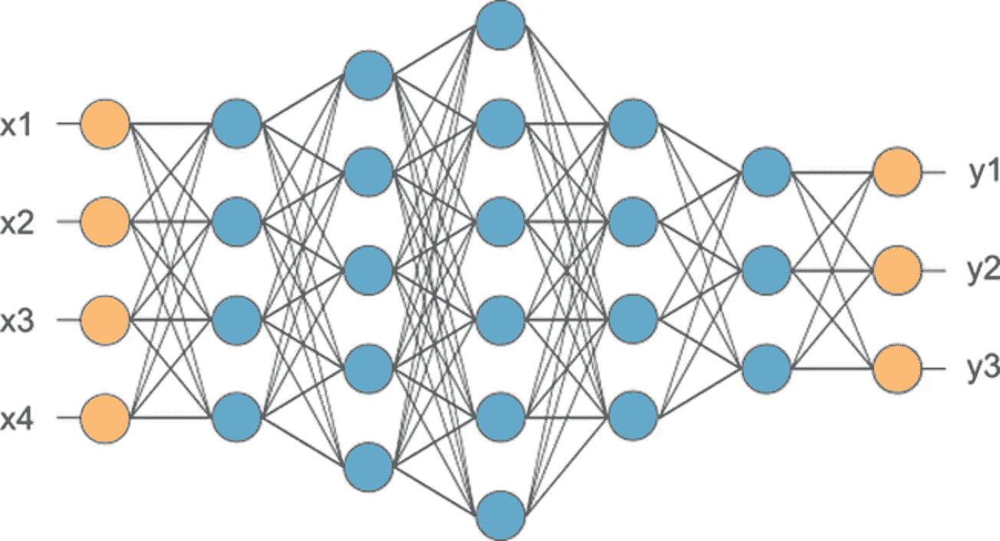
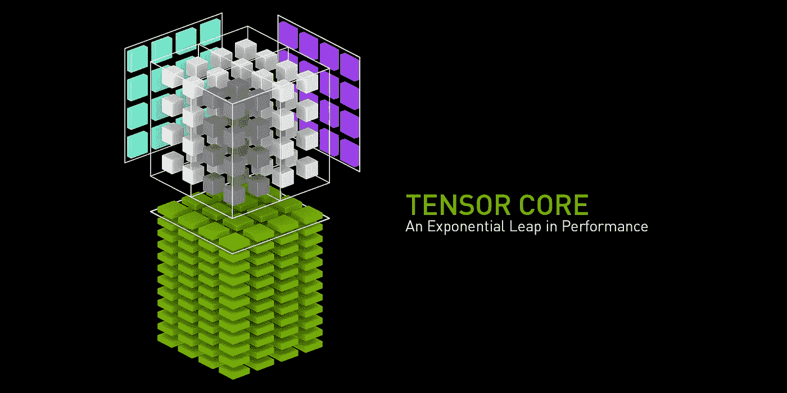
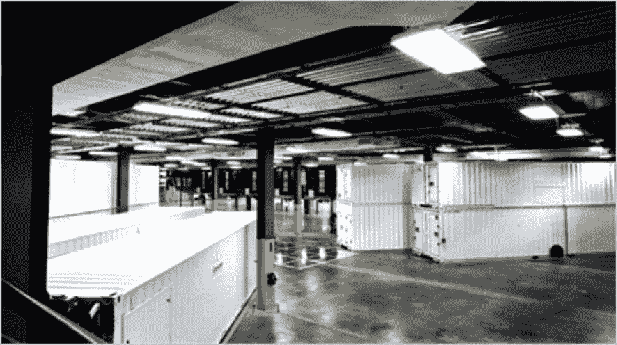
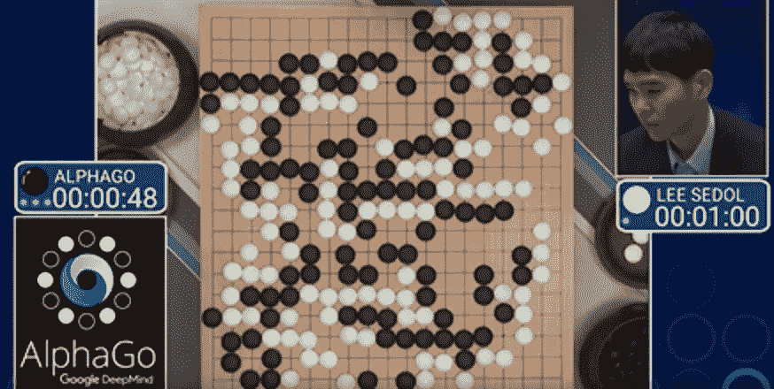
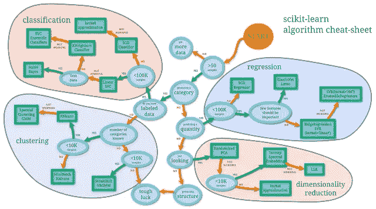

# 人工智能和机器学习中的安全和隐私考虑—第 2 部分:新资产

> 原文：<https://towardsdatascience.com/security-and-privacy-considerations-in-artificial-intelligence-machine-learning-part-2-the-new-39748342a5a?source=collection_archive---------7----------------------->

Where are the assets that need to be protected?

*注:这是“人工智能中的安全和隐私&机器学习”系列文章的第二部分。以下是所有文章的链接(到目前为止):*

*   [*Part-1*](/security-and-privacy-in-artificial-intelligence-and-machine-learning-part-1-c6f607feb94b)
*   *第二部分(本文)*

在[上一篇文章](/security-and-privacy-in-artificial-intelligence-and-machine-learning-part-1-c6f607feb94b)中，我们从“传统”网络安全的角度(没有深入到 AI & ML 工作流的具体细节)看了从端到端考虑 AI & ML 生态系统和工作流时出现的关键挑战。在这一部分中，我们将开始放大 AI & ML 组件——从探索 AI & ML 带来的有趣的新资产开始。这一练习将帮助我们认识这些资产，使我们在执行威胁建模和为端到端系统选择安全技术时，能够将它们与其他关键信息资产一起对待。识别资产后，将更容易考虑攻击者破坏这些资产的机密性、完整性或可用性(CIA)的可能方式，每种类型的破坏可能对业务产生的影响，并系统地确保我们设计和实施针对这些攻击的适当保护。

在上一篇文章中，我们已经讨论了如何在端到端人工智能工作流的各个点上涉及*大量的*敏感业务数据，以及由于(a)新工具和框架的大量涌现，(b)系统/子系统的新类型和组合，以及(c)涉及的新利益相关方，我们已经看到了一些安全和隐私挑战。我们将从那里向前迈进，并通过其他层来识别与用于“学习”的业务数据量相关的“下游”有趣资产。

# AI & ML 引入的有趣“新资产”

在一个非常简单的层面上，许多 ML 算法(尤其是那些与预测或分类有关的算法)本质上试图解决一个看起来像这样的数值问题:

**y**=**w . x**+**b**

这里' **x** '表示输入(或特征)，'**y【T21]'表示过去数据中观察到的相应输出或结果。**

因此，在房屋销售预测环境中， **x** 可能是影响其价格的房屋属性(如建筑面积、庭院大小、位置、条件等)。)和“ **y** ”可能是过去几个月房屋销售的价格。该算法的任务是发现最佳的' **w** 和' **b** '，它们可以解释过去的数据，并且可以用于做出良好的未来预测' ***y*** '，给定先前未看到的输入' ***x*** *'。*计算出“ **w** ”和“ **b** ”(以下统称为“权重”或“ **w** ”)的过程称为“训练”或“学习”。

一旦算法“学习”了权重“T24”w“T25”，我们就可以用它们来预测新投放市场的房屋可能的售价。(在大多数现实世界的问题中，对' **w** '的求值涉及到对非常大的矩阵的计算密集型和昂贵的操作。)

在这个非常简短的概述的背景下，让我们看看从 AI & ML 中出现的有趣的新资产:

## **1。特点**

在许多 ML 问题中，数据科学家与领域专家密切合作，为机器学习算法设计数据的最佳“表示”。这被称为“特征工程”,需要大量的努力和洞察力。领域专业知识有助于直觉判断什么可能是(或不是)值得考虑的有趣特征，数据科学家或统计学家有助于找出最合适的方法来考虑这些特征。因此，即使您从相同的训练数据开始，良好的特征选择和组合也可以产生更好的结果，并且从数据保护的角度来看，这使得“特征工程”的工件成为重要的资产。

(如今，模型自己“学习”这些特性变得越来越普遍，尤其是在较大的系统中。这项技术被称为“特征学习”或“表征学习”，其基本原理是输入所有可用的输入，并让算法(在内部)找出哪些特征重要，哪些不重要。当这种情况发生时,“特征”仍然保留在模型内部。也就是说，没有显式的称为“特性”的工件需要担心保护。然而，如果特性*是手工设计的*，它们就代表了一个有价值的工件，需要像对待任何其他信息资产一样对待。)

A typical ‘deep’ neural network

## **2。模型超参数**

大多数机器学习算法都有几个“设置”，可以调整这些设置来修改算法的行为。这些设置可以被认为是定义底层机器学习模型的物理特征和行为的“设计选择”。例如，在线性回归的情况下，“学习率”是影响模型在搜索最佳权重时收敛(或不收敛)速度的因素。在深度神经网络的情况下(见上面的图片)，有许多其他选择，如层数(网络的深度)、每层中神经元的数量(层的高度)、训练期间使用的批量大小、通过的次数、使用的优化方法等。等。

这些设置被称为“**超参数**，因为它们的选择会影响模型从训练数据中学习到的最终“参数”(即系数或权重)。在更大的问题中，可能会涉及到几十个这样的选择，需要做大量的工作来发现和确定能够提供期望结果的正确组合。在数据本身不是唯一的问题环境中(例如，在各方都可以获得数百万张图像的情况下的图像识别)，这些超参数代表了一种竞争优势。换句话说，一旦您投入了大量辛勤工作来创建一个已经开始产生巨大成果的模型，相应的超参数对于您的组织来说与任何其他“高价值资产”(HVA)没有什么不同，无论它们位于何处，考虑保护它们都变得非常重要。

## **3。权重或系数**

与超参数类似，模型学习到的权重/系数(上面的“**y**=**w . x**+**b**”中的“ **w** 和“ **b** ”)代表了模型在训练阶段从数百万条数据记录中收集到的所有宝贵“见解”。模型中的未来预测是使用这些权重对新数据点进行简单(通常也是快速)的数学运算。

就像“超参数”一样，这些砝码是“可重复使用的”。此外，与超参数相比，它们更易于重用。使用一种称为“迁移学习”的技术，其他数据科学家可以从您的模型导出的权重开始，进一步改进给定的解决方案，或者尝试解决原始问题的变体。事实上，这是数据科学家常用的协作技术。

然而，根据业务环境的不同，共享这些权重可能并不总是明智的(有意或无意)。例如，如果你是一家股票交易公司，你的团队制定了一个创新的基于 ML 的交易方案，你希望从中获得大量利润，你真的不希望另一个竞争对手利用这些权重进行“迁移学习”。(因为在类似的市场条件下，他们可能会开始做类似或比你更好的交易。)

The weights/coefficients of a model. (Source: Andrej Karpathy on Medium)

## **4。专业硬件上的计算投资**

大多数大规模/现实世界的问题需要大量的计算时间来学习正确的系数。由于涉及大量基于矩阵的计算，大多数解决方案需要专门的硬件——现场可编程门阵列(FPGAs)或图形处理单元(GPU)——来以省时的方式计算权重。使用这些硬件技术是因为它们能够以高度并行的方式执行计算(高维矩阵计算就是这种情况)。

Specialized hardware is often needed to make ML time-efficient (Source: NVidia)

此外，由于拥有这些设备可能非常昂贵，而且技术一直在快速发展，大多数情况下都采用云托管服务来访问这些硬件，因此可以使用“按需付费”的模式。

A cloud datacenter (Source: Microsoft)

大多数人听到后会说“哇！”关于谷歌 DeepMind 团队创造的 AlphaGo 系统如何击败围棋世界冠军(一种靠蛮力计算和搜索深度都不够的高度直观的游戏)。然而，人们忽略了一个细节，那就是投入了多少计算工作。

AlphaGo playing Lee Sedol at Go (Source: DeepMind)

DeepMind 关于他们壮举的论文提到了**42 天的训练时间**和各种硬件进步，有些涉及 48 个张量处理单元(TPU)，有些涉及 168 个 TPU——所有这些都托管在云中。

在许多现实世界的问题环境中，对计算的投资和由此产生的费用可能会类似地急剧增加。因此，在“ **w** ”矩阵中所有那些“权重”代表了大量的$$。此外，还必须小心对计算的访问，因为您不希望攻击者使用或重新利用它来满足自己的计算需求(例如试图从被盗的数据库中破解密码或增强其僵尸网络的计算能力)。

## **5。自定义算法**

人工智能和人工智能领域正在迅速发展，因为有很多机会以创造性的方式和在新的问题领域应用这些技术。有趣的是，来自一个问题领域的算法和模型的现有“最佳实践”在应用于一个完全不同的领域时并不一定“延续”。也就是说，在一个问题领域产生优秀结果的东西在另一个领域可能不那么有效或有洞察力。因此，从一个在另一个环境中工作的解决方案开始的团队经常发现他们自己在开始得到有趣和令人兴奋的结果之前投入了大量的实验，并进行了重大的修改和改进。因此，如果你正在研究一个新奇的问题，当你有效地解决了这个问题之后，如果你看到一个专有的算法，你不应该感到惊讶。当这种情况发生时，恭喜您，您手头又多了一份需要保护的无价资产！

ML algorithms (Source: SciKit-Learn docs)

# 保护新资产

我们已经看到了 ML & AI 解决方案带来的有趣的新型信息资产——如工程特征、模型超参数、权重/系数、高度昂贵的计算以及定制或专有的 ML 算法。

这些新资产遭受的攻击可以分为两类。可以被视为“传统”数据篡改/数据窃取攻击的攻击，我们可能会在其他数据保护环境中看到这些攻击。(例如，从数据科学家的笔记本电脑或邮箱中窃取模型参数，或者从不受保护的文件共享中窃取权重。)保护这些资产免受这种“传统”攻击的技术和方法已经在上一篇文章中介绍过了。只要这些新类型的资产也包括在威胁目标中，并且在工作流的不同阶段(相应的资产出现的地方)建立了足够的保护，我们就可以认为这类攻击已被涵盖。

第二类也是更有趣的一类代表了源于人工智能& ML 算法内部工作方式的攻击。我们将在下一部分继续我们的旅程，并通过冒险进入 AI & ML 系统的“运行时”来探索这些。

People at work!

[在‘资产’的话题上，我还想提一下，在当前人工智能和人工智能人才相对于需求如此稀缺的时代，优秀的数据科学家和机器学习/数据工程师也是任何企业的宝贵资产。所有良好的人力资源实践，通过恰当的认可和奖励，让你最优秀的员工保持快乐、有挑战性和兴奋、有动力，等等。，应该对那些有所帮助！]