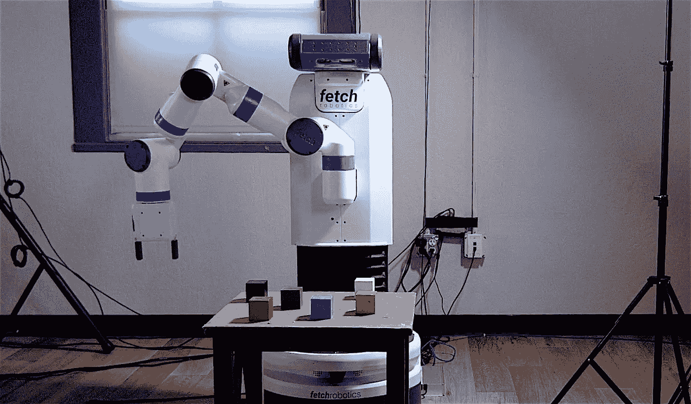
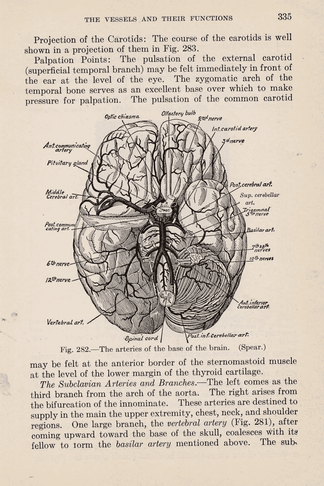
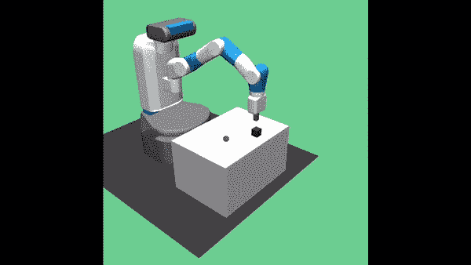

# 参见机器人游戏:探索人类和机器的好奇心。

> 原文：<https://towardsdatascience.com/see-robot-play-an-exploration-of-curiosity-in-humans-and-machines-b384b61b0f7b?source=collection_archive---------22----------------------->

## 好奇心在人类和人工智能代理中的作用。

你可以在文章末尾找到一个 GitHub 存储库，里面有重现实验的代码。

F 从生存的角度来看，驱动动物和人类的主要生物需求并没有特别的不同。人类和动物需要吃和喝才能生存，需要庇护，他们有一种繁殖的冲动，以保持物种的生存。但是，很明显，人类和动物的行为完全不同。这是为什么呢？

人类大脑的进化创造了动物不存在或特别发达的区域，如**前额皮质**，这是一个通常负责推理、规划和逻辑思维的区域。大脑的这种发展导致了完全不同的冲动和驱动力的产生。其中之一在很大程度上驱动了人类的行为。这是电影和图书产业存在的原因，举几个例子，这是几个世纪前探险家航行数月的原因，也是你阅读这篇文章的原因:**好奇心**。

好奇心是寻找意想不到的东西的冲动，是探索、发现和揭开面纱的需要。它经常被描述为智慧物种的一个特征:探索和扩展知识的需要甚至在伟大的希腊神话中就被认为是定义智慧和美德的女人和男人。

因此，在人类的好奇心和人工智能之间建立联系是很直观的:研究人员认为，在人工大脑中模仿这些现象将是创造真正的机器智能的基础。在这篇文章中，我们将探索如何在智能体的电子大脑中创造好奇心，以及它对其行为有什么影响，发现它将如何导致在某种意义上非常人性化的行为。

我们在这篇文章开始时谈到了需求和冲动。我们如何在机器中模拟那些生物信号？一个非常流行的框架是*强化学习* (RL)。在 RL 中，智能体(如机器人)可以观察环境和自身的状态，如其在空间中的位置，并采取相应的行动。代理人的主要目标是获得高额报酬。奖励是我们定义的信号，它应该告诉代理哪些行为是好的，哪些行为应该避免。从生物学的角度来看，积极的回报可以通过饮食来给予。消极的奖励可能是通过对自身造成伤害来给予的。比如像吃豆人这样的电子游戏，吃水果会有奖励，而被鬼吃了之后会有负奖励，而这就足以教会玩家如何打败游戏了。

近年来，深度强化学习取得了巨大的成就，比如学会了以超人的水平玩雅达利电子游戏，打败了世界上最好的围棋选手，学会了如何控制复杂的模拟机器人。让我们关注最后一个例子:为了教会机器人移动，环境奖励代理向前移动而不是摔倒，因此 RL 算法通过*试错*来学习导致向前移动的行为，例如步态或行走模式。这些奖励被称为**外在**:它们来自环境，它们是任务的一部分，因此代理可以学习如何完成任务。但是还有第二种奖励:**内在奖励**。内在奖励不是环境的一部分，而是由代理本身产生的。代理可以奖励自己**发现新事物**或**达到新的未知状态**，无论最终的环境任务是什么。在这一类别中，我们可以找到好奇心:这的确是对发现新奇事物的一种奖励，就像你发现了一篇新的有趣的文章、一本书或一家餐馆时的奖励一样。那么，好奇心是如何在代理中产生的呢？为了理解这一点，我们必须首先理解什么是**预测正向模型**。

Explorers sailed to discover new lands driven by curiosity.

在计算机科学和控制理论中，我们可以创建*模型，在给定当前状态和动作的情况下预测下一个状态*。这些模型通常是神经网络，根据经验预测行动对未来的直接影响。你知道用一定的力量把球抛向空中会发生什么，因为你以前经历过。因此，神经网络可以通过从以前的观察、行动和新观察的经验中学习，来学习预测下一个机器人手臂将会发生什么。简而言之，这是一个预测性的正向模型。

从某种意义上来说，你的大脑在不断地根据刚刚过去的事情预测不久的将来。正如一些[神经科学研究](https://medium.com/the-spike/generative-predictive-models-f39eb8f10584)所表明的，大脑是一台预测机器。因此，如果事情没有按预期进行，你会感到惊讶。你可能几乎每天都走同一条路线去上班，所有这些记忆都渐渐消失了。但是如果有一天你看到一辆车在路中间着火了呢？几年后你肯定会记得这件事，甚至可能记得确切的日期。同样，这也是为什么你要读一本书、一篇文章、看一部电影、去某个地方旅行:去看看和学习一些你没有预料到或已经知道的东西。既然我们知道什么是正向模型，这种驱动冲动可以在机器中复制:人工智能代理可以通过采取导致其达到令人惊讶的状态的行动来奖励自己。从计算上来说，**惊喜是预期的未来和实际发生的未来之差**，从一个状态，做某个动作。

我们现在可以介绍我们将做实验的环境:一个模拟的**取物机器人**，它可以用手臂推着一个盒子。这是著名的 OpenAI 的健身房图书馆里的 *FetchPush-v1* 环境。代理的目标是将盒子推到它的目标位置，即红色的球。但是我们现在不关心这个任务:正如之前解释的，我们对内在奖励感兴趣，我们想看看通过用好奇心引导代理会发生什么。

我们机器人 Fetch 可以在三维空间内移动它的末端执行器。每走一步，它都能观察到自己在空间中的位置，以及立方体的位置。我们可以在智能体中创建一个内部预测向前模型，通过简单地移动手臂，让它体验它的环境。基于这种经验，代理将很快了解当它给它的手臂一个命令时会发生什么:手臂在指定的方向上移动一点点。因此，前向模型在预测手臂运动方面将很快变得非常好。但是当给手臂一个动作命令时，第二件事可能发生:手臂可以*触摸立方体并移动它*。虽然这对我们来说很直观，但对像婴儿一样第一次探索世界的机器人来说却不是这样。学习预测立方体被触摸时会发生什么是非常困难的，这既是因为接触力的复杂物理学，也是因为在最初的探索中，机器人只会触摸立方体几次，因为整个操作空间相当大，而立方体非常小。所以，机器人将体验到立方体在 99%的情况下不受手臂移动的影响，并且可能认为立方体永远是静止的。因此，预测正向模型将很难预测立方体的移动。这里我们可以看到好奇心对机器人的影响。

Two of the Fetch gym environments. We will focus on FetchPush (left).

既然机器人已经学会了最初的前进模式，我们可以让它在好奇心的驱使下更多地探索环境。然后，机器人将尝试寻找结果令人惊讶的动作。正如预期的那样，移动手臂对机器人来说通常很无聊，因为它很清楚会发生什么。但是，一点一点地，它会知道它发现*在触摸立方体*时会发生什么令人惊讶的事情。立方体以一种不可预测的方式移动，这是它感到惊讶的原因，激起了它的好奇心。因此，就像婴儿一样，机器人将学习玩立方体，因为从某种意义上来说，这很有趣。有趣的是，它发现当它把盒子推出桌子时，最不可预测的事情发生了，盒子掉在了地上。

Fetch learns to play with the cube guided by curiosity.

机器人已经学会在没有任何外部指导或信号的情况下玩立方体**。它不知道任务的目标，它只是试图探索周围的世界，并试图**发现令人惊讶的事情，因为它很好奇**。这种简单的内在动机使它发现了立方体，就像玩具一样是它现在的主要兴趣。正如在[这篇博文](https://blogs.unity3d.com/2018/06/26/solving-sparse-reward-tasks-with-curiosity/)中所描述的，好奇心可以极大地帮助一个特工探索周围环境，发现原本看不见的东西。有了好奇心，智能体可以学习激活环境中的罕见事件，并逐渐了解复杂系统的所有底层机制。**

近年来，人工智能领域的研究人员已经在广泛的环境中研究了好奇心对智能体的影响。最有趣的结果之一来自于将好奇心应用到玩电子游戏的代理人身上。最近的一项研究表明，如果有好奇心的引导，一个代理人可以在没有任何外部奖励的情况下学会玩几个级别的超级马里奥兄弟。它对打破记录没有兴趣，只是对发现接下来会发生什么有着强烈的兴趣，并渴望发现新的和意想不到的东西。在这个游戏中，最好的方法就是在一个关卡中前进并发现下一个区域。为了做到这一点，代理人必须学会如何生存，避免敌人和陷阱，只是为了发现新的东西。

[另一项研究](https://arxiv.org/abs/1808.04355)展示了这种情况在几款雅达利视频游戏中是如何发生的:代理人可以通过遵循这种内在奖励来学习如何玩好一款游戏。但真正有趣的是研究人员在论文中写道的一个结论:这个结果不仅是人工智能的一项成就，也是对人类好奇心影响的一个很好的洞察。我们玩电子游戏是因为它们很有趣，它们是新的刺激、体验和挑战的来源。因此，一个设计良好的视频游戏应该围绕奖励玩家的好奇心来创建，这就是为什么由好奇心驱动的人工智能代理可以学习玩这些游戏。

好奇心是人类智力的重要组成部分。它不仅是人类行为的特征，也是构建进一步智能和知识的重要工具:没有好奇心，我们就无法发现新事物，除非它们撞上我们。这就是为什么，要建造真正智能的机器，就必须对好奇心和其他内在刺激进行描述和建模，这些刺激是由我们的大脑产生的，并推动人类不断进化。

觉得好奇？你可以在[这个 GitHub 库](https://github.com/normandipalo/curiosity-robot)里找到所有的代码。

谢谢你读到这里！你可以在推特(@normandipalo)上[关注我](https://twitter.com/normandipalo)关注我的工作和研究。