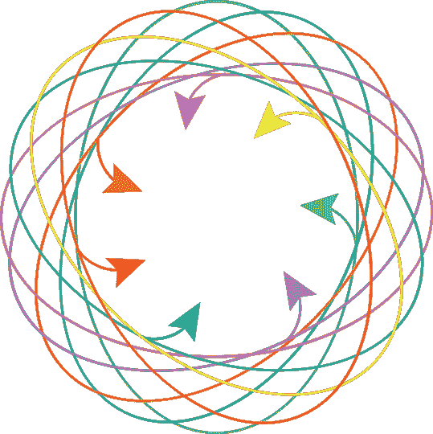
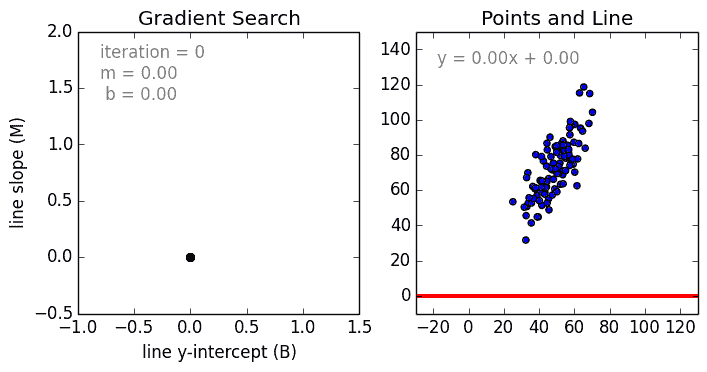

# 为您的回归问题选择最佳的机器学习算法

> 原文：<https://towardsdatascience.com/selecting-the-best-machine-learning-algorithm-for-your-regression-problem-20c330bad4ef?source=collection_archive---------1----------------------->

> 想获得灵感？快来加入我的 [**超级行情快讯**](https://www.superquotes.co/?utm_source=mediumtech&utm_medium=web&utm_campaign=sharing) 。😎

当处理任何类型的机器学习(ML)问题时，有许多不同的算法可供选择。在机器学习中，有一个叫做“没有免费的午餐”的定理，它基本上说明了没有一种最大似然算法对所有问题都是最好的。不同 ML 算法的性能很大程度上取决于数据的大小和结构。因此，除非我们通过简单的试错法直接测试我们的算法，否则算法的正确选择通常是不清楚的。

但是，每个 ML 算法都有一些优点和缺点，我们可以用它们作为指导。虽然一种算法并不总是比另一种算法更好，但是每种算法都有一些特性，我们可以用它们来指导快速选择正确的算法和调整超参数。我们将看看一些用于回归问题的著名的最大似然算法，并根据它们的优缺点设定何时使用它们的准则。这篇文章将有助于为你的回归问题选择最好的 ML 算法！

在我们开始之前，请查看 [***人工智能快讯***](https://aismart.substack.com/subscribe) 以阅读人工智能、机器学习和数据科学方面的最新和最棒的信息！

## 线性和多项式回归

Linear Regression

从简单的例子开始，单变量线性回归是一种使用线性模型(即直线)对单个输入自变量(特征变量)和输出因变量之间的关系进行建模的技术。更一般的情况是多变量线性回归，其中为多个独立输入变量(特征变量)和一个输出因变量之间的关系创建模型。该模型保持线性，因为输出是输入变量的线性组合。

还有第三种最常见的情况，称为多项式回归，其中模型现在变成特征变量的非线性组合，即可能有指数变量、正弦和余弦等。然而，这需要了解数据与输出之间的关系。可以使用随机梯度下降(SGD)来训练回归模型。

**优点:**

*   建模速度快，并且当要建模的关系不是非常复杂并且您没有大量数据时特别有用。
*   线性回归很容易理解，对商业决策非常有价值。

**缺点:**

*   对于非线性数据，多项式回归的设计可能相当具有挑战性，因为必须有一些关于数据结构和特征变量之间关系的信息。
*   由于上述原因，当涉及到高度复杂的数据时，这些模型不如其他模型好。

## 神经网络

Neural Network

神经网络由称为神经元的一组相互连接的节点组成。来自数据的输入特征变量作为多变量线性组合传递给这些神经元，其中乘以每个特征变量的值称为权重。然后将非线性应用于该线性组合，这赋予神经网络模拟复杂非线性关系的能力。神经网络可以有多层，其中一层的输出以相同的方式传递到下一层。在输出端，通常没有应用非线性。使用随机梯度下降(SGD)和反向传播算法(都显示在上面的 GIF 中)来训练神经网络。

**优点:**

*   由于神经网络可以有许多非线性层(和参数),它们在模拟高度复杂的非线性关系时非常有效。
*   我们一般不用担心数据的结构，神经网络在学习几乎任何一种特征变量关系时都非常灵活。
*   研究一直表明，简单地给网络提供更多的训练数据，无论是全新的还是增加原始数据集，都有利于网络性能。

**缺点:**

*   由于这些模型的复杂性，它们不容易解释和理解。
*   它们的训练可能非常具有挑战性和计算强度，需要仔细的超参数调整和学习率时间表的设置。
*   它们需要大量数据来实现高性能，并且在“小数据”情况下通常优于其他 ML 算法。

## **回归树和随机森林**

Random Forest

从基本情况开始，决策树是一种直观的模型，通过它可以遍历树的分支，并根据节点上的决策选择下一个分支。树归纳的任务是将一组训练实例作为输入，决定哪些属性最适合拆分，拆分数据集，并在生成的拆分数据集上重复，直到所有训练实例都被分类。在构建树时，目标是在属性上进行分割，以创建尽可能最纯粹的子节点，这将使分类数据集中的所有实例所需的分割数量保持最小。纯度是通过信息增益的概念来衡量的，信息增益与需要知道多少关于一个以前未见过的实例的信息以便对其进行正确分类有关。实际上，这是通过将熵(或对当前数据集分区的单个实例进行分类所需的信息量)与对单个实例进行分类所需的信息量(如果当前数据集分区将在给定属性上进一步分区)进行比较来测量的。

随机森林只是决策树的集合。输入向量在多个决策树中运行。对于回归，所有树的输出值被平均；对于分类，使用投票方案来确定最终类别。

**优点:**

*   擅长学习复杂、高度非线性的关系。它们通常可以实现相当高的性能，比多项式回归更好，通常与神经网络不相上下。
*   非常容易解释和理解。虽然最终训练的模型可以学习复杂的关系，但在训练期间建立的决策界限易于理解且实用。

**缺点:**

*   由于训练决策树的性质，它们很容易过度拟合。完整的决策树模型可能过于复杂，并且包含不必要的结构。虽然这有时可以通过适当的树木修剪和更大的随机森林集合来缓解。
*   使用更大的随机森林集合来实现更高的性能会带来速度更慢和需要更多内存的缺点。

## 结论

嘣！有你的利弊！在下一篇文章中，我们将看看不同分类模型的优缺点。我希望你喜欢这篇文章，并学到一些新的有用的东西。如果你看到了，请随意鼓掌。