# 自助本地新闻

> 原文：<https://towardsdatascience.com/self-serve-local-news-eaad4347b61f?source=collection_archive---------9----------------------->

## **在不稳定的媒体景观中提升同理心**

## 眼前的危机

在互联网和唐纳德·特朗普(Donald Trump)总统任期的双重拐点上，美国新闻业陷入了危机。社交媒体和在线注意力经济扰乱了曾经支撑良好报道的经济模式和读者模式，导致印刷媒体大量解雇有才华的记者，并在数字媒体中转向愤怒、点击诱饵和企业赞助。与此同时——也许是同样的潜在技术文化转变的结果——至少自理查德·尼克松(如果不是更早的话)以来最公开反对新闻的总统的当选重新点燃了对媒体机构的普遍怀疑，并打破了对自由、独立新闻业的共识支持的假设。

但是，尽管在这个动荡的时代，全国的*时报*和*邮报*吸引了人们的注意力，但首当其冲的冲击还是来自地方层面。皮尤研究中心[最近的一项研究发现](http://www.pewresearch.org/fact-tank/2018/07/30/newsroom-employment-dropped-nearly-a-quarter-in-less-than-10-years-with-greatest-decline-at-newspapers/)美国新闻编辑室的就业人数在 2008 年至 2017 年间下降了近四分之一，下降了 45 %,这对报纸来说损失更大。但中型报纸似乎失血最多；虽然自 2016 年以来，全国范围内的报道(具有讽刺意味的是)重新焕发了活力，超级地方报纸得到了其紧密联系的社区的支持，但许多[城市](https://newrepublic.com/article/147735/local-news-crisis-bigger-sinclair)和[地区](https://www.washingtonpost.com/lifestyle/style/the-local-news-crisis-is-destroying-what-a-divided-america-desperately-needs-common-ground/2018/08/03/d654d5a8-9711-11e8-810c-5fa705927d54_story.html?utm_term=.bb6fdafdce96)媒体既缺乏读者支持，也缺乏经济偿付能力，无法跟上互联网出现前的标准。

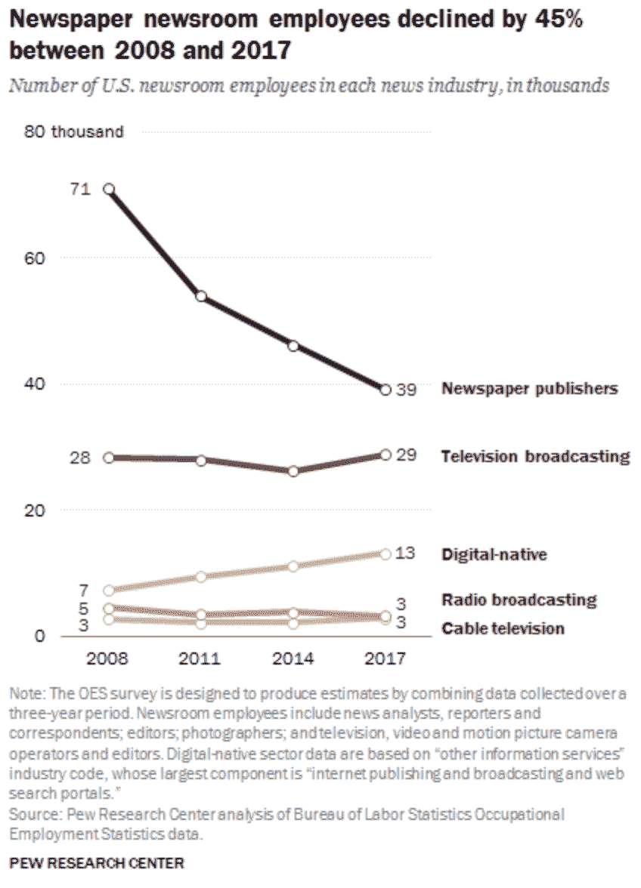

不用说，这是一场民主危机。在第一修正案中，媒体的名字不仅是为了保证记者写作的权利，也是为了保证公民阅读的权利。毕竟，只有在知情的情况下，投票才是真正的民主。

这个问题的答案之一是通过新的经济模式和报道方法来振兴城市和地区报纸。一种可行的方法？通过将文案制作部分外包给外部合作伙伴，新闻编辑室的时间和精力支出可以削减，新闻编辑室之间的冗余(如多家城市报纸委托记者报道同一篇报道时的 T2)可以消除。当然，这已经是某些类型报道的标准，如**联合通讯社**(美联社)、多功能数据工具(ProPublica)或公共文档库(The Intercept)。但是，在创造独特的本地体验时，这些选择会遇到问题。例如，每份刊登路透社关于最新枪支管制措施的报道的城市报纸都会刊登相同的路透社报道，即使国家趋势或细节与那些对特定地方读者更有意义的报道不一致。

考虑一下 2015 年皮尤的一份报告，其中[发现](http://www.pewresearch.org/fact-tank/2015/03/05/5-takeaways-media-ecosystems/)“每个城市大约十分之九的居民说他们至少在一定程度上密切关注当地的新闻，而大约十分之八的人说他们关注附近的新闻。”这些读者显然有兴趣了解这些问题——然而，如果没有经济上可行的渠道来满足他们的需求，这很可能得不到满足。通过重新思考记者如何在地区性和全国性报道之间斡旋，以及他们的雇主如何在两种报道之间分配资源，这一差距可以被填补。

地方报道的问题也是新闻效率的问题。通过将原本是全国性的故事地方化，抽象的问题变成了读者切实关心的问题。《纽约时报》的一篇关于美国毒品战争的文章可能会引起读者的兴趣，比如说，坦帕市的读者，但是对他们来说，改编成包含坦帕市具体细节的同一篇文章更有切身利益。如果新闻在很大程度上是政治教育的工具，而地方政治对读者有最明显的影响(至少在短期内)，那么对于记者来说，在可能的情况下，通过本地化的镜头来探索大局问题是有意义的。

因此，**自助式本地新闻**的主张是:通过创建技术基础设施和报道流程，利用国家规模的资源进行本地规模的报道，有可能同时满足经济现实和现代本地新闻的内容需求。

## 新闻本地化

作为这一理论概念的证明，我们的团队选择了 Maimuna Majumder 年发表的一篇名为“[仇恨犯罪率上升与收入不平等有关](https://fivethirtyeight.com/features/higher-rates-of-hate-crimes-are-tied-to-income-inequality/)”的文章 Majumder 的文章使用数据分析在全国范围内探索了人均仇恨犯罪和经济不平等(以及在较小程度上的教育不平等)之间的联系。

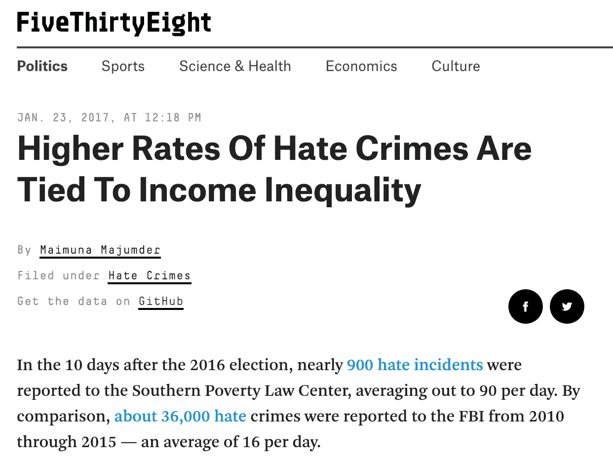

我们选择对本文进行本地化试验有几个原因:

1.  这个想法很有趣；特别是在特朗普意外赢得选举以及随后仇恨犯罪激增的背景下，Majumder 的论文激起了我们的兴趣。
2.  它有明确定义的主张——仇恨犯罪和经济不平等是相关的；仇恨犯罪和教育水平是相关的——这可以用数量来检验。
3.  Majumder 在 GitHub 存储库中提供了她的所有数据，消除了许多来源挑战。
4.  关于仇恨犯罪、经济不平等和教育不平等的数据是固有的**地理**，因此我们本地化文章的中心任务是有意义的。

为了开始开发一个系统来本地化 Majumder 的文章，我们首先创建了一个中性的文章“模板”版本，可以根据它修改版本。这包括从模板中删除任何特定日期的内容(因为这篇文章已经发表一年多了)，并删除大部分解释 Majumder 统计分析方法的内容。这给我们留下了我们称之为**的基础层**。

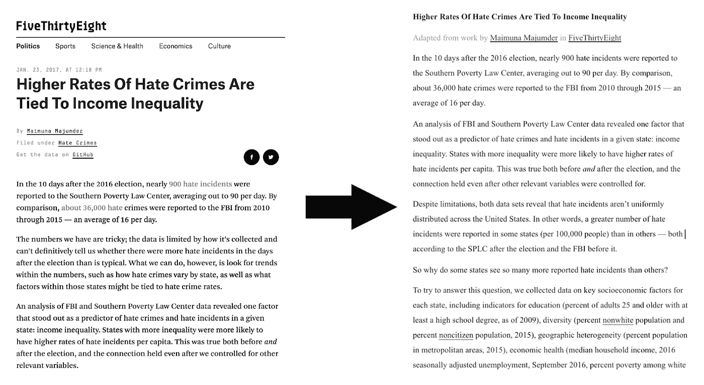

然后，我们必须收集所有必要的数据，以获取 Majumder 的故事，并放大到地方一级。这些本地数据来自各种来源。我们从美国人口普查局的年度美国社区调查中获取给定城市或州的人口统计数据，如经济不平等的基尼指数或高中毕业率。与此同时，仇恨犯罪的数据来自联邦调查局的统一犯罪报告计划，该计划汇编了当地机构的犯罪数据。最后，我们询问了南方贫困法律中心(SPLC ),寻找活跃在各州的仇恨组织。

除了 SPLC 的数据，我们利用了预计算的**汇总统计数据**。例如，对于毕业率，人口普查局已经收集了某个城市每个居民的教育程度的详细资料，并计算了至少获得高中学位的人的百分比。因此，获取数据意味着下载这些预先计算的百分比，而不是下载每个居民的教育记录。

然后，我们用编程语言 R 创建了一个**数据框架**,这将允许我们测试仇恨犯罪与经济不平等和教育率之间的相关性。将来自联邦调查局(仇恨犯罪)、SPLC(仇恨团体)和美国人口普查局(经济不平等和高中毕业率的基尼指数)的数据结合在一起，我们得到了一个强大的数据集，可以探索不同因素之间的关系，例如，在任何给定的城市或州，仇恨犯罪率和经济不平等在几年内的密切相关程度。为了计算相关性，我们只研究了拥有至少六年数据的城市和州。

从地区数据的特殊性转移到记者可能想告诉*的关于地区数据的故事的大概情况，我们决定了可能有必要发表的八种一般类型的文章，这取决于记者为哪个城市或州写文章。这些文章基于三个二元价值观:*

1.  仇恨犯罪和经济不平等之间是否有统计学上的显著关系。
2.  仇恨犯罪和教育水平之间是否有统计学上的显著关系。
3.  给定区域是城市还是州。

因此我们有 2*2*2 个因素在起作用，或者总共八个可能的文章。我们将文章本地化的这一阶段概念化为一个**决策树**，由此利用关于数据的相关细节(在我们的数据集中识别的相关性)和用户输入(文章将被本地化的地理位置)来识别多个预先编写的**文章框架**中的哪个将被加载到系统中。

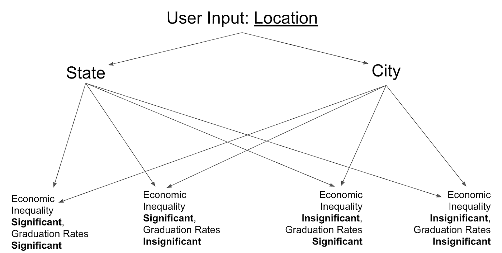

生成的树上的八个“叶子”中的每一个都用这些骨架中的一个来标识，这些骨架是通过修改基础层文章来组装的。我们有两种主要的方法来进行这种修改。

一种类型的修改是通过基于它们在文章中的相对重要性上下移动某些文本块来重新组织文章，基于这些重要性，趋势被识别为与给定位置相关。例如，一篇关于经济不平等和仇恨犯罪之间存在关联的城市的文章可能会强调这种关系，而一篇关于教育水平和仇恨犯罪之间存在关联的州的文章可能会强调这种关系。这植根于倒金字塔的新闻实践，即一篇文章中最重要的信息放在顶部。

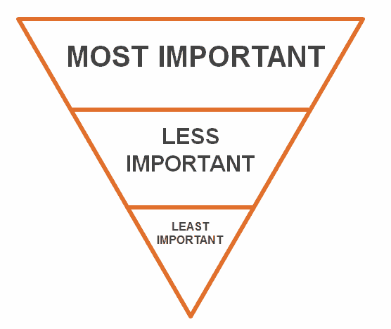

另一种类型的修改是在文章框架中标识出**内容中立的站点**,在这里可以插入额外的特定位置信息。我们将文章本地化的这个阶段概念化为一个**疯狂的 Libs** 游戏。在 Mad Libs 中，提供了一个短篇故事的框架，但是为某些单词留出了空间。然而，为了在文章的上下文中有意义——并且模仿**自然语言**——这些插入的单词必须满足某些参数；最常见的是词类。类似地，我们的文章框架确定了什么类型的数据或其他信息可以自动插入给定框架的特定部分。但是，在一个疯狂的 Libs 游戏可能需要一个动词或名词的地方，文章骨架可能需要 X 国仇恨犯罪的最常见原因或 y 国的基尼指数。

首先，我们确定了近 70 种可以插入文章的数据特征:

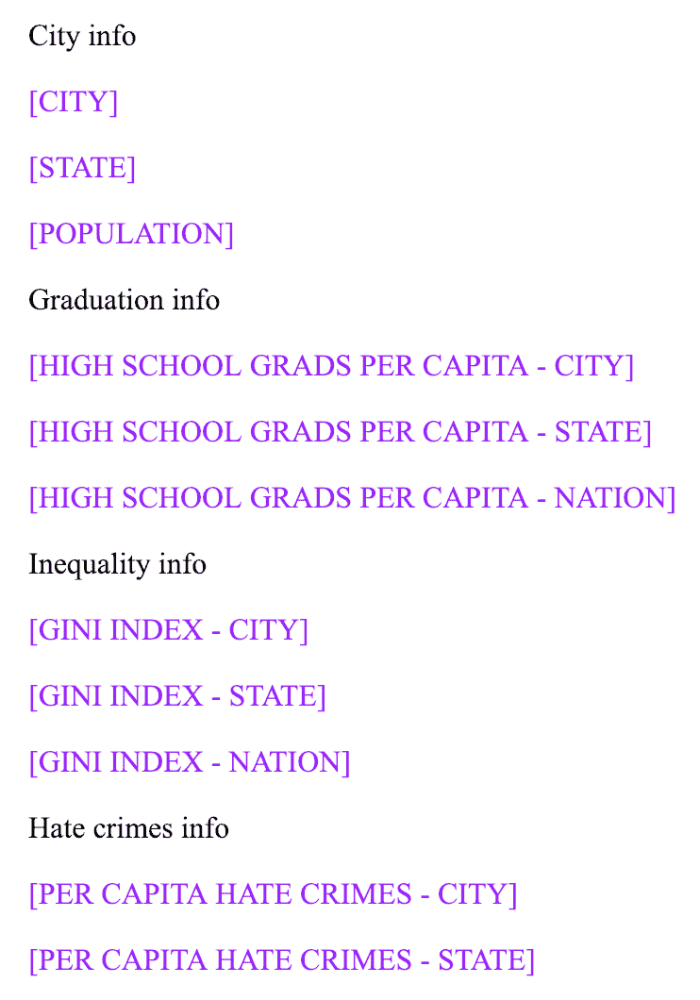

然后，我们将这些数据点合并到我们的骨架中，根据这些数据点，在讲述一个属于决策树上八个分类之一的地方的故事时，哪一个最相关。这产生了八个最终骨骼，其中一个开始于:

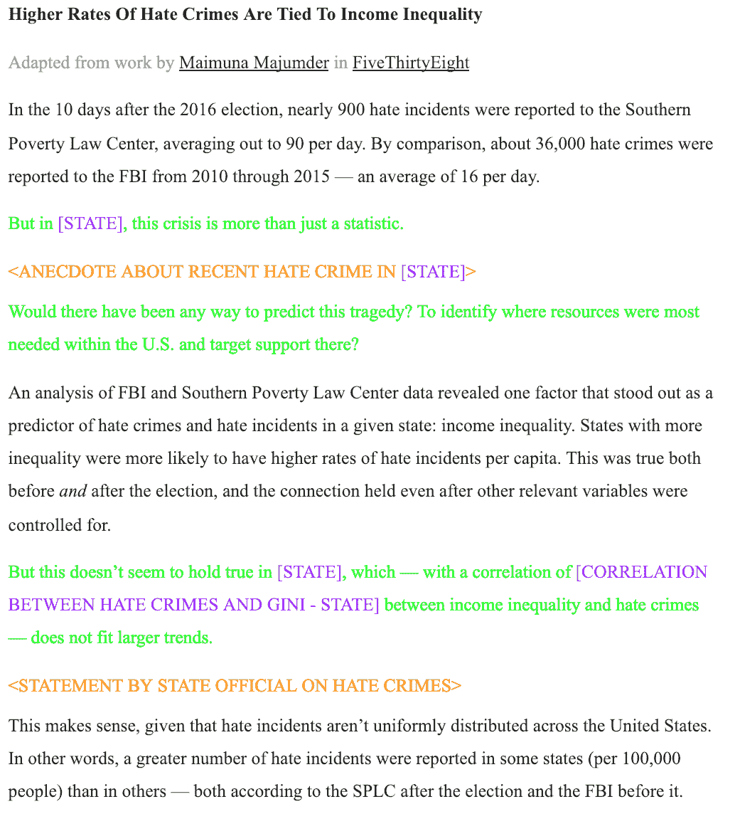

带括号的紫色元素是插入的数据点，而绿色文本标识添加到基础层的任何副本。与此同时，括号中的橙色特性是 Mad Libs 风格插件的第二种类型，它需要更多的叙述性(而不是数字)细节。因为人们可能希望包含在文章中的某些特定于地点的“价值”——如轶事或引语——在有组织的数据库或电子表格中(还)不存在，这些地点向当地记者标识他们仍然需要出去做他们自己的报道的地方。然后，该系统的最终输出将使用相关值填充紫色要素，但不修改橙色要素。

## 本土化实践

如果一名记者正在为洛杉矶的一家报纸写作，这种两部分本地化方法将导致以下决策树…

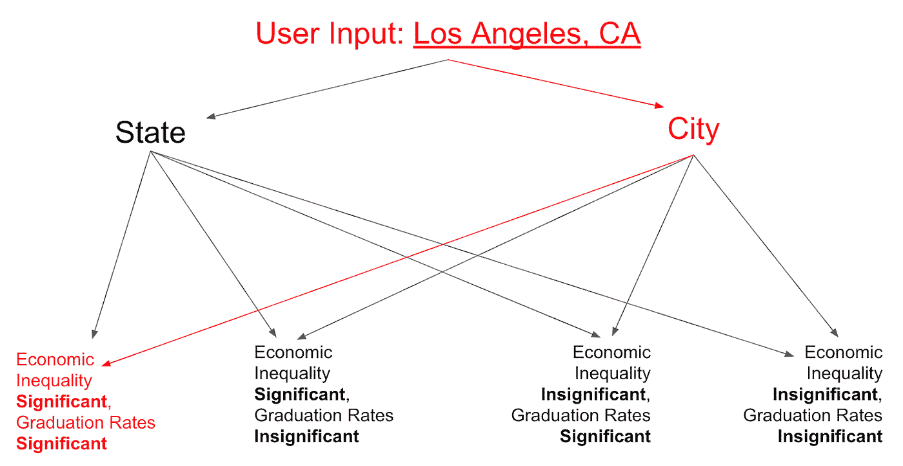

…这将导致下面的文章框架…

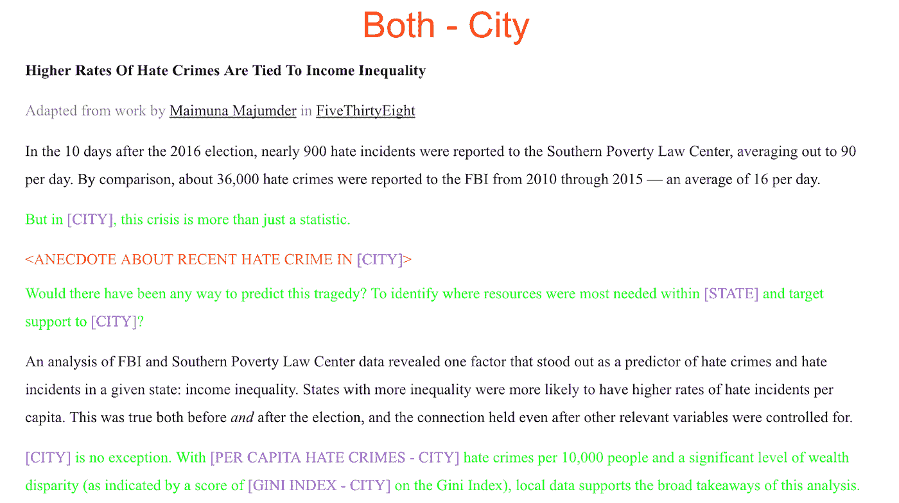

…当系统插入相关数据点时，会输出最终文章…

八个可能的文章框架与 3020 个城市、44 个州和哥伦比亚特区的数据相结合，结果是一个灵活的系统，用于自动生成独特的定制文章，这些文章可以以相对较小的开销整合到全国各地的本地媒体。虽然不是这个过程的每个方面都是自动化的，也就是说，编写文章框架和填充橙色文本特征，但是这个过程确实提出了一种大规模生产本地化文章的可能方法。

使用 JavaScript libraries Mapbox 进行绘图，使用 D3.js 进行数据可视化，我们的团队开发了一个 [web 应用程序](http://web.stanford.edu/~sharon19/HateCrimesIndex.html),使得这个系统易于使用，并且对于没有计算机或数据科学背景的人来说也是可访问的:

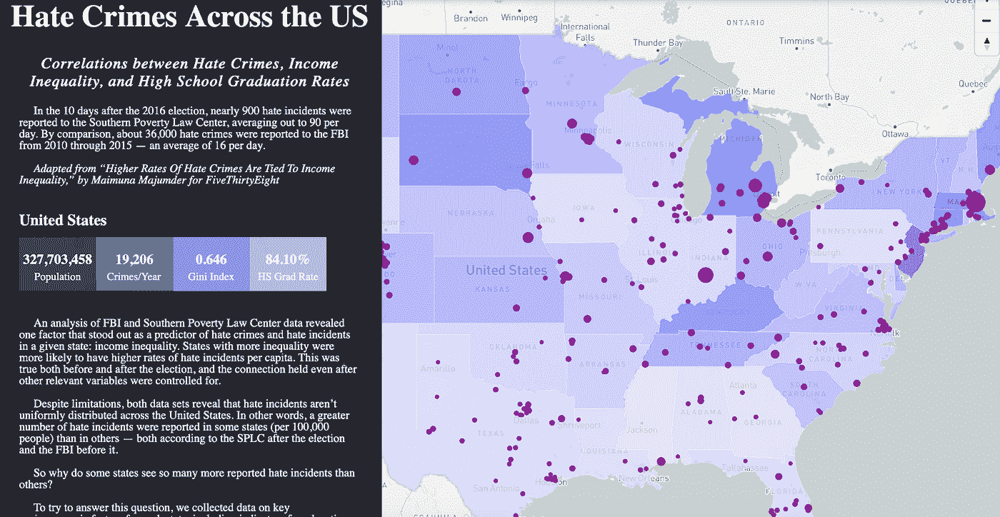

通过点击他们的城市或州，一个资源稀缺的新闻编辑室不仅可以调出一篇充实的文章…

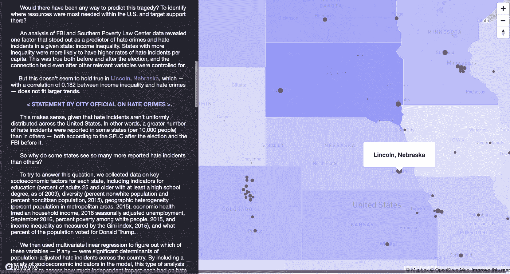

…而且还有有用的汇总统计数据…

…特定于地点的数据可视化…

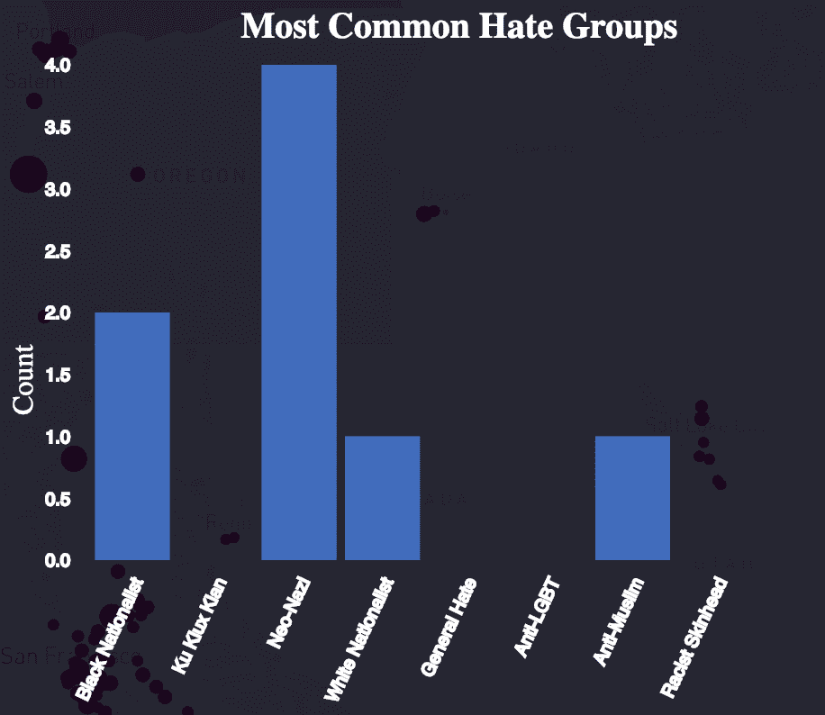

…甚至还有一份简洁的提示表，如果文章内容本身没有必要，它会指出哪些内容仍然值得研究…

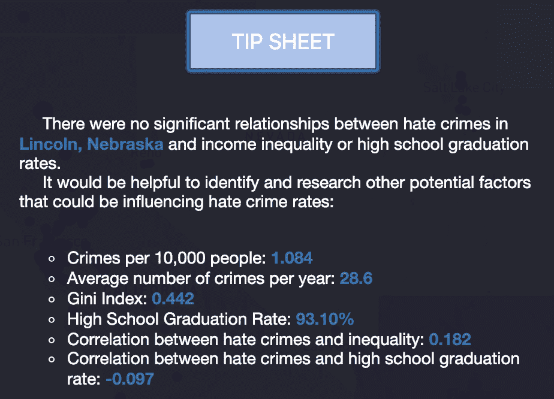

## 扩大范围

为了进一步发展这种概念验证，我们的团队决定将同样的方法应用于另一篇文章:本·卡塞尔曼的[《2015 年警察杀死美国人的地方》，](https://fivethirtyeight.com/features/where-police-have-killed-americans-in-2015/)另一篇 538 文章。Casselman 的文章使用了美国人口普查局的数据和《卫报》关于警察杀人的[数据项目](https://www.theguardian.com/us-news/ng-interactive/2015/jun/01/the-counted-police-killings-us-database)，探讨了贫困、种族和该国警察杀害最多平民的地方之间的关系。

本地化这一叙述基本上遵循与以前相同的过程:

1.  从初始副本创建一个中性的“基础层”。
2.  聚合数据，并在数据框架中将它们连接在一起。
3.  创建一个考虑规模(州或城市)和统计趋势(人均警察杀人事件和平均家庭收入是高于还是低于全国平均水平)的决策树。
4.  识别可以插入的 Mad Libs 风格的特征(定量和定性),可以从数据集插入，也可以由本地记者插入。
5.  修改基础层以考虑决策树结果(又是八种可能性)和 Mad Libs 特征。
6.  将这个过程嵌入到基于地图的 [web 应用](http://web.stanford.edu/~sharon19/PoliceKillingsIndex.html)中。
7.  整合额外的数据可视化、汇总统计、提示表等。如有可能。
8.  让记者了解结果。

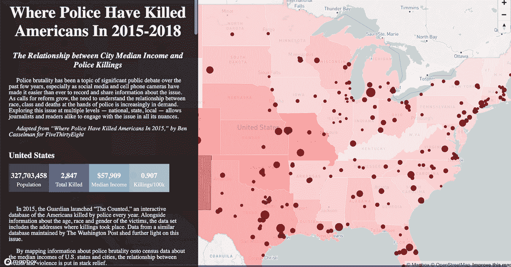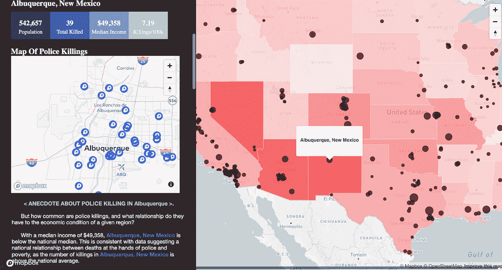

主要依赖汇总统计回避了这种产品是否能扩展到大规模数据集的问题。例如，在处理警察杀人的文章时，我们遇到了一个数据集，它包含了几年来美国每一次警察杀人的记录。当用户点击一个特定的地点来查看自动生成的填充了相关数据的文章时，一种简单的方法是查询发生在特定城市的所有警察杀人事件的数据集，然后计算适当的信息。然而，这种方法在计算上是**昂贵的**和**低效的**，因为相同的查询和计算可能被执行多次。一个更健壮的解决方案将涉及**预计算**每个城市的必要信息，并将这些信息存储在一个数据库中，该数据库将城市映射到它们的特定数据，这样每当用户点击一个特定的城市时，我们的系统将直接返回信息，而无需进行额外的计算。

例如，下图说明了当用户单击德克萨斯州的城市韦科时会发生什么。每一行都包含一个警察杀害受害者的信息。在前面提到的简单解决方案中，程序将搜索整个表，选择城市与 Waco 匹配的每一行。然而，在健壮的解决方案中，程序将搜索 Waco 并返回与之相关的数据块。因此，我们看到我们的程序对于大型数据集在计算上是可伸缩的。

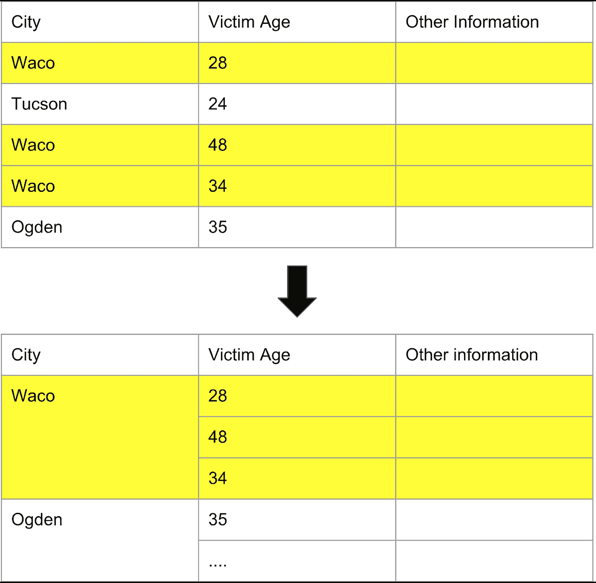

## 大局

对于一个资金紧张、遭受多轮裁员、在一个适得其反的环境中努力维持读者信任的新闻编辑室来说，这种系统可以——在 AP 或 ProPublica 等组织的基础设施和报道支持下——将标准报道流程中涉及的大量体力劳动外包出去。目前，像数据采集、数据清理、统计分析、文章写作、源编辑、文案编辑、图形开发等工作对新闻编辑室来说是一个巨大的压力，并且还可能在报道类似问题的多个新闻编辑室之间造成劳动力冗余。如果这项工作被集中起来，它将为已经承受巨大压力的媒体机构减轻一个重大负担，即利用有限的资源制作大量高质量的内容。

与任何自动化一样，新闻编辑室可能会将此视为裁员的机会。但至少聪明的人会看到它的本来面目:让有才华的记者腾出手来从事更重要的工作的机会，比如激发同情心的人类兴趣报道或让当权者承担责任的深度调查报道。明智而充满激情地去做，最终的结果将是美国自由媒体的各个层面都变得更强大、更聪明、更有效。

## 笔记

这个项目是为斯坦福大学 2018 年秋季的课程“探索计算新闻学”(CS206/COMM281)创建的，与布朗媒体创新研究所合作。

[两个网络应用都可以在这里访问:http://web.stanford.edu/~sharon19/.](http://web.stanford.edu/~sharon19/)

特别感谢:

> 教授们。Krishna Bharat、Maneesh Agrawala 和 R.B. Brenner 在本项目过程中提供了真知灼见、指导和专家建议；
> 
> Maimuna Majumder、Ben Casselman 和 FiveThirtyEight 深刻的报告和可获得的数据；
> 
> Cheryl Phillips 教授、Dan Jenson 和斯坦福开放警务项目，感谢他们对本项目早期迭代的帮助；
> 
> 以及所有参与实现这项工作的人。

图像引用:

> 图 1:皮尤研究中心([链接](http://www.pewresearch.org/fact-tank/2018/07/30/newsroom-employment-dropped-nearly-a-quarter-in-less-than-10-years-with-greatest-decline-at-newspapers/)
> 
> 图 5:萨姆·斯普林，中等([林克](https://medium.com/the-ready/why-effective-organizations-and-people-understand-the-inverted-pyramid-is-fractal-38d7e35fdd1))

数据来源包括:

> 联邦调查局
> 
> 《卫报》
> 
> 南方贫困法律中心
> 
> 美国人口普查局
> 
> 华盛顿邮报

如果您有兴趣了解这项工作的更多信息，可以通过以下方式联系相关人员:

> 陈莎伦(sharon19@stanford.edu)
> 
> 布莱恩·孔特雷拉斯([brianc42@stanford.edu](mailto:brianc42@stanford.edu)，@ _ 布莱恩 _ 孔特雷拉斯 _)
> 
> 黄志鹏(dhuang7@stanford.edu)