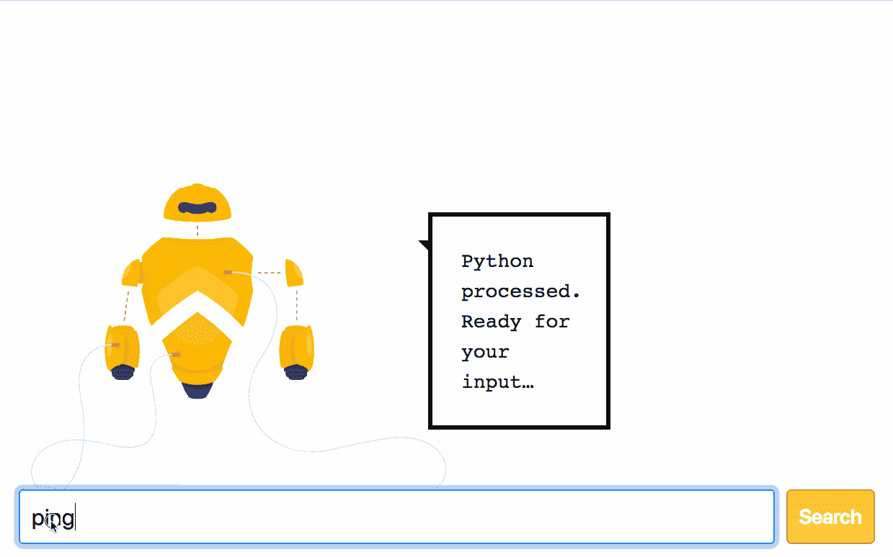
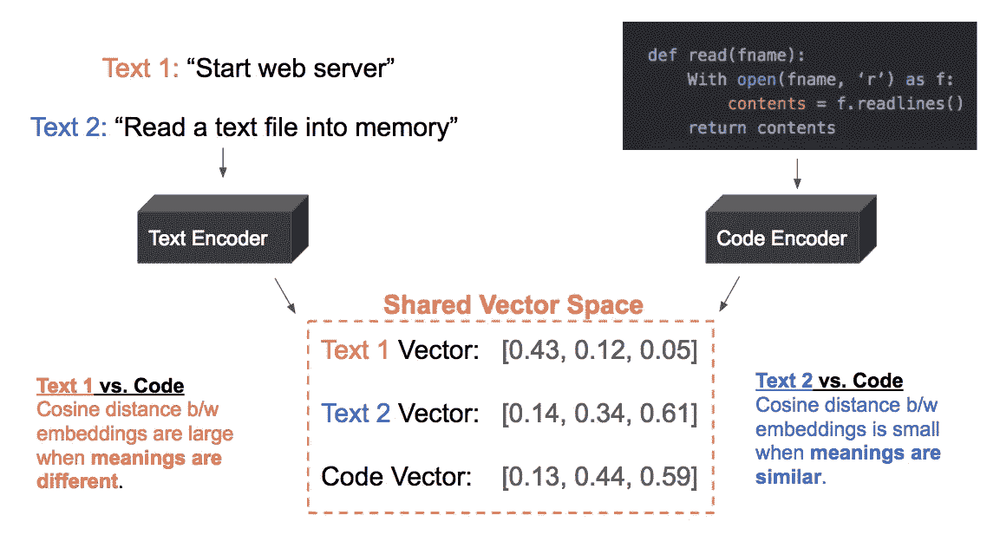
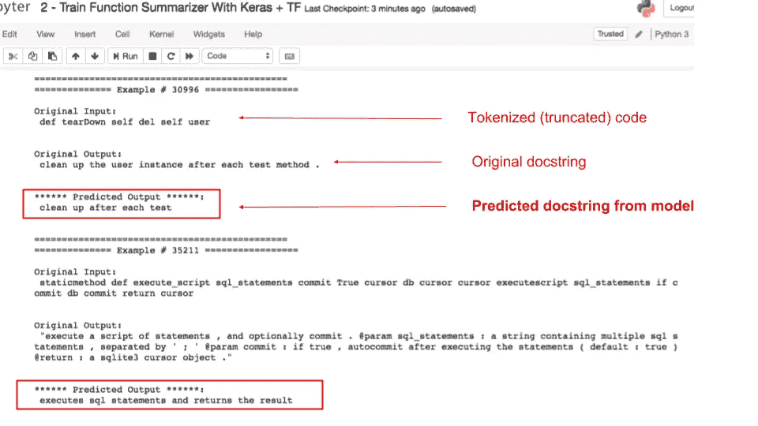
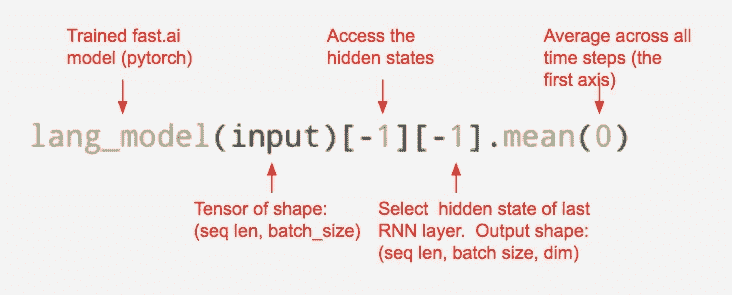
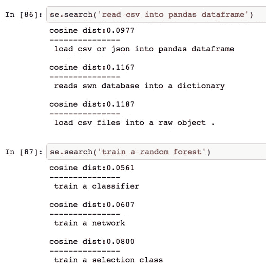

# 如何用深度学习创建任意对象的自然语言语义搜索

> 原文：<https://towardsdatascience.com/semantic-code-search-3cd6d244a39c?source=collection_archive---------3----------------------->

这是一个端到端的例子，展示了如何构建一个可以在语义上搜索对象的系统。由[哈默尔侯赛因](https://www.linkedin.com/in/hamelhusain/) & [吴和祥](https://www.linkedin.com/in/hohsiangwu/)


A picture of [Hubot](https://hubot.github.com/).

# 动机:

现代搜索引擎的力量是不可否认的:你可以随时从互联网上获取知识。不幸的是，这种超级力量并非无处不在。在许多情况下，搜索被归为严格的关键字搜索，或者当对象不是文本时，搜索可能不可用。此外，严格的关键字搜索不允许用户进行语义上的[搜索](https://en.wikipedia.org/wiki/Semantic_search)，这意味着信息不容易被发现。

今天，我们分享一个可复制的、最低限度可行的产品，它展示了如何为任意对象启用[语义搜索](https://en.wikipedia.org/wiki/Semantic_search)！具体来说，我们将向您展示如何创建一个从语义上搜索 python 代码的系统——但是这种方法可以推广到其他实体(比如图片或声音剪辑)。

语义搜索为什么这么激动人心？考虑下面的例子:



Semantic search at work on python code. *See Disclaimer section below.

呈现的搜索查询是“ **Ping** **REST api** 并返回结果”。然而，即使找到的代码&注释不包含单词 **Ping、REST** 或 **api，搜索也会返回合理的结果。**

这说明了 [**语义搜索**](https://en.wikipedia.org/wiki/Semantic_search) **的**威力:除了关键词**之外，我们还可以搜索内容的*含义*，最大限度地提高用户找到所需信息的几率。语义搜索的含义是深远的——例如，这样一个过程将允许开发人员在存储库中搜索代码，即使他们不熟悉语法或者没有预料到正确的关键字。更重要的是，你可以将这种方法推广到图片、音频和其他我们还没有想到的东西。**

如果这还不够令人兴奋的话，**这里有一个现场演示，展示在本教程结束时你能够构建的东西**:


Sometimes I use Jupyter notebooks and [custom magic functions](https://ipython.org/ipython-doc/3/config/custommagics.html) to create demonstrations when I cannot build a pretty website. it can be a quick way to interactively demonstrate your work!

# 直觉:构建一个共享的向量空间

在深入研究技术细节之前，向您提供一个关于我们将如何完成语义搜索的高层次直觉是很有用的。中心思想是在一个共享的向量空间中表示文本和我们想要搜索的对象(代码)，如下所示:



**Example: Text 2** and the **code** should be represented by similar vectors since they are directly related.

目标是将代码映射到自然语言的向量空间中，使得描述相同概念的(文本，代码)对是近邻，而不相关的(文本，代码)对则相距更远，通过[余弦相似度](https://en.wikipedia.org/wiki/Cosine_similarity)来测量。

有许多方法可以实现这一目标，但是，我们将展示一种方法，即采用一个预先训练好的模型从代码中提取特征，然后[微调](https://flyyufelix.github.io/2016/10/03/fine-tuning-in-keras-part1.html)这个模型，将潜在的代码特征投射到自然语言的向量空间中。一个警告:在本教程中，我们交替使用术语 ***向量*** 和 ***嵌入****。*

# *{ 2020 年 1 月 1 日更新}:代码搜索网*

*这篇博文中介绍的技术是旧的，并且在随后的一个名为 [CodeSearchNet](https://github.com/github/codesearchnet) 的项目中得到了显著的改进，并附有一篇相关的[论文](https://arxiv.org/abs/1909.09436)。*

*我建议看看前面提到的项目，寻找一种更现代的方法来解决这个问题，因为回想起来这篇博文有点丑陋。*

# *先决条件*

*我们建议在阅读本教程之前熟悉以下内容:*

*   **序列对序列模型:*回顾一下之前教程中的[信息会很有帮助。](/how-to-create-data-products-that-are-magical-using-sequence-to-sequence-models-703f86a231f8)*
*   *从高层次阅读本文，理解所介绍方法的直觉。我们利用类似的概念在这里介绍。*

# *概述:*

*本教程将分为 5 个具体步骤。这些步骤如下所示，在您学习本教程的过程中，它们将成为有用的参考。完成本教程后，重新查看此图以强调所有步骤是如何结合在一起的，这将非常有用。*

**

*A mind map of this tutorial. Hi-res version available [here](https://github.com/hamelsmu/code_search/blob/master/notebooks/diagram/Diagram.png).*

*每一步 1-5 对应一个 Jupyter 笔记本[这里](https://github.com/hamelsmu/code_search/tree/master/notebooks)。我们将在下面更详细地探讨每个步骤。*

# ***第 1 部分—获取和解析数据:***

*[*第一部笔记本*](https://github.com/hamelsmu/code_search/blob/master/notebooks/1%20-%20Preprocess%20Data.ipynb)*

*谷歌的人从开源的 GitHub 仓库收集数据并存储在 BigQuery 上。这是一个非常棒的开放数据集，适合各种有趣的数据科学项目，包括这个！当你注册一个谷歌云账户时，他们会给你 300 美元，这足够你查询这个练习的数据了。获取这些数据非常方便，因为您可以使用 SQL 查询来选择您要查找的文件类型以及关于 repos 的其他元数据，如 commits、stars 等。*

*本[笔记本](https://github.com/hamelsmu/code_search/blob/master/notebooks/1%20-%20Preprocess%20Data.ipynb)中概述了获取这些数据的步骤。幸运的是，[Google](https://kubernetes.io/blog/2017/12/introducing-kubeflow-composable/)的 Kubeflow 团队中一些出色的人已经经历了这些步骤，并慷慨地为这个练习托管了数据，这也在本[笔记本](https://github.com/hamelsmu/code_search/blob/master/notebooks/1%20-%20Preprocess%20Data.ipynb)中有所描述。*

*收集完这些数据后，我们需要将这些文件解析成(code， [docstring](http://www.pythonforbeginners.com/basics/python-docstrings) )对。对于本教程，一个代码单元要么是一个[顶级函数](https://stackoverflow.com/questions/18138166/what-is-a-top-level-statement-in-python)，要么是一个方法。我们希望收集这些对作为模型的训练数据，该模型将总结代码(稍后将详细介绍)。我们还希望剥离所有注释的代码，只保留代码。这似乎是一项艰巨的任务，然而，在 Python 的标准库中有一个名为 [**ast** 的惊人的库，可用于提取函数、方法和文档字符串。我们可以通过使用](https://docs.python.org/3/library/ast.html) [Astor](https://pypi.org/project/astor/) 包将代码转换成一个 [AST](https://en.wikipedia.org/wiki/Abstract_syntax_tree) ，然后再从该表示转换回代码，从而从代码中删除注释。本教程不要求理解 ASTs 或这些工具是如何工作的，但这是非常有趣的话题！*

*For more context of how this code is used, see this [notebook](https://github.com/hamelsmu/code_search/blob/master/notebooks/1%20-%20Preprocess%20Data.ipynb).*

*为了准备用于建模的数据，我们将数据分为训练集、验证集和测试集。我们还维护文件(我们称之为“沿袭”)来跟踪每个(code，docstring)对的原始来源。最后，我们对不包含 docstring 的代码应用相同的转换，并单独保存，因为我们也希望能够搜索这些代码！*

# *第 2 部分——使用 Seq2Seq 模型构建代码摘要:*

*[*第二部分笔记本*](https://github.com/hamelsmu/code_search/blob/master/notebooks/2%20-%20Train%20Function%20Summarizer%20With%20Keras%20%2B%20TF.ipynb)*

*从概念上讲，构建一个序列到序列的模型来汇总代码与我们之前介绍的 [GitHub 问题汇总器](/how-to-create-data-products-that-are-magical-using-sequence-to-sequence-models-703f86a231f8)是相同的——我们使用 python 代码代替问题主体，使用文档字符串代替问题标题。*

*然而，与 GitHub 问题文本不同，代码不是自然语言。为了充分利用代码中的信息，我们可以引入特定于域的优化，比如[基于树的 LSTMs](https://arxiv.org/pdf/1802.00921.pdf) 和语法感知标记化。对于本教程，我们将保持简单，像对待自然语言一样对待代码(并且仍然得到合理的结果)。*

*构建一个函数摘要器本身是一个非常酷的项目，但是我们不会花太多时间在这上面(但是我们鼓励你这么做！).本笔记本中的[描述了该模型的整个端到端培训流程。我们不讨论该模型的预处理或架构，因为它与](https://github.com/hamelsmu/code_search/blob/master/notebooks/2%20-%20Train%20Function%20Summarizer%20With%20Keras%20%2B%20TF.ipynb)[问题汇总器](/how-to-create-data-products-that-are-magical-using-sequence-to-sequence-models-703f86a231f8)相同。*

*我们训练这个模型的动机不是将它用于总结代码的任务，而是作为代码的通用特征提取器。从技术上讲，这一步是可选的，因为我们只是通过这些步骤来初始化相关下游任务的模型权重。在后面的步骤中，我们将从这个模型中提取编码器，并[为另一个任务微调](https://flyyufelix.github.io/2016/10/03/fine-tuning-in-keras-part1.html)。下面是该模型的一些示例输出的屏幕截图:*

**

*Sample results from function summarizer on a test set. See notebook [here](https://github.com/hamelsmu/code_search/blob/master/notebooks/2%20-%20Train%20Function%20Summarizer%20With%20Keras%20%2B%20TF.ipynb).*

*我们可以看到，虽然结果并不完美，但有强有力的证据表明，该模型已经学会了从代码中提取一些语义，这是我们这项任务的主要目标。我们可以使用 [BLEU metric](https://en.wikipedia.org/wiki/BLEU) 对这些模型进行量化评估，在本[笔记本](https://github.com/hamelsmu/code_search/blob/master/notebooks/2%20-%20Train%20Function%20Summarizer%20With%20Keras%20%2B%20TF.ipynb)中也有讨论。*

*应该注意的是，训练 seq2seq 模型来总结代码并不是构建代码特征提取器的唯一方法。例如，你也可以训练一个 [GAN](https://en.wikipedia.org/wiki/Generative_adversarial_network) 和[使用鉴别器作为特征提取器](https://arxiv.org/pdf/1511.06434.pdf)。然而，这些其他方法超出了本教程的范围。*

# *第 3 部分—训练一个语言模型来编码自然语言短语*

*[*第三部分笔记本*](https://github.com/hamelsmu/code_search/blob/master/notebooks/3%20-%20Train%20Language%20Model%20Using%20FastAI.ipynb)*

*现在我们已经建立了一个将代码表示为向量的机制，我们需要一个类似的机制来编码自然语言短语，就像在文档字符串和搜索查询中找到的那些一样。*

*有太多的通用预训练模型可以生成高质量的短语嵌入(也称为句子嵌入)。这篇[文章提供了一个很好的景观概述](https://medium.com/huggingface/universal-word-sentence-embeddings-ce48ddc8fc3a)。例如，谷歌的通用句子编码器在许多情况下都工作得很好，并且在 Tensorflow Hub 上[有售。](https://www.tensorflow.org/hub/modules/google/universal-sentence-encoder/1)*

*尽管这些预先训练的模型很方便，但是训练一个捕捉特定领域词汇和文档字符串语义的模型可能是有利的。有许多技术可以用来创建句子嵌入。这些方法从简单的方法，如平均[单词向量](https://en.wikipedia.org/wiki/Word_embedding)到更复杂的技术，如用于构建[通用句子编码器](https://arxiv.org/abs/1803.11175)的技术。*

*对于本教程，我们将利用一个[神经语言模型](https://en.wikipedia.org/wiki/Language_model)，使用一个 [AWD LSTM](https://arxiv.org/pdf/1708.02182.pdf) 来生成句子的嵌入。我知道这听起来可能有点吓人，但是精彩的 fast.ai 库提供了一些抽象概念，允许您利用这项技术，而不必担心太多的细节。下面是我们用来构建这个模型的一段代码。有关该代码如何工作的更多内容，请参见[本笔记本](https://github.com/hamelsmu/code_search/blob/master/notebooks/3%20-%20Train%20Language%20Model%20Using%20FastAI.ipynb)。*

*Part of the train_lang_model function called in [this notebook](https://github.com/hamelsmu/code_search/blob/master/notebooks/3%20-%20Train%20Language%20Model%20Using%20FastAI.ipynb). Uses [fast.ai](https://github.com/fastai/fastai).*

*在构建语言模型时，仔细考虑用于训练的语料库非常重要。理想情况下，您希望使用与下游问题领域相似的语料库，这样您就可以充分捕获相关的语义和词汇。例如，这个问题的一个很好的语料库是[栈溢出数据](https://cloud.google.com/bigquery/public-data/stackoverflow)，因为这是一个包含非常丰富的代码讨论的论坛。然而，为了保持本教程的简单性，我们重用了一组文档字符串作为我们的语料库。这是次优的，因为关于堆栈溢出的讨论通常包含比单行 docstring 更丰富的语义信息。我们把它作为一个练习，让读者通过使用替代语料库来检查对最终结果的影响。*

*在我们训练语言模型之后，我们的下一个任务是使用这个模型为每个句子生成一个嵌入。这样做的一个常见方法是总结语言模型的隐藏状态，例如本文中的 [concat 池方法](https://arxiv.org/pdf/1801.06146.pdf)。然而，为了简单起见，我们将简单地计算所有隐藏状态的平均值。我们可以用这行代码从 fast.ai 语言模型中提取隐藏状态的平均值:*

**

*How to extract a sentence embedding from a fast.ai language model. This pattern is used [here](https://github.com/hamelsmu/code_search/blob/master/notebooks/lang_model_utils.py#L302-L309).*

*评估句子嵌入的一个好方法是测量这些嵌入对下游任务的有效性，如情感分析、文本相似性等。你可以经常使用通用基准测试，比如这里[列出的例子](https://github.com/facebookresearch/SentEval)来测量你的嵌入的质量。然而，这些通用的基准可能不适合这个问题，因为我们的数据是非常具体的领域。不幸的是，我们还没有为这个领域设计一套可以开源的下游任务。在没有这种下游任务的情况下，我们至少可以通过检查我们知道应该相似的短语之间的相似性来检查这些嵌入是否包含语义信息。下面的屏幕截图展示了一些例子，在这些例子中，我们根据用户提供的短语(摘自[本笔记本](https://github.com/hamelsmu/code_search/blob/master/notebooks/3%20-%20Train%20Language%20Model%20Using%20FastAI.ipynb))来搜索矢量化文档字符串的相似性:*

**

*Manual inspection of text similarity as a sanity check. More examples in [this notebook](https://github.com/hamelsmu/code_search/blob/master/notebooks/3%20-%20Train%20Language%20Model%20Using%20FastAI.ipynb).*

*应该注意的是，这只是一个健全性检查——更严格的方法是测量这些嵌入对各种下游任务的影响，并使用它来形成关于您的嵌入质量的更客观的意见。关于这个话题的更多讨论可以在[这本笔记本](https://github.com/hamelsmu/code_search/blob/master/notebooks/3%20-%20Train%20Language%20Model%20Using%20FastAI.ipynb)中找到。*

# *第 4 部分—将代码向量映射到与自然语言相同的向量空间的训练模型*

*[*第四部分笔记本*](https://github.com/hamelsmu/code_search/blob/master/notebooks/4%20-%20Train%20Model%20To%20Map%20Code%20Embeddings%20to%20Language%20Embeddings.ipynb)*

*在这一点上，重温一下本教程开始时介绍的图表可能会有所帮助。在该图中，您可以找到第 4 部分的图示:*

**

*A visual representation of the tasks we will perform in Part 4*

*这一步的大部分内容来自本教程前面的步骤。在这一步中，我们将对第 2 部分中的 seq2seq 模型进行微调，以预测文档字符串嵌入，而不是文档字符串。下面是我们用来从 seq2seq 模型中提取编码器并添加密集层进行微调的代码:*

*Build a model that maps code to natural language vector space. For more context, see [this notebook](https://github.com/hamelsmu/code_search/blob/master/notebooks/4%20-%20Train%20Model%20To%20Map%20Code%20Embeddings%20to%20Language%20Embeddings.ipynb).*

*在我们训练该模型的冻结版本之后，我们解冻所有层，并训练该模型几个时期。这有助于对模型进行微调，使其更接近这个任务。你可以在[这本笔记本](https://github.com/hamelsmu/code_search/blob/master/notebooks/4%20-%20Train%20Model%20To%20Map%20Code%20Embeddings%20to%20Language%20Embeddings.ipynb)中看到完整的训练程序。*

*最后，我们希望对代码进行矢量化，以便构建搜索索引。出于评估的目的，我们还将对不包含 docstring 的代码进行矢量化，以查看该过程对我们尚未看到的数据的推广情况。下面是完成这项任务的代码片段(摘自[本笔记本](https://github.com/hamelsmu/code_search/blob/master/notebooks/4%20-%20Train%20Model%20To%20Map%20Code%20Embeddings%20to%20Language%20Embeddings.ipynb))。请注意，我们使用 [ktext](https://github.com/hamelsmu/ktext) 库将我们在训练集上学到的相同预处理步骤应用于该数据。*

*Map code to the vector space of natural language with the code2emb model. For more context, see [this notebook](https://github.com/hamelsmu/code_search/blob/master/notebooks/4%20-%20Train%20Model%20To%20Map%20Code%20Embeddings%20to%20Language%20Embeddings.ipynb).*

*收集了矢量化代码后，我们就可以开始最后一步了！*

# *第 5 部分—创建语义搜索工具*

*[*第五部分笔记本*](https://github.com/hamelsmu/code_search/blob/master/notebooks/5%20-%20Build%20Search%20Index.ipynb)*

*在这一步中，我们将使用我们在前面步骤中创建的工件构建一个搜索索引，如下图所示:*

**

*Diagram of Part 5 (extracted from the main diagram presented at the beginning)*

*在第 4 部分中，我们对不包含任何文档字符串的所有代码进行了矢量化。下一步是将这些向量放入搜索索引中，这样可以快速检索最近的邻居。一个很好的用于快速最近邻查找的 python 库是 [nmslib](https://github.com/nmslib/nmslib) 。要享受使用 nmslib 的快速查找，您必须预先计算搜索索引，如下所示:*

*How to create a search index with nmslib.*

*现在您已经构建了代码向量的搜索索引，您需要一种将字符串(查询)转换成向量的方法。为此，您将使用第 3 部分中的语言模型。为了简化这个过程，我们在 lang_model_utils.py 中提供了一个名为 Query2Emb 的助手类，在本笔记本中的[中演示了这个类。](https://github.com/hamelsmu/code_search/blob/master/notebooks/5%20-%20Build%20Search%20Index.ipynb)*

*最后，一旦我们能够将字符串转换成查询向量，我们就可以检索该向量的最近邻居，如下所示:*

```
*idxs, dists = self.search_index.knnQuery(query_vector, k=k)*
```

*搜索索引将返回两个项目(1)索引列表，这些索引是数据集中最近邻居的整数位置(2)这些邻居与您的查询向量的距离(在这种情况下，我们将索引定义为使用余弦距离)。一旦有了这些信息，构建语义搜索就简单了。下面的代码概述了如何实现这一点的示例:*

*A class that glues together all the parts we need to build semantic search.*

*最后，[这个笔记本](https://github.com/hamelsmu/code_search/blob/master/notebooks/5%20-%20Build%20Search%20Index.ipynb)向你展示了如何使用上面的 search_engine 对象来创建一个交互式演示，如下所示:*

**

*This is the same gif that was presented at the beginning of this tutorial.*

*恭喜你！您刚刚学习了如何创建语义搜索。我希望这次旅行是值得的。*

# *等等，你说搜查任意的东西？*

*尽管本教程描述了如何为代码创建语义搜索，但是您可以使用类似的技术来搜索视频、音频和其他对象。与使用从代码中提取特性的模型(第 2 部分)不同，您需要训练或找到一个预先训练好的模型，从您选择的对象中提取特性。唯一的先决条件是，您需要一个足够大的带有自然语言注释的数据集(比如音频的文字记录，或者照片的标题)。*

*我们相信您可以使用在本教程中学到的想法来创建自己的搜索，并希望收到您的来信，看看您创建了什么(参见下面的*联系*部分)。*

# *限制和遗漏*

*   *{Update 1/1/20202}:这篇博文中讨论的技术已经过时，尤其是关于模型架构和技术。对于同一项目的更新版本，请参见 [CodeSearchNet](https://github.com/github/codesearchnet) 项目和[相关论文](https://arxiv.org/abs/1909.09436)。*
*   *这篇博文中讨论的技术是经过简化的，并且仅仅触及了可能的表面。我们提供的是一个非常简单的语义搜索—但是，为了使这种搜索有效，您可能需要使用关键字搜索和其他过滤器或规则来增强这种搜索(例如，搜索特定回购、用户或组织的能力以及通知相关性的其他机制)。*
*   *有机会使用利用代码结构的特定领域架构，例如[树-lstms](https://arxiv.org/pdf/1503.00075.pdf) 。此外，还有其他标准技巧，如利用[注意力](https://medium.com/syncedreview/a-brief-overview-of-attention-mechanism-13c578ba9129)和[随机教师强迫](https://github.com/IBM/pytorch-seq2seq/blob/master/seq2seq/models/DecoderRNN.py#L50-L52)，为了简单起见，我们省略了这些技巧。*
*   *我们忽略的一部分是如何评估搜索。这是一个复杂的主题，值得在自己的博客上发表。为了有效地迭代这个问题，你需要一个客观的方法来衡量你的搜索结果的质量。这将是未来博客文章的主题。*

# *取得联系！*

*我们希望你喜欢这篇博文。请随时与我们联系:*

*   *哈默尔侯赛因:[推特](https://twitter.com/HamelHusain)， [LinkedIn](https://www.linkedin.com/in/hamelhusain/) ，或者 [GitHub](https://github.com/hamelsmu) 。*
*   *吴和祥: [LinkedIn](https://www.linkedin.com/in/hohsiangwu/) ， [GitHub](https://github.com/hohsiangwu)*

# *资源*

*   *[GitHub 回购](https://github.com/hamelsmu/code_search)本文供图。*
*   *为了让那些试图重现这个例子的人更容易，我们已经将所有依赖项打包到一个 Nvidia-Docker 容器中。对于那些不熟悉 Docker 的人来说，你可能会发现[这篇文章很有帮助](/how-docker-can-help-you-become-a-more-effective-data-scientist-7fc048ef91d5)。这里有一个[链接，链接到 Dockerhub](https://hub.docker.com/r/hamelsmu/ml-gpu/) 上本教程的 docker 图片。*
*   *对于任何试图获得深度学习技能的人，我的首要建议是尽快掌握[。艾](http://www.fast.ai/)乘[杰瑞米·霍华德](https://medium.com/u/34ab754f8c5e?source=post_page-----3cd6d244a39c--------------------------------)。我在那里学到了写这篇博文所需的许多技能。此外，本教程利用了 [fastai 库](https://github.com/fastai)。*
*   *请关注这本书，它仍处于早期发行阶段，但已经深入到这个主题的有用细节。*
*   *Avneesh Saluja 的演讲[强调了 Airbnb 如何研究使用共享向量空间来支持对房源和其他数据产品的语义搜索。](https://youtu.be/kX4CiA94bmQ)*

# *谢谢*

*实体模型搜索界面是由贾斯汀·帕尔默设计的(你可以在这里看到他的其他作品)。也感谢以下人员的评论和投入:[艾克·奥康科沃](https://www.linkedin.com/in/ikeokonkwo/)、[大卫·希恩](https://www.linkedin.com/in/david-shinn-84178415/)、[金梁](https://www.linkedin.com/in/leungkam/)。*

# *放弃*

*本文中提出的任何想法或观点都是我们自己的。提出的任何想法或技术不一定预示 GitHub 的未来产品。这个博客的目的只是为了教育。*