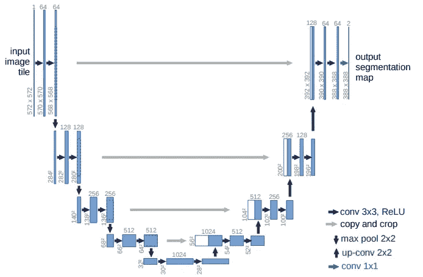
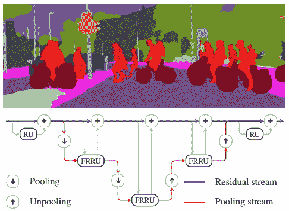
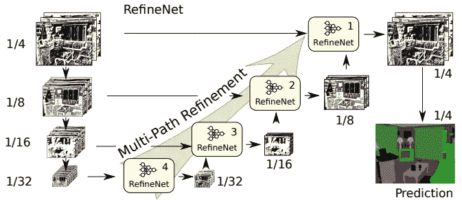
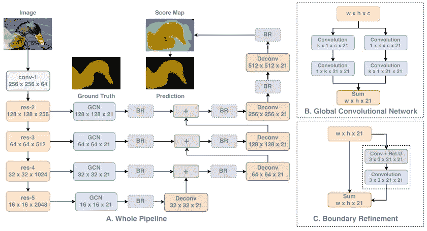

# 基于深度学习的语义分割

> 原文：<https://towardsdatascience.com/semantic-segmentation-with-deep-learning-a-guide-and-code-e52fc8958823?source=collection_archive---------1----------------------->

## 指南和代码

Semantic Segmentation

> 想获得灵感？快来加入我的 [**超级行情快讯**](https://www.superquotes.co/?utm_source=mediumtech&utm_medium=web&utm_campaign=sharing) 。😎

# 什么是语义切分？

深度学习和计算机视觉社区的大多数人都明白什么是图像分类:我们希望我们的模型告诉我们图像中存在什么单个对象或场景。分类很粗，层次很高。

许多人也熟悉对象检测，我们试图通过在它们周围绘制边界框，然后对框中的内容进行分类，来对图像中的多个对象进行*定位和分类。检测是中级的，我们有一些非常有用和详细的信息，但仍然有点粗糙，因为我们只画了边界框，并没有真正得到对象形状的准确想法。*

语义分割是这三者中信息量最大的，我们希望对图像中的*每一个像素进行分类，就像你在上面的 gif 中看到的那样！在过去的几年里，这完全是通过深度学习来完成的。*

在本指南中，您将了解语义分割模型的基本结构和工作原理，以及所有最新、最棒的最先进方法。

如果您想亲自尝试这些模型，您可以查看我的语义分割套件，其中包含 TensorFlow 培训和本指南中许多模型的测试代码！

 [## GeorgeSeif/语义分段套件

### TensorFlow 中的语义切分套件。轻松实现、训练和测试新的语义分割模型！…

github.com](https://github.com/GeorgeSeif/Semantic-Segmentation-Suite) 

# 基本结构

我将要向您展示的语义分割模型的基本结构存在于所有最先进的方法中！这使得实现不同的应用程序变得非常容易，因为几乎所有的应用程序都有相同的底层主干、设置和流程。

U-Net 模型很好地说明了这种结构。模型的左侧代表**为图像分类而训练的任何特征提取网络。**这包括像 VGGNet、ResNets、DenseNets、MobileNets 和 NASNets 这样的网络！在那里你真的可以使用任何你想要的东西。

选择用于特征提取的分类网络时，最重要的是要记住权衡。使用一个非常深的 ResNet152 会让你非常准确，但不会像 MobileNet 那样快。将这些网络应用于分类时出现的权衡也出现在将它们用于分割时。需要记住的重要一点是**在设计/选择您的细分网络时，这些主干将是主要驱动因素，这一点我再强调也不为过。**

U-Net model for segmentation

一旦这些特征被提取出来，它们将在不同的尺度下被进一步处理。原因有两个。首先，你的模型很可能会遇到许多不同大小的物体；以不同的比例处理要素将赋予网络处理不同规模要素的能力。

第二，当执行分段时，有一个折衷。如果你想要好的分类准确度，那么你肯定会想要在网络的后期处理那些高级特征，因为它们更有鉴别能力，包含更多有用的语义信息。另一方面，如果你只处理那些深度特征，由于分辨率低，你不会得到好的定位！

最近最先进的方法都遵循上面的特征提取结构，然后是多尺度处理。因此，许多都非常易于端到端的实施和培训。您选择使用哪一个将取决于您对准确性与速度/内存的需求，因为所有人都在尝试提出新的方法来解决这一权衡，同时保持效率。

在接下来的最新进展中，我将把重点放在最新的方法上，因为在理解了上面的基本结构之后，这些方法对大多数读者来说是最有用的。我们将按照大致的时间顺序进行演练，这也大致对应于最新技术的发展。

# 最先进的漫游

## 全分辨率残差网络(FRRN)

[FRRN](https://arxiv.org/pdf/1611.08323.pdf) 模型是多尺度处理技术的一个非常明显的例子。它使用两个独立的流来实现这一点:剩余流和池流。

我们希望处理这些语义特征以获得更高的分类精度，因此 FRRN 逐步处理和缩减采样池流中的特征映射。同时，它在残差流中以*全分辨率*处理特征图。所以池流处理高级语义信息(为了高分类精度)，残差流处理低级像素信息(为了高定位精度)！

现在，由于我们正在训练一个端到端网络，我们不希望这两个流完全断开。因此，在每次最大池化后，FRRN 对来自两个流的特征地图进行一些联合处理，以组合它们的信息。

FRRN model structure

## 金字塔场景解析网络

FRRN 在直接执行多尺度处理方面做得很好。但是在每一个尺度上进行繁重的处理是相当计算密集的。此外，FRRN 做一些全分辨率的处理，非常慢的东西！

PSPNet 提出了一个聪明的方法来解决这个问题，通过使用*多尺度池。*它从标准特征提取网络(ResNet、DenseNet 等)开始，并对第三次下采样的特征进行进一步处理。

为了获得多尺度信息，PSPNet 使用 4 种不同的窗口大小和步长应用 4 种不同的最大池操作。这有效地从 4 个不同的尺度捕获特征信息，而不需要对每个尺度进行大量的单独处理！我们简单地对每个图做一个轻量级的卷积，然后进行上采样，这样每个特征图都有相同的分辨率，然后把它们连接起来。

瞧啊。我们已经合并了多尺度特征地图，而没有对它们应用很多卷积！

所有这些都是在较低分辨率的特征图上完成的。最后，我们使用双线性插值将输出分割图放大到期望的大小。这种仅在所有处理完成后才进行升级的技术出现在许多最新的作品中。

PSPNet model structure

## 一百层提拉米苏

如果深度学习带来了一种令人敬畏的趋势，那就是令人敬畏的研究论文名称！[百层提拉米苏](https://arxiv.org/pdf/1611.09326.pdf)(听起来很好吃！)使用了和我们之前看到的 U-Net 架构类似的结构。主要贡献是巧妙使用了类似于 DenseNet 分类模型的密集连接。

这确实强调了计算机视觉的强大趋势，其中特征提取前端是在任何其他任务中表现良好的主要支柱。因此，寻找精度增益的第一个地方通常是您的特征提取前端。

FCDenseNet model structure

## 重新思考阿特鲁卷积

DeepLabV3 和[是另一种进行多尺度处理的聪明方法，这次**没有增加参数**。](https://arxiv.org/pdf/1706.05587.pdf)

这个模型非常轻便。我们再次从特征提取前端开始，获取第四次下采样的特征用于进一步处理。这个分辨率非常低(比输入小 16 倍)，因此如果我们能在这里处理就太好了！棘手的是，在如此低的分辨率下，由于像素精度差，很难获得良好的定位。

这就是 DeepLabV3 的主要贡献所在，它巧妙地使用了*阿特鲁*卷积。常规卷积只能处理非常局部的信息，因为权重总是彼此紧挨着。例如，在标准的 3×3 卷积中，一个权重与任何其他权重之间的距离只有一个步长/像素。

对于 atrous 卷积，我们将直接增加卷积权重之间的间距，而不会实际增加运算中权重的*数量*。因此，我们仍然使用一个总共有 9 个参数的 3x3，我们只是将相乘的权重间隔得更远！每个砝码之间的距离称为*膨胀率*。下面的模型图很好地说明了这个想法。

当我们使用低膨胀率时，我们将处理非常局部/低尺度的信息。当我们使用高膨胀率时，我们处理更多的全局/高尺度信息。因此，DeepLabV3 模型混合了具有不同膨胀率的 atrous 卷积来捕捉多尺度信息。

在 PSPNet 中解释的所有处理之后，在最后进行升级的技术也在这里完成。

DeepLabV3 model structure

## 多路径细化网络

我们之前已经看到 FRRN 是如何成功地将来自多个分辨率的信息直接组合在一起的。缺点是在如此高的分辨率下处理是计算密集型的，我们仍然需要处理和结合那些低分辨率的特征！

[RefineNet](https://arxiv.org/pdf/1611.06612.pdf) 模型说我们不需要这样做。当我们通过特征提取网络运行输入图像时，我们自然会在每次下采样后获得多尺度特征图。

然后，RefineNet 以自下而上的方式处理这些多分辨率特征图，以组合多尺度信息。首先，独立处理每个特征图。然后，当我们放大时，我们将低分辨率的特征图与高分辨率的特征图结合起来，对它们一起做进一步的处理。因此，多尺度特征地图被独立地和一起处理。在下图中，整个过程从左向右移动。

这里也采用了 PSPNet 和 DeepLabV3 中所述的在所有处理结束后进行升级的技术。

RefineNet model structure

## 大内核问题(GCN)

之前，我们看到了 DeepLabV3 模型如何使用具有不同膨胀率的 atrous 卷积来捕捉多尺度信息。棘手的是，我们一次只能处理一个秤，然后必须将它们组合起来。例如，速率为 16 的 atrous 卷积不能很好地处理局部信息，必须在以后与来自速率小得多的卷积的信息相结合，以便在语义分割中表现良好。

因此，在以前的方法中，多尺度处理首先单独发生，然后将结果组合在一起。如果能一次性获得多尺度信息，那就更有意义了。

为了做到这一点，[全球卷积网络(GCN)](https://arxiv.org/pdf/1703.02719.pdf) 巧妙地提出使用大型一维核，而不是方形核。对于像 3x3、7x7 等这样的平方卷积，我们不能让它们太大而不影响速度和内存消耗。另一方面，一维内核的缩放效率更高，我们可以在不降低网络速度的情况下将它们做得很大。这张纸甚至被放大到了 15 号！

你必须确保做的重要的事情是平衡水平和垂直回旋。此外，该论文确实使用了具有低滤波器数的小 3×3 卷积，以有效细化一维卷积可能遗漏的任何内容。

GCN 遵循与以前作品相同的风格，从特征提取前端处理每个尺度。由于一维卷积的效率，GCN 在所有尺度上执行处理，一直到全分辨率，而不是保持小规模，然后扩大规模。这允许在我们按比例放大时不断细化分割，而不是由于停留在较低分辨率而可能发生的瓶颈。

GCN model structure

## DeepLabV3+

[DeepLabV3+](https://arxiv.org/pdf/1802.02611.pdf) 模型，顾名思义，是 DeepLabV3 的快速扩展，从它之前的进步中借用了一些概念上的想法。正如我们之前看到的，如果我们只是简单地等待在网络末端使用双线性插值来扩大规模，就会存在潜在的瓶颈。事实上，最初的 DeepLabV3 模型在结尾被 x16 升级了！

为了解决这个问题，DeepLabV3+建议在 DeepLabV3 之上添加一个中间解码器模块。通过 DeepLabV3 处理后，特征由 x4 进行上采样。然后，它们与来自特征提取前端的原始特征一起被进一步处理，然后被 x4 再次放大。这减轻了网络末端的负载，并提供了从特征提取前端到网络近端的快捷路径。

DeepLabV3+ model structure

# CVPR 和 ECCV 2018

我们在上一节中讨论的网络代表了你需要知道的进行语义分割的大部分技术！今年在计算机视觉会议上发布的许多东西都是微小的更新和准确性上的小波动，对开始并不是非常关键。为了彻底起见，我在这里为任何感兴趣的人提供了他们的贡献的快速回顾！

[**图像级联网络(ICNet)**](https://arxiv.org/pdf/1704.08545.pdf) **—** 使用深度监督并以不同的尺度运行输入图像，每个尺度通过其自己的子网并逐步组合结果

[**【DFN】**](http://openaccess.thecvf.com/content_cvpr_2018/papers/Yu_Learning_a_Discriminative_CVPR_2018_paper.pdf)**—**使用深度监督并尝试分别处理线段的平滑和边缘部分

[**DenseASPP**](http://openaccess.thecvf.com/content_cvpr_2018/papers/Yang_DenseASPP_for_Semantic_CVPR_2018_paper.pdf)**—**结合了密集连接和粗糙卷积

[**上下文编码**](http://openaccess.thecvf.com/content_cvpr_2018/papers/Zhang_Context_Encoding_for_CVPR_2018_paper.pdf)**——**通过添加通道关注模块，利用全局上下文来提高准确性，该模块基于新设计的损失函数来触发对某些特征地图的关注。损失基于网络分支，该网络分支预测图像中存在哪些类别(即，更高级别的全局上下文)。

[**密集解码器快捷连接**](http://openaccess.thecvf.com/content_cvpr_2018/papers/Bilinski_Dense_Decoder_Shortcut_CVPR_2018_paper.pdf) **—** 在解码阶段使用密集连接以获得更高的精度(以前仅在特征提取/编码期间使用)

[**【BiSeNet】**](https://arxiv.org/pdf/1808.00897v1.pdf)**—**有两个分支:一个是深度分支，用于获取语义信息，另一个是对输入图像进行很少/很小的处理，以保留低级像素信息

[**ex fuse**](http://openaccess.thecvf.com/content_ECCV_2018/papers/Zhenli_Zhang_ExFuse_Enhancing_Feature_ECCV_2018_paper.pdf)**—**使用深度监督，在处理之前，显式组合来自特征提取前端*的多尺度特征，以确保多尺度信息在各级一起处理。*

ICNet model structure

# TL；DR 或者如何做语义分割

*   注意分类网络权衡。您的分类网络是您处理要素的主要驱动力，您的大部分收益/损失将来自于此
*   在多个尺度上处理并将信息结合在一起
*   多尺度池、atrous convs、大型一维 conv 都适用于语义分割
*   你不需要在高分辨率下做大量的处理。为了速度，在低分辨率下完成大部分，然后升级，如果必要的话，在最后做一些轻微的处理
*   深度监督可以稍微提高你的准确性(尽管设置训练更加棘手)

# 喜欢学习？

在 twitter 上关注我，我会在这里发布所有最新最棒的人工智能、技术和科学！也在 [LinkedIn](https://www.linkedin.com/in/georgeseif/) 上和我联系吧！